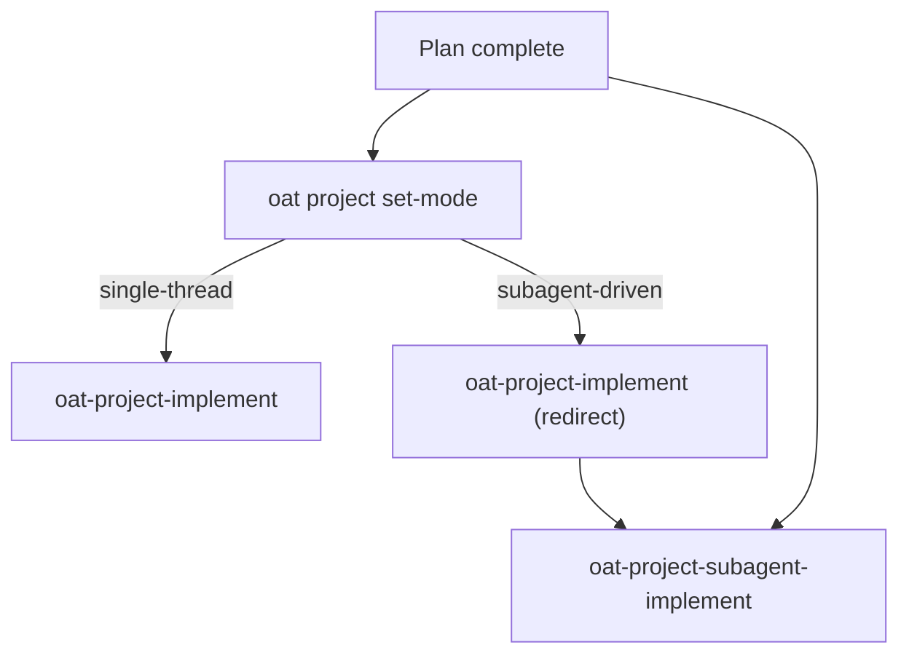

# .agents/

Canonical home for agent skills, subagents, and supporting documentation used by the Open Agent Toolkit (OAT).

## Directory Structure

```
.agents/
├── skills/          # Canonical shared skills (synced to provider views)
│   ├── <skill>/
│   │   ├── SKILL.md
│   │   └── references/   # (optional) Templates, examples
│   └── ...
├── agents/          # Subagent definitions (Claude Code only)
│   ├── oat-codebase-mapper.md
│   └── oat-reviewer.md
├── docs/            # Detailed agent guidance
│   ├── agent-instruction.md
│   ├── provider-reference.md
│   ├── reference-architecture.md
│   ├── skills-guide.md
│   └── subagents-guide.md
└── README.md        # This file
```

## Skills

Skills live in `.agents/skills/<skill-name>/SKILL.md` and sync to provider-specific views via:

```bash
oat sync --scope all --apply
```

For the full skill inventory, see [`docs/oat/skills/index.md`](../docs/oat/skills/index.md).

For guidance on creating new skills, see [`.agents/docs/skills-guide.md`](docs/skills-guide.md).

## Subagents

Subagent definitions live in `.agents/agents/` and are available in Claude Code only.

For details on available subagents and how to use them, see [`.agents/docs/subagents-guide.md`](docs/subagents-guide.md).

For parallel implementation using subagent orchestration, use `oat-project-subagent-implement` as an alternative to sequential `oat-project-implement`.

### Subagent implementation workflow

- Use `oat-project-implement` for sequential execution.
- Use `oat-project-subagent-implement` for parallel execution with autonomous review gates.
- Persist project mode with `oat project set-mode <single-thread|subagent-driven>`.



## Documentation

- **OAT overview:** [`docs/oat/index.md`](../docs/oat/index.md)
- **Quickstart:** [`docs/oat/quickstart.md`](../docs/oat/quickstart.md)
- **CLI reference:** [`docs/oat/cli/index.md`](../docs/oat/cli/index.md)
- **Skills index:** [`docs/oat/skills/index.md`](../docs/oat/skills/index.md)
- **Agent instruction guide:** [`.agents/docs/agent-instruction.md`](docs/agent-instruction.md)
- **Provider reference:** [`.agents/docs/provider-reference.md`](docs/provider-reference.md)

## Projects

OAT project documentation lives in `.oat/projects/` (gitignored). Create new projects with:

```bash
oat project new <project-name>
```

See [`docs/oat/projects/`](../docs/oat/projects/) for the project lifecycle workflow.
