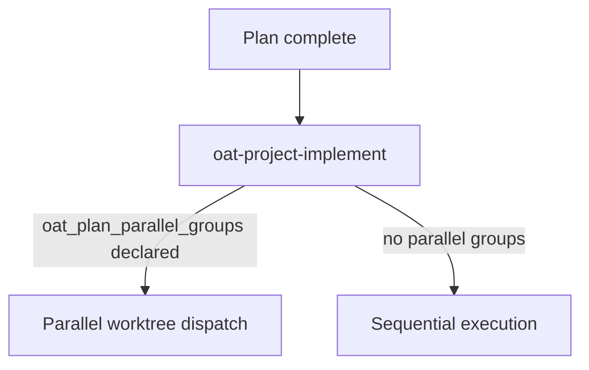

# .agents/

Canonical home for agent skills, subagents, and supporting documentation used by the Open Agent Toolkit (OAT).

## Directory Structure

```
.agents/
├── skills/          # Canonical shared skills (synced to provider views)
│   ├── <skill>/
│   │   ├── SKILL.md
│   │   └── references/   # (optional) Templates, examples
│   └── ...
├── agents/          # Subagent definitions (Claude Code only)
│   ├── oat-codebase-mapper.md
│   └── oat-reviewer.md
├── docs/            # Detailed agent guidance
│   ├── agent-instruction.md
│   ├── provider-reference.md
│   ├── reference-architecture.md
│   ├── skills-guide.md
│   └── subagents-guide.md
└── README.md        # This file
```

## Skills

Skills live in `.agents/skills/<skill-name>/SKILL.md` and sync to provider-specific views via:

```bash
oat sync --scope all
```

For the full skill inventory, see [`apps/oat-docs/docs/skills/index.md`](../apps/oat-docs/docs/skills/index.md).

For guidance on creating new skills, see [`.agents/docs/skills-guide.md`](docs/skills-guide.md).

## Subagents

Subagent definitions live in `.agents/agents/` and are available in Claude Code only.

For details on available subagents and how to use them, see [`.agents/docs/subagents-guide.md`](docs/subagents-guide.md).

### Subagent implementation workflow

`oat-project-implement` is the single execution skill. Declare `oat_plan_parallel_groups` in `plan.md` frontmatter to run eligible phases in parallel worktrees; omit it (or leave it empty) for fully sequential execution.


```mermaid
flowchart TD
  P["Plan complete"] --> I["oat-project-implement"]
  I -->|oat_plan_parallel_groups declared| PAR["Parallel worktree dispatch"]
  I -->|no parallel groups| SEQ["Sequential execution"]
```

## Documentation

- **OAT overview:** [`apps/oat-docs/docs/index.md`](../apps/oat-docs/docs/index.md)
- **Quickstart:** [`apps/oat-docs/docs/quickstart.md`](../apps/oat-docs/docs/quickstart.md)
- **CLI reference:** [`apps/oat-docs/docs/cli/index.md`](../apps/oat-docs/docs/cli/index.md)
- **Skills index:** [`apps/oat-docs/docs/skills/index.md`](../apps/oat-docs/docs/skills/index.md)
- **Agent instruction guide:** [`.agents/docs/agent-instruction.md`](docs/agent-instruction.md)
- **Provider reference:** [`.agents/docs/provider-reference.md`](docs/provider-reference.md)

## Projects

OAT project documentation lives in `.oat/projects/` (gitignored). Create new projects with:

```bash
oat project new <project-name>
```

See [`apps/oat-docs/docs/projects/index.md`](../apps/oat-docs/docs/projects/index.md) for the project lifecycle workflow.
