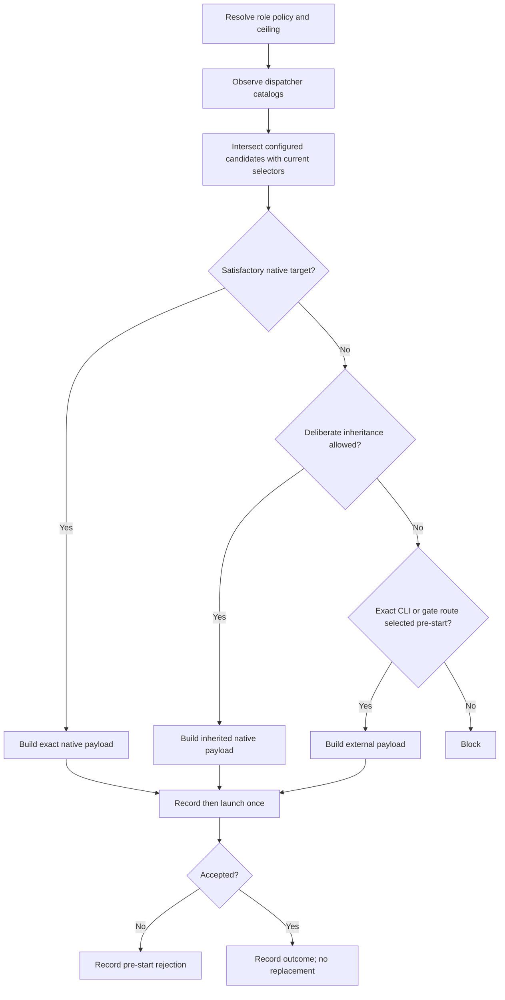

# Dispatching Subagents

Provider-neutral contract for selecting and recording OAT subagents. Calling
workflows own lifecycle sequencing, task boundaries, commits, and approval
state. This skill owns only dispatch selection and launch evidence.

## Required Loading

Read this file before every coordinator, task worker, fix worker, or self-review
dispatch. Provider-specific mechanics are loaded separately; do not infer one
provider's surface from another.

After resolving the active provider, read exactly one provider reference:

- Cursor: `references/cursor.md`
- Codex: `references/codex.md`
- Claude: `references/claude.md`

Do not load all provider references as one merged policy. Unsupported providers
retain the provider-neutral fail-closed contract.

## Dispatch Axes

Keep these controls independent:

- dispatch context: root native, nested native, provider CLI, workflow, or gate;
- role or agent definition;
- model selector and selector granularity;
- effort or reasoning selector, when exposed;
- inheritance source;
- context-fork or continuation controls;
- deadline and write authority.

A materialized role may package several axes, but evidence must preserve each
configured axis separately.

## Catalog Evidence

A catalog snapshot belongs to one dispatch context. A root native catalog does
not establish a nested coordinator's catalog, and a provider CLI account
catalog does not establish native eligibility.

Before explicit selection:

1. Observe the model selectors exposed to the dispatcher that will launch the
   child.
2. Observe role or agent-type selectors when the surface exposes them before
   selection.
3. Record the catalog source and observation time.
4. Intersect configured candidates at or below the named ceiling with the
   current dispatcher catalog, preserving exact provider strings.
5. Keep volatile snapshots out of durable configuration unless the user
   explicitly changes that configuration.

Do not launch a diagnostic child solely to obtain a catalog the provider cannot
expose before selection. Record the visibility timing instead.

## Full-information Selection

For every coordinator, worker, fix, or review dispatch:

1. Resolve action, role, provider, dispatch policy, and named ceiling.
2. Resolve all configured candidates at or below that ceiling.
3. Observe the current dispatcher's relevant catalogs.
4. Compute the exact native intersection.
5. Select one native, inherited, provider-CLI, gate, or blocked route before
   launch.
6. Build the complete redacted payload.
7. Record the route, selection reason, candidates considered, catalog source,
   and deadline.
8. Launch once.
9. Record launch acceptance separately from child outcome and runtime identity.



## Role Policy

| Role                       | Required policy                                                                                                                                 |
| -------------------------- | ----------------------------------------------------------------------------------------------------------------------------------------------- |
| Phase coordinator          | Prefer an explicit suitable native target. Deliberate inheritance is allowed only when the root or session target is suitable.                  |
| Task or fix worker         | Use an explicit native or pre-selected CLI target. Task or fix workers never silently inherit an expensive root model.                          |
| Planning self-review       | Inherit the planning parent model by default.                                                                                                   |
| Implementation self-review | Target the named ceiling. Inherit only when the review-owning dispatcher is known at or above it; otherwise choose an exact CLI reviewer first. |
| Phase gate                 | Use an independent configured cross-family CLI or exec target and fail closed when unavailable.                                                 |
| Lifecycle gate             | Stay independent of the producer context and fail closed rather than substituting same-context self-review.                                     |

A below-ceiling Cursor phase coordinator whose nested catalog cannot satisfy
the ceiling must make a recorded pre-start CLI reviewer selection. The record
must include the reason and candidates considered. It must not silently
downgrade the review.

## Acceptance and Recovery

- An accepted launch is terminal for automatic replacement eligibility.
- Completion, failure, timeout, interruption, `BLOCKED`, and contract refusal
  are outcomes after acceptance; they do not make another route eligible.
- A wrapper failure or provider payload rejection before child start is a
  pre-start rejection. A new recorded selection may be allowed within the
  caller's retry policy.
- Continuing the same accepted child through its existing handle is allowed.
  Record continuation separately and preserve the route and selectors.
- Operator-authorized recovery is a new explicit action, never automatic
  fallback.

Runtime identity is optional corroboration. Missing runtime identity does not
invalidate launcher-owned configured invocation evidence.

## Required Record

Each dispatch record includes:

```yaml
scope: pNN-tNN
action: implementation # implementation | fix | review
role: implementer # coordinator | implementer | fix | reviewer
dispatch_context: nested-native
dispatch_policy: high
dispatch_ceiling: high
catalog_snapshot:
  id: nested-native-1
  source: tool-schema
  observed_at: 2026-07-11T00:00:00Z
role_selector: oat-phase-implementer
model_selector: opaque-provider-selector
model_selector_granularity: opaque
effort_selector: not-exposed
selection_source: explicit-call
candidates_considered:
  - opaque-provider-selector
selection_reason: native-catalog # native-catalog | native-catalog-unsatisfying | pre-start-rejection | inherit | gate-target
selected_route: native
deadline_seconds: 300
payload: {}
launch_status: accepted
child_outcome: completed
configured_invocation_evidence: []
runtime_confirmation: not-reported
diagnostics: []
continuation_events: []
```

The existing parseable dispatch stamp may remain for compatibility, but it
does not replace the structured record.
