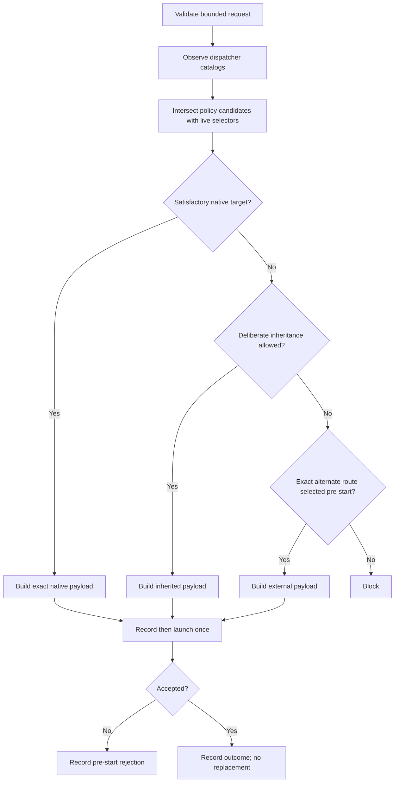

# Dispatching OAT Subagents

Use this internal contract to delegate bounded work while keeping judgment in
the calling skill. It standardizes provider selection and launch evidence. It
does not decide what work should be delegated or synthesize worker results.

## Progress Indicators (User-Facing)

This skill is an internal dependency; the calling skill owns the user-facing
mode and decides whether a sub-banner is useful. When surfacing a distinct
dispatch wave, use:

━━━━━━━━━━━━━━━━━━━━━━━━━━━━━━━━━━━━━━━━━━━━━━━━━━━━━
OAT ▸ SUBAGENT DISPATCH
━━━━━━━━━━━━━━━━━━━━━━━━━━━━━━━━━━━━━━━━━━━━━━━━━━━━━

Do not repeat the banner for every lane. Return a compact selection or blocking
summary for the caller to incorporate.

## Ownership Boundary

The calling skill owns:

- decomposition, lane boundaries, and output schemas;
- user-facing progress, authorization context, and decisions;
- verification of load-bearing worker claims;
- cross-lane synthesis, prioritization, and artifact writes.

This skill owns:

- capability and authorization probing;
- live catalog evidence and candidate intersection;
- model, effort, reasoning mode, service tier, role, route, authority, and deadline selection;
- launch acceptance, continuation, recovery, and dispatch records.

Do not read OAT project state, interpret `pNN-tNN` identifiers, or add phase,
gate, commit, or worktree policy here. Project workflows must load
`oat-project-dispatch-subagents`, which adapts those concerns into this
contract.

## Required Loading

Model-selection policy lives in the `subagent-orchestration` skill (same
pack); this skill owns launch mechanics. Read this file before every
OAT-managed subagent dispatch.

Independently probe each required `<name>/SKILL.md` in order: `${SKILL_DIR}/..`
from this loaded skill, `${HOME}/.agents/skills`, then
`<repo-root>/.agents/skills`. Bind the first match for `subagent-orchestration`
to its own `${ORCHESTRATION_SKILLS_ROOT}`; never ambient discovery. On a miss,
name the skill, stop class-constrained dispatch, and give its intended-scope
recovery command: `oat tools install utility --scope <user|project>` or
`oat tools update --pack utility --scope <user|project>`.

Then read
`${ORCHESTRATION_SKILLS_ROOT}/subagent-orchestration/references/model-selection-principles.md`.
Resolve the active provider and read exactly one selection reference from
`${ORCHESTRATION_SKILLS_ROOT}/subagent-orchestration/references/` plus the
matching mechanics reference from this skill's own `references/`. The
short-form paths below are relative to those two already-bound roots:

- Claude: `subagent-orchestration/references/provider-claude.md`, then
  `references/provider-claude.md`
- Codex or direct OpenAI: `subagent-orchestration/references/provider-codex.md`,
  then `references/provider-codex.md`
- Cursor: `subagent-orchestration/references/provider-cursor.md`, then
  `references/provider-cursor.md`

Do not merge provider references into one policy. The principles file contains
the durable task-class contract; the selection reference contains dated model
mappings; the mechanics reference contains surface-specific launch controls.
For an unsupported provider, apply the provider-neutral contract and fail
closed when exact launch controls cannot be established.

If no candidate root resolves `subagent-orchestration/SKILL.md`, treat model
guidance as unresolved: fail closed for class-constrained dispatch, name the
missing skill with its `utility` recovery commands above, and for
unconstrained dispatch select only through active user and repository
instructions intersected with the live catalog.

Read `subagent-orchestration/references/evidence-and-refresh.md` when
selection guidance is review-required or stale, when a newer model or unknown
control is observed, or when a consequential dispatch depends on evidence that
is not current.

Read `references/record-schema.md` only when constructing or validating a
dispatch request, dispatch record, or homogeneous recon-wave record.

## Caller Request Contract

Require the caller to provide:

- a unique request ID and calling skill;
- bounded objective and scope;
- action and role name mapped to a baseline role class;
- expected output and verification evidence;
- authority, deadline, escalation conditions, and retry limit;
- fallback policy and authorization scope;
- route-selection source for any non-native route;
- optional resolved dispatch policy or named ceiling.

The caller may also provide `task_class`, `classification_source`, and
`classification_reason`. This task-class metadata is optional for existing
generic callers. When supplied, all three fields are required:

- `task_class`: `mechanical-recon`, `intelligent-recon`,
  `default-implementation`, `hard-reasoning`, or `consequential`;
- `classification_source`: the literal `caller`; and
- `classification_reason`: a non-empty artifact-informed rationale.

The caller owns classification. `oat-reviewer` requires these fields for every
reviewer-local reconnaissance lane; other callers that omit them retain
role-based selection behavior and records without class-floor fields.

Reject an over-broad request before selection. Every nontrivial request must
state the exact objective, scope, expected output, verification evidence, and
conditions that require escalation. Model routing never repairs poor
decomposition.

The optional policy and ceiling are already-resolved inputs. Do not infer where
they came from or resolve project state to obtain them.

The optional `operation` is `prepare`, `execute`, or `dispatch`. `prepare` and
`execute` form the approval-bound two-step path below. When `operation` is
omitted, treat it as `operation: dispatch` and preserve the existing one-step
selection-and-launch path for backwards compatibility.

## Capability and Authorization

Classify delegation before launch:

| State                       | Meaning                                                         | Action                                                                  |
| --------------------------- | --------------------------------------------------------------- | ----------------------------------------------------------------------- |
| `available`                 | The host exposes a usable launch surface now.                   | Continue to catalog observation and selection.                          |
| `authorization-required`    | A usable surface exists but needs user approval or scope grant. | Ask once, preserve the approved scope, then re-probe.                   |
| `unresolved-or-unsupported` | No exact usable surface can be established in this environment. | Use only a pre-approved alternate route or block; do not invent syntax. |

Authorization-required is not unavailability. Do not silently reduce coverage
or run expensive work inline merely because one approval question is needed.
The caller owns the user interaction; this skill returns the question and
required scope.

## Native-First Route Selection

Use these route tiers:

1. **Native same-runtime:** Always the preferred default when it can satisfy
   the resolved role, model, effort, authority, and isolation requirements. It
   needs no additional authorization.
2. **Policy-resolved CLI/programmatic or cross-runtime:** Permitted without a
   per-run prompt when configured dispatch policy selected the route. Project
   policy resolved by `oat-project-dispatch-subagents` and configured
   cross-family gates are standing, scope-bound authorization. Some harnesses
   require this tier—for example Cursor task subagents when native model
   availability cannot satisfy the resolved project target.
3. **Agent-improvised CLI/programmatic or cross-runtime:** Prohibited unless
   the user explicitly approves the named target and scope for the current
   run. Approval from a prior run, task, branch reset, or materially different
   scope does not carry forward.

Availability of a provider CLI, SDK, API, or other programmatic surface is
capability evidence, not route authorization. The engine must distinguish a
policy-resolved alternate route from one proposed by the agent. If neither
configured policy nor current explicit approval authorizes the alternate
route, use an eligible native route or block.

Do not re-prompt for each task or gate when the caller provides a complete
policy-resolved route and scope. Record `selection_source: policy-resolved`
with the owning configuration evidence. Use
`selection_source: explicit-user` for a current-run operator grant and
`selection_source: native-default` for the preferred native route.

## Dispatch Axes

Keep these controls independent in selection and evidence:

- dispatch context: root native, nested native, provider CLI/programmatic,
  workflow, gate, or blocked;
- role or agent definition;
- model selector and selector granularity;
- provider-native effort or reasoning selector, when exposed;
- reasoning mode when exposed independently of effort;
- service tier, including fast or priority variants;
- inheritance source and context-fork controls;
- authority, writable roots, deadline, and retry limit;
- route and fallback policy;
- provider-guidance version, verification date, and freshness state.

Do not normalize effort labels across providers. A fast or priority tier is a
latency control unless current provider documentation explicitly establishes a
capability difference; it never satisfies a higher task-class floor.

A materialized role may package defaults, but its record must preserve each
configured axis separately.

## Deliberate Dispatch Mode

Choose foreground or background deliberately from expected duration and the
host interaction model. Multi-minute implementers, fix loops, and reviewers
must survive ordinary session interaction and therefore run in background when
the host supports a durable awaited handle. Reserve foreground dispatch for
short checks whose interruption risk is negligible. Record the selected mode
and reason with the launch payload.

Background does not mean fire-and-forget. Retain and await the accepted handle,
apply the Acceptance and Recovery contract below, and surface useful progress.
In headless gate contexts, fire-and-forget background dispatch is forbidden:
use the gate's inline or synchronously awaited route contract instead.

For a silent background child, provider transcript filesystem metadata at the
documented runtime path can provide observable liveness evidence. Check only
metadata such as mtime and size. This evidence shows observable activity; it
is never a health verdict and never authorizes replacement, timeout extension,
or a second launch.

## Baseline Role Classes

Specific role names are extensible, but map every dispatch to one class:

| Class          | Default contract                                                                                                                                                                                                                          |
| -------------- | ----------------------------------------------------------------------------------------------------------------------------------------------------------------------------------------------------------------------------------------- |
| `recon`        | Read-only, bounded evidence collection. Meet any supplied `task_class` / `model_class_floor` at or above the floor; select an explicit economical target only when no task-class floor was supplied. Never silently inherit a root model. |
| `dossier-lead` | Reconcile dispersed evidence within one declared scope. May coordinate bounded recon only when nesting is supported and approved.                                                                                                         |
| `generator`    | Produce a self-contained artifact within caller-declared authority.                                                                                                                                                                       |
| `worker`       | Execute bounded work with explicit authority, outputs, and verification.                                                                                                                                                                  |
| `reviewer`     | Perform independent or inherited review exactly as caller policy specifies.                                                                                                                                                               |
| `coordinator`  | Coordinate a caller-defined topology without taking over caller synthesis or user dialogue.                                                                                                                                               |

Use stronger workers when context, ambiguity, or consequence requires them,
not merely because many files exist. Keep coherence-critical synthesis and
cross-scope judgment in the root caller.

## Task Classes and Model Floors

Role class and task class are independent. Role class controls authority and
output ownership; task class is the minimum model-capability floor for one
bounded objective. A `role.class: recon` worker remains read-only and advisory
at every task class.

Classify by deterministic verifiability, silent-miss risk, dispersed context,
ambiguity, and consequence, in that order. File count alone never justifies
escalation:

| Task class               | Minimum capability contract                                                                             |
| ------------------------ | ------------------------------------------------------------------------------------------------------- |
| `mechanical-recon`       | Deterministic inventories, parity checks, or test/lint/format/build execution whose misses are visible. |
| `intelligent-recon`      | Interpretation, unfamiliar-code auditing, or policy/semantic evidence where a miss could be silent.     |
| `default-implementation` | Retain and reconcile dispersed context inside one independently bounded scope.                          |
| `hard-reasoning`         | Ambiguity, novelty, architecture analysis, or competing interpretations dominate.                       |
| `consequential`          | Security, release safety, irreversible impact, adversarial analysis, or expensive failure dominates.    |

Mechanical workers may execute checks and return exact output. Interpretation
and policy judgment require a stronger class or stay with the root caller. When
uncertain between classes, use the stronger floor.

For unconstrained legacy recon with no `task_class` supplied, select an
explicit economical target rather than silently inheriting the root model.
Class-constrained recon must select a target at or above the supplied
`model_class_floor`; otherwise set `floor_satisfaction: unsatisfied` and return
the lane through `caller-inline`. An economical target is not a universal
baseline for the `recon` role.

Resolve current class examples through active user and repository instructions
first, then the active-provider selection reference and live catalog, all
constrained by the supplied policy and ceiling. Named models in the guidance
layer are dated examples, not canonical requirements. Select an exact eligible
target at or above the requested floor; never silently downgrade.

## Dated Guidance and Candidate Qualification

Task-class contracts are durable. Named models in the selection references are
dated examples. A newer model is a candidate, not an automatic upgrade.

Before using a provider mapping, determine its guidance state from the
selection-reference frontmatter and
`subagent-orchestration/references/evidence-and-refresh.md`:

- `fresh`: use the mapping after live catalog intersection;
- `review-required`: inspect current official controls and relevant evidence
  before changing the incumbent;
- `stale`: do not rely on the named mapping without requalification. Retain a
  known-good incumbent only when still available and floor-satisfying, or route
  one class up.

A replacement must satisfy the class floor, be exactly selectable in the
launching harness, have understood effort and service-tier semantics, avoid a
material regression on relevant evidence, and fit the route's cost, latency,
tool, context, and safeguard requirements. When evidence is incomplete, keep
the incumbent or route one class up. Never silently select below the floor.

Record the guidance version, verification date, freshness state, and the reason
for any incumbent change.

## Catalog Evidence

A catalog snapshot belongs to one dispatch context. A root native catalog does
not establish a nested coordinator's catalog, and a provider CLI account
catalog does not establish native eligibility.

Before explicit selection:

1. Observe selectors exposed to the dispatcher that will launch the child.
2. Observe role or agent-type selectors when exposed before selection.
3. Record catalog source, context, and observation time.
4. Intersect configured candidates allowed by policy and ceiling with that
   catalog, preserving exact provider strings.
5. Keep volatile observations out of durable configuration unless the user
   explicitly changes the owning configuration.

Do not launch a diagnostic child solely to obtain a catalog the provider
cannot expose before selection. Record the visibility timing instead.

## Approval-Bound Preparation and Execution

Use this path when a caller must show the exact selection and execution
envelope for approval before any child starts. The caller still owns the user
interaction; this skill produces and validates the approval evidence.

### `operation: prepare`

Preparation is selection-only. It must observe the live catalog in the exact
dispatch context and return a complete prepared dispatch record without
launching, reserving capacity, or obtaining a child handle.

Before selecting a target:

1. Classify all planned and conditional waves before selection. Record every
   wave's `task_class` and `model_class_floor`.
2. Compute the run-wide maximum model-class floor using the durable task-class
   order. Conditional waves count even when the caller may later skip them.
3. Select one exact target at or above that maximum floor and pin it across all
   prepared waves. The pin includes provider, dispatch context, route, role,
   model and selector granularity, effort, reasoning mode, and service tier.
   Do not weaken a wave floor, split the target, or silently substitute a
   cheaper target. If one target cannot satisfy every wave, return a blocked
   preparation.
4. Materialize each wave's exact authority, deadline, retry limit,
   concurrency, lane cap, scopes, lane IDs, context controls, fallback, and
   canonical redacted payload digest. Record the catalog observation identity
   and the fingerprint of the relevant selectable facts.
5. Construct the canonical approval projection defined in
   `references/record-schema.md`, return `dispatch_state: prepared`, and stop.

The calling workflow may combine prepared wave records into a run manifest,
but it must preserve the run ID, maximum floor, pinned target, per-wave axes,
canonical approval fingerprint, and prepared timestamp byte-for-byte.

### Approval

The caller presents the complete approval projection and records explicit
approval by changing only `dispatch_state`, `approved_at`, and the approval
evidence fields allowed by the schema. Approval is valid only for the exact
canonical fingerprint. Editing any bound axis creates a new preparation; it
does not update an already approved record in place.

### `operation: execute`

Execution accepts one approved prepared record. Before invoking the launcher:

1. Validate the prepared-record version, legal state, approval timestamp, and
   approval fingerprint against the unchanged canonical projection.
2. Re-observe the live catalog in the same dispatch context and compare the
   current relevant selectable facts with the prepared observation. A new
   unrelated candidate alone is not relevant drift; removal, renaming,
   semantic change, or loss of selectability for an approved control is.
3. Re-resolve the actual launch controls without choosing alternatives and
   compare every approval-bound axis exactly. Provider-native opaque values
   stay byte-for-byte exact.
4. Refuse launch and mark the record `stale` when any comparison differs. The
   caller must run `prepare` again and obtain reapproval.
5. Launch the approved payload once. Record `accepted` only from positive
   launcher acceptance; otherwise record `not-accepted`.

A model change is model drift. An effort change is effort drift. A provider
change is provider drift. A route change is route drift. A role change is role
drift. A service tier change is service tier drift. An authority change is
authority drift. A deadline change is deadline drift. A concurrency change is
concurrency drift. A lane cap change is lane cap drift. A relevant catalog
change is catalog drift. The same fail-closed rule covers reasoning mode,
selector granularity, retry limit, writable roots, context controls, fallback,
wave topology, scope, lane identity, payload digest, floor, or pinned-target
drift. Never adjust one of these controls to make execution fit the current
surface.

Launch acceptance remains terminal for replacement eligibility. After a
prepared launch is accepted, no alternate route, replacement, or target
substitution is allowed; record the eventual terminal child outcome and use
only the existing continuation and caller-authorized same-target recovery
rules.

### One-Step Backwards Compatibility

Existing callers may omit `operation` or provide `operation: dispatch`. This
retains exactly the current one-step selection-and-launch flow in
Full-Information Selection: observe, select, record, and launch once in the
same operation. Do not require those callers to invent a prepared record,
approval timestamp, or approval fingerprint. New approval-bound callers must
use `prepare` and `execute`; they may not collapse that path into `dispatch`.

## Full-Information Selection

For every legacy one-step dispatch and for the selection portion of
`operation: prepare`:

1. Validate the caller request and capability state.
2. Resolve provider, context, role class, optional task class and model-class
   floor, policy, ceiling, and candidates.
3. Observe the launching dispatcher's relevant catalogs.
4. Compute the exact native intersection at or above the supplied task-class
   floor, when present.
5. Prefer an eligible native route. Otherwise select one policy-resolved or
   explicitly authorized inherited, provider-CLI/programmatic, workflow, gate,
   or blocked route before launch.
6. Build the complete redacted payload.
7. Record route, selection source, selection reason, candidates, catalog
   source, model, effort, reasoning mode, service tier, guidance version,
   authority, and deadline.
8. For `operation: prepare`, construct the prepared record and return without
   launch. Do not continue into the legacy launch steps.
9. For a legacy one-step dispatch only, launch once.
10. Record launch acceptance separately from child outcome and runtime identity.

The following diagram is the legacy one-step flow. Approval-bound preparation
stops after selection and record construction; its later `execute` operation
performs the separately approved launch.



## Homogeneous Recon Waves

A homogeneous wave may share one record only when `task_class` and
`model_class_floor` match in addition to every existing dispatch axis.
Multiple read-only recon lanes may share one selection record only when all of
these axes are identical: provider, dispatch context, catalog snapshot,
selected route, role class, role selector, model, effort, reasoning mode
(`reasoning_mode_selector`), service tier (`service_tier_selector`), guidance
reference (`guidance_reference`), guidance version (`guidance_version`),
guidance verification date (`guidance_verified_at`), guidance status
(`guidance_status`), authority, deadline, retry limit, fallback, `task_class`,
and `model_class_floor`. Optional model-guidance fields must be identically
present or absent across all lanes and, when present, have identical values.
Include a lane manifest with lane-specific scope, acceptance, and outcome. A
recon-wave record repeats the shared `task_class` and `model_class_floor`
beside `shared_dispatch_record`; lane entries do not redefine them.

If any axis differs or either class field does not match, create separate
records and waves. The record-level scope is the aggregate wave boundary; each
lane may narrow that boundary.

## Class-Constrained Fallback

For a request with task-class metadata, record `model_class_floor` equal to
`task_class` and set `floor_satisfaction` to `satisfied` or `unsatisfied`.
An unsatisfied floor blocks launch and returns control to the caller; it never
records a weaker selection as success.

Reviewer-local requests use:

```yaml
fallback:
  mode: caller-inline
  allow_below_task_class_floor: false
```

Below-floor selection is prohibited. The legacy `explicit-downgrade` fallback
remains available only to unconstrained callers without task-class metadata or
a declared class floor.

## Acceptance and Recovery

- An accepted launch is terminal for automatic replacement eligibility.
- Completion, failure, timeout, interruption, `BLOCKED`, and contract refusal
  are post-acceptance outcomes; none makes another route eligible.
- Automatic route, model, provider, or worker replacement after acceptance is
  forbidden fallback. No post-acceptance outcome makes another route eligible.
- A wrapper failure or payload rejection before child start is a pre-start
  rejection. A new recorded selection is allowed only within caller retry
  policy.
- Continuing the same accepted child through its valid handle is allowed.
  Record continuation separately and preserve selectors and route.
- Same-target bounded recovery is a continuation rather than fallback only when
  a caller-specific lifecycle contract explicitly authorizes it. That contract
  must supply the bounded scope, exact target, numeric budget, canonical
  recording, and stop conditions before launch. It may allow either
  continuation through the accepted handle or an explicitly linked fresh
  same-target launch when the original handle cannot be resumed.
- Standing recovery authority is default-deny. `oat-project-implement` may
  establish it through its complete caller-specific lifecycle contract; wave
  execution, autonomous projects, cloud-project orchestration, reviewers, and
  every other consumer remain outside that grant unless their own future
  contract independently defines the complete boundary.
- Scope-expanding or consequential recovery requires new operator direction.
  The same applies to ambiguous, destructive, or retry-exhausted work.
- A caller may cancel accepted handles only after it proves that the enclosing
  run itself is invalid under caller-owned containment or integrity policy.
  Record `invalid-run-abort` and the invalidating evidence. Cancellation never
  makes another route eligible and never authorizes replacement, fallback, or
  a successful child outcome.
- Runtime identity is optional corroboration. Missing runtime identity does not
  invalidate launcher-owned configured invocation evidence.

## Return Contract

Return the structured record plus the child output or blocking diagnostic to
the caller. Do not write caller artifacts, reinterpret results, or make user
decisions. The caller verifies claims before depending on them.

Use the schema in `references/record-schema.md`. Existing parseable dispatch
stamps may remain for compatibility, but they do not replace the structured
record.
