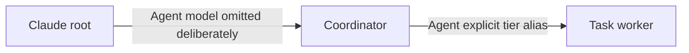

# Claude Subagent Dispatch

Load this reference only when the active provider is Claude. Verified native
and CLI capabilities are guidance; production workflow evidence remains Phase
p05 scope.

## Control Surfaces

| Surface            | Controls                                    | Qualification                                              |
| ------------------ | ------------------------------------------- | ---------------------------------------------------------- |
| Native `Agent`     | Agent type plus optional tier-alias model   | No effort parameter on this surface                        |
| Agent definition   | Default model in frontmatter                | Between explicit call selection and parent inheritance     |
| Workflow `agent()` | Agent type, model, and effort in schema     | Schema observed; no production launch verified             |
| `claude -p`        | Alias or full model ID plus CLI effort      | Exact model invocation verified                            |
| Continuation       | Existing child handle through `SendMessage` | Preserves context; a new `Agent` call starts another child |

Native model resolution precedence is:

1. explicit call model;
2. agent-definition model;
3. parent or session inheritance.

Omitting a model is a real inheritance selection. Never omit it for a task
worker unless inheritance is the deliberate policy.

## Native Topology

Generic depth-2 native dispatch is verified:

The current nested model enum is visible before selection. The nested
agent-type catalog may not become visible until after a first nested call. Read
the model enum before explicit selection, use a known role from the active
contract when a pre-call role list is unavailable, and record role-catalog
visibility timing. Do not launch a diagnostic child solely to satisfy a
universal catalog rule.

## Surface-aware Selection

Native `Agent` accepts tier aliases; `claude -p` can accept a full model ID and
CLI effort. Therefore:

- select an exact alias from the current native enum for native dispatch;
- select the CLI route before launch when a full ID or explicit effort is
  required;
- record selector granularity as `tier-alias` or `exact-model-id`;
- record native effort as `not-exposed`, not globally `not-applicable`;
- keep acceptance, child outcome, runtime identity, and continuation separate.

## Evidence Boundary

Capability runs verify generic native nesting, inheritance, explicit native
selection, and exact CLI invocation. They do not prove arbitrary production
role cooperation. Phase p05 live smoke owns production coordinator-to-worker
behavior, review routing, write-capable permissions, and review-ceiling
enforcement.
