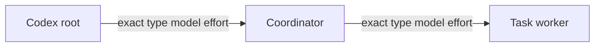

# Codex Subagent Dispatch

Load this reference only when the active provider is Codex.

## Independent Controls

Codex exposes independent native controls for:

- registered agent type;
- model and reasoning effort;
- service tier and forked context;
- maximum nesting depth;
- sandbox and scoped writable roots.

A materialized role may package defaults, but the dispatch record must preserve
role, model, effort, service tier, and fork behavior as separate configured
axes.

## Native Topology

Generic depth-2 native dispatch is verified:



Read the effective maximum nesting depth for each environment. Default
root → phase-agent execution needs one child level; a second level only enables
optional nested work. Either depth does not grant filesystem authority.
Before a write-capable launch, verify the minimum scoped writable roots needed
for the task, shared Git metadata, and managed output.

## Exact Native Selection

1. Read live registered roles and model/effort selectors.
2. Read effective depth and sandbox configuration.
3. Resolve one configured candidate under the named ceiling.
4. Use the resolver's materialized role as the exact native `agent_type`.
5. Use the fork mode allowed by the live schema for explicit overrides.
6. Record materialized configuration and live schema as distinct sources.

Native spawn acceptance is configured-invocation evidence. Missing runtime
model identity does not invalidate the accepted configured payload.

Only an actual role-selection rejection before child start permits another
recorded route. A timeout, interruption, `BLOCKED`, or task failure after
acceptance does not.

## CLI Route

When native dispatch cannot express the complete target and the route is
selected before launch, use a self-contained `codex exec` invocation:

```sh
codex exec \
  --ephemeral \
  --sandbox read-only \
  --model '<model>' \
  -c 'model_reasoning_effort="<effort>"' \
  '<self-contained bounded prompt>'
```

Use current CLI help and the caller's authorization boundary. Record model,
effort, sandbox, and route as configured invocation evidence; do not infer
runtime identity from a successful process alone.

## Evidence Boundary

Capability runs verify generic native depth, exact controls, independent CLI
invocation, and configured-invocation evidence. Phase p05 live smoke owns
production `oat-phase-implementer` cooperation, write-capable workers,
review-ceiling enforcement, and catalog stability.
