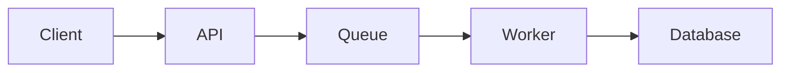

# Markdown and Fumadocs Conventions

Write docs in plain Markdown by default. Use MDX only when a page needs components and the repository intentionally supports MDX.

The goal is content portability: the docs should be readable in GitHub, useful to agents, and render cleanly in Fumadocs.

## File frontmatter

Use frontmatter when the docs platform supports it.

Recommended minimum:

```md
---
title: Local development
description: How to run the service locally for development.
---
```

Keep titles human-readable. Do not force title casing if the project style uses sentence case.

## One H1 per page

Use one top-level heading.

```md
# Local development
```

Then use nested headings in order:

```md
## Prerequisites

### Node.js version

## Start the app
```

Do not skip from `##` to `####`.

## Code block language identifiers

Always specify a language.

Use these defaults:

| Content             | Language     |
| ------------------- | ------------ |
| shell commands      | `sh`         |
| terminal output     | `txt`        |
| TypeScript          | `ts`         |
| TypeScript with JSX | `tsx`        |
| JavaScript          | `js`         |
| JSON                | `json`       |
| YAML                | `yaml`       |
| Markdown            | `md`         |
| GraphQL             | `graphql`    |
| Dockerfile          | `dockerfile` |
| SQL                 | `sql`        |
| Terraform           | `hcl`        |
| Diff                | `diff`       |

## Shell commands

Do not include a prompt unless the prompt itself matters.

Prefer:

```sh
pnpm test
```

Avoid:

```sh
$ pnpm test
```

## Placeholders

Use angle brackets for placeholders:

```sh
pnpm deploy --env <environment>
```

Explain placeholders immediately:

```md
Replace `<environment>` with `staging` or `production`.
```

Do not use fake values that look real unless they are explicitly examples.

## Comments inside commands

Avoid comments inside copyable commands when they make copy-paste fail.

Bad:

```sh
pnpm deploy # deploys to production
```

Better:

````md
Deploy to production:

```sh
pnpm deploy --env production
```
````

## Expected output

Show expected output for verification steps.

````md
Run the health check:

```sh
curl http://localhost:3000/health
```

Expected output:

```json
{
  "status": "ok"
}
```
````

## Callouts

Use GitHub-style callouts when supported by the renderer:

```md
> [!NOTE]
> Useful context that helps the reader avoid confusion.
```

```md
> [!WARNING]
> Production-impacting or destructive behavior.
```

```md
> [!TIP]
> Optional improvement or shortcut.
```

Keep callouts short. If a callout grows beyond a few sentences, it probably deserves a section.

## Tables

Use tables for structured reference.

```md
| Name   | Type   | Required | Default | Description      |
| ------ | ------ | -------: | ------- | ---------------- |
| `PORT` | number |       No | `3000`  | Local HTTP port. |
```

Avoid wide tables with paragraphs in cells. Split into sections instead.

## Relative links

Prefer relative links between docs pages.

```md
Read the [deployment guide](../how-to/deployment.md).
```

Use absolute links for external references.

## Descriptive links

Bad:

```md
See [this](../reference/configuration.md).
```

Better:

```md
Read the [configuration reference](../reference/configuration.md).
```

## Images and diagrams

For diagrams, prefer source-controlled formats when possible:

- Mermaid for simple flowcharts and sequence diagrams
- text-based diagrams for lightweight docs
- committed images only when necessary
- architecture-as-code tools when the team owns them

Every diagram should have surrounding text that explains:

- what the diagram shows
- what it omits
- when it is relevant
- where to find deeper detail

## Mermaid diagrams

Use Mermaid for simple diagrams if supported.

````md

````

Do not make diagrams so dense that they become worse than prose.

## Generated docs markers

If a page is generated, say so.

```md
> [!NOTE]
> This command reference is generated from the CLI source. Do not edit this page manually.
```

Also link to generation instructions.

## Public docs safety

Before publishing externally, remove:

- private repo names unless intentionally public
- internal URLs
- Slack channels
- incident details
- customer data
- private environment names
- secrets
- tokens
- credentials
- private architecture details that are not part of the public contract

## Markdown linting recommendations

Useful rules for consistency:

- one H1 per page
- heading levels increment by one
- fenced code blocks have language identifiers
- no trailing whitespace
- no bare URLs when a descriptive link is better
- ordered lists start at `1`
- no duplicate headings in the same page

## Fumadocs-specific notes

A Fumadocs site can support Markdown and MDX. Keep content in plain Markdown unless a page needs an interactive component or custom rendering.

When creating docs for a Fumadocs site:

- keep filenames stable and descriptive
- keep headings meaningful for generated table of contents
- use frontmatter consistently if the site expects it
- avoid custom components in core instructions unless necessary
- prefer standard Markdown for agent readability
- keep content files close to the product area they document

## llms.txt and agent consumption

For public docs sites, consider exposing agent-readable entry points such as:

- `llms.txt`
- `llms-full.txt`
- Markdown copy links
- source links

The goal is not to write separate docs for agents. The goal is to make the same docs easy for agents to retrieve and use.
