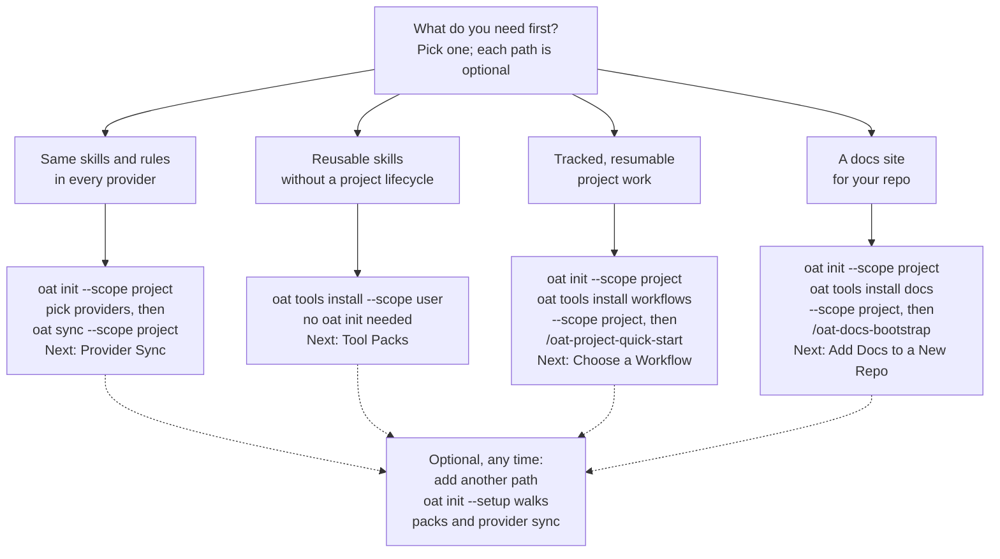

# Adoption paths diagram — verified drop-in

Status: drafted by one Opus lane, adversarially verified by a separate Opus lane (ACCEPT WITH CHANGES; changes applied). Verifier reopened every citation and ran the branch CLI in throwaway repos with an isolated HOME. Mermaid not machine-rendered. Reports: ../01-adoption-paths.md, ../01-adoption-paths.verify.md.

## Placement

apps/oat-docs/docs/getting-started/concepts.md: replace the first mermaid block (the three-box BASE -> MIDDLE -> TOP stack under the capability heading). Leave the second diagram (canonical assets -> provider views) in place, but remove its .gemini/ node: sync writes nothing to .gemini/ (packages/cli/src/providers/shared/registry.ts:298-299).

## Diagram

## accessible label

Decision flowchart. It starts from "What do you need first?" and branches into four optional paths: provider sync, reusable skills, tracked project workflows, and a docs site. Each path leads to its first commands or agent skill and a docs page to read next. Every path except reusable skills begins with `oat init` in the repository. Any path can later be combined with another.

## text equivalent

Pick the path that matches what you need first. No path depends on another path. Every path except reusable skills starts with `oat init` in the repository. Steps written as `/name` are agent skills you run in your coding agent, not shell commands.

- **Same skills and rules in every provider:** run `oat init --scope project` and choose your providers, then run `oat sync --scope project`. Read next: [Provider Sync](../provider-sync/index.md).
- **Reusable skills without a project lifecycle:** run `oat tools install --scope user` and choose packs. You do not need `oat init`, and the install syncs the new skills to your providers. Read next: [Tool Packs](tool-packs.md).
- **Tracked, resumable project work:** run `oat init --scope project`, then `oat tools install workflows --scope project`, then start with `/oat-project-quick-start`. Read next: [Choose a Workflow](../workflows/choose-workflow.md).
- **A docs site for your repo:** run `oat init --scope project`, then `oat tools install docs --scope project`, then use `/oat-docs-bootstrap`. Read next: [Add Docs to a New Repo](../docs-tooling/add-docs-to-a-repo.md).

On a fresh repository, `oat init` offers guided setup. Accept it to install tool packs and sync providers in one pass. Decline it to follow a single path. You can add another path at any time: `oat init --setup` walks through tool packs and provider sync again.

## Scope note (added after review)

Commands are shown with an explicit `--scope`. Without it, `oat init`, `oat sync` and `oat tools install` default to scope `all` and also write under your home directory. `--scope project` keeps changes inside the repository; `--scope user` installs for you across repositories. Flags confirmed against the installed CLI help (oat 0.3.13). Even with `--scope project`, the `core` pack installs at user scope. The Mermaid block was edited for these labels after its verification and has not been re-rendered.

## Related fixes for the editorial list

- concepts.md still says the layers 'stack' (around lines 66-74); README 'Capability Layers' / 'adopt any layer' / 'on top' wording has the same problem.
- Quick-start fails in a repo with no origin remote because new projects default to synced scope; worth one sentence near the workflows path.
- A bare oat init / oat sync also writes to the user's home directory (user scope); say so where first-run commands are shown.
