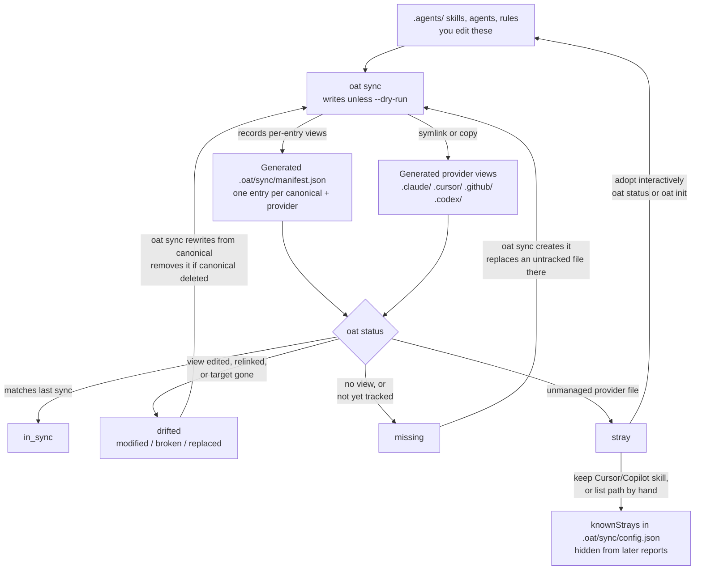

# Provider sync and drift diagram — verified drop-in

Status: drafted by one Opus lane, adversarially verified by a separate Opus lane
(ACCEPT WITH CHANGES; changes applied below). The verifier reopened citations
and ran the branch CLI in a throwaway repo with an isolated HOME, reproducing
`missing`, `stray`, and `drifted` (`replaced`, `modified`, `broken`) plus sync's
create, overwrite and remove behavior. Not verified: interactive adopt/keep
prompts, user scope, a machine render of the Mermaid block.
Reports: `../02-provider-sync-drift.md`, `../02-provider-sync-drift.verify.md`.

## Placement

`apps/oat-docs/docs/provider-sync/manifest-and-drift.md`: insert after the end
of the `## Quick Look` section (after the line beginning
`- Primary commands:`) and before `## Manifest locations`.

## Diagram

## Accessible label

Flowchart: you edit canonical files under `.agents/`. `oat sync` writes provider
views and records them in `.oat/sync/manifest.json`. `oat status` reports each
view as in_sync, drifted, missing, or stray. Re-running `oat sync` rewrites
drifted views and creates missing ones from canonical, replacing provider-side
edits. Strays are adopted into `.agents/` interactively or listed in
`knownStrays`.

## Text equivalent (place directly under the diagram)

- **What you edit.** Only the canonical files under `.agents/` (skills, agents,
  rules). `oat sync` reads them and writes provider views as symlinks or copies
  under `.claude/`, `.cursor/`, `.github/` and `.codex/`. It records each
  per-entry view in `.oat/sync/manifest.json`, one entry per canonical path and
  provider. Codex roles and config are generated too, but are tracked by the
  Codex extension, not as manifest entries.
- **What `oat status` reports.** A view is `in_sync` when it still matches what
  the last sync recorded, `drifted` (`modified`, `broken` or `replaced`) when
  its content or link changed or its target is gone, and `missing` when no view
  exists or it was never tracked. A provider file OAT does not manage is a
  `stray`.
- **What re-running `oat sync` does.** It writes unless you pass `--dry-run`.
  It recreates missing views and rewrites drifted ones from canonical, so an
  edit made in a provider copy is lost, not merged. A file you placed at a
  view's path without OAT is replaced too, and a view whose canonical source
  was deleted is removed.
- **What to do with a stray.** In an interactive `oat status` or `oat init` you
  can adopt it, which moves or converts it into `.agents/`. For a Cursor or
  Copilot skill you can keep it in place; OAT records the path under
  `knownStrays` in `.oat/sync/config.json` and leaves it out of later reports.
  You can also list a path there by hand.

## Source evidence (verified)

| Claim                                                                  | Evidence                                                                                        |
| ---------------------------------------------------------------------- | ----------------------------------------------------------------------------------------------- |
| State set: in_sync, drifted (modified/broken/replaced), missing, stray | `packages/cli/src/drift/drift.types.ts:1-5`                                                     |
| `oat sync` writes by default; `--dry-run` previews                     | `packages/cli/src/commands/sync/index.ts:596`, `:622`                                           |
| Untracked file at a view path reads `missing` and is replaced by sync  | `packages/cli/src/engine/compute-plan.ts:412-417`, `engine/execute-plan.ts:261-262`; reproduced |
| Deleted canonical → view and manifest entry removed                    | `packages/cli/src/engine/compute-plan.ts:211-229`; reproduced                                   |
| Drift compares a view with its last-sync record, not current canonical | `packages/cli/src/drift/detector.ts:111-113`                                                    |
| `.codex/` output generated outside manifest entries                    | `packages/cli/src/providers/codex/codec/sync-extension.ts:619`, `:816`                          |
| Sync writes nothing to `.gemini/`                                      | `packages/cli/src/providers/shared/registry.ts:298-299`                                         |

## Docs issues found (for the editorial list)

1. **Data-loss behavior is undocumented.** Provider-sync docs do not say that
   re-sync overwrites provider-side edits, replaces an untracked file sitting at
   a view path, or removes a view whose canonical source was deleted. This
   should be stated plainly on this page and in `provider-sync/commands.md`.
2. `getting-started/concepts.md` second diagram shows `oat sync --> .gemini/`;
   remove that node.
3. The adoption conflict prompt ("Replace canonical with stray content?") is
   not mentioned anywhere in provider-sync docs.
4. A stale copy can still read `in_sync` because drift is measured against the
   last sync, not current canonical; worth one sentence.
5. `provider-sync/index.md` says you edit `.agents/` and `.oat/`; only
   `.oat/sync/config.json` is meant to be edited, the manifest is CLI-written.
