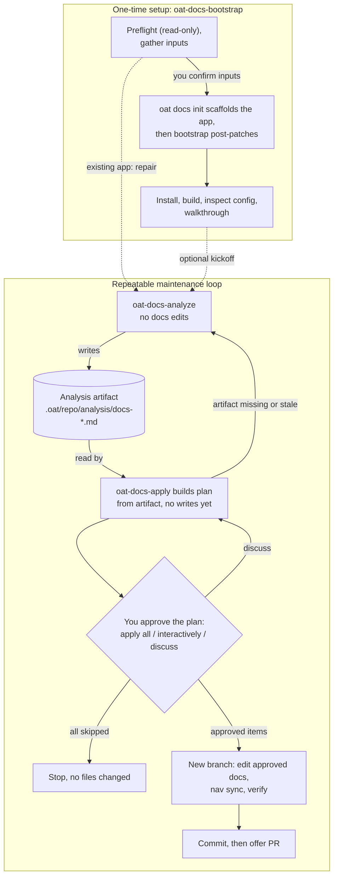

# Docs tooling flow diagram — verified drop-in

Status: drafted by one Opus lane, adversarially verified by a separate Opus lane
(ACCEPT WITH CHANGES; changes applied below). Verified by reading the skill
contracts and CLI code at HEAD `f337faa17`; not rendered in the docs app.
Draft and verifier reports: `../03-docs-tooling-flow.md`,
`../03-docs-tooling-flow.verify.md`.

## Placement

`apps/oat-docs/docs/docs-tooling/workflows.md`, directly after the heading
`## Typical flow` and before the list item `1. Bootstrap a docs app with ...`.

## Diagram

## Accessible label

Flowchart of OAT docs tooling: a one-time bootstrap that scaffolds a docs app
after you confirm its inputs, and a repeatable loop in which analyze writes an
analysis artifact, apply builds a plan from it, and nothing in the docs changes
until you approve that plan.

## Text equivalent (place directly under the diagram)

- **Setup, once.** `oat-docs-bootstrap` checks the repo without writing, asks
  you to confirm its inputs, then runs `oat docs init` to scaffold the app and
  applies its own post-patches. It finishes by installing, building and walking
  you through the result.
- **Analyze.** `oat-docs-analyze` never edits docs. It writes an analysis
  artifact under `.oat/repo/analysis/` (and updates OAT tracking).
- **Approve.** `oat-docs-apply` builds a plan from the newest artifact and
  stops for your decision: apply all, review item by item, or discuss and
  revise. If the artifact is missing or stale it sends you back to analyze. If
  you skip every item, nothing changes.
- **Apply.** Only after approval does apply create a branch, edit the approved
  docs, regenerate navigation, verify, commit and offer a pull request. Items
  marked as needing confirmation are confirmed again before they are written.
- **Repeat.** Re-run analyze afterwards to confirm the result.

## Source evidence (verified)

| Claim                                                                           | Evidence                                                                                                       |
| ------------------------------------------------------------------------------- | -------------------------------------------------------------------------------------------------------------- |
| Binding approval is apply Step 2, on a plan built from the newest artifact      | `.agents/skills/oat-docs-apply/SKILL.md:92-96`, `:134-166`                                                     |
| Options: apply all / apply interactively / discuss                              | `.agents/skills/oat-docs-apply/SKILL.md:134-166`                                                               |
| All skipped → stop, no file changes                                             | `.agents/skills/oat-docs-apply/SKILL.md:166`                                                                   |
| No branch before plan review; branch `oat/docs-<timestamp>` after               | `.agents/skills/oat-docs-apply/SKILL.md:31`, `:178-186`                                                        |
| Edit, nav sync, verify, commit, offer PR                                        | `.agents/skills/oat-docs-apply/SKILL.md:190-252`                                                               |
| Second confirmation for `ask_user` items                                        | `.agents/skills/oat-docs-apply/SKILL.md:201`                                                                   |
| Analyze edits only its artifact; nav commands are `--check` / `--validate-only` | `.agents/skills/oat-docs-analyze/SKILL.md:27-31`, `:470`; `packages/cli/src/commands/docs/nav/sync.ts:102-107` |
| Bootstrap writes nothing until inputs are confirmed                             | `.agents/skills/oat-docs-bootstrap/SKILL.md:233-240`                                                           |
| Bootstrap post-patches after init                                               | `.agents/skills/oat-docs-bootstrap/SKILL.md:14`, `:41`, `:495-724`                                             |

## Docs and contract issues found (for the editorial list, not part of the diagram)

1. `docs-tooling/workflows.md` step 8 ("Review the artifact and run
   `oat-docs-apply`") is ambiguous about where approval happens; the page states
   it correctly at line 56. Reword step 8.
2. `docs-tooling/add-docs-to-a-repo.md:48-50` lists the docs pack without
   `oat-docs-bootstrap`; the pack manifest includes it
   (`packages/cli/src/commands/tools/shared/pack-manifest.ts:207-219`).
3. Apply runs nav sync in write mode for both frameworks when navigation
   changes (`oat-docs-apply/SKILL.md:206`, `:223`); docs that call this step
   "verification" understate it.
4. Skill-contract defects (not docs): bootstrap Step 7b passes an "approved
   subset" that apply has no input for (results in a second approval, not a
   bypass); `oat-docs-apply` `allowed-tools` lists only `git` and `gh` though
   it runs `oat`, `pnpm` and a tracking script.
