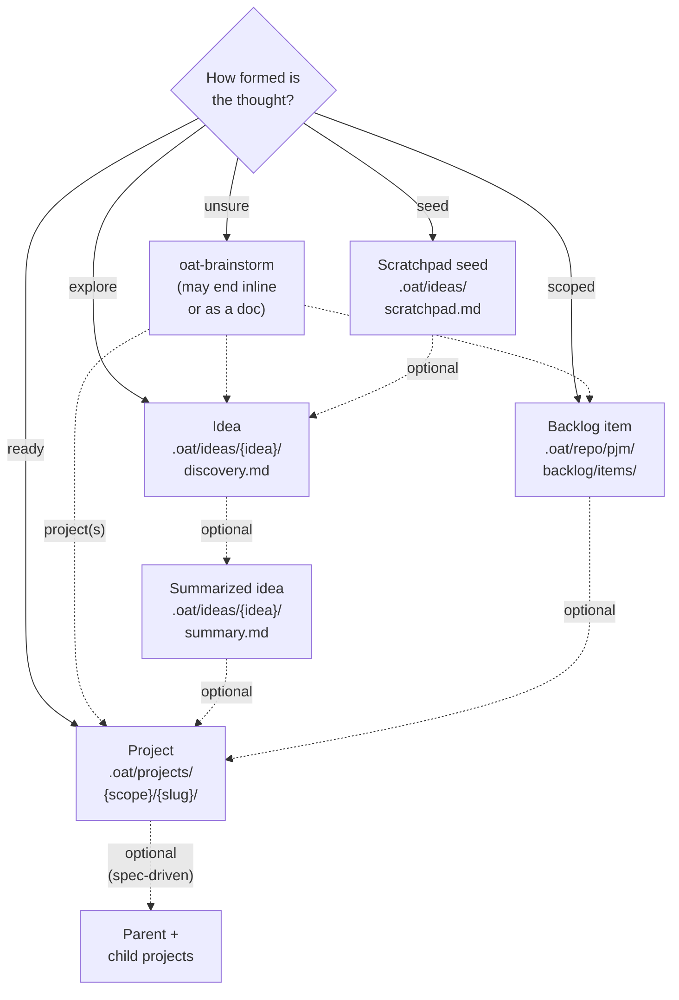

# Ideas, backlog and project homes diagram — verified drop-in

Status: drafted by one Opus lane, adversarially verified by a separate Opus lane
(ACCEPT WITH CHANGES; changes applied below). The verifier reopened every
citation, read the skill contracts and CLI scope resolution, and rendered both
versions with the repo's Mermaid 11.12.3 in headless Chrome: the draft was
1352px wide (unreadable on a phone); this version is 739px. Not checked: the
real docs column width, dark mode, running any skill.
Reports: `../04-ideas-promotion.md`, `../04-ideas-promotion.verify.md`.

## Placement

`apps/oat-docs/docs/workflows/ideas/lifecycle.md`, directly under `## Flow`,
before the list item beginning `1. Quick capture:`.

## Lead-in sentence (place above the diagram)

Start in the home that matches how formed the thought is. Every home is a fine
place to stop. Dashed arrows are optional moves.

## Diagram

## Accessible label

A decision flowchart that starts a thought in one of four homes, depending on
how formed it is: a scratchpad seed, an idea, a backlog item, or a project. A
thought you are unsure about starts in an `oat-brainstorm` conversation
instead. Dashed arrows are optional moves. A brainstorm can hand off to an
idea, a backlog item, or one or more projects. A seed can become an idea, and
an idea a summarized idea. A summarized idea or a backlog item can become a
project. A spec-driven project can split into a parent and child projects.

## Text equivalent (place directly under the diagram)

Where to start:

- **Unsure:** `oat-brainstorm`. It can end as an inline answer or a document,
  or hand off to an idea, a backlog item, or one or more projects.
- **A one-line seed:** `oat-idea-scratchpad`.
- **Worth exploring:** `oat-idea-new`. `oat-idea-ideate` resumes an idea, can
  start one from a scratchpad seed, and can reopen a summarized idea.
- **Scoped work for later:** `oat-pjm-add-backlog-item` (needs `oat pjm init`).
- **Ready to build:** `oat-project-lite`, `oat-project-quick-start`,
  `oat-project-new`, or `oat-project-import-plan` for a plan written elsewhere.

Optional moves:

- Seed to idea: `oat-idea-new`.
- Idea to summarized idea: `oat-idea-summarize`.
- Summarized idea to project: the documented route is `oat-project-new` and
  then `oat-project-discover`, with `summary.md` as the request. That is a
  spec-driven project.
- Backlog item to project: start any project skill and give it the item (or
  its kickoff handoff) as context. Archive the item with `oat backlog archive`
  when the work ships.
- Split into parent and child projects: from spec-driven discovery
  (`oat-project-discover`), or directly from `oat-brainstorm`.

Good to know:

- Moving on leaves the earlier record in place. It is archived, not moved.
- The paths shown are project-level defaults. With `--global`, ideas live in
  `~/.oat/ideas/`. Ideas are local and usually gitignored.
- The ideas backlog (`backlog.md` inside the ideas folder) is an index of
  ideas. It is not the repository backlog under `.oat/repo/pjm/backlog/`.
- Backlog items are committed to the repository. Projects are committed
  (shared scope), pushed to a project ref (synced scope, the default on a
  fresh install), or kept on your machine (local scope).

## Source evidence (verified)

| Claim                                                                         | Evidence                                                                                              |
| ----------------------------------------------------------------------------- | ----------------------------------------------------------------------------------------------------- |
| Split detection runs only in spec-driven discovery                            | `.agents/skills/oat-project-discover/SKILL.md:285`, `:320`, `:400`; no `split` in quick-start or lite |
| No project-entry skill consumes a backlog item; bridge is the kickoff handoff | `.agents/skills/oat-pjm-review-backlog/SKILL.md:248-262`; `oat-project-lite/SKILL.md:162-175`         |
| Summary → project route is `oat-project-new` + `oat-project-discover`         | `.agents/skills/oat-idea-summarize/SKILL.md:172-183`                                                  |
| Fresh-install default project scope is `synced`                               | `packages/cli/src/commands/shared/project-scope.ts:171-196`                                           |
| Synced projects are gitignored on the branch; local are untracked             | `packages/cli/src/commands/init/gitignore.ts:17-25`                                                   |
| User-level ideas root with `--global`                                         | `.agents/skills/oat-idea-new/SKILL.md:55-72`                                                          |
| `oat-idea-ideate` behaviors                                                   | `.agents/skills/oat-idea-ideate/SKILL.md:137-138`, `:152-160`, `:197-201`                             |
| `\n` in labels is rewritten to ` ` by the docs pipeline                   | `packages/docs-transforms/src/remark-mermaid.ts:9-21`                                                 |

## Docs and contract issues found (for the editorial list)

1. `workflows/ideas/index.md:33` says projects live in `.oat/projects/shared/`;
   a fresh install uses the `synced` scope.
2. `workflows/ideas/lifecycle.md:106` says brainstorm promotion always writes
   `discovery.md`; `oat-brainstorm` also has a lite branch that seeds `plan.md`.
3. `workflows/ideas/index.md:40` offers lite, quick or spec-driven from a
   summarized idea; the summarize contract documents only the spec-driven route.
4. `workflows/ideas/lifecycle.md:36` destination list for brainstorm is
   incomplete (active-project fold-back, reference file, multi-project).
5. Skill-contract defects (not docs): `oat-brainstorm` contradicts its own lite
   branch at `references/destinations.md:122-126` and `SKILL.md:821`;
   `oat-project-new/SKILL.md:94` checks for the project under the shared root,
   which is wrong for the default scope; PJM kickoff-handoff templates
   (`.oat/templates/pjm-handoffs-readme.md`, `pjm-agents.md:89-90`) omit lite.
