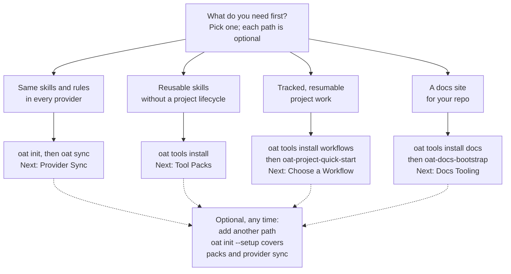
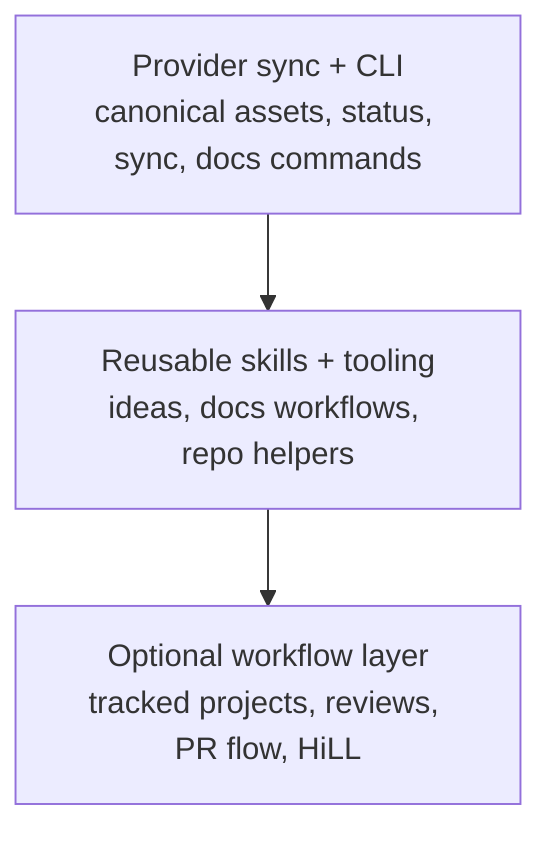

# 01 - Adoption paths (draft)

## Diagram



## Accessible label

Decision flowchart: starting from "What do you need first?", four independent, optional paths (provider sync, reusable skills, tracked project workflows, a docs site) each lead to a first command or skill and a docs page to read next, and all four can later be combined with another path.

## Text equivalent

Pick the path that matches what you need first. None of them is a prerequisite for the others:

- **Same skills and rules in every provider:** run `oat init`, then `oat sync`. Read next: [Provider Sync](../provider-sync/index.md).
- **Reusable skills without a project lifecycle:** run `oat tools install` and choose packs. Read next: [Tool Packs](tool-packs.md).
- **Tracked, resumable project work:** run `oat tools install workflows`, then start with the `oat-project-quick-start` skill. Read next: [Choose a Workflow](../workflows/choose-workflow.md).
- **A docs site for your repo:** run `oat tools install docs`, then use the `oat-docs-bootstrap` skill. Read next: [Docs Tooling](../docs-tooling/index.md).

You can add another path at any time. `oat init --setup` walks through tool packs and provider sync in one guided session.

## Placement

File: `apps/oat-docs/docs/getting-started/concepts.md`

Replace lines 12-16 (the fenced block under `## Capability Stack`, line 10), exactly:

````markdown

````

Suggested companion edits for the integrator, which are outside this diagram's scope:

- Rename the line 10 heading `## Capability Stack` to something like `## Choose a Starting Path`. "Stack" restates the layering this diagram removes.
- Put the Text equivalent directly under the diagram.
- Leave lines 22-32 (the canonical-assets to provider-views `flowchart LR`) unchanged.

## Edge citations

All paths are repo-relative to the `amphipod` worktree.

| Node or edge              | Claim it makes                                                                                                | Evidence                                                                                                                                                                                                                                                                                                                             |
| ------------------------- | ------------------------------------------------------------------------------------------------------------- | ------------------------------------------------------------------------------------------------------------------------------------------------------------------------------------------------------------------------------------------------------------------------------------------------------------------------------------ |
| `GOAL`                    | The reader picks a starting need, and every path is optional and independent                                  | `apps/oat-docs/docs/getting-started/quickstart.md:8`, `:88`; `apps/oat-docs/docs/index.md:10`, `:34`; `README.md:21`                                                                                                                                                                                                                 |
| `GOAL --> SYNC_NEED`      | Provider sync is a standalone starting choice                                                                 | `apps/oat-docs/docs/provider-sync/index.md:12`; `apps/oat-docs/docs/getting-started/quickstart.md:23-31`                                                                                                                                                                                                                             |
| `SYNC_NEED`               | This path keeps canonical skills/rules aligned across providers                                               | `apps/oat-docs/docs/getting-started/quickstart.md:25`; `apps/oat-docs/docs/provider-sync/index.md:8-10`                                                                                                                                                                                                                              |
| `SYNC_NEED --> SYNC_DO`   | The first actions are `oat init` and then `oat sync`                                                          | `apps/oat-docs/docs/provider-sync/index.md:52-56`; `packages/cli/src/commands/init/index.ts:1390` (`init` command); `packages/cli/src/commands/sync/index.ts:621` (`Sync canonical content to provider views`)                                                                                                                       |
| `SYNC_DO`                 | `oat init` creates the canonical layout and sync state; the next page is Provider Sync                        | `apps/oat-docs/docs/getting-started/bootstrap.md:20-24`, `:33`; `apps/oat-docs/docs/getting-started/quickstart.md:33-35`                                                                                                                                                                                                             |
| `GOAL --> SKILL_NEED`     | Reusable skills can be adopted without the workflow layer                                                     | `apps/oat-docs/docs/index.md:12-14`; `apps/oat-docs/docs/skills/index.md:36` (`subagent-orchestration` "usable without OAT")                                                                                                                                                                                                         |
| `SKILL_NEED`              | Packs provide reusable skills (utility, research, ideas, brainstorm, and others) apart from project lifecycle | `apps/oat-docs/docs/getting-started/tool-packs.md:19-28`; `packages/cli/src/commands/tools/shared/pack-manifest.ts:24-33`                                                                                                                                                                                                            |
| `SKILL_NEED --> SKILL_DO` | `oat tools install` is the real install command                                                               | `packages/cli/src/commands/tools/index.ts:26`; `packages/cli/src/commands/tools/install/index.ts:47`; `apps/oat-docs/docs/getting-started/tool-packs.md:710-714`                                                                                                                                                                     |
| `SKILL_DO`                | The next page is Tool Packs                                                                                   | `apps/oat-docs/docs/getting-started/tool-packs.md:6-14`; `apps/oat-docs/docs/getting-started/bootstrap.md:80` (`oat tools ...` points to `tool-packs.md`)                                                                                                                                                                            |
| `GOAL --> FLOW_NEED`      | The workflow layer is optional                                                                                | `apps/oat-docs/docs/workflows/choose-workflow.md:10`, `:38-42`                                                                                                                                                                                                                                                                       |
| `FLOW_NEED`               | This path is for tracked, resumable project work                                                              | `apps/oat-docs/docs/getting-started/quickstart.md:39-45`; `apps/oat-docs/docs/workflows/choose-workflow.md:31-36`                                                                                                                                                                                                                    |
| `FLOW_NEED --> FLOW_DO`   | Install the workflows pack, then start a project with `oat-project-quick-start`                               | `apps/oat-docs/docs/getting-started/tool-packs.md:874-888`; `packages/cli/src/commands/tools/shared/pack-manifest.ts:148` (skill in `WORKFLOW_SKILL_NAMES`), `:227-230` (workflows pack); `packages/cli/src/commands/init/index.ts:929-930` (CLI's own next step: "Start a project: `oat-project-quick-start` or `oat-project-new`") |
| `FLOW_DO`                 | The next page is Choose a Workflow                                                                            | `apps/oat-docs/docs/getting-started/quickstart.md:47-49`                                                                                                                                                                                                                                                                             |
| `GOAL --> DOCS_NEED`      | Docs tooling is its own adoption lane                                                                         | `apps/oat-docs/docs/docs-tooling/index.md:8-10`; `apps/oat-docs/docs/getting-started/quickstart.md:51-59`                                                                                                                                                                                                                            |
| `DOCS_NEED`               | This path is for setting up or maintaining a docs site                                                        | `apps/oat-docs/docs/getting-started/quickstart.md:53-57`; `apps/oat-docs/docs/docs-tooling/index.md:24-26`                                                                                                                                                                                                                           |
| `DOCS_NEED --> DOCS_DO`   | Install the docs pack, then run `oat-docs-bootstrap`, which wraps `oat docs init`                             | `apps/oat-docs/docs/docs-tooling/add-docs-to-a-repo.md:29-34`, `:58-64`; `packages/cli/src/commands/tools/shared/pack-manifest.ts:208-219` (`oat-docs-bootstrap` in the docs pack); `packages/cli/src/commands/docs/init/index.ts:392`                                                                                               |
| `DOCS_DO`                 | The next page is Docs Tooling                                                                                 | `apps/oat-docs/docs/getting-started/quickstart.md:61-63`                                                                                                                                                                                                                                                                             |
| `LATER`                   | Paths can be combined later; `oat init --setup` covers tool packs and provider sync                           | `apps/oat-docs/docs/getting-started/quickstart.md:88`; `apps/oat-docs/docs/getting-started/bootstrap.md:41`, `:44-54`; `packages/cli/src/commands/init/index.ts:761` (`[1/5] Tool packs`), `:894` (`[4/5] Provider sync`), `:1393` (`--setup`)                                                                                       |
| `SYNC_DO -.-> LATER`      | After sync, packs or workflows can be added. Installs are additive and leave sync config alone                | `apps/oat-docs/docs/getting-started/tool-packs.md:721` (installing is additive); `apps/oat-docs/docs/getting-started/quickstart.md:88`                                                                                                                                                                                               |
| `SKILL_DO -.-> LATER`     | Workflows or docs packs can be added later with the same additive installer                                   | `apps/oat-docs/docs/getting-started/tool-packs.md:721`, `:727`; `apps/oat-docs/docs/getting-started/tool-packs.md:238-241` (independent repository choices)                                                                                                                                                                          |
| `FLOW_DO -.-> LATER`      | The workflow lane sits alongside the others and does not replace them                                         | `apps/oat-docs/docs/index.md:10`; `apps/oat-docs/docs/getting-started/quickstart.md:88`                                                                                                                                                                                                                                              |
| `DOCS_DO -.-> LATER`      | The docs lane can be combined with the others                                                                 | `apps/oat-docs/docs/getting-started/quickstart.md:88`; `apps/oat-docs/docs/index.md:34`                                                                                                                                                                                                                                              |

## Disagreements and open questions

1. **The same page contradicts itself, and so does the README.** `concepts.md:68-74` says "OAT can be adopted in three layers ... These layers stack", while `index.md:10` and `quickstart.md:88` say the capabilities work "together or independently". `README.md:15-21` draws the same misleading three-box stack (`BASE --> TOOLS --> FLOW`) and then says on the next line "You can adopt any layer independently." The prose at `concepts.md:66-74` and the README diagram need the same correction. Otherwise the new diagram sits beside text that still says "stack".
2. **Hidden coupling: a tool install also runs provider sync.** `oat tools install` auto-syncs the scopes it changed unless you pass `--no-sync` (`packages/cli/src/commands/tools/install/index.ts:27-41`, `:50`, `:55-79`; `tool-packs.md:741-743`). So the skills, workflows and docs paths use the sync engine under the hood. The reader never has to adopt the provider-sync path or run `oat sync` themselves. "Independent" is true for the reader's choices, not for the code. The diagram does not draw this dependency, because it is automatic and not a step the reader takes. Consider one sentence of prose about it.
3. **Lane sets disagree.** `quickstart.md` has four lanes: Provider Sync, Agentic Workflows, Docs Tooling, and CLI Utilities. `index.md:12-14`, `concepts.md:14-15` and the README list three capabilities. Docs Tooling is a lane but not a capability, and "reusable skills" is a capability but not a quickstart lane. The diagram follows the actual first actions: Docs Tooling is its own branch, and "reusable skills" replaces "CLI Utilities", which is a reference lane, not a first-success action. The "CLI Utilities" link targets also disagree: `quickstart.md:77` points to `getting-started/index.md`, while `README.md:59` points to `reference#general-cli-adoption-guidance`.
4. **Does the docs path need `oat init` first?** `add-docs-to-a-repo.md:21-27` and `:202-204` list `oat init --scope project` as step 1. Packs default to user scope (`pack-manifest.ts:208-210`), and a user-scope install "needs no Git repository" (`tool-packs.md:737`). I did not verify whether `oat-docs-bootstrap` or `oat docs init` require a prior `oat init`, so the diagram leaves it out. If they do, add "oat init" to `DOCS_DO`.
5. **Does the workflows path need `oat init` first?** A user-scope workflows install skips project scaffolding (`tool-packs.md:891-894`). Project creation falls back to `.oat/projects/shared` when no config is set (`packages/cli/src/commands/shared/oat-paths.ts:5-22`). I did not run `oat-project-quick-start` end to end in a repo that was never initialized.
6. **`oat init` can turn into guided setup.** On a fresh repo in an interactive terminal, `oat init` asks "Would you like to run guided setup?" (`packages/cli/src/commands/init/index.ts:1302-1345`). A reader on the provider-sync path may therefore get the pack and sync prompts straight away. The behavior is harmless, but "oat init, then oat sync" undersells it.
7. **The docs pack list is incomplete in one place.** `add-docs-to-a-repo.md:48-50` lists the docs pack's skills without `oat-docs-bootstrap`, even though its own step 3a uses that skill. The pack manifest includes it (`pack-manifest.ts:219`), and `tool-packs.md` lists it.
8. **Pack scope defaults.** Every pack defaults to user scope on a fresh install (`pack-manifest.ts:171-351`), so `oat tools install` makes skills available across repositories, not only in the current one. The diagram does not show scope, on purpose. The Tool Packs page covers it.
