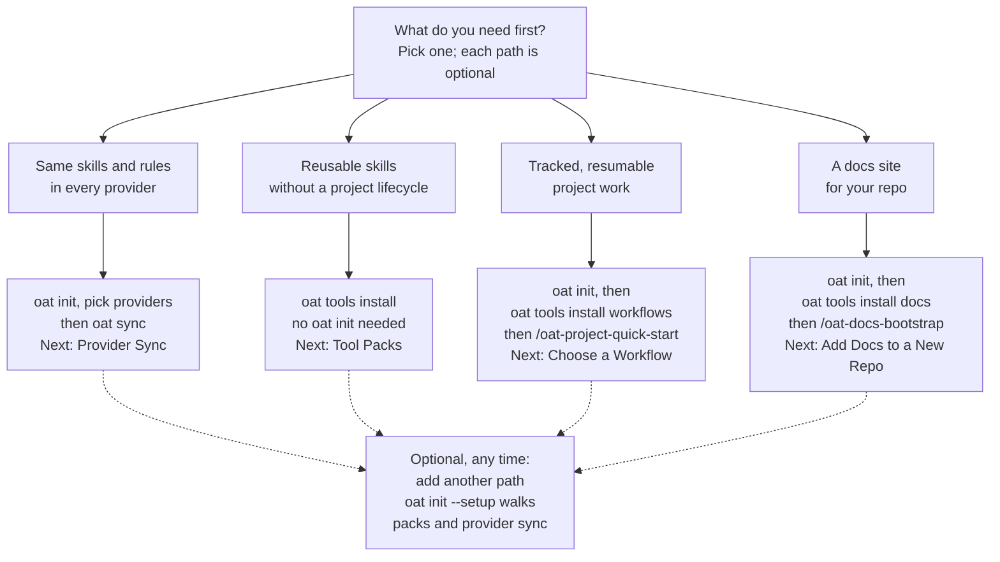

# 01 - Adoption paths: adversarial verification

**Verdict: ACCEPT WITH CHANGES.** One blocking issue: the workflows and docs paths leave out `oat init`, and both skills list it as a prerequisite. The commands, pack names, skill names and page targets are otherwise correct.

## Findings

| Severity   | Node or edge                                                     | What is wrong                                                                                                                                                                                                                                                                                                                                                                                                                                                                                                                                    | Evidence                                                                                                                                                                                                                                                                                                                               | Concrete correction                                                                                                                                                                                                                             |
| ---------- | ---------------------------------------------------------------- | ------------------------------------------------------------------------------------------------------------------------------------------------------------------------------------------------------------------------------------------------------------------------------------------------------------------------------------------------------------------------------------------------------------------------------------------------------------------------------------------------------------------------------------------------ | -------------------------------------------------------------------------------------------------------------------------------------------------------------------------------------------------------------------------------------------------------------------------------------------------------------------------------------- | ----------------------------------------------------------------------------------------------------------------------------------------------------------------------------------------------------------------------------------------------- |
| blocking   | `FLOW_DO`, `DOCS_DO` (and text "None of them is a prerequisite") | Only the sync path shows `oat init`. Both skills that the workflows and docs paths end on require an OAT-initialized repo. A newcomer who follows the picture literally reaches the skill without meeting its stated prerequisite. The owning docs guide also puts `oat init` first. The draft's open questions 4 and 5 resolve to "yes, init is expected".                                                                                                                                                                                      | `.agents/skills/oat-project-quick-start/SKILL.md:17-19` ("A repository initialized for OAT (`.oat/` and `.agents/` exist)"); `.agents/skills/oat-docs-bootstrap/SKILL.md:16-18` ("`.oat/config.json` readable, `.agents/` present"); `apps/oat-docs/docs/docs-tooling/add-docs-to-a-repo.md:21-27` (step 1 `oat init --scope project`) | Start `FLOW_DO` and `DOCS_DO` with "oat init, then". Leave `SKILL_DO` without it and say so ("no oat init needed"). Reword the text: no path depends on another path, but every path except reusable skills starts with `oat init` in the repo. |
| should-fix | `FLOW_DO`, `DOCS_DO`                                             | Skill names sit in the same "then X" form as shell commands. Read literally, `then oat-project-quick-start` looks like something to type into a shell. These are agent skills. The owning guide writes them as `/oat-docs-bootstrap`.                                                                                                                                                                                                                                                                                                            | `add-docs-to-a-repo.md:58-62`; `oat-project-quick-start/SKILL.md:7` (`user-invocable: true`)                                                                                                                                                                                                                                           | Write the skills as `/oat-project-quick-start` and `/oat-docs-bootstrap`. Add one text sentence saying the `/name` steps are run in your agent, not in the shell.                                                                               |
| should-fix | `SYNC_DO`                                                        | "oat init, then oat sync" leaves out provider choice. When I ran `oat init` non-interactively in a fresh repo, it only printed the `oat providers set ...` remediation. A later `oat sync` with a canonical skill present reported "No changes required". Sync wrote provider views only once a provider directory existed. An interactive `oat init` asks "Select supported project providers". On a fresh repo it also asks "Would you like to run guided setup?", which installs packs, so a newcomer on the sync-only path may be surprised. | `packages/cli/src/commands/init/index.ts:985-1003` (provider prompt), `:1301-1340` (fresh-init guided-setup offer); `provider-sync/index.md:52-56` (step 3 "Adjust provider enablement"); run R2 below                                                                                                                                 | Change the label to "oat init, pick providers / then oat sync". In the text, say that a fresh `oat init` offers guided setup: accept it to install packs and sync in one pass, or decline it to stay on this path.                              |
| nit        | `DOCS_DO` "Next: Docs Tooling"                                   | The docs-tooling index is a routing page whose "Start Here" points to Add Docs to a New Repo. That guide continues the exact steps shown in the box.                                                                                                                                                                                                                                                                                                                                                                                             | `docs-tooling/index.md:28-30`; `add-docs-to-a-repo.md:1-62`                                                                                                                                                                                                                                                                            | Next: Add Docs to a New Repo (`../docs-tooling/add-docs-to-a-repo.md`). Keeping the index is also defensible.                                                                                                                                   |
| nit        | `FLOW_DO` (text only)                                            | `oat-project-quick-start` runs `oat project new`. That defaults to `synced` scope, and `synced` scope needs an `origin` remote. In a freshly `git init`-ed repo with no remote, project creation fails.                                                                                                                                                                                                                                                                                                                                          | `packages/cli/src/commands/shared/project-scope.ts:171-195` (default `synced`); `project/new/scaffold.ts:672-681`; `.agents/skills/oat-project-quick-start/SKILL.md:160`; run R4                                                                                                                                                       | Optionally add a text note: needs an `origin` remote, or `oat config set projects.defaultScope local`. Keep it out of the picture.                                                                                                              |
| nit        | `SYNC_DO`                                                        | A bare `oat init` and `oat sync` default to `--scope all`, so they also write to `~/.agents`, `~/.oat` and user provider views. The docs guide uses `oat init --scope project`.                                                                                                                                                                                                                                                                                                                                                                  | Run R1/R2 (init created `$HOME/.agents/skills`, `$HOME/.oat/sync/manifest.json`; sync printed "Scope: project" and "Scope: user"); `add-docs-to-a-repo.md:24`                                                                                                                                                                          | No picture change needed. Optionally mention `--scope project` in the text.                                                                                                                                                                     |
| nit        | `SKILL_DO` "Next: Tool Packs"                                    | The page title is "Tool Packs and Installed Assets".                                                                                                                                                                                                                                                                                                                                                                                                                                                                                             | `getting-started/tool-packs.md:2`                                                                                                                                                                                                                                                                                                      | Fine as a short label. Use the full title in the text link if you want an exact match.                                                                                                                                                          |
| nit        | whole diagram                                                    | It has 10 nodes, which is within the limit. TD with four parallel branches puts four 3-4-line boxes side by side, so the SVG shrinks a lot on a phone.                                                                                                                                                                                                                                                                                                                                                                                           | node count                                                                                                                                                                                                                                                                                                                             | Acceptable because the text equivalent sits directly under it. Do not add nodes.                                                                                                                                                                |
| nit        | `LATER`                                                          | `oat init --setup` covers 5 steps: packs, local paths, docs metadata, provider sync (project scope only), and a summary. "covers packs and provider sync" is true but partial, and the draft citations do support it.                                                                                                                                                                                                                                                                                                                            | `init/index.ts:761,775,834,894-901`; `getting-started/bootstrap.md:44-55`                                                                                                                                                                                                                                                              | Keep it, but say "walks" rather than "covers".                                                                                                                                                                                                  |

## Verified by reading (draft citations reopened)

- Pack manifest: `PACK_NAMES` contains `docs` and `workflows` (`packages/cli/src/commands/tools/shared/pack-manifest.ts:24-33`). `oat-project-quick-start` is in `WORKFLOW_SKILL_NAMES` (`:148`), which the `workflows` pack uses (`:227-231`). `oat-docs-bootstrap` is in the `docs` pack (`:207-220`). Every pack has `defaultScope: 'user'`.
- `oat tools install <pack>` subcommands exist. `createToolsInstallCommand` (`tools/install/index.ts:22-83`) wraps `createInitToolsCommand`, which registers one subcommand per pack (`init/tools/index.ts:2219-2264`). A bare `oat tools install` opens an interactive picker. Without a TTY it installs every pack (`init/tools/index.ts:1186-1204`).
- `oat tools install` runs provider sync itself (`tools/install/index.ts:27-41,50-79`; `--no-sync` opts out). The draft's open question 2 is correct.
- `oat init --setup` exists (`init/index.ts:1393`). The init command is created at `:1389` (the draft cites `:1390`, which is the `.description` line, so it is off by one and harmless). The guided steps are at `:761-931`. Its own closing step names `oat-project-quick-start` (`:929-930`).
- `oat sync` description is at `sync/index.ts:621`.
- Link targets exist relative to `getting-started/concepts.md`: `../provider-sync/index.md`, `tool-packs.md`, `../workflows/choose-workflow.md`, `../docs-tooling/index.md` and `../docs-tooling/add-docs-to-a-repo.md`.
- Doc citations I checked say what the draft claims: `quickstart.md:8,88`; `index.md:10,34`; `README.md:21`; `provider-sync/index.md:8-12,52-56`; `tool-packs.md:19-28,710-743,874-894`; `choose-workflow.md:10,38-42`; `docs-tooling/index.md:8-10,24-26`; `skills/index.md:36`; `bootstrap.md:20-54`. The draft's open question 7 is confirmed: `add-docs-to-a-repo.md:49-51` leaves `oat-docs-bootstrap` out of the docs-pack list.
- Placement: `concepts.md:12-16` is the stack fence. The "These layers stack" contradiction is at `concepts.md:66-74`, and `README.md:15-21` matches the draft's description.
- Mermaid conventions: `\n` inside quoted labels is already used in `concepts.md` and seven other docs pages, and the docs theme uses mermaid `^11.6.0` (11.12.3 installed). The syntax uses quoted labels, uppercase ids, `-->` and `-.->`, and no reserved `end` id.

## Verified by running

I used the branch build `packages/cli/dist/index.js` (built 10:30, after HEAD 10:25). Each run used a temp git repo and an isolated `HOME`, both created with `mktemp -d` under the session scratchpad, with stdin set to `/dev/null` so the CLI ran non-interactively. Nothing was written inside the repository or the real home directory.

- **R0** `oat tools install --help`: lists the `core, ideas, docs, project-management, workflows, utility, research, brainstorm` subcommands and `--no-sync`. Exit 0.
- **R1** `oat init`, non-interactive, fresh repo: exit 0. It printed only the `oat providers set ...` and `oat init --hook` hints. It created `.agents/{skills,agents,rules}`, `.oat/sync/manifest.json`, `.gitignore` and `.gitattributes` in the repo, and `~/.agents/skills` and `~/.oat/sync/manifest.json` in the isolated home. It did not create `.oat/config.json`.
- **R2** I added `.agents/skills/hello/SKILL.md` and ran `oat sync --scope project`: "No changes required"; `oat status`: "No managed entries found". After `mkdir .claude .cursor`, `oat sync` warned "Provider config mismatch (unset: claude, cursor)" and then created `.claude/skills/hello`. Provider choice therefore decides whether the sync path does anything.
- **R3** `oat tools install workflows` in a fresh repo with no `oat init`: exit 0. It printed "Auto-sync completed", "Scope: user" and "Reconciled operations: 60", and made no repository writes. It then printed "Run: oat sync --scope user" even though auto-sync had already run, which is confusing CLI output outside this diagram's scope. `oat tools install docs` with `~/.claude` present: exit 0, and `~/.claude/skills/oat-docs-bootstrap` plus the six other docs skills were symlinked. The install half of each path works without `oat init`.
- **R4** `oat project new demo --mode quick --json`, the command quick-start runs, with no `oat init`:
  - Without a remote: exit 1, `"Synced project creation requires a configured origin remote. Configure origin or use --scope local."`
  - With a local bare repo as `origin`: exit 0, and it scaffolded `.oat/projects/synced/demo` without `oat init`.
  - So the CLI does not strictly need init, but the skill's declared prerequisite does. An agent that follows the skill should stop or ask for init.

## Could not verify

- I did not render or parse the Mermaid. `mermaid.parse` needs a DOM, and the repo has no jsdom or happy-dom, so the parse failed with `DOMPurify.addHook is not a function`. The syntax was checked by hand against mermaid 11 grammar and repo conventions.
- I did not run the interactive TTY flows (provider multi-select, guided-setup offer, `oat tools install` picker); I read them from code.
- I did not run either skill end to end in an agent. I did not check whether `oat-docs-bootstrap` hard-stops when `.oat/config.json` is missing. A plain `oat init` that declines guided setup did not create that file in R1, and the skill's Preflight reads it as optional (`SKILL.md:136`).

## Corrected Mermaid

### Corrected accessible label

Decision flowchart. It starts from "What do you need first?" and branches into four optional paths: provider sync, reusable skills, tracked project workflows, and a docs site. Each path leads to its first commands or agent skill and a docs page to read next. Every path except reusable skills begins with `oat init` in the repository. Any path can later be combined with another.

### Corrected text equivalent

Pick the path that matches what you need first. No path depends on another path. Every path except reusable skills starts with `oat init` in the repository. Steps written as `/name` are agent skills you run in your coding agent, not shell commands.

- **Same skills and rules in every provider:** run `oat init` and choose your providers, then run `oat sync`. Read next: [Provider Sync](../provider-sync/index.md).
- **Reusable skills without a project lifecycle:** run `oat tools install` and choose packs. You do not need `oat init`, and the install syncs the new skills to your providers. Read next: [Tool Packs](tool-packs.md).
- **Tracked, resumable project work:** run `oat init`, then `oat tools install workflows`, then start with `/oat-project-quick-start`. Read next: [Choose a Workflow](../workflows/choose-workflow.md).
- **A docs site for your repo:** run `oat init`, then `oat tools install docs`, then use `/oat-docs-bootstrap`. Read next: [Add Docs to a New Repo](../docs-tooling/add-docs-to-a-repo.md).

On a fresh repository, `oat init` offers guided setup. Accept it to install tool packs and sync providers in one pass. Decline it to follow a single path. You can add another path at any time: `oat init --setup` walks through tool packs and provider sync again.
