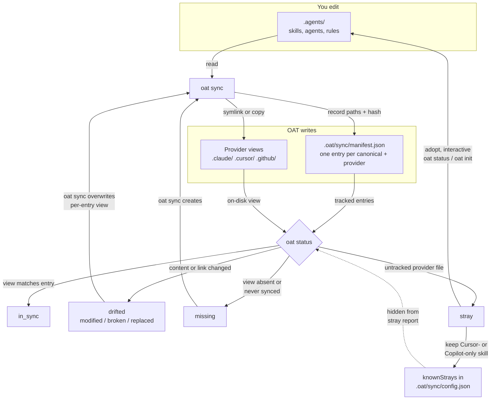

## Diagram

## Accessible label

Flowchart: you edit canonical files under .agents/, oat sync writes provider views and records each one in .oat/sync/manifest.json, and oat status compares views against the manifest to report in_sync, drifted, missing, or stray, with strays either adopted into .agents/ or remembered as knownStrays.

## Text equivalent

- You edit only the canonical files under `.agents/` (skills, agents, rules). `oat sync` reads them, writes provider views as symlinks or copies (for example under `.claude/`, `.cursor/`, and `.github/`), and records each view in `.oat/sync/manifest.json`, one entry per canonical path and provider, with a content hash for copies.
- `oat status` checks each manifest entry against the file on disk. The view is `in_sync` when it still matches its entry, `drifted` (`modified`, `broken`, or `replaced`) when its content or link changed, and `missing` when it is absent or a canonical entry was never synced. A provider file with no manifest entry is a `stray`.
- Running `oat sync` again recreates missing views. It also rewrites a drifted per-entry view from canonical, so any edit made in the provider copy is lost, not merged. A drifted collection alias is kept and detached from the manifest instead of being rewritten.
- In an interactive run, `oat status` or `oat init` can adopt a stray, which moves it into `.agents/`. For Cursor or Copilot skills, you can also keep the file where it is. OAT then records its path under `knownStrays` in the sync config and leaves it out of later stray reports. Git-ignored provider files are never reported as strays.

## Placement

File: `apps/oat-docs/docs/provider-sync/manifest-and-drift.md`

Insert after the end of the `## Quick Look` section and before `## Manifest locations`. That puts it right after this line:

> `- Primary commands: \`oat status\`, \`oat init\`, \`oat sync\``

and immediately before:

> `## Manifest locations`

Put the text equivalent directly under the diagram. One lead-in sentence works well above it, such as "The rest of this page details each box below."

## Edge citations

All paths are relative to the repository root. `status` = `packages/cli/src/commands/status/index.ts`, `plan` = `packages/cli/src/engine/compute-plan.ts`, `exec` = `packages/cli/src/engine/execute-plan.ts`, `detector` = `packages/cli/src/drift/detector.ts`, `strays` = `packages/cli/src/drift/strays.ts`.

| Node or edge                  | Claim                                                                                                                                                                                                                                                                                             | Evidence                                                                                                                                                                                                                                                                                      |
| ----------------------------- | ------------------------------------------------------------------------------------------------------------------------------------------------------------------------------------------------------------------------------------------------------------------------------------------------- | --------------------------------------------------------------------------------------------------------------------------------------------------------------------------------------------------------------------------------------------------------------------------------------------- | ---------------------------------------------------------------------------------------------------------------------------------------------------------------------------------------------------------------------------------------------- | ---------------------------------------------------------------------------------------------------------------------------------------------------------------------------------------------------------------------------------------------------------------------------------------------- |
| Subgraph "You edit" / `CANON` | Canonical sources are `.agents/skills`, `.agents/agents`, `.agents/rules`; every sync mapping reads from a `canonicalDir` under `.agents/`                                                                                                                                                        | `packages/cli/src/providers/claude/paths.ts:11-42`; `packages/cli/src/commands/sync/index.ts:391-395` (`scanCanonical`)                                                                                                                                                                       |
| Subgraph "OAT writes"         | Views and manifest are written by the CLI; `saveManifest` overwrites the file and stamps `oatVersion`                                                                                                                                                                                             | `packages/cli/src/manifest/manager.ts:166-180`; `exec:242-327`                                                                                                                                                                                                                                |
| `VIEWS`                       | Manifest-backed output dirs are the non-native-read mappings: `.claude/{skills,agents,rules}`, `.cursor/{agents,rules}`, `.github/{agents,instructions}` (`.copilot/agents` at user scope). Native-read mappings are excluded from sync                                                           | `packages/cli/src/providers/shared/adapter.utils.ts:86-92`; `packages/cli/src/providers/claude/paths.ts:12-42`; `packages/cli/src/providers/cursor/paths.ts:12-44`; `packages/cli/src/providers/copilot/paths.ts:12-44`; `packages/cli/src/providers/gemini/paths.ts:7-29` (all `nativeRead`) |
| `MANIFEST`                    | Path is `<scopeRoot>/.oat/sync/manifest.json`, keyed by `(canonicalPath, provider)`                                                                                                                                                                                                               | `packages/cli/src/commands/sync/index.ts:327`; `status:892`; `packages/cli/src/manifest/manager.ts:182-207`; `packages/cli/src/manifest/manifest.types.ts:125-135`                                                                                                                            |
| `CANON -->                    | read                                                                                                                                                                                                                                                                                              | SYNC`                                                                                                                                                                                                                                                                                         | Sync scans canonical entries and plans per-entry operations from them                                                                                                                                                                          | `packages/cli/src/commands/sync/index.ts:391-395, 483-490`; `plan:538-560`                                                                                                                                                                                                                     |
| `SYNC -->                     | symlink or copy                                                                                                                                                                                                                                                                                   | VIEWS`                                                                                                                                                                                                                                                                                        | Apply writes a symlink or a copy (rendered content for rules) at the provider path                                                                                                                                                             | `exec:242-327`                                                                                                                                                                                                                                                                                 |
| `SYNC -->                     | record paths + hash                                                                                                                                                                                                                                                                               | MANIFEST`                                                                                                                                                                                                                                                                                     | Each applied entry becomes a manifest entry with canonical path, provider path, strategy, and a `contentHash` for copies only (null for symlinks); the manifest is saved after apply                                                           | `exec:173-197`, `exec:966-977`; `packages/cli/src/manifest/manifest.types.ts:34-50`                                                                                                                                                                                                            |
| `MANIFEST -->                 | tracked entries                                                                                                                                                                                                                                                                                   | STATUS`                                                                                                                                                                                                                                                                                       | Status loads the manifest and runs `detectDrift` once per entry for active mappings                                                                                                                                                            | `status:892-896`, `status:1046-1068`                                                                                                                                                                                                                                                           |
| `VIEWS -->                    | on-disk view                                                                                                                                                                                                                                                                                      | STATUS`                                                                                                                                                                                                                                                                                       | Drift detection inspects the provider path on disk (lstat, readlink, content hash)                                                                                                                                                             | `detector:36-111`                                                                                                                                                                                                                                                                              |
| `STATUS` (decision)           | Summary buckets are exactly `in_sync`, `drifted`, `missing`, `stray`; exit code 1 when anything is not `in_sync`                                                                                                                                                                                  | `packages/cli/src/drift/drift.types.ts:1-5`; `status:516-545`, `status:1247`, `status:1586`                                                                                                                                                                                                   |
| `STATUS --> INSYNC`           | `in_sync` when the symlink resolves to canonical, the copy hash equals the recorded hash (including the managed-banner and rendered-rule re-checks), or the collection alias is an exact link                                                                                                     | `detector:45-46`, `detector:101-113`, `detector:130-138`, `detector:180-188`                                                                                                                                                                                                                  |
| `STATUS --> DRIFTED`          | `drifted` with reason `replaced` (not a symlink, or target differs), `broken` (symlink target missing), or `modified` (copy hash mismatch); collection non-exact maps to `broken` or `replaced`                                                                                                   | `detector:51-54`, `detector:74-106`, `detector:191-194`                                                                                                                                                                                                                                       |
| `STATUS --> MISSING`          | `missing` when the tracked provider path is ENOENT, the collection alias is absent, or a canonical entry has no manifest entry for an active provider                                                                                                                                             | `detector:48-50`, `detector:57-69`; `status:973-978`, `status:1071-1097`                                                                                                                                                                                                                      |
| `STATUS --> STRAY`            | `stray` = an entry in a provider or adoption-source dir that is not manifest-tracked, not git-ignored, not a generated rule, and (for non-native-read mappings) not named like a canonical entry                                                                                                  | `strays:198-272`; `status:1100-1121`; `packages/cli/src/providers/shared/adapter.utils.ts:105-119`                                                                                                                                                                                            |
| `DRIFTED --> SYNC`            | Sync compares provider and canonical directly (it never reads drift state) and plans `update_symlink` / `update_copy`. Apply deletes the provider path and rewrites it from canonical. A changed or unverifiable owned collection alias is instead preserved and detached, hence "per-entry view" | `plan:387-498` (`update_symlink` 414/426/433, `update_copy` 496); `exec:261-263`, `exec:300-302`; `plan:765-781`                                                                                                                                                                              |
| `MISSING --> SYNC`            | Absent provider path plans `create_symlink` / `create_copy`                                                                                                                                                                                                                                       | `plan:402-407`, `plan:444-449`; `exec:242-327`                                                                                                                                                                                                                                                |
| `STRAY -->                    | adopt                                                                                                                                                                                                                                                                                             | CANON`                                                                                                                                                                                                                                                                                        | Adoption is offered only in interactive `oat status` / `oat init`. It moves the provider file into the canonical dir. For non-native-read mappings it then symlinks it back and adds a manifest entry; for native-read skills it adds no entry | `status:1307-1308`, `status:1433-1505`; `packages/cli/src/commands/init/index.ts:1093`, `packages/cli/src/commands/init/index.ts:1180-1240`; `packages/cli/src/commands/shared/adopt-stray.ts:71-168`                                                                                          |
| `STRAY -->                    | keep ...                                                                                                                                                                                                                                                                                          | KNOWN`                                                                                                                                                                                                                                                                                        | "Keep provider-only" exists only for native-read skill strays from Cursor/Copilot adoption-source dirs. It appends the exact path to the scope's sync config `knownStrays`                                                                     | `packages/cli/src/commands/shared/native-skill-disposition.ts:31-59`, `packages/cli/src/commands/shared/native-skill-disposition.ts:73-95`; `packages/cli/src/config/sync-config.ts:203`; `packages/cli/src/providers/cursor/paths.ts:14`, `packages/cli/src/providers/copilot/paths.ts:14,39` |
| `KNOWN -.-> STATUS`           | Reports and adoption candidates whose path exactly matches a project or user `knownStrays` entry are removed before output                                                                                                                                                                        | `packages/cli/src/drift/known-strays.ts:42-85`; `status:1188-1195`                                                                                                                                                                                                                            |

## Disagreements and open questions

1. **`concepts.md` overstates sync output (docs vs code).** The flowchart in `apps/oat-docs/docs/getting-started/concepts.md:22-32` shows `oat sync --> .gemini/`. Every Gemini mapping is `nativeRead` (`packages/cli/src/providers/gemini/paths.ts:7-29`), and `.gemini` is used only for detection (`packages/cli/src/providers/gemini/adapter.ts:10`), so sync writes nothing there. The same chart also implies `.cursor/` receives skills, but Cursor skills are native-read and `.cursor/skills` is only an adoption source (`packages/cli/src/providers/cursor/paths.ts:12-14`). My diagram omits `.gemini/` for this reason.
2. **Overwrite on re-sync is not documented.** `manifest-and-drift.md` and `commands.md` say sync "reconciles provider views from canonical sources". Neither says that re-running sync on a `drifted` per-entry view deletes it and rewrites it from canonical, discarding provider-side edits (`exec:261-263`, `exec:300-302`). That edge is drawn because the code does it. Consider adding one sentence to the page, such as "edit canonical, not the view".
3. **Undocumented adoption conflict prompt (not drawn).** When an ordinary stray's canonical path already exists with different content, interactive adoption asks "Replace canonical with stray content?" (`status:1400-1404`, `status:1481-1485`; `packages/cli/src/commands/shared/adopt-stray.ts:113-132`). If the user declines, the stray is skipped. `manifest-and-drift.md` does not mention this. I left it out of the diagram because the brief excludes conflict-resolution detail. It is implemented, so the page could document it.
4. **Codex output is generated but not manifest-tracked.** `.codex/agents/*.toml` and `.codex/config.toml` are written by the Codex materialization extension, not the manifest engine. `oat status` still reports their create and update operations as `missing` or `drifted` (`status:1123-1153`). Codex role strays come from a separate detector filtered by `managedRoles` (`status:1155-1185`). The diagram's `VIEWS` node lists only manifest-backed dirs. A reader may still ask where `.codex/` fits, and `scope-and-surface.md:66-69` covers it.
5. **What drift detects.** Drift compares a view with its own manifest record, not with current canonical. A copy left stale after a canonical edit still reads `in_sync`; this is documented at `manifest-and-drift.md:144-148` and matches `detector:111-113`. One exception: for rendered rule files the detector also accepts output re-rendered from current canonical (`detector:176-189`). The "view matches entry" label is accurate, but readers may assume canonical edits show up as drift.
6. **Reason coverage by strategy.** For copy entries the detector only ever emits `modified` (`detector:191-194`). `broken` and `replaced` come only from symlink and collection entries (`detector:51-54`, `detector:74-106`). The docs list all three reasons without saying this.
7. **Ownership framing.** `provider-sync/index.md:14` says "you edit the canonical layout in `.agents/` and `.oat/`", but `.oat/sync/manifest.json` is written only by the CLI (`packages/cli/src/manifest/manager.ts:166-180`). The diagram puts the manifest under "OAT writes". `.oat/sync/config.json` (`knownStrays`) can be edited by you or by OAT on a Keep choice, so `KNOWN` sits outside both subgraphs.
8. **Not verified.** I did not render the diagram visually in the docs app's light or dark theme; only the parse was checked. I also did not run any CLI command against a live repo to observe these states; every claim comes from reading the source.
