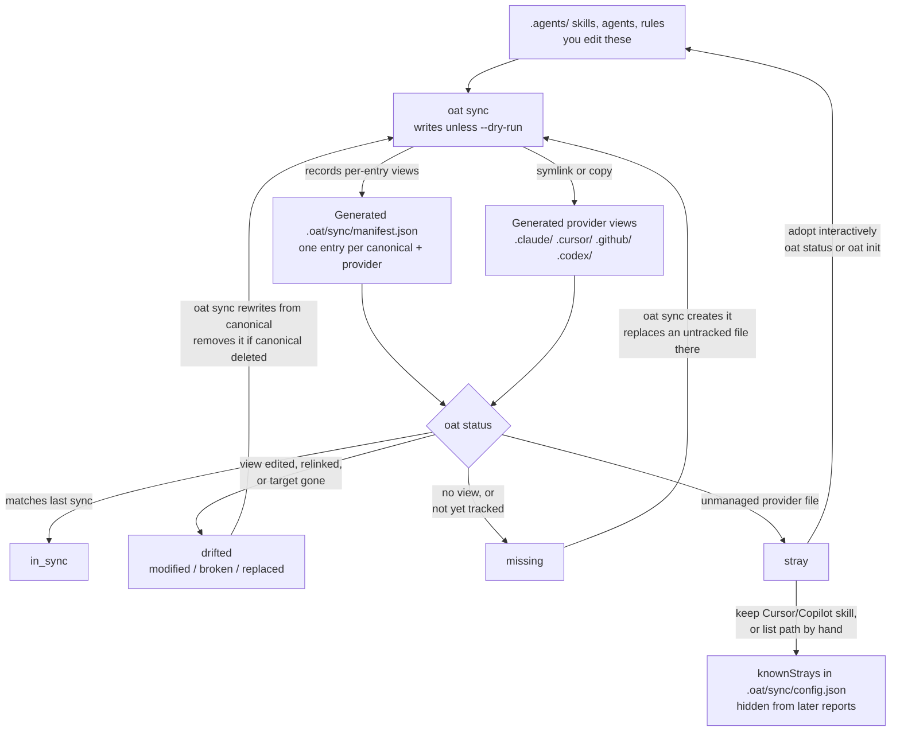

# Verification: 02-provider-sync-drift

**Verdict: ACCEPT WITH CHANGES**

The state set, the manifest path and key, the default-write behavior, the adoption commands, and `knownStrays` are correct. Two repair edges leave out a destructive branch that I reproduced. `VIEWS` leaves out `.codex/`, which `oat sync` does generate. The layout has more back-edges than it needs. Of the draft's claimed disagreements, the `.gemini/` claim is confirmed and the `.cursor/` half is refuted.

Paths are relative to `packages/cli/src` unless they start with `apps/`.

## Findings

| Severity   | Node or edge                                                                                                     | What is wrong                                                                                                                                                                                                                                                                                                                                                                                                                                                                                                               | Evidence                                                                                                                                                                                                                                                                                                                                                                                                                                                                                                                                                                  | Concrete correction                                                                                                                                                                                                    |
| ---------- | ---------------------------------------------------------------------------------------------------------------- | --------------------------------------------------------------------------------------------------------------------------------------------------------------------------------------------------------------------------------------------------------------------------------------------------------------------------------------------------------------------------------------------------------------------------------------------------------------------------------------------------------------------------- | ------------------------------------------------------------------------------------------------------------------------------------------------------------------------------------------------------------------------------------------------------------------------------------------------------------------------------------------------------------------------------------------------------------------------------------------------------------------------------------------------------------------------------------------------------------------------- | ---------------------------------------------------------------------------------------------------------------------------------------------------------------------------------------------------------------------- |
| should-fix | `MISSING -->\|oat sync creates\| SYNC`                                                                           | "Creates" is only true when nothing is at the path. `oat status` also reports `missing` when an **untracked** file sits at the expected path, because stray detection skips names that match a canonical entry. `oat sync` then plans `update_symlink`/`update_copy` and `rm -rf`s that unmanaged content. No manifest-ownership guard exists, only a path-safety check.                                                                                                                                                    | `drift/strays.ts:254-259`; `apps/oat-docs/docs/provider-sync/manifest-and-drift.md:100`; `engine/compute-plan.ts:412-417, 870-901` (no ownership check; `engine/provider-path-safety.ts:18-58` checks path containment only); `engine/execute-plan.ts:261-262`. **Observed:** hand-written `.claude/skills/foo/SKILL.md` ("HAND EDIT unmanaged") showed as `claude foo ✗ missing`. Plain `oat sync --scope project` printed `update_symlink foo (provider path is not a symlink) result: changed`, and the file became a symlink to canonical. The hand content was gone. | Label: `oat sync creates it\n(replaces an untracked file there)`                                                                                                                                                       |
| should-fix | `DRIFTED -->\|oat sync overwrites per-entry view\| SYNC`                                                         | The edge is true when canonical still exists (I reproduced it). When canonical was **deleted**, the view reads `drifted:broken` for a symlink, and sync **removes** the view and its manifest entry instead of rewriting it. A hand-edited copy is also removed (`rm -rf`), with no modification check.                                                                                                                                                                                                                     | `engine/compute-plan.ts:211-229` (`remove`, "canonical entry no longer exists"), `:1007-1013`; `engine/execute-plan.ts:328-331`. **Observed:** after `mv .agents/skills/foo` out of the repo, status showed `claude foo ⚠ drifted:broken`, and sync showed `remove foo (canonical entry no longer exists) result: changed`. `.claude/skills/foo` was deleted.                                                                                                                                                                                                             | Label: `oat sync rewrites from canonical\n(removes it if canonical was deleted)`                                                                                                                                       |
| should-fix | `VIEWS` "Provider views .claude/ .cursor/ .github/"                                                              | The page answers "which provider views are generated?". `oat sync` also writes `.codex/agents/*.toml` and `.codex/config.toml` through the Codex materialization extension, and model-variant agent files into `.claude/agents` and `.cursor/agents` through the Claude and Cursor extensions. These outputs are generated but **not** manifest entries. Leaving `.codex/` out tells Codex users that nothing is generated for them. This also contradicts `manifest-and-drift.md:31`, which lists `.codex` as sync output. | `providers/codex/codec/sync-extension.ts:123, 619, 816`; `providers/claude/codec/sync-extension.ts:304, 348`; `providers/cursor/codec/sync-extension.ts:495, 546`; `commands/sync/index.ts:500-510`; `commands/status/index.ts:1123-1153`                                                                                                                                                                                                                                                                                                                                 | Add `.codex/` to `VIEWS`. Say in the text equivalent that Codex roles and model-variant agent files are tracked by the provider extension, not by manifest entries.                                                    |
| should-fix | Layout: 3 back-edges (`DRIFTED→SYNC`, `MISSING→SYNC`, `STRAY→CANON`), the dashed `KNOWN→STATUS`, and 2 subgraphs | In a TD layout every back-edge crosses the forward spine, and the two subgraphs force wide routing. On a narrow docs column this becomes a tangle of 14 edges. `KNOWN -.-> STATUS` adds nothing that the `KNOWN` label cannot say.                                                                                                                                                                                                                                                                                          | Visual reasoning. 10 nodes, 14 edges, 2 subgraphs.                                                                                                                                                                                                                                                                                                                                                                                                                                                                                                                        | Drop the subgraphs and put ownership in the node labels ("you edit" / "generated"). Drop `KNOWN→STATUS` and fold "hidden from later reports" into the `KNOWN` label. Result: 10 nodes, 13 edges (see the block below). |
| nit        | `KNOWN` / edge "keep Cursor- or Copilot-only skill"                                                              | The edge is accurate as the only path where **OAT writes** `knownStrays`. But `knownStrays` is a general, hand-editable exact-path list at project or user scope, and it filters **any** stray report, Codex role strays included. "Limited" describes the prompt, not the config.                                                                                                                                                                                                                                          | `commands/shared/native-skill-disposition.ts:31-95` (keep → `appendKnownStray`); `config/sync-config.ts:19, 203`; `drift/known-strays.ts:42-85` (filters every `stray` report by exact path); `commands/status/index.ts:1188-1195`; `apps/oat-docs/docs/provider-sync/manifest-and-drift.md:182-186`                                                                                                                                                                                                                                                                      | Label: `keep Cursor/Copilot skill,\nor list path by hand`                                                                                                                                                              |
| nit        | `STRAY -->\|adopt\| CANON` "moves"                                                                               | Directory skills and agents are moved (`rename`). Rules and Codex roles are **parsed and converted** into canonical form. For non-native mappings the view is then re-linked and gets a manifest entry. Non-TTY or `--json` status never adopts; it prints `Run "oat init" to adopt stray entries.`                                                                                                                                                                                                                         | `commands/shared/adopt-stray.ts:96-168`; `commands/status/index.ts:142, 1307-1308, 1578-1580`; `commands/init/index.ts:1089-1091`; `app/command-context.ts:50`                                                                                                                                                                                                                                                                                                                                                                                                            | Keep the edge. In the text equivalent, change "moves" to "moves (or converts, for rules and Codex roles)".                                                                                                             |
| nit        | `STATUS` inputs                                                                                                  | `missing` for "never synced" and the stray name filter both come from scanning **canonical**, not only from the manifest and views. There is no `CANON→STATUS` edge.                                                                                                                                                                                                                                                                                                                                                        | `commands/status/index.ts:951-955, 1071-1097`; `drift/strays.ts:254-259`                                                                                                                                                                                                                                                                                                                                                                                                                                                                                                  | Acceptable to leave undrawn. The text equivalent already explains it ("a canonical entry was never synced").                                                                                                           |
| nit        | `MANIFEST` "one entry per canonical + provider"                                                                  | This is correct for per-entry views (unique `(canonicalPath, provider)`). Manifest v2 also has a `collections[]` array and `strategy: "collection"` entries for an adopted collection alias.                                                                                                                                                                                                                                                                                                                                | `manifest/manifest.types.ts:117-135, 99-108`; `manifest/manager.ts:182-207`                                                                                                                                                                                                                                                                                                                                                                                                                                                                                               | No diagram change. Optional text: "plus collection-alias records".                                                                                                                                                     |
| nit        | `INSYNC` "view matches entry"                                                                                    | This is accurate, but readers will read it as "up to date". A copy left stale after a canonical edit still reads `in_sync`.                                                                                                                                                                                                                                                                                                                                                                                                 | `drift/detector.ts:111-113`; `apps/oat-docs/docs/provider-sync/manifest-and-drift.md:144-148`                                                                                                                                                                                                                                                                                                                                                                                                                                                                             | Label: `matches last sync`.                                                                                                                                                                                            |
| nit        | Accessible label                                                                                                 | It omits the two repair loops (re-running `oat sync`) that the picture draws.                                                                                                                                                                                                                                                                                                                                                                                                                                               | Draft line 30                                                                                                                                                                                                                                                                                                                                                                                                                                                                                                                                                             | Add: "re-running oat sync repairs drifted and missing views from canonical".                                                                                                                                           |
| nit        | `SYNC`                                                                                                           | Correct: `oat sync` **writes by default**, and `--dry-run` is the opt-in preview. One edge case: any invalid canonical rule aborts the whole run before writing anything.                                                                                                                                                                                                                                                                                                                                                   | `commands/sync/index.ts:596-601, 622`; `engine/compute-plan.ts:928-940`. **Observed:** a rule without `activation` printed `Sync stopped: 1 invalid canonical rule` with exit 1, and the queued `update_symlink bar` was not applied.                                                                                                                                                                                                                                                                                                                                     | Optionally label `SYNC` "writes unless --dry-run".                                                                                                                                                                     |

## Checks requested

1. **State names.** The set is real and complete: `DriftState` is exactly `in_sync | drifted{modified|broken|replaced} | missing | stray` (`drift/drift.types.ts:1-5`). The `oat tools info` view classes (`missing-additive`, `removed`, and so on) are a separate classification, not status states. These conditions produce each state:
   - `in_sync`: symlink resolves to canonical (`detector.ts:108`); copy hash equals the recorded hash (`:112`); managed-banner re-hash or legacy bridge (`:130-172`); rendered rule matches current canonical (`:180-188`); collection exact link (`:45`).
   - `drifted:replaced`: provider path is not a symlink (`:74`), the target differs (`:101`), or the collection is non-exact.
   - `drifted:broken`: symlink target is missing (`:93`) or the collection link is broken (`:53`).
   - `drifted:modified`: copy hash mismatch (`:191`), or an extension update op (`status:1132-1149`).
   - `missing`: ENOENT (`:68`); collection absent (`:49`); canonical with no manifest entry, which includes an untracked file sitting at the path (`status:1071-1097`); Codex extension create op (`status:1131-1135`).
   - `stray`: `drift/strays.ts:198-272` and Codex role strays (`status:1155-1185`).
   - Exit code is 1 whenever anything is not `in_sync` (`status:1247, 1586`). Observed exit=1.
2. **Transitions.** Sync writes by default (observed). Drifted per-entry views are rewritten from canonical: I reproduced both `replaced` (a hand-made directory was replaced by a symlink) and `modified` (an edited rule copy was rewritten without the edit). Two exceptions: views whose canonical was deleted are removed, and owned collection aliases are preserved and detached (`compute-plan.ts:745-760`). Missing views are created, but an untracked file at the path is overwritten. In the strategy loop, an existing manifest strategy wins over config (`compute-plan.ts:876-881`). Transforms force copy (`:128-129`). `createSymlink` can fall back to copy (`execute-plan.ts:264-271`). "Symlink or copy" is therefore correct.
3. **Stray adoption.** Interactive only (TTY and not `--json`), from `oat status` and `oat init` only. No sync file touches strays (`grep -i stray commands/sync/*.ts` returns nothing). Adoption renames, or converts rules and Codex roles, into `.agents/`. `knownStrays` is real (`config/sync-config.ts:19`) and uses exact-path matching for project and user scope. OAT only appends to it from the Cursor/Copilot "Keep" choice, but users can list any path.
4. **Provider directories.**
   - Project scope: `.claude/{skills,agents,rules}` (`claude/paths.ts:8-30`), `.cursor/{agents,rules}` (`cursor/paths.ts:16-30`), and `.github/{agents,instructions}` (`copilot/paths.ts:16-30`).
   - User scope: `.claude/{skills,agents}`, `.cursor/agents`, and `.copilot/agents`.
   - Extensions add `.codex/agents`, `.codex/config.toml`, and model-variant files in `.claude/agents` and `.cursor/agents`.
   - Gemini writes nothing: every mapping is `nativeRead` (`gemini/paths.ts:3-31`), `extensions: []` (`providers/shared/registry.ts:298-299`), and the only `.gemini` references are detection (`gemini/adapter.ts:10`) and a doctor scan list (`commands/doctor/stale-invocations.ts:61`).
5. **Manifest.** Project: `<repo>/.oat/sync/manifest.json`. User: `~/.oat/sync/manifest.json`. Both resolve as `join(scopeRoot, '.oat','sync','manifest.json')` (`commands/sync/index.ts:327`, `commands/status/index.ts:891-892`). Uniqueness is enforced on `(canonicalPath, provider)` (`manifest.types.ts:117-135`). Hash is recorded for copies only (`:33-52`). **Observed:** after the first sync the manifest had v2 with 2 entries, `('.agents/skills/bar','claude','symlink',None)` and `('.agents/skills/foo','claude','symlink',None)`, and `collections: []`.
6. **Mermaid.** No reserved IDs (`end` is not used). Quoted labels with `\n` match the repo's existing diagrams (`concepts.md:13-15`), and `{"..."}` and `-.->|...|` are valid syntax. I could not machine-parse it: the local `mermaid@11.12.3` needs a DOM (`DOMPurify.addHook is not a function`). Readability: simplify as described below.

## Draft's claimed disagreements

1. **`concepts.md` `.gemini/`.** Confirmed: sync never writes `.gemini/` (evidence in check 4), so `concepts.md:28` `OAT --> GEMINI[".gemini/"]` is wrong. **`.cursor/` half: refuted.** The chart only draws `oat sync → .cursor/`, which is true: Cursor agents and rules are generated (`cursor/paths.ts:16-30`), as are model-variant agents. It does not claim skills land there. Docs fix: remove `.gemini/` and keep `.cursor/` and `.codex/`. The prose at `concepts.md:21` also implies Gemini consumes "provider views". Gemini reads `.agents/` natively.
2. **Overwrite on re-sync undocumented.** Confirmed, and it reproduces. `provider-sync/` has no overwrite or discard wording; `commands.md:22, 52` only says "reconcile". It is worse than the draft states: an untracked same-name file reported as `missing` is overwritten too, and a canonical deletion removes the view.
3. **Adoption conflict prompt undocumented.** Confirmed. `grep -i "Replace canonical" apps/oat-docs/docs/provider-sync` finds nothing. The prompt is at `commands/status/index.ts:1400-1404, 1481-1485`.
4. **Codex output not manifest-tracked.** Confirmed, and it extends further: Claude and Cursor model-variant agents are extension-managed and not manifest-tracked either (`claude/codec/sync-extension.ts:304`, `cursor/codec/sync-extension.ts:546`).
5. **Drift compares against the record, not canonical.** Confirmed (`detector.ts:111-113`; rendered-rule exception at `:176-189`).
6. **Reason coverage by strategy.** Confirmed. Copy emits only `modified` (`:191-194`). Symlink emits `replaced` or `broken` (`:74-106`). Collection emits `broken` or `replaced` (`:51-54`).
7. **Ownership framing (`index.md:14`).** Partially confirmed. The manifest is CLI-written (`manifest/manager.ts:166-180`), but `.oat/sync/config.json` is user-editable, so "you edit `.oat/`" is loose rather than wrong.
8. **Not verified.** Superseded: I ran the CLI (below).

## Corrected Mermaid

Suggested accessible label: "Flowchart: you edit canonical files under .agents/. oat sync writes provider views and records per-entry views in .oat/sync/manifest.json. oat status reports each view as in_sync, drifted, missing, or stray. Re-running oat sync rewrites drifted views and creates missing ones from canonical, replacing provider-side edits. Strays are adopted into .agents/ interactively or listed in knownStrays."

Text-equivalent edits:

- Add `.codex/` (Codex roles and config, tracked by the Codex extension rather than manifest entries).
- In the re-sync bullet, add: "a file you placed at a view's path without OAT is replaced too, and a view whose canonical source was deleted is removed."
- Change "moves it into `.agents/`" to "moves or converts it into `.agents/`".
- Change the `knownStrays` sentence to say users can also list any provider path by hand.

## What I verified and how

- **By reading:** every cited path:line in the draft's table that the findings depend on (detector, drift.types, compute-plan, execute-plan, status, strays, known-strays, native-skill-disposition, adopt-stray, sync-config, manifest types and manager, all provider `paths.ts`, the gemini adapter, registry, the three sync extensions, concepts.md, manifest-and-drift.md, provider-sync/index.md). The citations I checked were accurate. The gaps are omissions, not miscitations.
- **By running:** a throwaway repo from `mktemp -d` (`/var/folders/fp/.../tmp.r5Xefm2eVy/repo`) with `HOME` pointed at a temp dir, so nothing wrote to the real home. Every command used `--scope project`, run from the repo root as `HOME=$T/home pnpm -s run cli:source -- --cwd $T/repo <cmd>`. Config: `{"defaultStrategy":"auto","providers":{"claude":{"enabled":true}}}`. Sequence:
  1. `status`: `bar` and `foo` missing.
  2. Added untracked `.claude/skills/foo` and stray `.claude/skills/zed`. `status` exit=1: foo `missing`, zed `stray`.
  3. `sync --dry-run`: `update_symlink claude/foo (provider path is not a symlink)`.
  4. `sync` exit=0: foo's hand content was replaced by a symlink, and zed was untouched.
  5. Replaced the `bar` symlink with a real directory: `drifted:replaced`. `sync` restored the symlink.
  6. An invalid rule aborted the whole sync. After fixing it, a hand-edited `.claude/rules/r1.md` read `drifted:modified`, and `sync` printed `update_copy`, which removed the edit.
  7. Moved the canonical `foo` away: `drifted:broken`. `sync` printed `remove foo`.
- **Not verified:** interactive adoption and the Keep prompt (no TTY in this harness); user scope; Copilot and Cursor paths at runtime; machine parse or visual render of either Mermaid block (mermaid needs a DOM). The temp directory is left in place, outside the repository.
