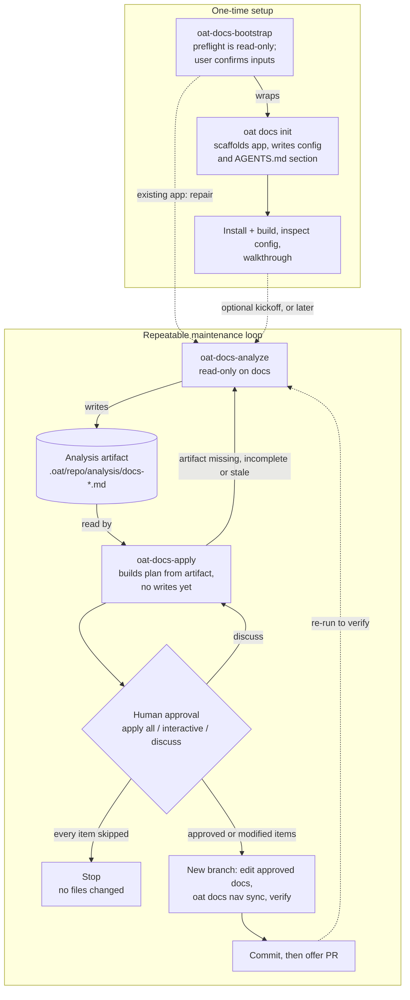

# 03 — Docs tooling flow (bootstrap, analyze, approval, apply)

## Diagram

## Accessible label

Flowchart of the OAT docs workflow: a one-time setup path where oat-docs-bootstrap wraps oat docs init and verifies the build, feeding a repeatable loop in which oat-docs-analyze writes an analysis artifact, oat-docs-apply turns it into a plan, and a human approval decision either stops with no files changed, loops back for discussion, or lets approved edits be made on a new branch and committed.

## Text equivalent

- **One-time setup:** `oat-docs-bootstrap` inspects the repo read-only, has you confirm the inputs, then runs `oat docs init`. That command scaffolds the app and writes the `documentation` config and the root `AGENTS.md` section. Bootstrap then installs, builds, inspects the config and walks you through the result. You can also run `oat docs init` on its own, without the guided steps. If a docs app already exists, bootstrap's `repair` option skips scaffolding and hands off to the maintenance loop instead.
- **Maintenance loop:** `oat-docs-analyze` never edits docs. It writes only an analysis artifact under `.oat/repo/analysis/` (plus its tracking metadata). `oat-docs-apply` reads that artifact and builds a plan without writing anything. If the artifact is missing, incomplete or stale, apply stops and asks for a fresh analysis.
- **Approval boundary:** nothing changes until you review the plan inside `oat-docs-apply` and pick `apply all`, approve items one at a time, or `discuss` (which revises the plan and asks again). If you skip every item, apply stops with no files changed. Only then does apply create a branch, edit the approved docs, run `oat docs nav sync`, verify, commit and offer a PR. You can re-run analyze afterward to check the result.
- Solid arrows are the main path. Dashed arrows are optional or alternative entries into the loop.

## Placement

File: `apps/oat-docs/docs/docs-tooling/workflows.md`

Insert directly after the heading:

> `## Typical flow`

whose following (non-blank) line is:

> `1. Bootstrap a docs app with `oat-docs-bootstrap`(preferred — guided, includes post-scaffold patches and walkthrough) or`oat docs init` directly (CLI-only / non-interactive workflows)`

(heading at line 61, list item at line 63). Put the diagram, then the text equivalent, then the existing numbered list. The list keeps its detail on migration, authoring and per-framework regeneration, which the diagram leaves out.

## Edge citations

All paths are repo-relative to the worktree at commit `ad71d9cd9`.

| Node or edge                                      | Claim it makes                                                                                                                                                          | Evidence                                                                                                                                                                                                                                                                                                                                    |
| ------------------------------------------------- | ----------------------------------------------------------------------------------------------------------------------------------------------------------------------- | ------------------------------------------------------------------------------------------------------------------------------------------------------------------------------------------------------------------------------------------------------------------------------------------------------------------------------------------- |
| Subgraph `setup` "One-time setup"                 | Bootstrap is the one-time onramp for adding a docs app                                                                                                                  | `.agents/skills/oat-docs-bootstrap/SKILL.md:3`, `:12-14`; `apps/oat-docs/docs/docs-tooling/workflows.md:32-35`                                                                                                                                                                                                                              |
| Subgraph `maint` "Repeatable maintenance loop"    | Analyze/apply is the repeated maintenance cycle                                                                                                                         | `apps/oat-docs/docs/docs-tooling/add-docs-to-a-repo.md:200-210` ("Repeat as the codebase changes"); `.agents/skills/oat-docs-analyze/SKILL.md:118-122` (delta mode on later runs using stored tracking)                                                                                                                                     |
| BS node                                           | Bootstrap preflight is read-only; user confirms inputs before any mutation                                                                                              | `.agents/skills/oat-docs-bootstrap/SKILL.md:37`, `:113-115`, `:222-240` (coherence check, loop until `yes`), `:335-342` (pre-scaffold invariant)                                                                                                                                                                                            |
| INIT node                                         | `oat docs init` scaffolds the app, writes `documentation` into `.oat/config.json`, upserts root `AGENTS.md` `## Documentation`                                          | `packages/cli/src/commands/docs/init/index.ts:148-165` (scaffold + `writeOatConfig`), `:298-305` (`upsertAgentsMdSection`), `:392`                                                                                                                                                                                                          |
| VER node                                          | Bootstrap installs, builds, inspects config, then gives a walkthrough                                                                                                   | `.agents/skills/oat-docs-bootstrap/SKILL.md:726-752` (Step 4), `:799-801` (Step 5), `:889` (Step 6)                                                                                                                                                                                                                                         |
| BS → INIT "wraps"                                 | Bootstrap invokes `oat docs init` non-interactively; CLI owns scaffolding                                                                                               | `.agents/skills/oat-docs-bootstrap/SKILL.md:30`, `:39`, `:346`, `:438`                                                                                                                                                                                                                                                                      |
| INIT → VER                                        | Build verification follows scaffolding (skipped if scaffold failed)                                                                                                     | `.agents/skills/oat-docs-bootstrap/SKILL.md:726-732`                                                                                                                                                                                                                                                                                        |
| BS -.-> AN "existing app: repair"                 | With an existing docs setup, `repair` hands off to analyze (then apply on approval) and never scaffolds                                                                 | `.agents/skills/oat-docs-bootstrap/SKILL.md:307-312`, `:328`                                                                                                                                                                                                                                                                                |
| VER -.-> AN "optional kickoff, or later"          | Step 7 offers analyze now; on decline it hands off the skill names to run later                                                                                         | `.agents/skills/oat-docs-bootstrap/SKILL.md:1019-1051` (accept), `:1056-1062` (decline)                                                                                                                                                                                                                                                     |
| AN node "read-only on docs"                       | Analyze must not edit docs, scaffold or touch nav; it may write only its artifact and tracking; its review loop edits only the artifact; nav checks are read-only modes | `.agents/skills/oat-docs-analyze/SKILL.md:6` (allowed-tools: only `--check` / `--validate-only` nav sync), `:27-38`, `:219-221`, `:470`; read-only modes in code: `packages/cli/src/commands/docs/nav/sync.ts:102-107`, `packages/cli/src/commands/docs/nav/fumadocs.ts:185-186`, `packages/cli/src/commands/docs/nav/ownership.ts:141-156` |
| ART node (cylinder)                               | Artifact path is `.oat/repo/analysis/docs-<timestamp>.md`                                                                                                               | `.agents/skills/oat-docs-analyze/SKILL.md:426-429`; `packages/cli/src/commands/docs/analyze.ts:22` (`artifactDirectory: '.oat/repo/analysis'`)                                                                                                                                                                                              |
| AN → ART "writes"                                 | Analyze writes the artifact, reviews it, then records tracking                                                                                                          | `.agents/skills/oat-docs-analyze/SKILL.md:422-447`, `:449-451`, `:474-494`                                                                                                                                                                                                                                                                  |
| ART → PLAN "read by"                              | Apply locates the newest `docs-*.md` artifact and builds its plan from it                                                                                               | `.agents/skills/oat-docs-apply/SKILL.md:90-96`, `:109-112`, `:123`                                                                                                                                                                                                                                                                          |
| PLAN node "no writes yet"                         | No unapproved changes and no branch before the plan is reviewed                                                                                                         | `.agents/skills/oat-docs-apply/SKILL.md:28-32`, `:132`                                                                                                                                                                                                                                                                                      |
| PLAN → AN "artifact missing, incomplete or stale" | Apply stops and asks for a fresh analysis when there is no artifact, required fields are missing, or evidence is stale/contradicted                                     | `.agents/skills/oat-docs-apply/SKILL.md:98`, `:100-107`, `:130`, `:216`                                                                                                                                                                                                                                                                     |
| PLAN → Q                                          | Apply presents the full plan then asks for a review mode                                                                                                                | `.agents/skills/oat-docs-apply/SKILL.md:134-140`                                                                                                                                                                                                                                                                                            |
| Q node (diamond) "Human approval"                 | The approval gate is apply Step 2: `apply all` / `apply interactively` (approve/modify/skip each) / `discuss`                                                           | `.agents/skills/oat-docs-apply/SKILL.md:134-164`                                                                                                                                                                                                                                                                                            |
| Q → PLAN "discuss"                                | Discuss revises the plan and re-asks the review mode                                                                                                                    | `.agents/skills/oat-docs-apply/SKILL.md:160-164`                                                                                                                                                                                                                                                                                            |
| Q → STOP "every item skipped"                     | If all recommendations are skipped, stop without changing files                                                                                                         | `.agents/skills/oat-docs-apply/SKILL.md:166`                                                                                                                                                                                                                                                                                                |
| STOP node                                         | No files changed                                                                                                                                                        | `.agents/skills/oat-docs-apply/SKILL.md:166`                                                                                                                                                                                                                                                                                                |
| Q → APPLY "approved or modified items"            | Only approved/modified recommendations proceed; branch is created after approvals                                                                                       | `.agents/skills/oat-docs-apply/SKILL.md:148-152`, `:168-176`, `:178-186`                                                                                                                                                                                                                                                                    |
| APPLY node                                        | New `oat/docs-<timestamp>` branch, targeted edits per approved item, `oat docs nav sync`, then verification                                                             | `.agents/skills/oat-docs-apply/SKILL.md:178-186`, `:190-209`, `:218-226`; nav sync writes in non-check mode: `packages/cli/src/commands/docs/nav/sync.ts:102-107`, `packages/cli/src/commands/docs/nav/ownership.ts:157-172`                                                                                                                |
| APPLY → PR                                        | Commit approved files, then ask whether to push and open a PR                                                                                                           | `.agents/skills/oat-docs-apply/SKILL.md:230-245`                                                                                                                                                                                                                                                                                            |
| PR node                                           | Commit happens first; the PR is offered (user choice), `gh` fallback otherwise                                                                                          | `.agents/skills/oat-docs-apply/SKILL.md:232-258`, `:295-302`                                                                                                                                                                                                                                                                                |
| PR -.-> AN "re-run to verify"                     | Apply's summary recommends re-running analyze for a post-apply verification artifact                                                                                    | `.agents/skills/oat-docs-apply/SKILL.md:334`                                                                                                                                                                                                                                                                                                |

## Disagreements and open questions

1. **Bootstrap's kickoff describes a different approval point than apply does.** Bootstrap Step 7b says the user reads analyze's report, "decides which recommendations to approve", and bootstrap then invokes `oat-docs-apply` "with the approved subset" (`.agents/skills/oat-docs-bootstrap/SKILL.md:1050-1051`; repair path `:308`). Apply's contract has no input for a pre-approved subset. It always loads the newest artifact (`.agents/skills/oat-docs-apply/SKILL.md:92-96`) and runs its own approval step (`:134-166`). The diagram shows apply's Step 2 as the binding gate. Either bootstrap should say "run apply and approve there", or apply should define a pre-approved-subset handoff. As written, it can produce a double approval or an approval that nothing honors.
2. **`workflows.md` puts the approval in the wrong step.** Step 8 says "Review the artifact and run `oat-docs-apply`" (`apps/oat-docs/docs/docs-tooling/workflows.md:73`). That suggests the human review happens on the artifact before apply runs. Per the contract, the required approval happens inside apply, on the plan built from the artifact (`.agents/skills/oat-docs-apply/SKILL.md:134-166`). Reading the artifact beforehand is optional. The page's "Contract model" section is correct ("Apply consumes the artifact, asks for approval", `workflows.md:56`). The typical-flow list is not.
3. **`workflows.md` shows no failure or loop paths.** Its typical flow (`workflows.md:61-73`) is a straight line. It omits three paths the contracts define: apply stops when the artifact is missing, incomplete or stale (`oat-docs-apply/SKILL.md:98,107,130`); `discuss` loops back (`:160-164`); and skipping every item ends the run with no changes (`:166`).
4. **`oat docs analyze` / `oat docs apply` are guidance stubs only.** In code, both print a pointer to the skill and exit 0 (`packages/cli/src/commands/docs/analyze.ts:17-45`, `apply.ts:17-45`). `workflows.md:22` says only that they "expose the workflow surface in CLI help". It doesn't say they don't run the workflow. `add-docs-to-a-repo.md:166,197-198` and `commands.md:26-27` do say so. The diagram uses skill names, not these CLI commands.
5. **"Read-only" analyze still writes some files.** Analyze is read-only for docs, nav and generated outputs, but it does write: the artifact (`.oat/repo/analysis/docs-*.md`), docs tracking metadata (`oat-docs-analyze/SKILL.md:36,38,474-494`), and corrections to its own artifact during the auto-review loop (`:451-470`). The bootstrap walkthrough says analyze "never mutates content" (`oat-docs-bootstrap/SKILL.md:1014`), which is true only if "content" means docs. The node label says "read-only on docs" to stay accurate.
6. **Apply's nav sync step is labeled as verification but can write.** Apply Step 5 lists `oat docs nav sync --framework mkdocs --target-dir <app-root>` under "Verify and Sync Navigation" (`oat-docs-apply/SKILL.md:223`). Without `--check`, that command rewrites `mkdocs.yml` (`packages/cli/src/commands/docs/nav/sync.ts:105-106`). This is allowed after approval (`oat-docs-apply/SKILL.md:32,38`), but it is a write, not a check. For Fumadocs, apply runs source-only `--validate-only` and leaves generation to the build hooks (`:222`; hooks in `packages/cli/assets/templates/docs-app-fuma/package.json.template:8,10`).
7. **Extra human checkpoints the diagram leaves out.**
   - Recommendations with `ask_user` disclosure need another explicit confirmation at write time (`oat-docs-apply/SKILL.md:201`).
   - The PR is a separate choice that comes after the commit (`:239-252`). The local commit on the new branch needs no approval beyond Step 2.
   - Analyze's review loop offers Medium/Low artifact fixes to the user (`oat-docs-analyze/SKILL.md:466`). These only affect the artifact.
   - Bootstrap's conflict-resolution choice (`oat-docs-bootstrap/SKILL.md:258-342`) is shown only as the "existing app: repair" edge. `replace` deletes the existing app directory before scaffolding (`:264-272`) and is not drawn.
8. **Can bootstrap actually call the other skills? (open question)** `oat-docs-analyze`, `oat-docs-apply` and `oat-docs-bootstrap` all set `disable-model-invocation: true` (`oat-docs-analyze/SKILL.md:4`, `oat-docs-apply/SKILL.md:4`, `oat-docs-bootstrap/SKILL.md:5`). Bootstrap Step 7b and `repair` tell the agent to "invoke" analyze and apply. On hosts that enforce `disable-model-invocation`, the user may have to start those skills manually. I could not confirm host behavior from the repo, so the bootstrap-to-analyze edges are dashed and labeled as entry points, not automatic calls.
9. **Docs-pack list omits bootstrap.** `add-docs-to-a-repo.md:49-50` lists the docs pack skills without `oat-docs-bootstrap`. The pack manifest includes it (`packages/cli/src/commands/tools/shared/pack-manifest.ts:207-219`). This is outside the diagram's scope but worth fixing on the same page set.
10. **Left out on purpose.**
    - `oat-docs-authoring` and `authoring-docs` (targeted edits between analyze runs). They have no approval-gate relationship with analyze/apply beyond routing broad audits and bulk fixes to them (`oat-docs-authoring/SKILL.md:58-64`).
    - `oat docs migrate` and `oat docs generate-index`. These are separate CLI helpers, not part of the approval flow.
    - `oat-project-document`.

    The 12-node budget didn't fit these, and the reader's question doesn't need them.

11. **Rendering not checked.** I checked the parse only, not how it renders. `\n` in labels follows the existing convention on other pages (for example `apps/oat-docs/docs/workflows/projects/lifecycle.md:362`). I did not render this diagram in the Fumadocs site, so line breaks, the cylinder shape and subgraph layout at mobile width are unverified.
