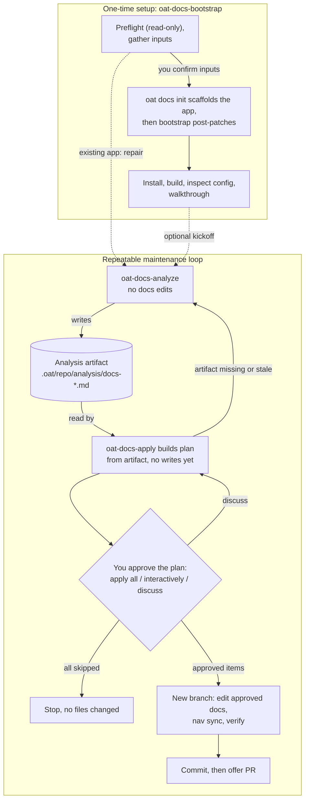

# Verification: 03 — Docs tooling flow

**Verdict: ACCEPT WITH CHANGES**

The maintenance-loop approval boundary is correct. The binding approval is
`oat-docs-apply` Step 2, on a plan built from the newest analysis artifact. The
three modes are real. "All skipped → stop, no files changed" is real. Branch
creation, edits, nav sync, verify, commit and PR offer happen only after that
step and in that order.

The weak spots are elsewhere. The setup half hides bootstrap's own
confirm-before-write gate and its own docs writes (post-patches). One sentence
in the disagreements list misstates how apply runs Fumadocs nav sync. The text
equivalent leaves out the one approval that happens after the branch exists
(`ask_user` items).

Worktree HEAD is `f337faa17`, not `ad71d9cd9` as the draft states. Running
`git diff ad71d9cd9 HEAD` over every cited path (skills, `packages/cli/src/commands/docs`,
`docs-tooling` pages, `pack-manifest.ts`, the fuma template) is empty, so all
citations still hold.

## Findings

| Severity   | Node or edge                                | What is wrong                                                                                                                                                                                                                                                                                                                                                                                                                                                                                                                                                                                                                                           | Evidence                                                                                                                                                                                                                                                                                                     | Concrete correction                                                                                                                                                                                                                                                                                                                                         |
| ---------- | ------------------------------------------- | ------------------------------------------------------------------------------------------------------------------------------------------------------------------------------------------------------------------------------------------------------------------------------------------------------------------------------------------------------------------------------------------------------------------------------------------------------------------------------------------------------------------------------------------------------------------------------------------------------------------------------------------------------- | ------------------------------------------------------------------------------------------------------------------------------------------------------------------------------------------------------------------------------------------------------------------------------------------------------------ | ----------------------------------------------------------------------------------------------------------------------------------------------------------------------------------------------------------------------------------------------------------------------------------------------------------------------------------------------------------- |
| should-fix | BS → INIT, INIT node                        | Bootstrap has its own approval gate before any write: the coherence check loops until the user answers `yes`. On a conflict, the user's choice also gates writes, and `replace` deletes the existing app dir, the config section and the AGENTS.md section before init. After init, bootstrap itself edits scaffolded docs through gated post-patches (FP-12/13/16/17 on `docs/index.md`, `getting-started.md`, `contributing.md`; FP-15 writes `<app>/AGENTS.md`). The diagram labels the edge only "wraps" and attributes every write to `oat docs init`. A reader asking "where must a person approve before docs change?" sees only the apply gate. | `.agents/skills/oat-docs-bootstrap/SKILL.md:14`, `:41`, `:233-240`, `:264-272`, `:331-340`, `:495-724` (patch sections), `:713-718`                                                                                                                                                                          | Label the edge `"you confirm inputs"`. Make INIT read "oat docs init scaffolds the app, then bootstrap post-patches". In the text equivalent, say bootstrap writes only after you confirm the inputs (and, on a conflict, pick a resolution).                                                                                                               |
| should-fix | Disagreement 6 (Fumadocs sentence)          | The draft says that for Fumadocs, apply "runs source-only `--validate-only` and leaves generation to the build hooks". Apply Step 4 prescribes **write-mode** `oat docs nav sync --framework fumadocs --target-dir <app-root>` whenever approved actions involve nav updates. Step 5's `docs:build` also runs `prebuild`, which runs write-mode nav sync. `--validate-only` is only the Step 5 verification call. The writes land in owned, ignored `meta.json` and sidecar files, not in committed files.                                                                                                                                              | `.agents/skills/oat-docs-apply/SKILL.md:206`, `:222`, `:226`; `packages/cli/assets/templates/docs-app-fuma/package.json.template:10`; `packages/cli/src/commands/docs/init/scaffold.ts:260-261`; write path `packages/cli/src/commands/docs/nav/ownership.ts:157-172`, skipped only by `fumadocs.ts:185-186` | Reword: "MkDocs: Step 5 runs write-mode `--framework mkdocs` (rewrites `mkdocs.yml`; `sync.ts:105-106`). Fumadocs: Step 4 runs write-mode `--framework fumadocs` for approved nav changes (owned, ignored metadata). Step 5 runs `--validate-only` and then the build, whose prebuild hook regenerates. Apply never prescribes `--check`; analyze uses it." |
| should-fix | Text equivalent, "Approval boundary" bullet | The draft says "nothing changes until you review the plan… Only then does apply create a branch, edit…". That is true, but it leaves out the one approval that comes after the branch exists: recommendations with `ask_user` disclosure need explicit confirmation before writing. Apply can also stop one recommendation mid-run, on the branch, when a cited source has disappeared (it asks for a fresh analysis or user guidance).                                                                                                                                                                                                                 | `.agents/skills/oat-docs-apply/SKILL.md:201`, `:216`                                                                                                                                                                                                                                                         | Add: "Items marked `ask_user` are confirmed again before they are written; a recommendation whose cited source has disappeared is stopped and sent back for fresh analysis."                                                                                                                                                                                |
| nit        | PR -.-> AN "re-run to verify"               | The edge is accurate (`oat-docs-apply/SKILL.md:334`). It is the third back-edge into the loop, after PLAN→AN and Q→PLAN, and it adds crossing lines on narrow screens without telling the reader anything about approval.                                                                                                                                                                                                                                                                                                                                                                                                                               | `.agents/skills/oat-docs-apply/SKILL.md:334`                                                                                                                                                                                                                                                                 | Drop the edge (12 edges) and keep the sentence in the text equivalent.                                                                                                                                                                                                                                                                                      |
| nit        | PLAN → AN label                             | "artifact missing, incomplete or stale" is the longest edge label (37 chars). Note that the apply-plan template blocks individual under-evidenced recommendations; it does not stop the whole run.                                                                                                                                                                                                                                                                                                                                                                                                                                                      | `.agents/skills/oat-docs-apply/SKILL.md:98`, `:107`, `:130`; `references/apply-plan-template.md:23-25`                                                                                                                                                                                                       | Shorten to `"artifact missing or stale"`.                                                                                                                                                                                                                                                                                                                   |
| nit        | INIT node / text                            | `oat docs init` also patches the root `package.json` unless `--no-root-patch` is given or no root package exists. Neither the node nor the text says so.                                                                                                                                                                                                                                                                                                                                                                                                                                                                                                | `packages/cli/src/commands/docs/init/index.ts:153-158`, `:422`                                                                                                                                                                                                                                               | Add "(and root package.json scripts)" to the text equivalent's init sentence.                                                                                                                                                                                                                                                                               |
| nit        | VER -.-> AN "optional kickoff"              | Step 7 is offered only after a successful build. The walkthrough's `skip to summary` jumps straight to the Exit summary, which skips the 7a offer. The dashed edge is right, but its condition is narrower than the draft states.                                                                                                                                                                                                                                                                                                                                                                                                                       | `.agents/skills/oat-docs-bootstrap/SKILL.md:897`, `:1019-1045`, `:1156-1160`                                                                                                                                                                                                                                 | In text: "after a successful build, bootstrap offers to run analyze now; otherwise run it later."                                                                                                                                                                                                                                                           |
| nit        | VER node                                    | Step 5 writes `.oat/config.json` (`requireForProjectCompletion`), but only on opt-in.                                                                                                                                                                                                                                                                                                                                                                                                                                                                                                                                                                   | `.agents/skills/oat-docs-bootstrap/SKILL.md:855-873`                                                                                                                                                                                                                                                         | Optional; not approval-relevant to docs.                                                                                                                                                                                                                                                                                                                    |
| nit        | ART node / text                             | The artifact directory is gitignored, so the artifact is local-only; apply copies it into the PR body. Analyze's "tracking metadata" is the **tracked** file `.oat/tracking.json`, so analyze does dirty the repo, though not the docs.                                                                                                                                                                                                                                                                                                                                                                                                                 | `.gitignore:83` (`.oat/**/analysis/`); `.oat/scripts/resolve-tracking.sh:33`; `git ls-files .oat/tracking.json` → tracked; `oat-docs-apply/SKILL.md:258`                                                                                                                                                     | In text, write "(plus `.oat/tracking.json`)".                                                                                                                                                                                                                                                                                                               |
| nit        | Draft header                                | It says commit `ad71d9cd9`; HEAD is `f337faa17`. The cited files are identical between the two.                                                                                                                                                                                                                                                                                                                                                                                                                                                                                                                                                         | `git log ad71d9cd9..HEAD` = 1 commit; scoped diff empty                                                                                                                                                                                                                                                      | Update the commit reference.                                                                                                                                                                                                                                                                                                                                |

Nothing is blocking. The checks that the diagram's central claims survive:

- `apply all` / `apply interactively` / `discuss` are exact (`oat-docs-apply/SKILL.md:136-164`; the template repeats them at `references/apply-plan-template.md:19-21`).
- `discuss` revises the plan and re-asks (`:160-164`).
- All skipped → stop without changing files (`:166`).
- No branch before the plan is reviewed (`:31`); the branch `oat/docs-<UTC timestamp>` is created "After approvals" (`:178-186`).
- The order is: edits (`:190-209`), nav sync and verification (`:218-228`), commit (`:232-237`), then the PR offer as a separate prompt (`:239-252`), with a gh fallback (`:295-302`).
- The artifact template itself says to run apply "to approve and apply" (`oat-docs-analyze/references/analysis-artifact-template.md:292`).
- The template ends with a "Proceed? Confirm to begin applying" (`apply-plan-template.md:67-69`), which belongs inside the Q node.

### Is there any edit before or without that approval?

- **Analyze:** BLOCKED from editing docs, scaffolding, `mkdocs.yml` or nav (`oat-docs-analyze/SKILL.md:27-31`).
  - Writes: the artifact (`:36`, `:426-429`), artifact fixes during the review loop (`:465-470`), and tracking (`:38`, `:486-492`).
  - The review loop "may only edit the analysis artifact" (`:470`).
  - Generated-index checks are read-only (`:219-221`).
  - The allowed nav commands are only `--check` and `--validate-only` (`:6`), and both are read-only in code (`nav/sync.ts:102-107`, `fumadocs.ts:185-186`, `ownership.ts:141-156`).
  - Confirmed: analyze makes no docs edits.
- **Apply tracking:** Step 7 writes `.oat/tracking.json` after the commit (`oat-docs-apply/SKILL.md:304-321`). It is not a docs edit, but it leaves an uncommitted tracked-file change on the new branch.
- **Bootstrap:** does write docs without the apply gate (scaffold, post-patches, and `replace` deletion), but only after its own confirmations. See the first finding.
- **Apply can also scaffold:** the "Scaffold an OAT docs app when no docs app exists" action via `oat docs init` exists (`oat-docs-apply/SKILL.md:120`, `:205`), but only as an approved recommendation. That is consistent with the gate.

### Point 2: nav sync mode per framework (apply contract)

- **MkDocs:** `oat docs nav sync --framework mkdocs --target-dir <app-root>`, write mode, in Step 5 (`:223`). It rewrites `mkdocs.yml` (`sync.ts:105-106`).
- **Fumadocs:**
  - Step 4 runs write-mode `--framework fumadocs` for approved nav changes, before MDX generation (`:206`).
  - Step 5 runs `--validate-only` (no writes) and then generation through the build hooks (`:222`).
  - `--check` is described as separate and read-only, and apply never prescribes it.
  - `--check` and `--validate-only` are mutually exclusive in code (`sync.ts:81-82` (throw at :82)), and `--validate-only` without fumadocs throws (`sync.ts:89-90`).
- The diagram's "oat docs nav sync" without a mode is acceptable. "verify" must not be read as covering the sync.

## Disagreement verdicts

| #   | Claim                                                                   | Verdict                                                          | Evidence / note                                                                                                                                                                                                                                                                                                                                                                                                                                    |
| --- | ----------------------------------------------------------------------- | ---------------------------------------------------------------- | -------------------------------------------------------------------------------------------------------------------------------------------------------------------------------------------------------------------------------------------------------------------------------------------------------------------------------------------------------------------------------------------------------------------------------------------------- |
| 1   | Bootstrap 7b "approved subset" has no matching input in apply           | **Confirmed**                                                    | `oat-docs-bootstrap/SKILL.md:1050-1051`; apply always loads the newest artifact (`oat-docs-apply/SKILL.md:92-96`) and runs its own Step 2 (`:134-166`). The effect is a double approval, not a bypass: apply's gate still runs. "An approval that nothing honors" is accurate only in the sense that the pre-approval is lost. The repair text says "with user approval, to `oat-docs-apply`" (`:308`), which is consistent with apply's own gate. |
| 2   | `workflows.md` step 8 puts the approval in the wrong step               | **Partly confirmed (overstated)**                                | `workflows.md:73` reads "Review the artifact and run `oat-docs-apply`". That is ambiguous rather than wrong, because reviewing the artifact first is harmless. The same page states the gate correctly at `:56`, and `add-docs-to-a-repo.md:184`, `:192` says apply "asks for approval". Suggest rewording step 8 to "Run `oat-docs-apply` and approve recommendations there".                                                                     |
| 3   | `workflows.md` typical flow shows no failure or loop paths              | **Confirmed**                                                    | `workflows.md:61-73` vs `oat-docs-apply/SKILL.md:98`, `:107`, `:130`, `:160-166`.                                                                                                                                                                                                                                                                                                                                                                  |
| 4   | `oat docs analyze` / `apply` are guidance stubs                         | **Confirmed**                                                    | `packages/cli/src/commands/docs/analyze.ts:17-45` and `apply.ts:17-45` print guidance and set exit 0. `workflows.md:22` says only "expose the workflow surface in CLI help"; `add-docs-to-a-repo.md:166`, `:197-198` and `commands.md:26-27` are explicit.                                                                                                                                                                                         |
| 5   | "Read-only" analyze still writes files                                  | **Confirmed**                                                    | `oat-docs-analyze/SKILL.md:36-38`, `:465-470`, `:486-492`. Add that the tracking file `.oat/tracking.json` is git-tracked. Bootstrap's "never mutates content" is at `oat-docs-bootstrap/SKILL.md:1014`.                                                                                                                                                                                                                                           |
| 6   | Apply's nav sync is labelled verification but writes                    | **Confirmed for MkDocs; the draft's Fumadocs sentence is wrong** | See the second finding. Step 4 (`:206`) and the build hook (`package.json.template:10`) write Fumadocs metadata.                                                                                                                                                                                                                                                                                                                                   |
| 7   | Extra human checkpoints left out                                        | **Confirmed**                                                    | `oat-docs-apply/SKILL.md:201` (`ask_user`), `:239-252` (PR choice), `oat-docs-analyze/SKILL.md:466`, `oat-docs-bootstrap/SKILL.md:258-342`. Add the bootstrap coherence check (`:233-240`), which the draft leaves out, and the template's final "Proceed?" (`apply-plan-template.md:67-69`). The `ask_user` checkpoint belongs in the text equivalent, not only in the notes.                                                                     |
| 8   | `disable-model-invocation: true` on all three; bootstrap "invokes" them | **Confirmed in frontmatter; host effect unverified from repo**   | `oat-docs-analyze/SKILL.md:4`, `oat-docs-apply/SKILL.md:4`, `oat-docs-bootstrap/SKILL.md:5`; invoke instructions at `oat-docs-bootstrap/SKILL.md:311`, `:1049-1051`. The repo lists the field (`apps/oat-docs/docs/contributing/skills.md:183`) without defining its runtime effect. Keeping the edges dashed is right.                                                                                                                            |
| 9   | Docs-pack list omits `oat-docs-bootstrap`                               | **Confirmed**                                                    | `add-docs-to-a-repo.md:48-50` vs `packages/cli/src/commands/tools/shared/pack-manifest.ts:207-219`.                                                                                                                                                                                                                                                                                                                                                |
| 10  | Exclusions                                                              | Reasonable                                                       | `oat-docs-authoring/SKILL.md:58-64` routes audits to analyze and broad application to apply, as cited.                                                                                                                                                                                                                                                                                                                                             |
| 11  | Rendering unverified; `\n` convention                                   | **`\n` convention confirmed**                                    | `packages/docs-transforms/src/remark-mermaid.ts:9-10`, `:21` rewrites literal `\n` to ` ` before the Mermaid 11 renderer (`packages/docs-theme/package.json:44`, `src/mermaid.tsx`).                                                                                                                                                                                                                                                           |

**Additional disagreement (new).** Apply's `allowed-tools` pre-approves only `Bash(git:*)` and `Bash(gh:*)` (`oat-docs-apply/SKILL.md:6`). Its body runs `oat docs nav sync`, `oat docs init`, `pnpm … docs:*`, and `bash resolve-tracking.sh` with `jq`. Analyze likewise pre-approves no `bash` call for its tracking write (`oat-docs-analyze/SKILL.md:6` vs `:486`). On hosts that treat `allowed-tools` as a pre-approval list, this means extra permission prompts, not a blocked step. The exact effect is host-dependent and out of the diagram's scope.

## Mermaid syntax and readability

- **Parse risk is low.** Quoted subgraph titles (`subgraph id ["…"]`), the cylinder `[("…")]`, the diamond `{"…"}` and quoted edge labels with `-->|"…"|` / `-.->|"…"|` are all valid Mermaid 11 syntax. No reserved ids (`end`) are used. `*`, `/` and `.` sit inside quotes.
- **Counts are as claimed:** 10 nodes, 13 edges (draft lines 21-33), 2 subgraphs.
- **Narrow viewports.** Node lines are at most about 37 characters after ` ` splits, which is acceptable. The main narrow-viewport cost is three back-edges converging on AN/PLAN (PLAN→AN, Q→PLAN, PR→AN) plus two dashed cross-subgraph entries into AN. Dropping PR→AN and shortening the PLAN→AN label removes the worst crossing. Rendering was not checked.
- **Accessible label vs picture.** They agree on setup → loop → approval with the three outcomes. The label leaves out the stale-artifact loop and the repair entry, which is acceptable for a short label.
- **Text equivalent vs picture.** They agree on every drawn element. It describes PR→AN in prose, which is fine and is the right home for it if the edge is dropped. It leaves out bootstrap's confirm gate, its post-patches and the `ask_user` re-confirmation. See the findings.

## Corrected Mermaid

The corrected diagram has 10 nodes, 12 edges and 2 subgraphs, with no styling.

**Corrected accessible label:** Flowchart of the OAT docs workflow. In one-time setup, oat-docs-bootstrap inspects the repo read-only and, once you confirm the inputs, runs oat docs init, applies its post-patches and verifies the build. A repeatable loop follows: oat-docs-analyze writes an analysis artifact without editing docs, and oat-docs-apply turns it into a plan. A human approval then either stops with no files changed, loops back for discussion, or lets the approved edits be made on a new branch and committed.

**Text equivalent: required edits**

- **Setup bullet.** Add "Bootstrap changes nothing until you confirm the inputs (and, if a docs app already exists, choose a resolution; `replace` deletes the old app). After `oat docs init`, bootstrap applies its own gated post-patches to the scaffolded docs." Mention that init also patches the root `package.json` scripts. Make the kickoff conditional: "after a successful build".
- **Loop bullet.** Change the tracking parenthetical to "(plus `.oat/tracking.json`)".
- **Approval bullet.** Add the `ask_user` re-confirmation and the mid-apply stop for a cited source that has disappeared. Keep "You can re-run analyze afterward" here, since the edge is removed.

## What was verified and what was not

**Verified by reading:**

- In full: all three SKILL.md files, `oat-docs-apply/references/apply-plan-template.md`, and the apply-related lines of `oat-docs-analyze/references/analysis-artifact-template.md`.
- In `packages/cli/src/commands/docs/`: `analyze.ts`, `apply.ts`, `nav/sync.ts`, the relevant ranges of `nav/fumadocs.ts` and `nav/ownership.ts`, `init/index.ts` (write path and flags), and `init/scaffold.ts:260-261`.
- Supporting files: `.oat/scripts/resolve-tracking.sh`, `.gitignore`, `pack-manifest.ts`, and the fuma `package.json.template`.
- The remark-mermaid transform and the theme renderer.
- The cited docs pages: `workflows.md`, the relevant ranges of `add-docs-to-a-repo.md`, `commands.md` and `lifecycle.md:362`, and `oat-docs-authoring/SKILL.md:56-66`.
- Every draft citation was reopened. All match their claims, with the line offsets noted above. The only substantive misstatement is the Fumadocs sentence in disagreement 6.

**Not verified:**

- How the diagram renders in the Fumadocs site, including mobile layout.
- How any host enforces `disable-model-invocation` or `allowed-tools`.
- Runtime behavior of the skills. They were not run, per instructions.
- The bootstrap post-patch target list beyond the sections read (`:495-724` was skimmed through its headings and `:14`/`:41`).
