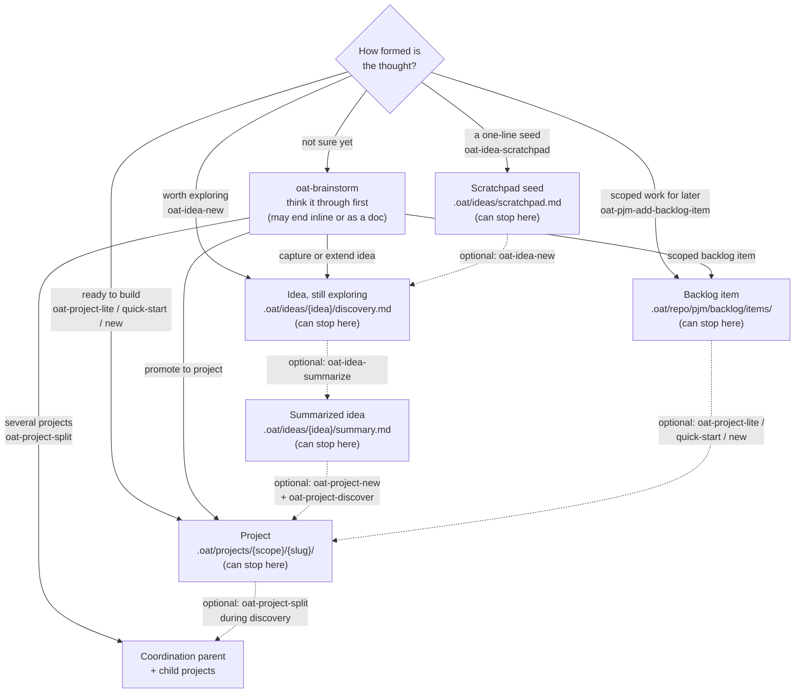

## Diagram



## Accessible label

Decision flowchart that sorts a thought by how formed it is into one of five OAT homes (scratchpad seed, idea, backlog item, project, or an `oat-brainstorm` conversation when unsure), with dashed optional promotion edges from scratchpad to idea, idea to summarized idea, summarized idea or backlog item to project, and project to a split into child projects.

## Text equivalent

- **Not sure yet:** run `oat-brainstorm`. When the conversation wraps up it can end inline, write a doc to a path, or hand off to an idea, a backlog item, a new project, or a split into several projects.
- **A one-line seed:** `oat-idea-scratchpad` adds it to `.oat/ideas/scratchpad.md`.
- **Worth exploring:** `oat-idea-new` creates `.oat/ideas/{idea}/discovery.md`. Use `oat-idea-ideate` to resume it later.
- **Scoped work for later:** `oat-pjm-add-backlog-item` files `.oat/repo/pjm/backlog/items/BL-*.md`. The repository must have adopted PJM first (`oat pjm init`).
- **Ready to build:** start a project with `oat-project-lite`, `oat-project-quick-start`, or `oat-project-new`.

Every home is a valid place to stop. Moving a thought on is always optional, and every step is a separate run of a skill:

- a seed becomes an idea through `oat-idea-new`
- an idea is finalized through `oat-idea-summarize`
- a summarized idea becomes a project through `oat-project-new` and then `oat-project-discover`
- a backlog item becomes a project through a project-start skill
- a project whose discovery turns out to hold several shippable pieces can split through `oat-project-split`

Ideas are local and gitignored. Backlog items and projects are tracked in the repository.

## Placement

File: `apps/oat-docs/docs/workflows/ideas/lifecycle.md`

Insert directly under the `## Flow` heading, before the numbered list. Put a one-sentence lead-in before the diagram, such as "Pick the home that matches how formed the thought is; promotion is optional." Then add the diagram and the text equivalent, and keep the existing numbered list after them.

The heading and the line that currently follows it (after one blank line):

```text
## Flow

1. Quick capture: `oat-idea-scratchpad` to review or capture idea seeds
```

Suggested companion edit (not required for the diagram): retitle or lead into the numbered list as "Typical idea path (each step optional)". As written, steps 1-4 read like a lifecycle every idea must follow, which the skill contracts do not require.

## Edge citations

All paths are repo-relative to the worktree root.

| Node or edge                                              | Claim it makes                                                                                                                                                                                 | Evidence                                                                                                                                                                                                                     |
| --------------------------------------------------------- | ---------------------------------------------------------------------------------------------------------------------------------------------------------------------------------------------- | ---------------------------------------------------------------------------------------------------------------------------------------------------------------------------------------------------------------------------- |
| Node `Q` (How formed is the thought?)                     | The homes form a maturity range from pre-shape to committed delivery, so a reader can sort a thought by how formed it is                                                                       | `apps/oat-docs/docs/workflows/ideas/index.md:16` (scratchpad note, captured idea, scoped backlog item, or full project); `AGENTS.md:222-238` (workflow choice by requirements clarity)                                       |
| Node `BS` (oat-brainstorm, may end inline or as a doc)    | `oat-brainstorm` is the entry point when you don't have a destination yet; `Inline only` and `Doc-to-path` are always available as endings                                                     | `.agents/skills/oat-brainstorm/SKILL.md:13`, `:84`, `:296`; `.agents/skills/oat-brainstorm/references/destinations.md:16-31`                                                                                                 |
| Node `SP` (Scratchpad seed)                               | Seeds are checklist entries in `{IDEAS_ROOT}/scratchpad.md` (project level `.oat/ideas`)                                                                                                       | `.agents/skills/oat-idea-scratchpad/SKILL.md:50-53`, `:87-93`; `.oat/templates/ideas/ideas-scratchpad.md` (template source, `.agents/skills/oat-idea-scratchpad/SKILL.md:81-83`)                                             |
| Node `SP` (can stop here)                                 | Review mode only suggests next steps and never auto-invokes them                                                                                                                               | `.agents/skills/oat-idea-scratchpad/SKILL.md:68-71`, `:107-109`                                                                                                                                                              |
| Node `ID` (Idea, still exploring)                         | An idea is `{IDEAS_ROOT}/{idea}/discovery.md` in the `brainstorming` state                                                                                                                     | `.agents/skills/oat-idea-new/SKILL.md:106-111`; `.oat/templates/ideas/idea-discovery.md:2`; `apps/oat-docs/docs/workflows/ideas/lifecycle.md:60-63`                                                                          |
| Node `ID` (can stop here)                                 | When a session closes, the next steps are only suggested; ideation is open-ended                                                                                                               | `.agents/skills/oat-idea-ideate/SKILL.md:189`, `:197-201`                                                                                                                                                                    |
| Node `SUM` (Summarized idea)                              | Summarizing writes `{IDEAS_ROOT}/{idea}/summary.md`, sets `oat_idea_state: summarized`, and moves the entry to Captured Ideas                                                                  | `.agents/skills/oat-idea-summarize/SKILL.md:106-109`, `:139-155`                                                                                                                                                             |
| Node `SUM` (can stop here)                                | Captured Ideas are "Summarized and ready for future consideration"; promotion is suggested and never auto-invoked                                                                              | `.oat/templates/ideas/ideas-backlog.md:15-17`; `.agents/skills/oat-idea-summarize/SKILL.md:168-173`                                                                                                                          |
| Node `BL` (Backlog item)                                  | Repo backlog items are file-per-item under `.oat/repo/pjm/backlog/items/` with a `BL-YYMMDD-slug` ID                                                                                           | `.agents/skills/oat-pjm-add-backlog-item/SKILL.md:13`, `:109`; `apps/oat-docs/docs/workflows/backlog-and-planning/backlog-lifecycle.md:26`                                                                                   |
| Node `BL` (can stop here)                                 | `open` means captured and not yet started; kickoff handoffs are created only for the kickoff stack the operator agrees, never for parked or queued items                                       | `apps/oat-docs/docs/workflows/backlog-and-planning/backlog-lifecycle.md:35`; `.agents/skills/oat-pjm-review-backlog/SKILL.md:252-254`                                                                                        |
| Node `PR` (Project)                                       | Projects scaffold under `.oat/projects/<scope>/<slug>/`, and the scope defaults to `synced`                                                                                                    | `.agents/skills/oat-brainstorm/SKILL.md:516-517`; `.agents/skills/oat-project-new/SKILL.md:14`, `:83`; `packages/cli/src/config/resolve.ts:49`                                                                               |
| Node `PR` (can stop here)                                 | Splitting is optional, and a large but coherent project stays as one                                                                                                                           | `apps/oat-docs/docs/workflows/projects/planning/splitting.md:16`; `.agents/skills/oat-project-discover/SKILL.md:316-318`                                                                                                     |
| Node `SPLIT` (Coordination parent + child projects)       | A split writes a coordination-only parent and flat sibling child projects                                                                                                                      | `.agents/skills/oat-project-split/SKILL.md:14`, `:61-71`; `apps/oat-docs/docs/workflows/projects/planning/splitting.md:28-46`                                                                                                |
| Edge `Q -> BS` (not sure yet)                             | Pre-shape thoughts go to `oat-brainstorm`; `oat-idea-ideate` refuses a blank-slate start                                                                                                       | `apps/oat-docs/docs/workflows/ideas/index.md:14-16`; `.agents/skills/oat-idea-ideate/SKILL.md:29`, `:113`                                                                                                                    |
| Edge `Q -> SP` (a one-line seed, oat-idea-scratchpad)     | Capture mode takes a slug name, a required one-sentence summary, and optional notes                                                                                                            | `.agents/skills/oat-idea-scratchpad/SKILL.md:73-95`                                                                                                                                                                          |
| Edge `Q -> ID` (worth exploring, oat-idea-new)            | `oat-idea-new` creates the idea directory and `discovery.md`, then hands off to ideation                                                                                                       | `.agents/skills/oat-idea-new/SKILL.md:3`, `:14`, `:88-111`, `:161`                                                                                                                                                           |
| Edge `Q -> BL` (scoped work for later)                    | `oat-pjm-add-backlog-item` collects a title, description, acceptance criteria and a confirmed scope estimate, then writes the item; it requires PJM adoption                                   | `.agents/skills/oat-pjm-add-backlog-item/SKILL.md:39-50`, `:52-74`                                                                                                                                                           |
| Edge `Q -> PR` (ready to build, lite / quick-start / new) | The three project entry skills cover single-sitting, bounded, and spec-driven work                                                                                                             | `AGENTS.md:222-238`; `.agents/skills/oat-project-lite/SKILL.md:3`; `.agents/skills/oat-project-quick-start/SKILL.md:3`; `.agents/skills/oat-project-new/SKILL.md:3`; `apps/oat-docs/docs/workflows/choose-workflow.md:44-50` |
| Edge `BS -> ID` (capture or extend idea)                  | The brainstorm's "Capture as new idea" and "Extend existing idea" endings run `oat-idea-new` Steps 3-7 or `oat-idea-ideate` Step 4 (gated on the ideas pack)                                   | `.agents/skills/oat-brainstorm/SKILL.md:297`, `:453-481`; `.agents/skills/oat-brainstorm/references/destinations.md:48-63`                                                                                                   |
| Edge `BS -> BL` (scoped backlog item)                     | The brainstorm's "Scoped backlog item" ending runs `oat-pjm-add-backlog-item` from Step 1 (gated on PJM capability plus adoption)                                                              | `.agents/skills/oat-brainstorm/SKILL.md:298-301`, `:492-505`; `.agents/skills/oat-brainstorm/references/destinations.md:84-113`                                                                                              |
| Edge `BS -> PR` (promote to project)                      | The brainstorm's "Promote to new OAT project" ending runs `oat project new <slug> --mode <lite\|quick\|spec-driven>` and seeds `plan.md` (lite) or `discovery.md` (quick or spec-driven)       | `.agents/skills/oat-brainstorm/SKILL.md:302`, `:507-575`; `.agents/skills/oat-brainstorm/references/destinations.md:118-121`                                                                                                 |
| Edge `BS -> SPLIT` (several projects, oat-project-split)  | Declared multi-project intent, or a "Promote to N projects" pick once at least two split signals fire, hands off to `oat-project-split`                                                        | `.agents/skills/oat-brainstorm/SKILL.md:33-46`, `:304-330`; `.agents/skills/oat-project-split/SKILL.md:18-23`                                                                                                                |
| Edge `SP -.-> ID` (optional: oat-idea-new)                | Promoting a seed is a suggestion; `oat-idea-new` checks off the matching scratchpad entry. `oat-idea-ideate` can also scaffold an idea from a selected seed                                    | `.agents/skills/oat-idea-scratchpad/SKILL.md:70`, `:108`; `.agents/skills/oat-idea-new/SKILL.md:126-136`; `.agents/skills/oat-idea-ideate/SKILL.md:138`                                                                      |
| Edge `ID -.-> SUM` (optional: oat-idea-summarize)         | Summarizing is one optional next step after a session                                                                                                                                          | `.agents/skills/oat-idea-ideate/SKILL.md:197-199`; `.agents/skills/oat-idea-summarize/SKILL.md:3`, `:137-155`                                                                                                                |
| Edge `SUM -.-> PR` (optional: oat-project-new + discover) | The promotion contract is `oat-project-new {idea}`, then `oat-project-discover` with `summary.md` as the initial request, and archive the ideas-backlog entry                                  | `.agents/skills/oat-idea-summarize/SKILL.md:172-183`; `apps/oat-docs/docs/workflows/ideas/lifecycle.md:98-104`                                                                                                               |
| Edge `BL -.-> PR` (optional: lite / quick-start / new)    | An item turns into a project when an operator starts one; an optional kickoff handoff recommends `oat-project-lite`, `oat-project-quick-start`, or `oat-project-new`                           | `.agents/skills/oat-pjm-review-backlog/SKILL.md:248-262`; `.oat/repo/pjm/handoffs/README.md:1-6`                                                                                                                             |
| Edge `PR -.-> SPLIT` (optional: during discovery)         | During discovery, split signals are checked mid-stream and again at convergence; only a user-confirmed split invokes `oat-project-split`, which turns the project into the coordination parent | `.agents/skills/oat-project-discover/SKILL.md:285`, `:316-320`, `:398-400`; `apps/oat-docs/docs/workflows/projects/planning/splitting.md:23-24`, `:32`                                                                       |

## Disagreements and open questions

Where the docs and the skill contracts disagree, the diagram follows the contracts:

1. **Brainstorm promotion to a project, lite branch.** `apps/oat-docs/docs/workflows/ideas/lifecycle.md:106` says the brainstorm "stops with a pointer to `oat-project-quick-start` or `oat-project-design`" and "deliberately writes `discovery.md` only". The contract at `.agents/skills/oat-brainstorm/SKILL.md:519-548` has a lite branch that seeds `plan.md`, rejects any `discovery.md` (exit 64), and hands off to `oat-project-lite`. The page needs a lite clause. (`ideas/index.md:40` does describe the lite and `plan.md` split correctly.)
2. **Promoting a summarized idea: which project modes?** `apps/oat-docs/docs/workflows/ideas/index.md:40` says to summarize, then start a project "in lite, quick, or spec-driven mode", and that lite seeds `plan.md` while quick and spec-driven seed `discovery.md`. That seeding describes brainstorm promotion, not idea promotion. The contract in `.agents/skills/oat-idea-summarize/SKILL.md:172-183` (and `lifecycle.md:98-104`) names only `oat-project-new` plus `oat-project-discover`, which is spec-driven. The diagram draws the contract. Either `index.md` should be narrowed, or the summarize contract should be widened to name lite and quick-start (there is a "Future: `oat-idea-promote`" note at `:183`).
3. **Default project location.** The `index.md:33` comparison table says projects live in `.oat/projects/shared/`. `oat-project-new` defaults new projects to `synced` (`.agents/skills/oat-project-new/SKILL.md:14`, `:83`; `packages/cli/src/config/resolve.ts:49` has `defaultScope: 'synced'`). Yet the same resolver's `projects.root` default is `.oat/projects/shared`, and the skill's Step 0.5 fallback (`oat-project-new/SKILL.md:56`) also uses `shared`. The diagram uses `{scope}` to avoid choosing. Someone should confirm what a default install actually creates.
4. **Two different "backlogs".** The ideas workflow keeps its own `{IDEAS_ROOT}/backlog.md`: `lifecycle.md:43`, `:90-96`, and `oat-idea-summarize`, whose description says "move ... into the backlog". That file is unrelated to the repo PJM backlog at `.oat/repo/pjm/backlog/`. No skill moves an idea into the PJM backlog, so the diagram draws no idea-to-backlog edge, and the `BL` node is the PJM backlog. Readers will likely confuse the two. The page should say so explicitly.
5. **Brainstorm destinations listed on the page are incomplete.** `lifecycle.md:36` lists the non-ideas destinations as backlog item, new project, doc-to-path, and inline. The contract also has active-project fold-back, an active-project reference file (`.agents/skills/oat-brainstorm/SKILL.md:303`), and "Promote to N projects" (`:330`). The diagram omits the active-project endings because they enrich an existing project rather than file the thought in a new home.
6. **Kickoff handoff mode list.** `.oat/repo/pjm/handoffs/README.md:5-6` names only `oat-project-quick-start` or `oat-project-new`. `.agents/skills/oat-pjm-review-backlog/SKILL.md:259` also includes `oat-project-lite`. The diagram follows the skill. Also, `README.md` is this repository's generated instance; I did not check the `oat pjm init` template it comes from.

Simplifications and open questions:

7. **The brainstorm's endings depend on what is installed.** Idea endings need the ideas pack, the backlog ending needs PJM capability plus `adoption.state` of `declared` or `inferred-legacy`, and project promotion needs the workflows pack with no valid active project (`.agents/skills/oat-brainstorm/SKILL.md:296-303`). The diagram does not show these gates. The text equivalent mentions only the PJM adoption requirement.
8. **"Summarize idea directly" is folded into another edge.** That brainstorm ending (`.agents/skills/oat-brainstorm/SKILL.md:483-490`) lands at `SUM`, not `ID`. It is folded into the `BS -> ID` edge to stay within the node and edge budget.
9. **Backlog item to external plan is not drawn.** `oat-pjm-review-backlog` can hand items to `oat-repo-improve`, which writes external plans that `oat-project-import-plan` can take in (`.agents/skills/oat-pjm-review-backlog/SKILL.md:268-276`). It is left out as a second route from backlog item to project.
10. **User-level ideas are not drawn.** `~/.oat/ideas/` (`lifecycle.md:12-19`) is left out to keep labels short.
11. **`{idea}` placeholder.** Labels write `{idea}` where the docs write `{idea-name}`, to save width. `<name>` style placeholders were avoided because Mermaid would sanitize them as HTML tags.
12. **Mobile layout was not checked.** I verified the parse only (see the verification note), not the rendered layout. Long-path dependency ranking should stack the homes vertically (`SP` and `BS`, then `ID` and `BL`, then `SUM`, `PR`, `SPLIT`), but I did not check the width on a narrow viewport visually.

Verification note: there is no `mmdc` binary, and `npx --no-install mmdc` fails. I parsed the block with the repository's installed `mermaid@11.12.3` flowchart grammar (`flowDiagram` chunk parser with a `FlowDB`, and DOMPurify stubbed for Node), run from a `mktemp -d` scratch directory. Result: parse OK, 8 vertices, 14 edges. The 5 dashed edges are reported as `dotted` strokes and the rest as `normal`. A deliberately broken control block (an unclosed quote) failed with a parse error.
