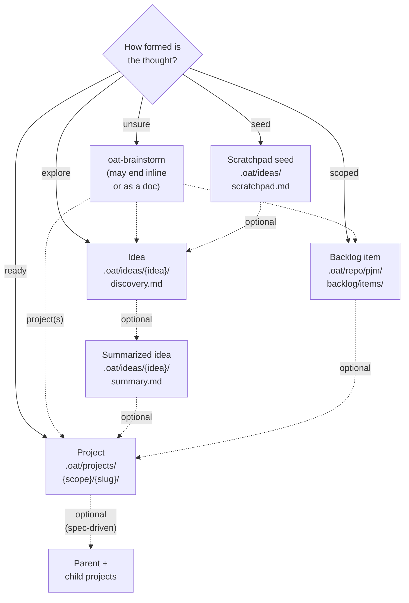

# Verification: 04-ideas-promotion (ideas/lifecycle.md diagram)

**Verdict: ACCEPT WITH CHANGES.** One finding blocks placement: at the draft's layout the text renders at about 4px on a phone and about 9px in a normal content column. The other problems are should-fix or nit. The routing the diagram draws holds up against the contracts. Every citation I reopened says what the draft claims, apart from the points below. Promotion is correctly shown as optional.

## Findings

| Severity   | Node / edge                                                                 | What is wrong                                                                                                                                                                                                                                                                                                                                                                                                                                                                                          | Evidence                                                                                                                                                                                            | Correction                                                                                                                                                                                                                |
| ---------- | --------------------------------------------------------------------------- | ------------------------------------------------------------------------------------------------------------------------------------------------------------------------------------------------------------------------------------------------------------------------------------------------------------------------------------------------------------------------------------------------------------------------------------------------------------------------------------------------------ | --------------------------------------------------------------------------------------------------------------------------------------------------------------------------------------------------- | ------------------------------------------------------------------------------------------------------------------------------------------------------------------------------------------------------------------------- |
| blocking   | Whole diagram                                                               | The draft is 1352px wide at natural size. (I rendered it with Mermaid 11.12.3 in headless Chrome, after the docs pipeline's `\n` to ` ` rewrite.) The theme renders it with `max-width` and scales it to fit the container. At a 375px viewport it renders 343px wide, a scale of 0.25, so 16px labels become about 4px. Five edges fan out from `Q` and four from `BS`, and the long labelled edges add dummy columns and crossings. Even a content column of about 750px scales it to about 55%. | `packages/docs-theme/src/mermaid.tsx:36-38` (plain `mermaid.render`); `packages/docs-transforms/src/remark-mermaid.ts:21`; render measurement (viewBox `0 0 1351.9 1173.3`)                         | Use the corrected block below: one-word `Q` labels, no skill names on edges, paths broken over 2 lines. It measured 739px wide (viewBox `0 0 739.3 1077.3`), about 45% narrower. Skill names move to the text equivalent. |
| should-fix | Edge `PR -.-> SPLIT` ("during discovery")                                   | Split detection runs only in `oat-project-discover`, which is spec-driven only. `oat-project-quick-start` and `oat-project-lite` never evaluate split signals. As drawn, the edge implies that any project can split.                                                                                                                                                                                                                                                                                  | `.agents/skills/oat-project-discover/SKILL.md:3`, `:285`, `:320`, `:400`; a grep for `split` in `oat-project-quick-start/SKILL.md` and `oat-project-lite/SKILL.md` returns no hits                  | Label it `optional (spec-driven)`. The text says a split comes from spec-driven discovery or directly from `oat-brainstorm`.                                                                                              |
| should-fix | Edge `BL -.-> PR` ("oat-project-lite / quick-start / new")                  | No project-entry skill takes a backlog item as input. Lite and quick-start mention backlog IDs only as `absorbed_backlog_ids` when they consolidate earlier scaffolds. The only bridge is an optional kickoff handoff written by `oat-pjm-review-backlog` Step 10, which the operator pastes in as context. The item also stays in `items/` until `oat backlog archive` runs in the PR that ships it. With skill names on it, the edge implies that the skill consumes the item.                       | `.agents/skills/oat-project-lite/SKILL.md:162-175`; `.agents/skills/oat-project-quick-start/SKILL.md:200-213`; `.agents/skills/oat-pjm-review-backlog/SKILL.md:248-262`                             | Label the edge only `optional`. Text: "start a project with any project-start skill, giving it the item (or its kickoff handoff) as context. Archive the item with `oat backlog archive` when the work ships."            |
| should-fix | Text equivalent: "Backlog items and projects are tracked in the repository" | This is wrong for the default project scope. With `projects.defaultScope` unset, `oat project new` uses `synced`. Synced project directories are gitignored on the branch and persisted to `refs/oat/projects/<slug>`. `local` projects are not tracked at all.                                                                                                                                                                                                                                        | `packages/cli/src/commands/shared/project-scope.ts:171-196` (fallback `'synced'`), `:24`; `packages/cli/src/commands/init/gitignore.ts:17-25` (`.oat/projects/synced/*/`, `.oat/projects/local/**`) | "Backlog items are committed to the repository. Projects are committed (shared scope), pushed to a project ref (synced, the default), or kept local (local scope)."                                                       |
| should-fix | Accessible label                                                            | It calls `oat-brainstorm` one of "five OAT homes", but it is a conversation, not a home. It does not mention the summarized-idea node or the split node as places things can land. It also leaves out brainstorm's handoff edges, which the picture shows.                                                                                                                                                                                                                                             | Draft lines 6, 20-23, 34                                                                                                                                                                            | Use the revised label below.                                                                                                                                                                                              |
| should-fix | Text equivalent: idea paths                                                 | The ideas skills resolve `IDEAS_ROOT` to `~/.oat/ideas` with `--global`. They also pick it without asking when the user config's `activeIdea` is set, or when only `~/.oat/ideas/` exists. The node labels show the project-level default, which is fine, but the text never says ideas can live at user level.                                                                                                                                                                                        | `.agents/skills/oat-idea-new/SKILL.md:55-72` (same block in `oat-idea-scratchpad`, `oat-idea-ideate`, `oat-idea-summarize`); `lifecycle.md:12-19`                                                   | Add: "Paths shown are the project-level defaults. `--global` (or an existing user-level setup) uses `~/.oat/ideas/` instead."                                                                                             |
| should-fix | Text equivalent: summarized idea to project                                 | This is accurate to the contract, but it doesn't say that the documented route is spec-driven. Nor does it say that `ideas/index.md:40` also allows lite and quick-start.                                                                                                                                                                                                                                                                                                                              | `.agents/skills/oat-idea-summarize/SKILL.md:172-183`; `apps/oat-docs/docs/workflows/ideas/index.md:40`                                                                                              | Use "The documented route is `oat-project-new` and then `oat-project-discover`, with `summary.md` as the request. That is a spec-driven project."                                                                         |
| nit        | `oat-idea-ideate` placement                                                 | Ideate is on no edge. It does three jobs: it resumes an idea (an `ID` self-loop), it turns a selected scratchpad seed into an idea (a second `SP -> ID` route), and it reopens a summarized idea (`SUM -> ID`, backwards). A self-loop would widen the layout.                                                                                                                                                                                                                                         | `.agents/skills/oat-idea-ideate/SKILL.md:137-138`, `:152-160`, `:197-201`                                                                                                                           | Keep it out of the picture. In the text: "`oat-idea-ideate` resumes an idea, can also start one from a scratchpad seed, and can reopen a summarized idea."                                                                |
| nit        | Dashed edges read as "move"                                                 | Promotion doesn't move the record. The idea files stay in `IDEAS_ROOT`, and its ideas-backlog entry is archived by hand. The backlog item stays until it is archived.                                                                                                                                                                                                                                                                                                                                  | `.agents/skills/oat-idea-summarize/SKILL.md:180-181`; `apps/oat-docs/docs/workflows/backlog-and-planning/backlog-lifecycle.md:24-27`                                                                | One sentence: "Moving on leaves the earlier record in place. It is archived, not moved."                                                                                                                                  |
| nit        | `Q -> PR`                                                                   | `oat-project-import-plan` (an external plan) is also a project entry.                                                                                                                                                                                                                                                                                                                                                                                                                                  | root `AGENTS.md` Workflow Options #4                                                                                                                                                                | Mention it in the text if space allows.                                                                                                                                                                                   |
| nit        | "Ideas are local and gitignored"                                            | Project-level `.oat/ideas` is gitignored only when it is chosen at `oat init`, where it is checked by default. User-level ideas are outside the repo.                                                                                                                                                                                                                                                                                                                                                  | `packages/cli/src/commands/init/index.ts:626-630`, `:779-797`; `ideas/index.md:10` ("usually gitignored")                                                                                           | Use "Ideas are local and usually gitignored."                                                                                                                                                                             |
| nit        | `\n` in labels                                                              | Plain Mermaid 11.12.3 renders a literal `\n` as the characters `\n`; I confirmed this by rendering. It works on the docs site only because `remarkMermaid` rewrites it to ` `. Other docs pages use the same convention, so it is consistent. But raw GitHub previews of the `.md` will show `\n`.                                                                                                                                                                                                 | `packages/docs-transforms/src/remark-mermaid.ts:9-21`; for example `apps/oat-docs/docs/workflows/projects/reviews/review-flavors.md:39`                                                             | Keep it for consistency, or use ` `, which renders in both places.                                                                                                                                                    |

## Verdicts on the claimed disagreements

1. **lifecycle.md:106 vs the brainstorm lite branch: CONFIRMED, and wider than the draft says.** `oat-brainstorm/SKILL.md:400` and `:509-548` add a lite branch that seeds `plan.md`, exits with status 64 if `discovery.md` exists, and hands off to `oat-project-lite`. Two other parts of the skill's own contract repeat the stale rule that page :106 mirrors. One is `references/destinations.md:122-126` ("proposes `quick` vs `spec-driven`", "Write field-filled `discovery.md` only"). The other is the success criterion at `SKILL.md:821` ("Project promotion writes `discovery.md` only"). Fixing the page alone would still leave the skill contradicting itself. The diagram is unaffected, because its brainstorm-to-project edge is mode-neutral.
2. **ideas/index.md:40 vs `oat-idea-summarize` naming only `oat-project-new`: PARTIALLY CONFIRMED.** There is a real scope mismatch. The summarize contract (`:172-183`) and `lifecycle.md:98-104` name only `oat-project-new` followed by `oat-project-discover`, which is spec-driven, while index.md offers lite, quick, or spec-driven. No contract forbids lite or quick, but none documents them either. The draft overreaches, though, in saying the "lite seeds `plan.md`, quick and spec-driven seed `discovery.md`" sentence "describes brainstorm promotion". That sentence is accurate about what each mode's scaffold starts with (`packages/cli/src/commands/project/new/scaffold.ts:117-128`; `oat-project-lite/SKILL.md:153-160`).
3. **Default project scope, `shared` vs `synced`: CONFIRMED that index.md is stale. The `projects.root` "contradiction" is REFUTED.** On a fresh install, `projects.defaultScope` is unset, `oat init` never writes it (no hit in `packages/cli/src/commands/init/**`), and `resolveDefaultScope` returns `synced` (`project-scope.ts:171-196`; also `config/resolve.ts:49`). An `OAT_PROJECTS_DEFAULT_SCOPE` env value or a config value overrides it. `projects.root = .oat/projects/shared` is the _shared-scope root_: the other scope roots are its siblings (`project-scope.ts:78-88`; `scaffold.ts:592-599`). So the result is `.oat/projects/synced/<slug>/`, and the two defaults do not contradict each other. A related skill bug the draft missed: `oat-project-new/SKILL.md:94`'s success criterion "`{PROJECTS_ROOT}/{project-name}/` exists" uses the shared root from Step 0.5 (`:56`). That is wrong for the default synced scope and contradicts the same skill's `:83`. This repository overrides the scope to `shared` (`.oat/config.json` `projects.defaultScope: "shared"`), which is why its own projects live under `shared/`. Keeping `{scope}` in the label is correct, and the text should say "synced by default".
4. **Two different "backlogs": CONFIRMED.** The ideas index is `{IDEAS_ROOT}/backlog.md`, with the sections Active Brainstorming, Captured Ideas, and Archived (`.oat/templates/ideas/ideas-backlog.md`; `oat-idea-summarize/SKILL.md:3`, `:146-155`). It is unrelated to `.oat/repo/pjm/backlog/` (`oat-pjm-add-backlog-item/SKILL.md:13`). None of the four idea skills calls `oat-pjm-add-backlog-item`, so drawing no idea-to-backlog-item edge is correct. The text should spell out the distinction.
5. **lifecycle.md:36's destination list is incomplete: CONFIRMED (minor).** Active-project fold-back, the reference file, and "Promote to N projects" are missing (`SKILL.md:303`, `:330`).
6. **The kickoff handoff's mode list leaves out lite: CONFIRMED, and the root cause is the template.** The template the draft did not check, `.oat/templates/pjm-handoffs-readme.md`, also names only quick-start and new. So does `.oat/templates/pjm-agents.md:89-90`. `oat-pjm-review-backlog/SKILL.md:259` includes lite.

The draft's remaining notes (7-12) are accurate. I resolved note 12 by rendering: see the blocking finding.

## Corrected Mermaid

The block has 8 nodes and 13 edges. It parses and renders in Mermaid 11.12.3, with `\n` rewritten to ` ` as the docs pipeline does, at 739px natural width. As a negative control, a block with an unclosed quote failed to parse.

**Lead-in:** "Start in the home that matches how formed the thought is. Every home is a fine place to stop. Dashed arrows are optional moves."

**Accessible label:** "A decision flowchart that starts a thought in one of four homes, depending on how formed it is: a scratchpad seed, an idea, a backlog item, or a project. A thought you are unsure about starts in an `oat-brainstorm` conversation instead. Dashed arrows are optional moves. A brainstorm can hand off to an idea, a backlog item, or one or more projects. A seed can become an idea, and an idea a summarized idea. A summarized idea or a backlog item can become a project. A spec-driven project can split into a parent and child projects."

**Text equivalent: keep the draft's, with these changes.**

- **Unsure:** `oat-brainstorm`. Unchanged, and add that it can also summarize an idea directly.
- **Seed:** `oat-idea-scratchpad`.
- **Explore:** `oat-idea-new`. `oat-idea-ideate` resumes an idea, can start one from a scratchpad seed, and can reopen a summarized idea.
- **Scoped:** `oat-pjm-add-backlog-item`, which needs `oat pjm init`.
- **Ready:** `oat-project-lite`, `oat-project-quick-start`, `oat-project-new`, or `oat-project-import-plan` for an external plan.
- **Optional moves:**
  - Seed to idea: `oat-idea-new`.
  - Idea to summary: `oat-idea-summarize`.
  - Summarized idea to project: the documented route is `oat-project-new` and then `oat-project-discover`, with `summary.md` as the request (spec-driven).
  - Backlog item to project: start any project skill with the item, or its kickoff handoff, as context, then archive the item with `oat backlog archive` when the work ships.
  - Split: from spec-driven discovery (`oat-project-discover`), or directly from `oat-brainstorm`.
- **Records stay in place:** moving on leaves the earlier record where it is. It is archived, not moved.
- **Paths:** the paths shown are project-level defaults. With `--global`, ideas live in `~/.oat/ideas/`. Ideas are local and usually gitignored.
- **The ideas backlog:** `{IDEAS_ROOT}/backlog.md` is an index of ideas, not the repository backlog.
- **Where projects are kept:** backlog items are committed. Projects are committed (shared scope), pushed to a project ref (synced, which is the default on a fresh install), or kept local (local scope).

## What I verified, and what I could not

**Verified by reading:**

- Every path:line in the draft's citation table, apart from minor range drift. For example, the extend-idea stanza in `destinations.md` runs to `:68`, not `:63`.
- The full contracts of `oat-idea-new`, `oat-idea-ideate`, `oat-idea-scratchpad`, `oat-idea-summarize`, `oat-pjm-add-backlog-item`, `oat-project-split`, and `oat-project-new`.
- `oat-brainstorm/SKILL.md`, all except lines 620-760 (the fold-back persistence detail), plus `references/destinations.md`.
- The split and backlog sections of `oat-project-discover`, `oat-project-quick-start`, and `oat-project-lite`, found by grep and read in context.
- Steps 10-11 of `oat-pjm-review-backlog`.
- Templates: `.oat/templates/ideas/*` and the PJM handoff templates.
- CLI source: scope resolution (`config/resolve.ts`, `commands/shared/project-scope.ts`, `commands/project/new/scaffold.ts`), `init/gitignore.ts`, `init/index.ts` local paths, and pack membership (`tools/shared/pack-manifest.ts`: `oat-project-split` is in `workflows`).
- The docs Mermaid pipeline: `remark-mermaid.ts` and `docs-theme/src/mermaid.tsx`.

**Verified by running:**

- I rendered the draft and the corrected block in headless Chrome with the repository's `mermaid@11.12.3` at a 375px viewport, using inline scripts. That confirmed the widths, that a literal `\n` renders as `\n` without the remark rewrite, and the parse negative control.

**Not verified:**

- The actual Fumadocs content-column width. The "about 55%" desktop scale is an estimate.
- Rendering in dark theme.
- How `oat init` behaves non-interactively for the `.oat/ideas` local path. I read the code only; `selectedPaths` is `[]` when not interactive.
- I did not run any skill.
- I did not read `oat-brainstorm/SKILL.md:620-760`.

**Write-scope note:** besides this report, the first render pass wrote a screenshot, `scratchpad/diagrams/04-draft-375.png`, to the session scratchpad, outside the repository. I wrote nothing inside the repository.
