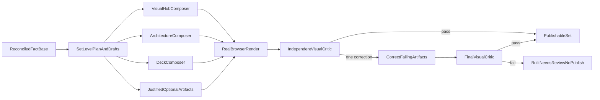

## <!-- 33154d65-bbb7-4bfe-a7f1-fababf504825 -->

todos:

- id: "license-foundation"
  content: "Ship complete MIT notices and package-payload regression coverage before PR #179 merges"
  status: pending
- id: "normalize-backlog"
  content: "Split the XL visual backlog into the five ordered, independently verifiable outcomes"
  status: pending
- id: "visual-runtime"
  content: "Implement bundled visual guidance, set-level planning, adaptive-three portfolio, and provider-neutral composition contracts"
  status: pending
- id: "bounded-critic"
  content: "Implement browser screenshot evidence, independent visual criticism, one correction pass, and built-needs-review failure semantics"
  status: pending
- id: "golden-conformance"
  content: "Validate three benchmark cases against the personal kit and complete one bounded final review"
  status: pending
  isProject: false

---

# Restore Golden Visual Quality

## Diagnosis

The current implementation is mechanically capable but does not reliably put visual judgment in the loop. The production author receives only a brief, fact base, theme, and shell in [`authorArtifact`](.agents/skills/explainer-kit/scripts/run.mjs); the personal kit additionally supplies representation-selection rules, composition guidance, a whole-set plan, real browser review, and a cohesion sweep in [`SKILL.md`](/Users/thomas.stang/.agents/skills/personal-explainer-kit/SKILL.md) and [`workflow-build-verify.js`](/Users/thomas.stang/.agents/skills/personal-explainer-kit/templates/workflow-build-verify.js).

Preserve the current fact-base reconciliation, recipe policy, HTML safety, provenance, approval, and durability work. Do not reopen those foundations or add this recovery to the already oversized PR #179 beyond the mandatory licensing fix.

## 1. Fix licensing before merging the foundation

- Complete [`BL-260727-ship-mit-notices-inside.md`](.oat/repo/pjm/backlog/items/BL-260727-ship-mit-notices-inside.md) on PR #179 before merge.
- Include the full upstream MIT texts and verify every affected public package with `npm pack` plus a release regression check.
- Merge PR #179 as the mechanical foundation; start visual-quality work on a fresh branch/project.

## 2. Replace the XL backlog item with bounded outcomes

Supersede [`BL-260727-close-the-explainer-kit-visual.md`](.oat/repo/pjm/backlog/items/BL-260727-close-the-explainer-kit-visual.md) as an umbrella and split it into ordered work:

1. **P0 — Visually skilled unattended author + critic:** bundle the relevant MIT-licensed visual-explainer guidance and add a provider-neutral independent visual-review seam.
2. **P0 — Cohesive adaptive recap set:** plan the whole set once; require hub + architecture/system visual + deck, with optional status, rollout, and deep dives only when justified.
3. **P1 — Non-linear diagram routing:** detect branches, fan-ins, and cycles and route them to the artistic composer. Do not build a general graph-layout engine in this recovery.
4. **P1 — Durable backlinks + catalog:** emit commit-SHA-pinned GitHub source URLs and `initiatives/<slug>/catalog.json` from manifest data.
5. **P2 — Additional visual workflows:** diff review, plan review, fact-check, dashboards, and richer compositions stay outside the quality-recovery critical path.

Correct the current contradictory diagram acceptance criteria: an inline renderer may reject/reroute unsupported non-linear graphs; it cannot simultaneously be allowed to refuse them and be required to preserve all of them itself.

## 3. Make visual capability part of the runtime contract

- Adapt the relevant upstream guidance into versioned bundled references such as [`references/visual-authoring.md`](.agents/skills/explainer-kit/references/visual-authoring.md) and `visual-review.md`; the full MIT notice is the prerequisite.
- Route guidance by medium: architecture/cards, diagrams, decks, tables, and responsive navigation. Installed `visual-explainer` capability may enhance the run, but unattended quality must not depend on a user plugin being installed.
- Add a set-level planning stage before per-artifact composition. It produces one shared terminology/status/number ledger, the adaptive artifact portfolio, source coverage, per-artifact draft, and visual intent.
- Compose the flagship hub through the artistic house-style path from the planned draft; retain deterministic Markdown rendering as a simpler fallback, not the golden recap path.
- Update [`project-recap.json`](.agents/skills/explainer-kit/recipes/project-recap.json), author contracts, retained records, and the OAT adapter so all artifact authors receive the same set context.

## 4. Require independent browser judgment with a hard loop cap

- Extend the injected browser-probe surface to retain screenshots plus existing layout/accessibility metrics at desktop, tablet, and mobile widths.
- Add a provider-neutral visual critic separate from the fact critic and from the author. It reviews the complete rendered set for first-viewport clarity, hierarchy, representation choice, legibility, visual polish, medium-appropriate composition, terminology/number/status cohesion, redundancy, source-link coverage, and broken interactions.
- The current production cohesion check receives no cohesion data and therefore checks empty objects. Replace that no-op with reviewer evidence over actual rendered artifacts and the shared set ledger.
- For unattended `project-recap`, absence of a browser probe or visual critic is not a warning: return `built-needs-review` and do not publish or attest durability.
- Permit exactly one correction pass over failing artifacts, then one final review. Never recurse. A remaining failure is preserved with actionable findings and stops publication.

## 5. Lock quality with golden conformance, not endless review

- Build a three-case benchmark from committed fixtures: a simple project, a branched/cyclic architecture case, and the archived explainer-authoring-redesign evidence. Run both the personal kit and the rebuilt OAT path against equivalent source material.
- Commit benchmark inputs, rubric results, screenshots, and representative output fixtures. The personal kit is the acceptance oracle for workflow and quality; pixel identity is not required.
- Required runtime outcome for every case: adaptive minimum set present, all links resolve, catalog matches manifest, no unsupported graph is silently flattened, browser checks pass, visual critic passes in at most one correction, and the full set is understandable from the first viewport and internally cohesive.
- Run normal core/adapter/smoke/release tests, but do not treat them as visual acceptance.
- Project-process cap: one design review before implementation and one final review after all three golden runs. Fix Critical/Important findings once; explicitly backlog lower-severity improvements. No open-ended re-review loop.

## Handoff

Use the current provider plan mode, then import the accepted plan into a fresh OAT project. Keep the project bounded to golden-quality unattended project recaps; additional workflow recipes remain follow-up work.
