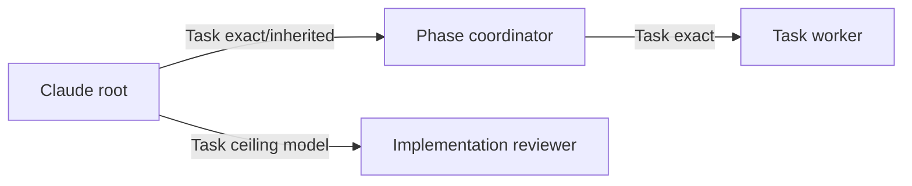
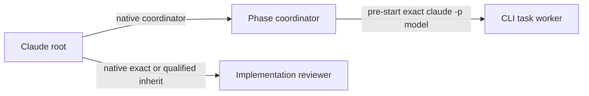

# Claude Subagent Dispatch — Draft Harness Reference

> **Status:** validation draft. Native coordinator-to-worker nesting remains an
> evidence question, not an assumed capability.

## Control Surfaces

| Surface                | Meaning                                                            |
| ---------------------- | ------------------------------------------------------------------ |
| Native Task tool       | Named subagent dispatch with optional per-call model               |
| Omitted Task model     | Host/default inheritance behavior                                  |
| Explicit Task model    | OAT-selected Claude model target                                   |
| `claude -p`            | Fresh exact CLI child when a deliberate external route is required |
| Named agent definition | Coordinator, task-worker, or reviewer instructions                 |

Claude's OAT-managed dispatch axis is model, not a separate reasoning-effort
axis. Current abstract ordering is:

```text
haiku < sonnet < opus < fable
```

## Candidate Native Topology

This topology must be confirmed rather than assumed:



If native nested Task dispatch is not exposed to the coordinator, the
sanctioned alternative should be selected before task launch and recorded:



## Claude Selection Rules

1. Resolve an exact model candidate under the named maximum.
2. Snapshot the current dispatcher's native Task model catalog, if the schema
   exposes one.
3. Pass the resolver-returned model exactly on native Task invocation.
4. Keep `effort_axis=not-applicable`.
5. Omit the model only for deliberate inheritance.
6. Coordinator inheritance is allowed when the root is suitable.
7. Leaf workers must not silently inherit an expensive root when an exact lower
   candidate or CLI route is intended.
8. Implementation self-review must run at or above the named ceiling.
9. After Task or CLI acceptance, do not switch routes.

## Exact CLI Route

The verifying Claude session should confirm the current non-interactive syntax
and model-selection controls. The expected conceptual form is:

```bash
claude -p \
  --model '<exact-model>' \
  '<canonical role instructions + bounded scope packet>'
```

Do not treat this draft syntax as confirmed until the Claude harness records
the live help output and a bounded read-only acceptance probe.

## Claims for Concurrent Claude Verification

1. Enumerate the root Task tool's exact explicit model choices.
2. Record whether omitting `model` inherits the parent model or a named-agent
   default.
3. Launch a read-only coordinator and inspect whether it has a nested Task tool.
4. If nested Task exists, enumerate its explicit model choices.
5. Launch one bounded read-only nested sentinel with an exact model.
6. Record the complete Task payload and acceptance evidence.
7. Verify whether runtime model identity is observable separately from the
   requested model.
8. Capture `claude -p --help` model controls and run at most one read-only exact
   model probe.
9. Confirm whether named subagent instructions and per-call model selection can
   be combined.
10. Classify every claim as confirmed, unsupported, or inconclusive.

## Review Behavior to Verify

- Planning self-review inherits the planning root.
- Capped implementation self-review receives the configured ceiling model.
- If that native model is unavailable, inheritance is allowed only when the
  parent is known at or above the ceiling; otherwise select an exact CLI
  reviewer before launch.
- External gate review remains independent of the producer context.

## Open Questions

- Is native nesting supported for all named Claude subagents or only selected
  tool configurations?
- Does the nested catalog vary by named role or parent model?
- Can model upgrades above the coordinator tier be verified after dispatch?
- Which launcher fields provide configured-invocation evidence?
- Is the CLI account catalog equivalent to native Task eligibility?
