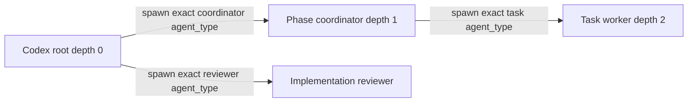

# Codex Subagent Dispatch — Draft Harness Reference

> **Status:** validation draft. Codex sessions should verify each claim against
> the current materialized roles and runtime rather than accepting prior project
> evidence as universal.

## Control Surfaces

| Surface                                        | Meaning                                                                      |
| ---------------------------------------------- | ---------------------------------------------------------------------------- |
| Native `spawn_agent` / registered `agent_type` | Exact OAT-managed coordinator, task-worker, or reviewer role                 |
| Materialized `.codex` agent configuration      | Launcher-owned model + effort declaration                                    |
| `agents.max_depth`                             | Maximum native nesting depth; not a permission grant                         |
| `codex exec` fresh child                       | Explicit model/effort route after documented pre-start role rejection        |
| Sandbox writable roots                         | Worktree, shared Git metadata, and managed agent assets the child may mutate |

## Expected Native Topology



`agents.max_depth >= 2` is required for this topology. Increasing depth does
not make `.git` metadata, worktree content, or `.agents` writable.

## Codex Selection Rules

1. Resolve one exact configured `{model, effort}` candidate under the named
   maximum.
2. Prefer the resolver-returned materialized `agent_type`.
3. Pass that exact role name as the native spawn payload.
4. Treat spawn acceptance as authoritative configured-invocation evidence.
5. Do not require worker self-report to prove role availability.
6. If the exact registered role is rejected before start, a fresh
   `codex exec` child may be selected with explicit model, effort, and canonical
   role instructions.
7. Never replace a concrete managed task target with the base coordinator or
   provider-default role.
8. After acceptance, timeout, `BLOCKED`, or verification failure is terminal;
   do not try another role or CLI child.

## Writable-Root Requirements

Native depth and filesystem permissions are orthogonal. Before launching a
write-capable task worker, verify access to:

- the task's worktree files;
- shared Git metadata required for index/commit operations;
- managed `.agents` content when the task edits canonical skills/agents;
- explicitly planned generated-output directories.

Use scoped writable roots. Do not use broad danger/full-access permissions as
the default remedy.

## Fresh Exact Child Route

When a complete native role payload is rejected before start:

```bash
codex exec \
  --model '<exact-model>' \
  -c 'model_reasoning_effort="<exact-effort>"' \
  '<canonical role instructions + bounded scope packet>'
```

The exact command shape and sandbox controls must be captured by the verifying
Codex session. The fresh child route is not available after an accepted native
launch.

## Review Behavior

- Capped implementation self-review targets the configured ceiling role.
- Managed uncapped and explicit inherit/default may use the documented base
  reviewer behavior.
- Gate review targets are independently selected and may use a cross-runtime
  `codex exec` session that itself dispatches a managed reviewer.
- Requested/model-materialized identity and runtime-observed identity remain
  separate evidence layers.

## Claims for Concurrent Codex Verification

1. Enumerate the exact registered coordinator, worker, and reviewer roles
   visible to the root.
2. Record effective `agents.max_depth`.
3. Launch a read-only phase coordinator and ask it to enumerate its nested
   role catalog.
4. Launch one bounded read-only depth-2 sentinel using an exact task role.
5. Record the complete native payload and whether acceptance was observable.
6. Verify that missing self-reported identity does not affect acceptance.
7. Verify the scoped writable-root requirements without changing repo or user
   configuration.
8. Confirm the exact `codex exec` model/effort syntax without launching a
   write-capable task.
9. Classify every claim as confirmed, unsupported, or inconclusive.

## Open Questions

- Can the current Codex host enumerate materialized native roles directly, or
  only attempt exact names?
- Does a fresh session need provider sync before newly materialized roles are
  selectable?
- Which launcher-owned fields can independently corroborate runtime identity?
- Are root and nested role catalogs stable for the duration of one run?
