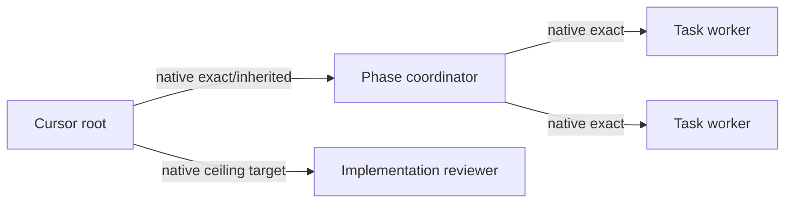
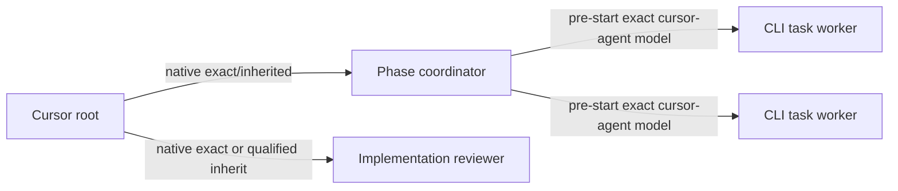

# Cursor Subagent Dispatch — Draft Harness Reference

> **Status:** validation draft. Current observations are evidence, not a
> permanent model catalog.

## Control Surfaces

Cursor currently exposes at least three different catalogs:

| Surface                          | Meaning                                                         | Enumeration                                           |
| -------------------------------- | --------------------------------------------------------------- | ----------------------------------------------------- |
| Native Task/Subagent tool schema | Models this specific dispatcher can explicitly pin              | Read only from the current tool schema                |
| Cursor CLI account catalog       | Models accepted by `cursor-agent --model` for the account       | `cursor-agent --list-models` or `cursor-agent models` |
| UI role configuration            | User-selected defaults, inheritance, and role-specific settings | Cursor UI                                             |

These surfaces are not interchangeable. CLI presence does not establish native
Task eligibility, and a root Task catalog does not establish a nested
coordinator's Task catalog.

## Current Session Evidence

- Earlier Fable root snapshot exposed `gpt-5.6-sol-high-fast`; native pinned
  plan self-reviews were accepted.
- Later Sol xhigh and Fable root snapshots exposed
  `gpt-5.6-sol-xhigh` instead. The root-model A/B test showed the catalog change
  was not caused by the selected root model.
- Three fresh child-context probes — general/Terra, coordinator/Terra, and
  coordinator/Sol — each exposed only `composer-2.5-fast` for nested dispatch.
- Cursor CLI continued to list Sol high-fast, Sol xhigh, Terra, and Luna
  variants.
- `p01-t01` completed through a deliberately selected exact
  `cursor-agent --model gpt-5.6-terra-medium` child after native nested
  rejection.

See `orchestration-execution-log.md` for timestamps, commits, and the full
catalog snapshots.

## Cursor Selection Rules

1. Treat every model slug as opaque.
2. Snapshot the current dispatcher's Task model enum immediately before
   selection.
3. Intersect configured candidates with that snapshot.
4. If a suitable exact native candidate exists, pass it byte-for-byte as the
   Task model argument.
5. If a coordinator target is unavailable, prefer native inheritance when the
   root is suitable.
6. If a leaf/fix target is unavailable or the native intersection is
   unsatisfactory, choose an exact Cursor CLI target before launch.
7. If an implementation reviewer cannot be pinned natively, inherit only when
   the root is known at or above the review ceiling; otherwise choose an exact
   CLI reviewer.
8. An accepted native or CLI child is terminal for fallback eligibility.

## Expected Cursor Topologies

Ideal when the nested catalog is sufficient:



Current sanctioned hybrid when the nested catalog is insufficient:



## Cursor CLI Route

The complete invocation must include the resolver-returned opaque model:

```bash
cursor-agent \
  --print \
  --output-format json \
  --trust \
  --force \
  --model '<exact-opaque-model>' \
  --workspace '<worktree>' \
  '<self-contained bounded task prompt>'
```

The prompt includes one task ID, one file boundary, task verification, expected
commit, and the canonical task-worker role obligations. Do not use an implicit
continuation or a second route after acceptance.

## Claims Still Requiring Verification

- Whether the nested one-model catalog is universal, account-specific, or a
  temporary child-context policy.
- Whether the UI's role editor can expand the nested Task catalog.
- Whether Cursor CLI Task events can reliably expose nested selection evidence.
- Whether runtime identity can be observed independently from requested model
  arguments.
- Whether a root catalog can change between preflight and dispatch without a
  model/session transition.

## Mismatch Advisory Example

```text
Cursor native catalog mismatch:
- Configured candidates not natively dispatchable here:
  gpt-5.6-luna-high, gpt-5.6-terra-medium
- Native candidates observed but not configured:
  composer-2.5-fast
- Action:
  selected provider CLI target gpt-5.6-terra-medium before launch
- Advisory:
  consider adding compatible native candidates if they fit your policy;
  do not remove CLI-capable ladder entries solely because native Task cannot
  pin them.
```
