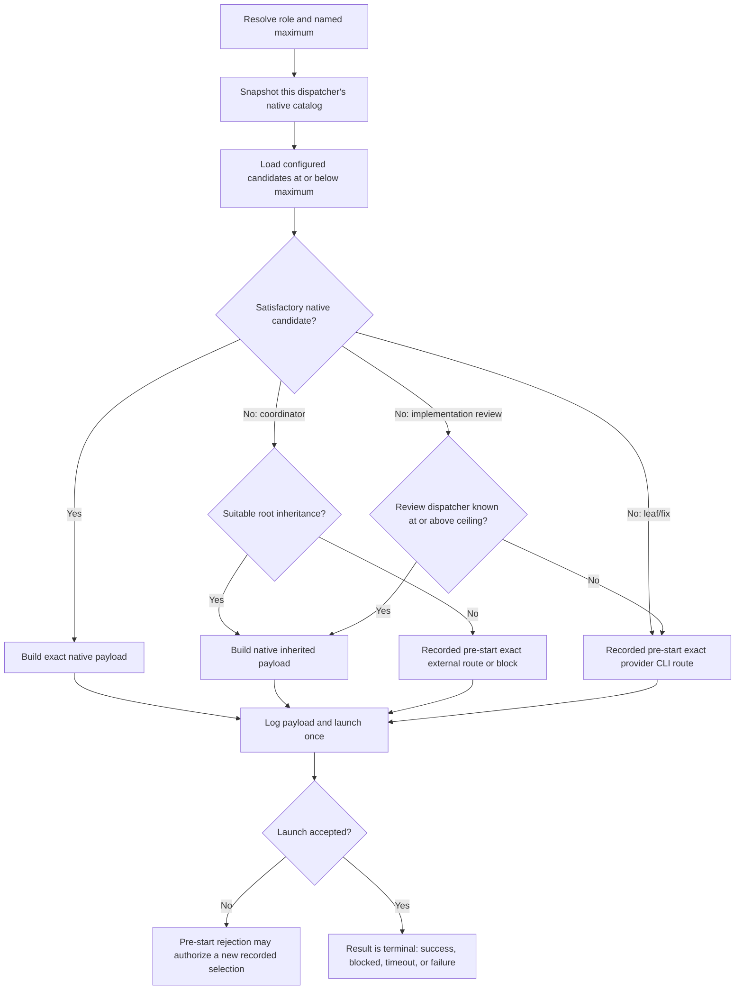

# Dispatching Subagents — Draft Contract

> **Status:** validation draft, not an active runtime contract.
>
> This document is the provider-neutral source for concurrent Cursor, Codex,
> and Claude verification. Phase p04 will refine verified claims into the
> canonical `oat-dispatch-subagents` skill and its provider references.

## Purpose

Define one dispatch model for phase coordinators, task workers, self-reviewers,
and external gates without pretending that all harnesses expose the same model
catalog, nesting behavior, or invocation controls.

## Role Decision Table

| Role                       | Preferred dispatch                                                            | When the preferred native target is unavailable                                                                                                 |
| -------------------------- | ----------------------------------------------------------------------------- | ----------------------------------------------------------------------------------------------------------------------------------------------- |
| Phase coordinator          | Native subagent, pinned to a suitable candidate at or below the named ceiling | Native inheritance from the root when the root is suitable; otherwise make a recorded pre-start exact external selection or block               |
| Task / leaf worker         | Native exact candidate selected from the current dispatcher's catalog         | Select an exact provider CLI child before launch; never silently inherit the root                                                               |
| Planning self-review       | Native subagent inheriting the planning root                                  | Continue inherited execution; the planning root is expected to satisfy the review quality floor                                                 |
| Implementation self-review | Native exact reviewer at the named ceiling                                    | Inherit only when the review-owning dispatcher is known at or above the ceiling; otherwise select the exact provider CLI reviewer before launch |
| Phase review gate          | Configured gate target                                                        | Fail closed when the configured target cannot be launched or corroborated                                                                       |
| Lifecycle gate             | Independent cross-family/cross-runtime CLI target                             | Fail closed; do not replace it with a same-context self-review                                                                                  |

## Dispatch Contexts

A model catalog belongs to a specific dispatcher invocation, not to an account,
conversation, root model, or provider in general.

Distinct contexts include:

- root native dispatch;
- coordinator nested native dispatch;
- provider CLI account catalog;
- provider-managed/materialized roles;
- UI-configured defaults or inheritance.

The dispatcher MUST snapshot its own native catalog immediately before making
a selection. A root snapshot cannot be passed off as a nested coordinator's
catalog, and a preflight snapshot may be stale by dispatch time.

## Selection Algorithm

For each coordinator, worker, fix, or review dispatch:

1. Resolve the named project/phase maximum and provider route.
2. Read the current dispatcher's live native catalog from its tool schema.
3. Read the configured candidates at or below the named maximum.
4. Build the native intersection without normalizing opaque provider strings.
5. Select once using role, task complexity, quality floor, cost, and current
   catalog information.
6. Build the complete host payload before logging.
7. Launch exactly once.
8. Treat an accepted launch as terminal for fallback eligibility.



## Terminology

- **Pre-start selection:** choosing native, inherited, or CLI execution before
  launching a child, using the actual available catalogs and role rules.
- **Pre-start rejection:** the provider rejects the complete requested payload
  before accepting child execution.
- **Fallback:** a second route attempted after a launch. Fallback is forbidden
  after acceptance.
- **Inherited:** the child deliberately receives the parent's host model/default
  because no explicit model argument is passed.
- **Exact target:** the provider-specific model/effort/role payload returned by
  the resolver and passed unchanged to the host invocation.
- **Catalog mismatch:** configured candidates and the current native catalog do
  not have a satisfactory intersection.

## Catalog-Mismatch Advisory

When mismatch occurs:

1. Report configured candidates not natively dispatchable in this context.
2. Report nearby native candidates as possible **additions** to configuration.
3. Never recommend removing configured entries solely because they are absent
   from a native catalog; the same ladders may serve provider CLI dispatch.
4. Record whether the chosen route was native, inherited, external, or blocked.
5. Keep observed catalog snapshots out of durable configuration unless the user
   explicitly changes the configuration.

## Inheritance Rules

- Phase coordinators may inherit when exact pinning is unavailable and the root
  is suitable. Coordinator inheritance is an explicit cost/quality decision.
- Task workers MUST NOT silently inherit an expensive root model. Select an
  exact native or exact CLI candidate.
- Planning self-reviews inherit by default.
- Implementation self-reviews must run at or above the named ceiling. Inherit
  only when the review-owning dispatcher's declared tier satisfies that
  invariant. A phase coordinator below the ceiling must select an exact
  provider CLI reviewer before launch when its nested native catalog lacks the
  ceiling target; the outer root's catalog does not satisfy that nested
  selection.
- External gates never inherit the producer context.

## Acceptance Boundary

Launcher acceptance is authoritative configured-invocation evidence.
Self-reported runtime identity is optional diagnostic evidence and MUST NOT be
used as an availability probe.

After acceptance, `BLOCKED`, timeout, failed tests, and provider errors are
terminal child outcomes. They do not authorize a different model, role, or
harness. Operator-interrupted recovery must be explicit and auditable; it must
not masquerade as ordinary fallback.

## Required Dispatch Evidence

Each dispatch record should preserve:

```yaml
scope: pNN-tNN
action: implementation # implementation | fix | review
role: implementer # implementer | fix | reviewer
dispatch_context: nested-native # root-native | nested-native | provider-cli | gate
dispatch_policy: high
dispatch_ceiling: high
native_catalog_snapshot:
  - opaque-model-slug
candidates_considered:
  - opaque-model-slug
selection_reason: native-catalog # native-catalog | native-catalog-unsatisfying | pre-start-rejection | inherit | gate-target
selected_route: native # native | inherited | provider-cli | gate | blocked
requested_target: opaque-provider-target
payload: {} # complete provider invocation controls, redacted where required
launch_status: accepted # accepted | rejected-before-start | not-launched
producer: unknown
provenance: unknown
runtime_confirmation: not-reported
```

The parseable compatibility stamp remains:

```text
Dispatch: scope=<phase-or-task> action=<implementation|fix|review> role=<implementer|fix|reviewer> producer=<slug|unknown> provenance=<declared|observed|inferred|unknown> model_axis=<axis> effort_axis=<axis> dispatch_policy=<policy|unknown> dispatch_ceiling=<value|none> target=<target|unknown>
```

## Provider Verification Status

| Claim area            | Cursor                                                           | Codex                                                            | Claude                               |
| --------------------- | ---------------------------------------------------------------- | ---------------------------------------------------------------- | ------------------------------------ |
| Root exact native pin | Confirmed in IDE; catalog is volatile                            | Verify against materialized roles                                | Verify Task model argument           |
| Nested native catalog | Observed as `composer-2.5-fast` only in current child contexts   | Verify depth-2 materialized role path                            | Unknown; verify                      |
| Native inheritance    | Confirmed by omit-model contract                                 | Base-role/default behavior differs from explicit managed targets | Verify omit-model behavior           |
| Exact CLI child       | CLI catalog enumerated; p01-t01 completed via exact Terra target | Verify pinned fresh child and role instructions                  | Verify `claude -p` exact model route |
| Runtime identity      | Not reported                                                     | Launcher/config declared; runtime observation optional           | Verify available evidence            |

## Promotion Criteria

Phase p04 may promote a claim only when:

- the harness mechanism is documented or directly observed;
- the exact payload and acceptance boundary are recorded;
- inheritance and exact-selection behavior are not conflated;
- unsupported and inconclusive results remain explicit;
- provider-specific facts are kept in provider references rather than the core
  contract.
