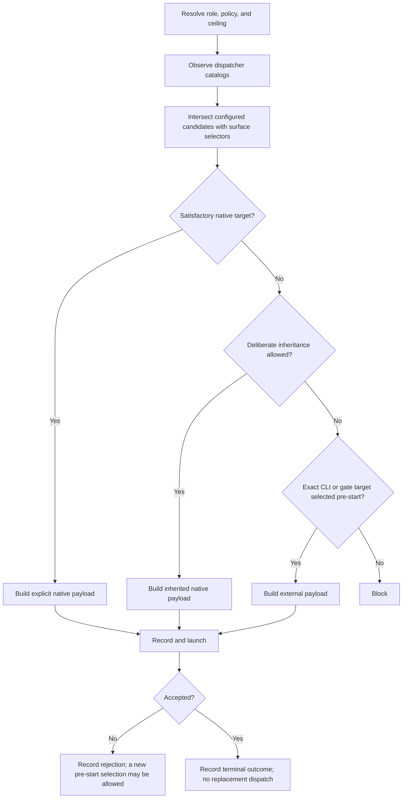

# Dispatching Subagents — Verified Contract Candidate

> **Status:** verified Phase p04 promotion input, not an active runtime
> contract. Verified against fresh canonical Claude, Codex, Cursor IDE, and
> Cursor CLI capability runs on 2026-07-11.

## Purpose

Define the provider-neutral rules OAT needs to select, launch, observe, and
record subagents without pretending that providers expose the same roles,
model selectors, effort controls, nesting behavior, or runtime evidence.

This document separates three kinds of statement:

| Kind      | Meaning                                                              | Promotion rule                                                           |
| --------- | -------------------------------------------------------------------- | ------------------------------------------------------------------------ |
| Mechanism | Provider behavior documented or observed by a bounded capability run | May be promoted when the provider reference preserves its qualifications |
| Policy    | OAT behavior the project intends to enforce                          | Requires contract tests in p04 and live workflow evidence in p05         |
| Snapshot  | A catalog or configuration observed at one time and dispatch context | Diagnostic evidence only; never promote as a durable inventory           |

## Dispatch Model

A dispatch is the product of independent controls, not one combined model
name:

- dispatch context: root native, nested native, provider CLI, workflow, or
  gate;
- role or agent definition;
- model selector and selector granularity;
- effort or reasoning selector, when the surface exposes one;
- inheritance source;
- context-fork or continuation controls;
- deadline and write authority.

The provider-neutral contract must retain these axes separately even when a
particular harness materializes some of them into one named role.

## Terminology

- **Dispatch context:** the specific root, child, CLI, workflow, or gate
  invocation making the selection.
- **Catalog snapshot:** selectors observable from one dispatch context at one
  timestamp and source.
- **Explicit selection:** a selector passed on the invocation rather than
  omitted.
- **Inherited selection:** a deliberate omission that uses an agent-definition
  default or parent/session value according to the provider's precedence rules.
- **Surface-exact target:** the complete provider payload expressible on that
  surface. Exactness may mean a tier alias, an opaque model slug, or a
  model-plus-effort role.
- **Pre-start rejection:** the provider refuses a complete payload before a
  child starts.
- **Accepted launch:** the provider starts or materially enters child
  execution. Acceptance and the child's final outcome are separate facts.
- **Continuation:** resuming the same accepted child through its existing
  handle without changing role, model, or route.
- **Replacement dispatch:** launching another child, selector, or route after
  an earlier attempt.

## Catalog Observation Rules

Catalogs belong to dispatch contexts. A root native catalog does not establish
a nested coordinator's catalog, and a provider CLI account catalog does not
establish native eligibility.

Before an explicit selection:

1. Read the model-selector catalog from the dispatcher surface that will make
   the launch.
2. Read the role or agent-type catalog when the provider exposes it before
   selection.
3. Record the source and observation time.
4. Intersect the configured candidates with the relevant catalog without
   normalizing provider strings.
5. Keep the snapshot out of durable configuration unless the user explicitly
   changes that configuration.

Do not require a catalog the provider cannot expose at that point. Claude's
nested model enum was schema-visible before dispatch, while its nested
agent-type list became visible only after the first nested call. The contract
therefore requires pre-selection model evidence, but records role-catalog
visibility timing instead of forcing a diagnostic launch.

## Surface-Aware Exactness

"Exact target" is defined per invocation surface:

| Harness surface     | Verified explicit controls                                          |
| ------------------- | ------------------------------------------------------------------- |
| Codex native        | Agent type, model, reasoning effort, service tier, and fork mode    |
| Codex CLI           | Model plus configuration-supplied reasoning effort                  |
| Claude native Agent | Agent type plus tier-alias model; no native effort parameter        |
| Claude Workflow     | Agent type, model, and effort in schema; launch not exercised       |
| Claude CLI          | Alias or full model ID plus CLI effort control                      |
| Cursor native       | Agent type plus opaque model selector from that invocation's schema |
| Cursor CLI          | Opaque model selector from the account catalog                      |

A resolver must emit a target expressible on the chosen surface. It must not
return a dated Claude model ID and claim that it can be passed unchanged to the
native Agent enum, or infer Cursor native eligibility from CLI presence.

## Selection Algorithm

For each coordinator, worker, fix, or review dispatch:

1. Resolve the action, role, dispatch policy, named ceiling, and provider.
2. Resolve configured candidates at or below the ceiling.
3. Observe the relevant current dispatcher catalogs.
4. Build the native intersection using exact provider strings.
5. Select one native, inherited, CLI, gate, or blocked route before launch.
6. Build and record the complete payload, selection reason, candidates
   considered, catalog source, and deadline.
7. Launch once.
8. Record launch acceptance separately from child outcome and runtime identity.
9. After acceptance, do not replace the role, model, or route.



## OAT Route Policy

These are project policies to enforce in p04 and exercise in p05. The
capability runs establish the mechanisms they depend on, not the workflow
semantics themselves.

| Role                       | Required policy                                                                                                                                  |
| -------------------------- | ------------------------------------------------------------------------------------------------------------------------------------------------ |
| Phase coordinator          | Prefer an explicit suitable native target. Deliberate inheritance is allowed only when the root/session target is suitable.                      |
| Task or fix worker         | Use an explicit native or pre-selected CLI target. Never silently inherit an expensive root.                                                     |
| Planning self-review       | Inherit the planning root by default.                                                                                                            |
| Implementation self-review | Target the named ceiling. Inherit only when the review-owning dispatcher is known at or above it; otherwise select a CLI reviewer before launch. |
| Phase gate                 | Use its configured independent target and fail closed when unavailable.                                                                          |
| Lifecycle gate             | Remain independent of the producer context and fail closed rather than substituting same-context self-review.                                    |

## Acceptance and Recovery Boundary

- An accepted launch is terminal for automatic fallback eligibility.
- Completion, failure, timeout, interruption, contract refusal, and `BLOCKED`
  are child outcomes; they do not rewrite acceptance.
- A wrapper or command-construction failure that never invokes the provider is
  not a launch.
- A provider trust or payload rejection before child start may permit a new
  recorded pre-start selection or the same route with the missing prerequisite.
- Continuation of the same accepted child is allowed when the provider exposes
  a handle. Record it separately and do not change the selector or route.
- Operator-authorized recovery after interruption is a new explicit action,
  not automatic fallback.

Runtime identity is optional corroboration. Missing runtime identity never
turns an accepted configured invocation into an unavailable target.

## Required Dispatch Record

```yaml
scope: pNN-tNN
action: implementation # implementation | fix | review
role: implementer # coordinator | implementer | fix | reviewer
dispatch_context: nested-native # root-native | nested-native | provider-cli | workflow | gate
dispatch_policy: high
dispatch_ceiling: high
catalog_snapshot:
  id: nested-native-1
  source: tool-schema
  observed_at: 2026-07-11T00:00:00Z
role_selector: oat-phase-implementer
agent_definition: oat-phase-implementer
fork_turns: none
model_selector: opaque-provider-selector
model_selector_granularity: opaque # tier-alias | exact-model-id | opaque | inherited | none
effort_selector: low # provider value | inherited | not-exposed | none
selection_source: explicit-call # explicit-call | agent-definition | parent-inheritance | cli | gate
candidates_considered:
  - opaque-provider-selector
selection_reason: native-catalog # native-catalog | native-catalog-unsatisfying | pre-start-rejection | inherit | gate-target
selected_route: native # native | inherited | provider-cli | workflow | gate | blocked
deadline_seconds: 300
payload: {} # complete redacted provider invocation
launch_status: accepted # accepted | rejected-before-start | not-launched
child_outcome: completed # completed | failed | timeout | interrupted | blocked | contract-refusal | not-observed
configured_invocation_evidence: []
runtime_confirmation: not-reported
diagnostics: []
continuation_events: []
```

The existing parseable compatibility stamp may remain, but it does not replace
the structured record:

```text
Dispatch: scope=<phase-or-task> action=<implementation|fix|review> role=<implementer|fix|reviewer> producer=<slug|unknown> provenance=<declared|observed|inferred|unknown> model_axis=<axis> effort_axis=<axis> dispatch_policy=<policy|unknown> dispatch_ceiling=<value|none> target=<target|unknown>
```

## Provider-Neutral Confirmed Mechanisms

The canonical runs support these shared conclusions:

- Native and CLI controls are independent when declared before launch.
- Root, nested, CLI, workflow, and materialized catalogs are distinct evidence
  sources. Treat UI configuration as another source when it is actually
  inspected.
- Provider role, model, effort, inheritance, and runtime identity must remain
  separate fields.
- Acceptance and child outcome are independent.
- Missing runtime identity is not evidence of rejection.
- Accepted-launch terminality can be followed without suppressing diagnostics.
- Catalog snapshots are transient evidence, not normative model inventories.

## Non-Coverage

The bounded capability protocol did not verify planning-review inheritance,
implementation-review ceiling enforcement, cross-family gate independence,
write-capable production workers, or full production-role cooperation. Phase
p04 owns contract tests for those policies; Phase p05 owns live workflow smoke
evidence.

See the [verification summary](verification/summary.md) and the
[provider references](providers/) for verdicts and qualifications.
