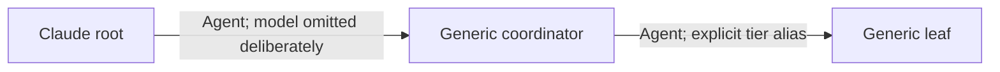

# Claude Subagent Dispatch — Verified Reference

> **Status:** verified Phase p04 promotion input. Capability evidence was
> captured in a fresh canonical Claude Code session on 2026-07-11. Production
> workflow behavior remains p05 scope.

## Control Surfaces

| Surface            | Verified controls                           | Qualification                                                 |
| ------------------ | ------------------------------------------- | ------------------------------------------------------------- |
| Native `Agent`     | Agent type plus optional tier-alias model   | No effort parameter on this surface                           |
| Agent definition   | Default model in frontmatter                | Sits between explicit call selection and parent inheritance   |
| Workflow `agent()` | Agent type, model, and effort in schema     | Schema observed; no Workflow launch performed                 |
| `claude -p`        | Alias or full model ID plus CLI effort      | Exact dated model ID sentinel completed                       |
| Continuation       | Existing child handle through `SendMessage` | Resume preserves child context; a new Agent call starts fresh |

The live dispatch tool is named `Agent`. Agent definitions that grant `Task`
still receive the live `Agent` tool: a supplementary controlled probe confirmed
that `Task` is a recognized tool-grant alias. Unknown tool names are silently
dropped, so migrating the grant to `Agent` is robustness insurance, not a fix
for a current functional defect.

## Model Resolution

Native model resolution has three layers:

1. An explicit call model overrides the agent definition.
2. The agent-definition frontmatter model applies when present.
3. Otherwise the child inherits the parent/session model.

The canonical run exercised the third branch. A generic topology child launched
with no call model and no agent-definition default self-reported the same model
as the root. Omission is therefore a real inheritance path, not a neutral
placeholder.

## Native Topology

Generic depth-2 native dispatch is confirmed:

The depth-1 child materialized its own `Agent` tool and its explicit-model leaf
returned `OAT_CLAUDE_NESTED_SENTINEL_OK`.

This capability finding does not prove that `oat-phase-implementer` or
`oat-reviewer` will cooperate with arbitrary prompts. The pilot correctly saw a
production coordinator accept a launch and then return `NEEDS_CONTEXT` because
its role contract rejected diagnostic work. Phase p05 must test production
scope packets.

## Catalog Visibility

The nested model enum was present in the child's tool schema before its nested
launch. The nested agent-type catalog was not visible until after that first
nested call. OAT guidance must therefore:

- read the current native model enum before explicit model selection;
- use a known role selector from the active contract when a pre-call role list
  is unavailable;
- record when the role catalog becomes visible;
- avoid launching a diagnostic child solely to satisfy a universal
  pre-selection role-snapshot rule.

The root and nested catalogs matched in the canonical run, but they remain
independent observations. Do not promote their dated contents as a permanent
inventory.

## Surface-Aware Selection

Native `Agent` accepts tier aliases, not full dated model IDs. `claude -p`
accepts a full model ID. Therefore:

- for native dispatch, select one exact alias from the live native enum;
- for a CLI child that requires a full ID or explicit effort, select the CLI
  route before launch;
- record `modelSelectorGranularity` as `tier-alias` or `exact-model-id`;
- never claim that a resolver-returned full ID can pass unchanged through the
  native enum;
- never omit the model for a leaf unless inheritance is the deliberate policy.

Native effort is `not-exposed`, not globally `not-applicable`. Claude CLI and
Workflow both expose effort controls on different surfaces.

## Evidence Semantics

- Native acceptance returned agent IDs and usage records.
- The inherited topology child self-reported runtime identity.
- The explicit native leaf did not report runtime identity but still completed.
- The CLI result identified the exact model through `modelUsage`.
- Continuation handles were observed but not exercised.

Keep configured selection, acceptance, child outcome, runtime identity, and
continuation separate.

## Open Boundaries

Phase p05 still owns:

- production coordinator-to-worker behavior;
- planning and implementation review routing;
- review-ceiling enforcement;
- write-capable worker permissions;
- variation by named production role or parent model.

## Evidence

- [Canonical run](../verification/runs/claude/2026-07-11T205550Z/report.md)
- [Supplementary tool-grant probe](../verification/runs/claude/2026-07-11T210629Z/report.md)
- [Frozen input draft](../../dispatching-subagents-claude-draft.md)
