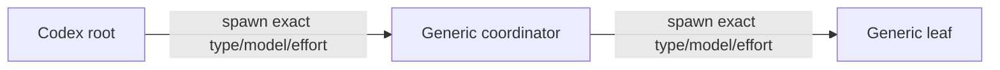

# Codex Subagent Dispatch — Verified Reference

> **Status:** verified Phase p04 promotion input. Capability evidence was
> captured in a fresh canonical Codex session on 2026-07-11. Dated catalogs are
> evidence, not a stable inventory.

## Control Axes

Codex exposes independent native controls for:

- registered agent type;
- model selector;
- reasoning effort;
- service tier;
- forked context;
- maximum nesting depth;
- sandbox and writable roots.

Do not collapse these controls into one role/model field. A materialized role
may package defaults, but an invocation record must still preserve the role,
model, effort, service tier, and fork behavior that were requested.

## Native Topology

Generic depth-2 native dispatch is confirmed:



The canonical run observed separate root and nested schemas, accepted an
explicit coordinator payload, and received
`OAT_CODEX_NESTED_SENTINEL_OK` from the depth-2 leaf.

The effective `agents.max_depth` was 2 for that run, which was sufficient for
root → coordinator → leaf. Treat the value as configuration evidence and read
it for each environment; do not promote 2 as a global default.

## Exact Native Selection

The canonical generic topology launch used explicit agent type, model, and
effort controls. The live schema required the self-contained `fork_turns: none`
mode for the tested exact override. Full-history forks and exact overrides must
not be assumed compatible.

Selection guidance:

1. Read the live registered agent types and model/effort selectors.
2. Read the effective depth configuration.
3. Choose a complete exact payload from the configured candidates and current
   schema.
4. Use the fork mode the live schema permits for explicit overrides.
5. Record materialized configuration and live schema as distinct sources when
   both exist.

Root and nested catalogs matched in this run, but they were observed
independently. Preserve the run packet for the dated arrays instead of copying
them into durable guidance.

## CLI Route

An independent read-only `codex exec` child completed with explicit model and
reasoning effort and returned `OAT_CODEX_CLI_SENTINEL_OK`.

The verified conceptual route is:

```sh
codex exec \
  --ephemeral \
  --sandbox read-only \
  --model '<model>' \
  -c 'model_reasoning_effort="<effort>"' \
  '<self-contained bounded prompt>'
```

The exact flags must follow current CLI help and the caller's authorization
boundary. A CLI control declared before native launch is an independent
capability check, not fallback.

## Acceptance and Identity

Both accepted native launches completed without runtime model identity. The
CLI result also did not independently corroborate runtime identity. This
confirms that:

- launcher acceptance is configured-invocation evidence;
- runtime identity is optional corroboration;
- diagnostics such as nonfatal MCP authorization messages remain separate from
  launch status and child outcome.

## Depth and Write Authority

Nesting depth and filesystem authority are orthogonal. Increasing
`agents.max_depth` does not grant access to worktree files, shared Git metadata,
managed agent assets, or generated-output directories.

Before a write-capable worker launch, the production workflow must verify the
minimum scoped writable roots required by the task. The canonical capability
run inspected the separate controls but did not exercise writes.

## Open Boundaries

Phase p05 still owns:

- production `oat-phase-implementer` and reviewer behavior;
- write-capable worker execution;
- review-ceiling and gate policy;
- catalog stability across provider releases or materialization changes.

## Evidence

- [Canonical run](../verification/runs/codex/2026-07-11T205116Z/report.md)
- [Frozen input draft](../../dispatching-subagents-codex-draft.md)
