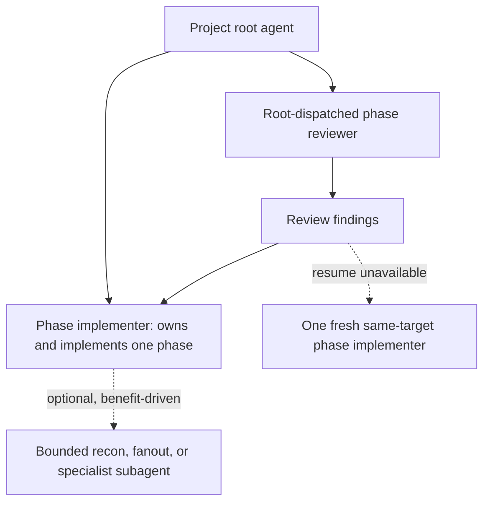

# Revised Plan: Restore Root-Owned Phase-Agent Orchestration

## Review Status

This is a reviewable proposal, not yet part of the executable `plan.md`.
After review and adjustment, its accepted work will be incorporated into the
existing Phase 5 as new tasks.

## Why Revise the Topology

The automated Codex `implement` smoke run passed all nine assertions, proving
that the mandatory three-tier topology is functionally correct:

```text
root → phase coordinator → task worker
                         → phase reviewer
```

It took **38 minutes 22 seconds** (`2,302,342 ms`) to execute five trivial task
edits. The edits themselves took seconds; most elapsed time came from nested
launches, capacity contention, repeated selection and verification, and
coordinator ceremony.

The preferred topology restores the previously effective phase-agent model
without reverting the dispatch, gate, evidence, bootstrap, and smoke hardening
completed since then.

## Target Topology



### Ownership

- The root resolves and launches one exact phase implementer under the
  project or phase ceiling.
- The phase implementer directly executes all tasks in dependency order.
- The root independently resolves and launches the phase reviewer.
- Review findings return to the original phase implementer when its handle can
  be resumed.
- If that handle is unavailable after successful phase completion, the root may
  launch one fresh phase implementer with the same target, phase context, and
  bounded findings.

### Optional Third Tier

Nested dispatch is optional and justified per use, not mandatory per task. A
phase implementer may launch a bounded child when there is a clear benefit,
including:

- read-only reconnaissance;
- independent analysis lanes;
- safely isolated fanout;
- a genuinely specialized implementation task.

Every optional launch still flows through
`oat-project-dispatch-subagents` → `oat-dispatch-subagents` and records its
selection, exact payload, launch acceptance, and outcome.

Optional dispatch must preserve these guardrails:

- bounded objective and authority;
- explicit file or read scope;
- safe write isolation for concurrent writers;
- exact target at or below the phase ceiling;
- no silent takeover of the same scope after an accepted child failure;
- no widening of plan order, checkpoints, or phase authority.

## Preserved Invariants

The revision does not weaken:

- one verified commit per planned task;
- task file boundaries and verification commands;
- phase-wide integration verification;
- plan-declared parallel phase worktrees and ordered fan-in;
- root-owned lifecycle bookkeeping and HiLL checkpoints;
- full-information dispatch selection and mismatch advisories;
- launcher-owned configured-invocation evidence;
- runtime identity as corroboration only;
- accepted-launch terminality and pre-start rejection rules;
- `invalid-run-abort`;
- independent gate targets, liveness telemetry, and fail-closed gates;
- repository-defined worktree bootstrap;
- deterministic and live smoke evidence.

## Deliberately Unchanged Substrate

This is primarily a workflow-prose, producer-topology, and assertion change.
No behavioral or schema changes are planned for:

- `oat-dispatch-subagents`;
- dispatch-ceiling resolution inputs or outputs;
- worktree creation, bootstrap, ownership journaling, or cleanup;
- gate execution or gate artifacts;
- the three-layer evidence model;
- smoke evidence collection and report publication;
- task IDs, task commits, fixture logs, or Git fan-in evidence.

Codex `agents.max_depth >= 2` remains the managed readiness floor so optional
third-tier work is available. The workflow stops requiring that third tier for
every ordinary task.

Fix continuity uses the generic dispatch record's existing `request_id` and
`continuation_events`. This revision does not introduce a dispatch schema v2.

## Proposed Work

### 1. Preserve the Measured Baseline

- Preserve the passed Codex report as explicitly labeled historical
  three-tier evidence.
- Record the 38m22s elapsed time and launch topology in project implementation
  history.
- Keep the successful plan-review and negative-control reports unchanged.
- Do not create a backlog item for this revision.

### 2. Rewrite the Core Implementation Contracts

#### `oat-phase-implementer`

Convert Phase Scope from coordinator-only behavior to direct phase
implementation:

1. Read the assigned phase artifacts.
2. Execute tasks in dependency order.
3. Before each task, record the pre-task HEAD.
4. Apply only the task's declared file boundary.
5. Run task verification.
6. Create exactly one task commit.
7. Verify the commit, changed files, and clean worktree.
8. Run phase-wide verification.
9. Return a compact phase report with task commits and verification.

Delete the mandatory per-task worker protocol rather than retaining it as a
dormant alternate path. Keep optional bounded child dispatch as a separate,
explicitly guarded capability.

Remove phase reviewer ownership from this agent.

#### `oat-project-implement`

Change the root phase loop to:

1. Resolve and dispatch one phase implementer.
2. Verify its phase report and commit range.
3. Resolve and dispatch the phase reviewer independently.
4. Parse the reviewer artifact and verdict.
5. On blocking findings, resume the original phase implementer with bounded
   findings.
6. If resume is unavailable after successful phase completion, launch one
   fresh same-target phase implementer for that new fix scope.
7. Re-run the root-owned reviewer until pass or retry exhaustion.
8. Perform bookkeeping, optional phase gate, checkpoint handling, and fan-in.

Parallel groups retain one worktree and one phase implementer per phase.

Update resumption and dry-run contracts to reflect root-owned reviewer handles,
phase-agent continuation, and optional nested capability.

### 3. Adjust the Project Dispatch Adapter

Update the lifecycle role table:

- **Phase implementer** → generic `worker` at phase scope; owns direct phase
  production.
- **Optional task/recon/specialist child** → generic `worker` or `recon`;
  launched only under the guarded optional-third-tier policy.
- **Implementation reviewer** → root-dispatched `reviewer` at the configured
  review ceiling.
- **Gates** → unchanged independent reviewer routes.

Resolve the phase implementer once per phase using `--report-scope pNN`.
Per-task resolution occurs only when an optional task child is actually used.

Remove the special contract requiring a below-ceiling nested coordinator to
select its own CLI reviewer; the root now owns that route.

### 4. Rewrite Smoke Producers and Assertions

Update the deterministic provider and live protocols to produce:

- one accepted phase-implementer launch per phase;
- one root-owned phase-reviewer launch per phase;
- zero required task-worker launches;
- optional nested launch records only when used;
- the same five task commits and fixture markers;
- unchanged parallel worktrees, fan-in, final gate, and cleanup.

Update the `implement` evidence profile:

- replace “one accepted launch per task” with “one accepted phase implementer
  per phase”;
- apply exact-target and runtime-identity checks to phase implementers and
  phase reviewers;
- continue proving each task through its exact commit, marker, and file
  boundary;
- validate every optional nested dispatch when present without requiring one;
- keep parallel isolation, fan-in, gate corroboration, and review durability;
- retarget the accepted-failure negative control to phase implementation or an
  explicitly optional child scope.

Keep the dispatch record schema and collector unchanged.

### 5. Reconcile Documentation

Incorporate documentation commit `fe29809c`, then revise its old-topology
language before shipping:

- `workflows/projects/orchestration-model.md`;
- `workflows/projects/implementation-execution.md`;
- `workflows/projects/review-flavors.md`;
- dispatch-ceiling and provider-sync pages;
- configuration guidance;
- smoke-testing runbook and diagrams.

The documentation should emphasize that the topology returned to root-owned
phase orchestration while retaining the hardened engine/adapter and evidence
substrate.

### 6. Version, Sync, and Release

- Bump each changed canonical skill version once.
- Bump the changed canonical phase-agent version.
- Refresh provider views with `oat sync --scope all`.
- Apply the required five-package lockstep version bump.
- Regenerate documentation navigation/indexes.
- Run `pnpm release:validate`.

## Verification Order

1. Skill and agent contract tests.
2. Review and post-implementation sequence contract tests.
3. Deterministic smoke tests and failure controls.
4. Full smoke/evidence test suites.
5. One automated Codex `implement` run using the revised topology.
6. Compare launch counts and elapsed time against the 38m22s baseline.
7. Proceed to operator-driven runs only after the revised automated run passes.
8. Run workspace lint, format, type-check, build, tests, and release validation.

## Acceptance Criteria

- A phase implementer directly completes every task in its assigned phase.
- Each task still has exactly one verified bounded commit.
- Root dispatches exactly one accepted reviewer per review round.
- Blocking findings return to the original phase handle when resumable.
- A resume-unavailable recovery uses at most one fresh same-target phase
  implementer and is recorded as a new fix scope.
- Optional third-tier dispatch is absent by default and fully evidenced when
  used.
- Parallel phase isolation and fan-in remain unchanged.
- Deterministic smoke passes in seconds.
- Live Codex `implement` passes with materially fewer launches and materially
  lower elapsed time than 38m22s.
- Existing gate, bootstrap, cleanup, evidence, and plan-review behavior remains
  green.

## Expected Primary Files

- `.agents/agents/oat-phase-implementer.md`
- `.agents/skills/oat-project-implement/SKILL.md`
- `.agents/skills/oat-project-implement/references/phase-execution.md`
- `.agents/skills/oat-project-implement/references/plan-and-resume.md`
- `.agents/skills/oat-project-implement/references/dispatch-and-dry-run.md`
- `.agents/skills/oat-project-dispatch-subagents/SKILL.md`
- `.agents/skills/oat-project-plan-writing/SKILL.md`
- `packages/cli/src/validation/skills.test.ts`
- `packages/cli/src/commands/init/tools/shared/post-implement-sequence-contracts.test.ts`
- `tools/smoke/CONTRACT.md`
- `tools/smoke/protocols/*.md`
- `tools/smoke/deterministic/provider.mjs`
- `tools/smoke/deterministic/deterministic.test.mjs`
- `tools/smoke/evidence/assertions.mjs`
- `tools/smoke/evidence/assertions.test.mjs`
- `tools/smoke/runner/drive.mjs`
- `tools/smoke/runner/drive.test.mjs`
- topology-dependent OAT documentation pages

## Explicit Non-Goals

- Rewriting the generic dispatch engine.
- Replacing dispatch ladders or ceilings.
- Lowering gate independence.
- Changing worktree or dependency-management policy.
- Changing the smoke evidence schema.
- Removing optional third-tier capability.
- Adding new dispatched review rounds. Inline between-task self-checks and the
  phase-wide self-review from the proven v1.0.3 contract are preserved.
- Creating a backlog item.

## Fable Review (2026-07-12)

Overall verdict: **approve with adjustments**. The proposal matches the
recon-verified blast radius (no CLI changes, prose + assertions), correctly
preserves the substrate, and the delete-not-demote call on the per-task worker
protocol is right — dormant protocol is drift bait. Decision context is
recorded as `DR-260712-restore-phase-agent` in `.oat/repo/reference/decisions/`;
this plan and that record should stay consistent. Specific feedback:

1. **Pin the restoration baseline to history.** Section 2 re-derives the
   phase-implementer contract as a 9-step list. Instead, restore from the
   proven text: `git show 3c244937:.agents/agents/oat-phase-implementer.md`
   (v1.0.3, last commit before PR #132 introduced the coordinator mode). Use
   v1.0.3 as the base and layer in only enumerated substrate additions
   (two-skill dispatch load, dispatch stamps/records, parallel-group worktree
   awareness and base-mismatch gate, the guarded optional-third-tier clause).
   The diff against v1.0.3 becomes the review surface — far easier to verify
   "baseline + additions" than a fresh 300-line contract.

2. **Resolve the self-review frequency conflict.** v1.0.3 included inline
   self-review _between tasks_ (its Step 3) plus phase-wide self-review (its
   Step 4). The non-goal "changing self-review frequency from once per phase"
   contradicts restoring that text. Recommendation: keep v1.0.3's between-task
   self-checks — they are inline quality hygiene in the same context, cost no
   dispatch and no records, and were part of why the old model worked. Reword
   the non-goal to "no new dispatched review rounds."

3. **Make fresh-launch continuity explicit in evidence.** The
   resume-unavailable recovery (one fresh same-target implementer) is sound.
   Require the fresh launch's dispatch record to reference the original
   `request_id` via the existing `continuation_events` linkage so evidence
   readers can reconstruct the chain without inference. No schema change —
   just a stated convention.

4. **Docs ownership and split.** Section 5's page list is broader than the
   docs branch (`fe29809c` on `oat-project-fixture-2`) — good catch on
   `implementation-execution.md` and the config guidance. Ownership (user
   decision): the peer session executing this revision also owns the docs
   alignment. Merge branch `oat-project-fixture-2` (worktree
   `/Users/tstang/orca/workspaces/open-agent-toolkit/oat-project-fixture-2`,
   single docs commit `fe29809c` atop this branch's `a67bd378`) into
   `oat-project-fixture`, then revise topology language in the merged pages.
   Revision map: `orchestration-model.md` — roles/boundaries table, layering
   diagram, and worker-per-task language (its terminality section already
   documents `invalid-run-abort`); `review-flavors.md` — implementation
   self-review moves from coordinator-owned to root-dispatched;
   `implementation-execution.md` — pre-existing page, coordinator/tier
   language; `smoke-testing.md` and `evidence-layers.md` — light touch
   (per-task launch phrasing). `programmatic-execution.md` and the AGENTS.md
   project-docs-rule softening (also in `fe29809c`) need no topology changes.
   Nav `## Contents` entries are already done in that commit. Do not
   hand-edit `apps/oat-docs/index.md`; regeneration stays deferred to release
   validation.

5. **Timing comparison should be machine-readable, eventually.** Verification
   step 6 compares elapsed time against the 38m22s baseline by stopwatch. Two
   nearly-free telemetry wins exist (ownership journal already stamps
   `registeredAt` — add a completion timestamp; gate liveness already computes
   elapsed/idle — persist it in the result instead of discarding after
   streaming). Fine to keep out of this revision's scope, but record them as
   named follow-ups so the next timing debate starts from data.

6. **Plan-writing skill note.** `oat-project-plan-writing` appears correctly
   in Expected Primary Files — the reconciliation just added the below-ceiling
   nested-coordinator reviewer rule that Section 3 removes. Same-day churn on
   that language is fine; just bump the skill version once for the final PR
   diff per repo policy.

## User Decision and Revised Scope (2026-07-12)

Accepted path, per user direction:

1. **Incorporate** this document's accepted work into the existing
   `oat-project-fixture` project as new tasks (recovery-task pattern; the
   peer session owns `plan.md` numbering).
2. **Execute** the contract restoration and adapter changes (Sections 2-3,
   with review feedback items 1-3 applied).
3. **Re-align the smoke producers and assertions** with the restored
   topology (Section 4).
4. **Descope extensive live smoke runs from the project.** Exactly **one**
   automated live `implement` run (Codex) validates the revised topology and
   provides the timing comparison against the 38m22s baseline. The remaining
   multi-runtime live runs — Claude, Cursor IDE, Cursor CLI, cross-harness
   evidence summary, and additional negative controls — are **removed from
   this project's ship gate** and become post-ship follow-up executed as
   user-driven operator runs. Existing plan tasks for those runs (p05-t03,
   p05-t04, p05-t05, and the live portions of p05-t06) should be marked
   descoped/deferred accordingly, with the operator runbook
   (`contributing/smoke-testing.md` on the docs branch) as the execution
   guide.
5. **Ship the project**: docs reconciliation (Section 5), version/sync/release
   (Section 6), summary, and final PR — without waiting on the deferred
   operator runs.

## Docs Reference Material (authored, ready to merge)

The p06-t01 documentation corpus is committed and validation-green in a
sibling worktree. Merge it, then revise topology language per review item 4.

- **Worktree:** `/Users/tstang/orca/workspaces/open-agent-toolkit/oat-project-fixture-2`
- **Branch:** `oat-project-fixture-2` (based on this branch's `a67bd378`;
  merges clean with `git merge oat-project-fixture-2`)
- **Docs commit:** `fe29809c` — `docs(p06-t01): add orchestration docs and smoke runbook`
- **Contents (8 files):**
  - `apps/oat-docs/docs/workflows/projects/orchestration-model.md` (new)
  - `apps/oat-docs/docs/workflows/projects/review-flavors.md` (new)
  - `apps/oat-docs/docs/workflows/projects/evidence-layers.md` (new)
  - `apps/oat-docs/docs/workflows/projects/programmatic-execution.md` (new)
  - `apps/oat-docs/docs/contributing/smoke-testing.md` (new)
  - `apps/oat-docs/docs/workflows/projects/index.md` (nav `## Contents` updated)
  - `apps/oat-docs/docs/contributing/index.md` (nav `## Contents` updated)
  - `apps/oat-docs/AGENTS.md` (project-docs rule softened per p06-t01)
- **Validation at commit time:** `pnpm build:docs` green, `pnpm lint` green,
  oxfmt clean, markdownlint 0 errors across all docs, all cross-links verified.
- **Deliberate scoping:** pages contain no live-run outcomes, no topology
  conclusions from live evidence, and no package version numbers.
  `apps/oat-docs/index.md` regeneration is deferred to release validation and
  must not be hand-edited.
