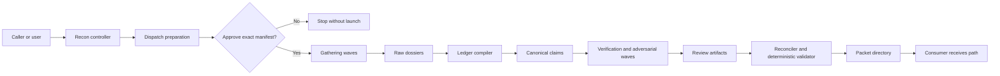

# Design: recon-skill

## Overview

`recon` is a provider-neutral Agent Skills workflow that compiles a bounded
investigation into a durable evidence-packet directory. Its main instructions
own request completion, rigor-profile expansion, model and execution-manifest
approval, lane decomposition, selectively blind pass boundaries, and final
handoff. Provider catalogs, model selection, dispatch mechanics, launch
receipts, and recovery remain delegated to the existing
`oat-dispatch-subagents` contract instead of being reimplemented.

The skill uses an artifact-first context firewall. Reconnaissance workers write
bounded dossiers into `raw/`; a compiler constructs canonical `claims.json`;
independent validators and adversarial workers write review results without
receiving prior reasoning; and a final assembler emits compact `packet.md` from
the validated ledger. The parent or expensive downstream consumer receives the
packet path and compact completion summary, not every worker transcript.

The initial release is standalone and capability-based. It can use repository,
git, read-only command, URL, and connected-system evidence when those sources
are available, but it modifies only its confirmed packet directory. A small set
of bundled, deterministic helpers validates versioned JSON artifacts and
renders the consumer view so packet structure and assurance rules do not depend
solely on prose compliance. Automatic integration into project discovery and
the broader research skill family remains deferred to the recorded backlog
items.

## Architecture

### System Context

`recon` is the run controller and packet contract, not a new provider
dispatcher. It accepts a bounded investigation, resolves a packet destination,
expands the requested rigor profile into homogeneous worker waves, obtains
approval for one exact execution manifest, and advances the packet through
gathering, synthesis, review, and publication.



The controller passes paths and bounded task contracts between stages. It does
not load every raw dossier into the parent conversation. Workers consume only
the artifacts their role requires, preserving the context firewall and the
selective-blind review boundaries.

### Dispatch Preparation and Approval

The existing `oat-dispatch-subagents` contract remains the authority for live
catalog observation, provider-neutral model selection, exact launch controls,
acceptance evidence, and recovery. It needs one backwards-compatible
selection-only operation for recon:

1. `prepare` validates a homogeneous wave request, observes the live launch
   context, and returns a no-launch dispatch record.
2. `recon` combines the prepared records into a run-level execution manifest
   containing the exact provider, model, effort, reasoning mode, service tier,
   route, role, lane counts, concurrency, authority, deadlines, and retry caps.
3. The user approves that manifest once before any worker starts.
4. `execute` accepts only the approval-bound prepared record. If an exact axis
   or relevant catalog fact has materially changed, it returns for reapproval
   instead of substituting a model, effort, route, or provider.

All waves in a run use the same approved model and effort. Profiles may change
lane count and pass topology, but they do not silently raise model cost. A
different model or effort requires a new manifest and explicit approval.

### Artifact Pipeline and Isolation

The packet directory is created during preflight, but `packet.md` is published
last. Each worker or wave owns a unique output path; no two workers concurrently
edit the ledger, manifest, or consumer packet. Stage transitions consume
versioned artifacts and record their hashes so a later pass can prove which
inputs it reviewed.

- Mapping and gathering lanes write bounded dossiers under `raw/`.
- A synthesis lane compiles dossiers into provisional canonical claims.
- Mechanical validation checks schemas, source reachability, and locator shape.
- Standard and thorough profiles add selectively blind semantic verification,
  adversarial challenge, coverage review, and—in thorough mode—redundant
  independent passes and contradiction resolution.
- A reconciliation lane applies review dispositions to the canonical ledger.
- Deterministic helpers validate the complete directory and render `packet.md`
  from the ledger and manifest.

The manifest records the requested profile, achieved profile, source
capabilities, dispatch evidence, stage outcomes, and incomplete work. A valid
partial run can therefore publish an honest packet without claiming assurance
from passes that did not complete.

### Repository Placement

The provider-neutral skill lives at `.agents/skills/recon/` with a lean
`SKILL.md`, focused references for packet and worker contracts, deterministic
validation/rendering scripts, and fixtures. A single canonical companion agent
at `.agents/agents/recon-worker.md` provides the common worker invariants; pass
roles remain assignment modes rather than separate agents or nested skills.
Both assets are distributed through the existing research tool pack, which
retains user- and project-scope installation and declares the utility-owned
`oat-dispatch-subagents` and `subagent-orchestration` skills as dependencies.

The selection-only contract is added to `oat-dispatch-subagents` and its record
schema rather than duplicated inside `recon`. The utility pack retains
ownership of both dispatch dependencies; research installation must reconcile
them without duplicating ownership or removing an independently installed
utility copy. No first-release changes are made to the core pack, project
discovery, quick start, `analyze`, `deep-research`, or other consumers; those
automatic integrations remain separate backlog work.

## Component Design

### Recon Controller

The main `SKILL.md` is the only user- and caller-facing controller. It completes
a request from the supplied objective, scope, context, profile, and output
override; asks only for information required to run safely; and owns all user
interaction. It generates the run identifier, invokes preflight, prepares the
approval manifest, sequences stages, evaluates publication eligibility, and
returns the final packet path with a compact status summary.

The controller never performs provider-specific model selection or launch
construction. It also avoids reading raw dossiers unless a structural failure
requires a targeted diagnosis.

### Request, Destination, and Source Preflight

Preflight normalizes the bounded question and decides the packet destination
using explicit override, project evidence directory, repository evidence
directory, then caller-approved fallback order. It refuses a destination that
would escape or overwrite an existing run directory.

It inventories source capabilities without mutating them, records unavailable
sources, and pins the observable evidence boundary. Repository sources record
revision, dirty state, relevant content hashes, and observation time; URLs and
connected systems record stable identifiers, retrieval time, and available
locator semantics. Preflight creates the directory skeleton and initial
manifest, but not `packet.md`.

### Profile and Lane Planner

The planner expands `quick`, `standard`, or `thorough` into a pass graph and
partitions the declared scope into non-overlapping lanes. Mechanical inventory
drives the initial lane count. The approval manifest records exact planned
lanes plus explicit caps for conditional work such as contradiction resolution;
the controller cannot exceed that envelope without reapproval.

All worker passes share the approved model and effort. A profile changes
redundancy, review topology, and maximum concurrency—not the model tier.

### Dispatch Approval Adapter

This adapter supplies bounded homogeneous-wave requests to the new
`oat-dispatch-subagents` `prepare` operation and assembles the returned
selection evidence into the run-level approval manifest. After approval it
submits only approval-bound records to `execute`, stores launch and outcome
receipts under the packet directory, and stops for reapproval when a material
dispatch axis changes.

The preferred role selector is the globally installed `recon-worker`. If a
provider cannot resolve that definition, a generic role with the complete
worker contract may be prepared instead; because the role selector is part of
the manifest, this fallback is visible before approval rather than occurring
after launch.

### Recon Worker

`.agents/agents/recon-worker.md` defines the invariants shared by every lane:
read only assigned inputs, write only the assigned artifact, preserve locators,
emit the requested schema, surface uncertainty and contradictions, never
interact with the user, and never launch another agent. The task assignment
selects one mode:

- `map` or `gather`: inspect an isolated source partition and write a raw
  dossier.
- `compile`: convert designated dossiers into provisional canonical claims.
- `verify`: reopen cited sources and test claims without reading gatherer
  reasoning.
- `adversary`: seek counterevidence, unsupported inference, and missing
  alternatives without reading prior review conclusions.
- `coverage`: compare the requested scope and questions with ledger coverage.
- `reconcile`: apply review dispositions and contradiction outcomes to a new
  ledger version without inventing evidence.

Multiple instances may run concurrently only when their input and output paths
do not overlap.

### Packet Workspace and Deterministic Helpers

The workspace manager owns directory creation, unique stage paths, artifact
hashing, and promotion of validated stage outputs. Workers never update shared
JSON in place. The controller or helper promotes a complete candidate to the
next canonical version after schema validation.

Bundled scripts provide three deterministic operations:

- Validate individual dossiers, claims, reviews, and manifests against their
  versioned contracts.
- Verify artifact references, hashes, allowed state transitions, and the
  requested-versus-achieved assurance rules.
- Render `packet.md` from the final canonical ledger and manifest, then publish
  it atomically only when the packet passes structural validation.

### Completion and Handoff

The handoff reports the packet directory, requested and achieved profiles,
claim-state counts, unresolved gaps, failed or omitted passes, and whether the
packet is complete or partial. The normal consumer contract is the directory
path. Raw dossier contents and worker transcripts are not copied into the
parent response.

## Data Models

### Packet Directory Contract

Every structurally publishable run has the same top-level shape:

```text
<topic>-<run-id>/
├── packet.md
├── manifest.json
├── claims.json
├── reviews/
│   ├── locator-validation.json
│   ├── semantic/
│   ├── adversarial/
│   ├── coverage/
│   └── reconciliation.json
└── raw/
    ├── dossiers/
    ├── drafts/
    ├── dispatch/
    └── failure.json          # only when a stage fails
```

`manifest.json` and `claims.json` are the canonical machine-readable
interfaces. `packet.md` is a deterministic consumer view of those files.
`reviews/` contains compact assurance evidence. `raw/` contains worker-facing
intermediates and is not part of the normal consumption path. A structural
failure may leave `manifest.json` and `raw/failure.json`, but it must not leave
a misleading `packet.md`.

All JSON artifacts carry `kind` and integer `schemaVersion` fields. Run, wave,
lane, source, evidence, claim, review, and artifact identifiers are stable
within a packet. Canonical artifacts record the path and SHA-256 digest of
their direct inputs.

### Packet Manifest

The manifest is the run and provenance index:

```ts
interface PacketManifest {
  kind: 'recon.packet-manifest';
  schemaVersion: 1;
  run: {
    id: string;
    topic: string;
    status:
      | 'preparing'
      | 'awaiting-approval'
      | 'running'
      | 'complete'
      | 'partial'
      | 'failed';
    requestedProfile: 'quick' | 'standard' | 'thorough';
    achievedProfile: 'quick' | 'standard' | 'thorough' | null;
    createdAt: string;
    updatedAt: string;
  };
  request: ReconRequest;
  sources: SourceDescriptor[];
  execution: ExecutionEnvelope;
  stages: StageResult[];
  artifacts: ArtifactReference[];
  gaps: Gap[];
}
```

`ReconRequest` stores the objective, explicit questions, included and excluded
scope, caller context references, selected profile, and confirmed output path.
It does not copy large caller content when a stable path or resource identifier
is available.

`ExecutionEnvelope` references the prepared dispatch records and records the
exact selected provider, model, effort, reasoning mode, service tier, route,
role selector, planned lanes, conditional lane caps, concurrency, authority,
deadlines, and retry policy. Approval stores the SHA-256 fingerprint of the
canonical envelope and its approval time. Execution is valid only while that
fingerprint still matches; dispatch receipts are separate immutable artifacts
referenced by path and digest.

### Sources and Evidence Locators

Each `SourceDescriptor` declares a stable source ID, source kind, availability,
authority boundary, observation time, and locator semantics. Repository
descriptors additionally preserve canonical root, revision, dirty state, and
relevant snapshot or content hashes.

Evidence is normalized into records in the claim ledger:

```ts
interface EvidenceRecord {
  id: string;
  sourceId: string;
  locator: EvidenceLocator;
  excerpt: string;
  observedAt: string;
  contentHash?: string;
  provenance: ArtifactReference;
}

type EvidenceLocator =
  | {
      kind: 'repository';
      path: string;
      revision: string;
      lineStart: number;
      lineEnd: number;
    }
  | {
      kind: 'file';
      path: string;
      lineStart?: number;
      lineEnd?: number;
    }
  | {
      kind: 'url';
      url: string;
      retrievedAt: string;
      fragment?: string;
    }
  | {
      kind: 'command-output';
      artifactPath: string;
      lineStart: number;
      lineEnd: number;
      commandDigest: string;
    }
  | {
      kind: 'connected-resource';
      system: string;
      resourceId: string;
      fieldOrSection?: string;
      retrievedAt: string;
    };
```

Repository and file locators resolve against their `SourceDescriptor`, allowing
the manifest to carry the canonical root while claims retain concise exact
paths and lines. Unsupported source types may be added only through a new
versioned locator variant, not an untyped string.

### Canonical Claim Ledger

`claims.json` contains both the synthesis and its auditable evidence graph:

```ts
interface ClaimLedger {
  kind: 'recon.claim-ledger';
  schemaVersion: 1;
  runId: string;
  revision: number;
  inputArtifacts: ArtifactReference[];
  synthesis: {
    answer: string;
    keyClaimIds: string[];
    caveats: string[];
    unresolvedQuestionIds: string[];
  };
  evidence: EvidenceRecord[];
  claims: Claim[];
  unresolvedQuestions: UnresolvedQuestion[];
}

interface Claim {
  id: string;
  statement: string;
  status:
    | 'provisional'
    | 'supported'
    | 'verified'
    | 'contested'
    | 'unresolved'
    | 'unsupported';
  evidence: Array<{
    evidenceId: string;
    relation: 'supports' | 'contradicts' | 'qualifies' | 'context';
  }>;
  qualifications: string[];
  reviewIds: string[];
  derivedFrom: ArtifactReference[];
}
```

Statuses are categorical, never numeric confidence scores:

- `provisional`: compiled but not yet mechanically validated.
- `supported`: evidence and locators validate, without completed independent
  semantic verification.
- `verified`: an independent semantic pass reopened the cited sources and
  affirmed the claim without unresolved material challenge.
- `contested`: credible counterevidence or incompatible interpretations remain.
- `unresolved`: available evidence cannot settle the claim.
- `unsupported`: the proposed claim lacks valid supporting evidence or failed
  verification.

Quick packets may reach `supported` but never `verified`. Standard and thorough
packets may reach `verified` only through recorded independent review. Review
workers propose dispositions; only reconciliation writes the next canonical
ledger revision.

### Raw Dossiers and Review Artifacts

A raw dossier records run, wave, lane, mode, assigned objective and scope,
allowed inputs, findings with evidence records, gaps, contradictions, and lane
outcome. It contains no global confidence score and cannot directly establish a
canonical claim state.

Each review artifact records its review kind, reviewer lane, permitted and
excluded inputs, digests of artifacts actually reviewed, completion status,
claim-level dispositions, newly discovered evidence, coverage findings, and
unresolved issues. The permitted/excluded input list is evidence that the
selective-blind contract was constructed correctly; it does not claim stronger
filesystem isolation than the provider supplied.

### Consumer Packet

The deterministic renderer produces `packet.md` with:

1. Run status and requested-versus-achieved profile.
2. The canonical synthesis answer.
3. Key claims with categorical state and compact exact locators.
4. Material contradictions and qualifications.
5. Unresolved questions and coverage gaps.
6. Failed or omitted passes and provenance instructions.

The packet links to `claims.json`, `manifest.json`, and relevant compact review
artifacts. It does not inline or require the raw dossiers.

## Error Handling

### Preflight and Approval Failures

Malformed requests, unsafe or pre-existing destinations, unresolved source
authority, and missing required dispatch capabilities fail before worker
launch. The run may retain an initial manifest and `raw/failure.json` for
diagnosis, but it does not publish `packet.md`. Missing optional sources are
recorded as capability gaps and reduce achievable coverage; a missing source
that makes the objective impossible fails the run.

An unapproved or changed execution envelope stays in `awaiting-approval` and
launches nothing. A pre-start dispatch rejection may be re-prepared within the
declared retry bound, but any changed model, effort, provider, route, role, or
approved execution cap requires a new fingerprint and approval. There is no
silent substitution.

### Worker and Stage Failures

Launch acceptance and worker outcome remain separate. After a child has
started, timeout, interruption, invalid output, or task failure does not
authorize a replacement child or alternate route. The controller may continue
the same accepted handle when the provider supports it; otherwise it records
the pass failure and determines whether the remaining successful stages can
produce an honest lower-assurance packet.

Every stage writes a candidate artifact to its unique path. Schema-invalid,
hash-mismatched, out-of-scope, or locator-invalid output remains under `raw/`
and is never promoted. A failed compiler or reconciler cannot overwrite the
last valid ledger revision. Conflicting writes, missing declared inputs, or an
artifact path escaping the packet directory are structural failures.

### Evidence Drift and Source Access

Workers never broaden permissions or request credentials to recover missing
evidence. Permission failures and unavailable connected systems are recorded
as gaps. If a repository revision, file hash, URL capture, or connected
resource changes between gathering and verification, affected evidence is
marked stale and its claims become `contested` or `unresolved`. Recapture is
allowed only when it fits the approved envelope; otherwise the run publishes a
partial packet or fails when no valid base remains.

Evidence excerpts are minimal and redact detected credentials, tokens, and
secret values before persistence. Redaction is recorded without copying the
secret into an error, review, dispatch record, or packet. Source authority does
not imply permission to persist sensitive values in a repository-owned
destination.

### Publication Outcomes

The validator derives the achieved profile from completed required passes; a
worker or controller never declares it directly.

- `complete`: every required pass for the requested profile completed and the
  final manifest, ledger, reviews, references, and hashes validate.
- `partial`: the packet is structurally valid but the achieved profile is lower
  than requested or material coverage gaps remain. The manifest and packet
  identify every failed or omitted pass and downgraded claim.
- `failed`: no valid canonical ledger and manifest can be published. Raw
  diagnostics may remain, but `packet.md` is absent.

Rendering writes to a temporary sibling and promotes `packet.md` only after
final validation. If rendering or promotion fails, any previous consumer packet
is removed from publication eligibility rather than treated as current.

### Diagnostics

Errors identify run, stage, wave or lane, artifact path, categorical failure
code, and safe remediation. They do not copy full source material, worker
transcripts, credentials, or model reasoning. The completion summary reports
the terminal status and exact packet or failure-record path without claiming
that a failed external source or runtime was verified.

## Testing Strategy

### Static Skill and Agent Validation

Repository skill validation checks the `recon` frontmatter, required workflow
sections, progressive-disclosure references, version bump, and provider-neutral
language. Agent validation checks that `recon-worker` is canonical, contains
every supported mode, forbids nested dispatch and user interaction, and limits
inputs and outputs to assignment-declared paths.

Contract tests inspect the skill text for the model-approval boundary, same
model-and-effort invariant, context firewall, no-silent-substitution rule,
categorical claim states, profile ceilings, partial-publication semantics, and
directory-only handoff.

### Deterministic Helper Tests

Unit tests use checked-in fixtures and invoke the bundled scripts directly:

- Valid quick, standard, thorough, and honest-partial packet fixtures.
- Invalid schema versions, duplicate identifiers, missing artifact references,
  hash mismatches, path traversal, bad line ranges, and unsupported locator
  variants.
- Claim-state transition rules, including quick packets being unable to reach
  `verified` and contested evidence preventing verification.
- Canonical execution-envelope serialization, stable approval fingerprints,
  and tamper detection.
- Deterministic `packet.md` rendering from identical manifests and ledgers.
- Structural failures leaving no publishable `packet.md`.
- Redaction fixtures proving secret values do not reach persisted artifacts or
  diagnostics.

### Dispatch Contract Tests

`oat-dispatch-subagents` tests cover selection-only preparation without launch,
approval-bound execution, exact-axis comparison, catalog drift, pre-start
rejection, post-acceptance non-replacement, and homogeneous recon-wave records.
Tests assert that a changed provider, model, effort, route, role, service tier,
or execution cap returns for reapproval.

### Tool-Pack Lifecycle Tests

Research-pack tests verify that install, update, inventory, migration, removal,
and provider sync manage both `recon` and `recon-worker` at user and project
scope. Dependency tests ensure research installation resolves the utility-owned
dispatch pair without duplicating ownership, and that research removal
preserves independently installed utility assets. CLI help, pack documentation,
bundle inventory, and generated provider views must remain consistent.

### Workflow Integration Tests

End-to-end tests use fake dispatch records and fixture sources rather than live
model calls. Scenarios include:

- Quick repository recon producing supported claims with exact file and line
  locators.
- Standard recon producing independently verified claims.
- Thorough recon resolving redundant findings and retaining a genuine
  contradiction as contested.
- Missing optional sources, worker failure, and source drift producing an
  honest partial packet.
- Unavailable `recon-worker` preparing a visible generic-role fallback before
  approval.
- Dispatch-axis drift blocking execution pending reapproval.
- Invalid compiler or review output remaining quarantined while the last valid
  ledger survives.
- Structural failure producing a failure record and no consumer packet.
- The parent handoff returning only the directory path and compact status, with
  no raw dossier contents.

A provider smoke test may exercise one real approved run per supported harness,
but deterministic fixtures remain the CI correctness boundary. The repository's
documented skill validation, skill tests, lint, formatting, release validation,
and build gates run before completion.

## Open Questions

None. Packet schemas, artifact exchange, agent placement, pack ownership,
dispatch approval, and first-release integration boundaries are resolved above.
