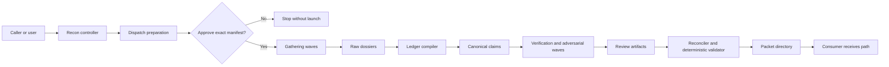

# Design: recon-skill

## Overview

`recon` is a provider-neutral Agent Skills workflow that compiles a bounded
investigation into a durable evidence-packet directory. Its main instructions
own request completion, rigor-profile expansion, model and execution-manifest
approval, lane decomposition, selectively blind pass boundaries, and final
handoff. Provider catalogs, model selection, dispatch mechanics, launch
receipts, and recovery remain delegated to the existing
`oat-dispatch-subagents` contract instead of being reimplemented.

The skill uses an artifact-first context firewall. Reconnaissance workers write
bounded dossiers into `raw/`; a compiler constructs canonical `claims.json`;
independent validators and adversarial workers write review results without
receiving prior reasoning; and a final assembler emits compact `packet.md` from
the validated ledger. The parent or expensive downstream consumer receives the
packet path and compact completion summary, not every worker transcript.

The initial release is standalone and capability-based. It can use repository,
git, read-only command, URL, and connected-system evidence when those sources
are available, but it modifies only its confirmed packet directory. A small set
of bundled, deterministic helpers validates versioned JSON artifacts and
renders the consumer view so packet structure and assurance rules do not depend
solely on prose compliance. Automatic integration into project discovery and
the broader research skill family remains deferred to the recorded backlog
items.

## Architecture

### System Context

`recon` is the run controller and packet contract, not a new provider
dispatcher. It accepts a bounded investigation, resolves a packet destination,
expands the requested rigor profile into homogeneous worker waves, obtains
approval for one exact execution manifest, and advances the packet through
gathering, synthesis, review, and publication.

The controller passes paths and bounded task contracts between stages. It does
not load every raw dossier into the parent conversation. Workers consume only
the artifacts their role requires, preserving the context firewall and the
selective-blind review boundaries.

### Dispatch Preparation and Approval

The existing `oat-dispatch-subagents` contract remains the authority for live
catalog observation, provider-neutral model selection, exact launch controls,
acceptance evidence, and recovery. It needs one backwards-compatible
selection-only operation for recon:

1. `prepare` validates a homogeneous wave request, observes the live launch
   context, and returns a no-launch dispatch record.
2. `recon` combines the prepared records into a run-level execution manifest
   containing the exact provider, model, effort, reasoning mode, service tier,
   route, role, lane counts, concurrency, authority, deadlines, and retry caps.
3. The user approves that manifest once before any worker starts.
4. `execute` accepts only the approval-bound prepared record. If an exact axis
   or relevant catalog fact has materially changed, it returns for reapproval
   instead of substituting a model, effort, route, or provider.

All waves in a run use the same approved model and effort. Profiles may change
lane count and pass topology, but they do not silently raise model cost. A
different model or effort requires a new manifest and explicit approval.

### Artifact Pipeline and Isolation

The packet directory is created during preflight, but `packet.md` is published
last. Each worker or wave owns a unique output path; no two workers concurrently
edit the ledger, manifest, or consumer packet. Stage transitions consume
versioned artifacts and record their hashes so a later pass can prove which
inputs it reviewed.

- Mapping and gathering lanes write bounded dossiers under `raw/`.
- A synthesis lane compiles dossiers into provisional canonical claims.
- Mechanical validation checks schemas, source reachability, and locator shape.
- Standard and thorough profiles add selectively blind semantic verification,
  adversarial challenge, coverage review, and—in thorough mode—redundant
  independent passes and contradiction resolution.
- A reconciliation lane applies review dispositions to the canonical ledger.
- Deterministic helpers validate the complete directory and render `packet.md`
  from the ledger and manifest.

The manifest records the requested profile, achieved profile, source
capabilities, dispatch evidence, stage outcomes, and incomplete work. A valid
partial run can therefore publish an honest packet without claiming assurance
from passes that did not complete.

### Repository Placement

The provider-neutral skill lives at `.agents/skills/recon/` with a lean
`SKILL.md`, focused references for packet and worker contracts, deterministic
validation/rendering scripts, and fixtures. A single canonical companion agent
at `.agents/agents/recon-worker.md` provides the common worker invariants; pass
roles remain assignment modes rather than separate agents or nested skills.
Both assets are distributed through the existing research tool pack, which
retains user- and project-scope installation and declares the utility-owned
`oat-dispatch-subagents` and `subagent-orchestration` skills as dependencies.

The selection-only contract is added to `oat-dispatch-subagents` and its record
schema rather than duplicated inside `recon`. The utility pack retains
ownership of both dispatch dependencies; research installation must reconcile
them without duplicating ownership or removing an independently installed
utility copy. No first-release changes are made to the core pack, project
discovery, quick start, `analyze`, `deep-research`, or other consumers; those
automatic integrations remain separate backlog work.

## Component Design

### Recon Controller

The main `SKILL.md` is the only user- and caller-facing controller. It completes
a request from the supplied objective, scope, context, profile, and output
override; asks only for information required to run safely; and owns all user
interaction. It generates the run identifier, invokes preflight, prepares the
approval manifest, sequences stages, evaluates publication eligibility, and
returns the final packet path with a compact status summary.

The controller never performs provider-specific model selection or launch
construction. It also avoids reading raw dossiers unless a structural failure
requires a targeted diagnosis.

### Request, Destination, and Source Preflight

Preflight normalizes the bounded question and decides the packet destination
using explicit override, project evidence directory, repository evidence
directory, then caller-approved fallback order. It refuses a destination that
would escape or overwrite an existing run directory.

It inventories source capabilities without mutating them, records unavailable
sources, and pins the observable evidence boundary. Repository sources record
revision, dirty state, relevant content hashes, and observation time; URLs and
connected systems record stable identifiers, retrieval time, and available
locator semantics. Preflight creates the directory skeleton and initial
manifest, but not `packet.md`.

### Profile and Lane Planner

The planner expands `quick`, `standard`, or `thorough` into a pass graph and
partitions the declared scope into non-overlapping lanes. Mechanical inventory
drives the initial lane count. The approval manifest records exact planned
lanes plus explicit caps for conditional work such as contradiction resolution;
the controller cannot exceed that envelope without reapproval.

All worker passes share the approved model and effort. A profile changes
redundancy, review topology, and maximum concurrency—not the model tier.

### Dispatch Approval Adapter

This adapter supplies bounded homogeneous-wave requests to the new
`oat-dispatch-subagents` `prepare` operation and assembles the returned
selection evidence into the run-level approval manifest. After approval it
submits only approval-bound records to `execute`, stores launch and outcome
receipts under the packet directory, and stops for reapproval when a material
dispatch axis changes.

The preferred role selector is the globally installed `recon-worker`. If a
provider cannot resolve that definition, a generic role with the complete
worker contract may be prepared instead; because the role selector is part of
the manifest, this fallback is visible before approval rather than occurring
after launch.

### Recon Worker

`.agents/agents/recon-worker.md` defines the invariants shared by every lane:
read only assigned inputs, write only the assigned artifact, preserve locators,
emit the requested schema, surface uncertainty and contradictions, never
interact with the user, and never launch another agent. The task assignment
selects one mode:

- `map` or `gather`: inspect an isolated source partition and write a raw
  dossier.
- `compile`: convert designated dossiers into provisional canonical claims.
- `verify`: reopen cited sources and test claims without reading gatherer
  reasoning.
- `adversary`: seek counterevidence, unsupported inference, and missing
  alternatives without reading prior review conclusions.
- `coverage`: compare the requested scope and questions with ledger coverage.
- `reconcile`: apply review dispositions and contradiction outcomes to a new
  ledger version without inventing evidence.

Multiple instances may run concurrently only when their input and output paths
do not overlap.

### Packet Workspace and Deterministic Helpers

The workspace manager owns directory creation, unique stage paths, artifact
hashing, and promotion of validated stage outputs. Workers never update shared
JSON in place. The controller or helper promotes a complete candidate to the
next canonical version after schema validation.

Bundled scripts provide three deterministic operations:

- Validate individual dossiers, claims, reviews, and manifests against their
  versioned contracts.
- Verify artifact references, hashes, allowed state transitions, and the
  requested-versus-achieved assurance rules.
- Render `packet.md` from the final canonical ledger and manifest, then publish
  it atomically only when the packet passes structural validation.

### Completion and Handoff

The handoff reports the packet directory, requested and achieved profiles,
claim-state counts, unresolved gaps, failed or omitted passes, and whether the
packet is complete or partial. The normal consumer contract is the directory
path. Raw dossier contents and worker transcripts are not copied into the
parent response.

## Data Models

_Pending collaborative review._

## Error Handling

_Pending collaborative review._

## Testing Strategy

_Pending collaborative review._

## Open Questions

- Confirm the packet schema and artifact exchange interfaces during this
  lightweight design.
