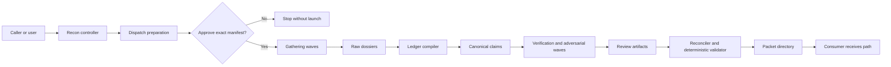

# Design: recon-skill

## Overview

`recon` is a provider-neutral Agent Skills workflow that compiles a bounded
investigation into a durable evidence-packet directory. Its main instructions
own request completion, rigor-profile expansion, model and execution-manifest
approval, lane decomposition, selectively blind pass boundaries, and final
handoff. Provider catalogs, model selection, dispatch mechanics, launch
receipts, and recovery remain delegated to the existing
`oat-dispatch-subagents` contract instead of being reimplemented.

The skill uses an artifact-first context firewall. Reconnaissance workers write
bounded dossiers into `raw/`; a compiler constructs canonical `claims.json`;
independent validators and adversarial workers write review results without
receiving prior reasoning; and a final assembler emits compact `packet.md` from
the validated ledger. The parent or expensive downstream consumer receives the
packet path and compact completion summary, not every worker transcript.

The initial release is standalone and capability-based. It can use repository,
git, read-only command, URL, and connected-system evidence when those sources
are available, but it modifies only its confirmed packet directory. A small set
of bundled, deterministic helpers validates versioned JSON artifacts and
renders the consumer view so packet structure and assurance rules do not depend
solely on prose compliance. Automatic integration into project discovery and
the broader research skill family remains deferred to the recorded backlog
items.

## Architecture

### System Context

`recon` is the run controller and packet contract, not a new provider
dispatcher. It accepts a bounded investigation, resolves a packet destination,
expands the requested rigor profile into homogeneous worker waves, obtains
approval for one exact execution manifest, and advances the packet through
gathering, synthesis, review, and publication.

The controller passes paths and bounded task contracts between stages. It does
not load every raw dossier into the parent conversation. Workers consume only
the artifacts their role requires, preserving the context firewall and the
selective-blind review boundaries.

### Dispatch Preparation and Approval

The existing `oat-dispatch-subagents` contract remains the authority for live
catalog observation, provider-neutral model selection, exact launch controls,
acceptance evidence, and recovery. It needs one backwards-compatible
selection-only operation for recon:

1. `prepare` validates a homogeneous wave request, observes the live launch
   context, and returns a no-launch dispatch record.
2. `recon` combines the prepared records into a run-level execution manifest
   containing the exact provider, model, effort, reasoning mode, service tier,
   route, role, lane counts, concurrency, authority, deadlines, and retry caps.
3. The user approves that manifest once before any worker starts.
4. `execute` accepts only the approval-bound prepared record. If an exact axis
   or relevant catalog fact has materially changed, it returns for reapproval
   instead of substituting a model, effort, route, or provider.

All waves in a run use the same approved model and effort. Profiles may change
lane count and pass topology, but they do not silently raise model cost. A
different model or effort requires a new manifest and explicit approval.

### Artifact Pipeline and Isolation

The packet directory is created during preflight, but `packet.md` is published
last. Each worker or wave owns a unique output path; no two workers concurrently
edit the ledger, manifest, or consumer packet. Stage transitions consume
versioned artifacts and record their hashes so a later pass can prove which
inputs it reviewed.

- Mapping and gathering lanes write bounded dossiers under `raw/`.
- A synthesis lane compiles dossiers into provisional canonical claims.
- Mechanical validation checks schemas, source reachability, and locator shape.
- Standard and thorough profiles add selectively blind semantic verification,
  adversarial challenge, coverage review, and—in thorough mode—redundant
  independent passes and contradiction resolution.
- A reconciliation lane applies review dispositions to the canonical ledger.
- Deterministic helpers validate the complete directory and render `packet.md`
  from the ledger and manifest.

The manifest records the requested profile, achieved profile, source
capabilities, dispatch evidence, stage outcomes, and incomplete work. A valid
partial run can therefore publish an honest packet without claiming assurance
from passes that did not complete.

### Repository Placement

The provider-neutral skill lives at `.agents/skills/recon/` with a lean
`SKILL.md`, focused references for packet and worker contracts, deterministic
validation/rendering scripts, and fixtures. It is distributed through the
existing research tool pack. The selection-only contract is added to
`oat-dispatch-subagents` and its record schema rather than duplicated inside
`recon`. No first-release changes are made to project discovery, quick start,
`analyze`, `deep-research`, or other consumers; those integrations remain
separate backlog work.

## Component Design

_Pending collaborative review._

## Data Models

_Pending collaborative review._

## Error Handling

_Pending collaborative review._

## Testing Strategy

_Pending collaborative review._

## Open Questions

- Confirm the packet schema and artifact exchange interfaces during this
  lightweight design.
