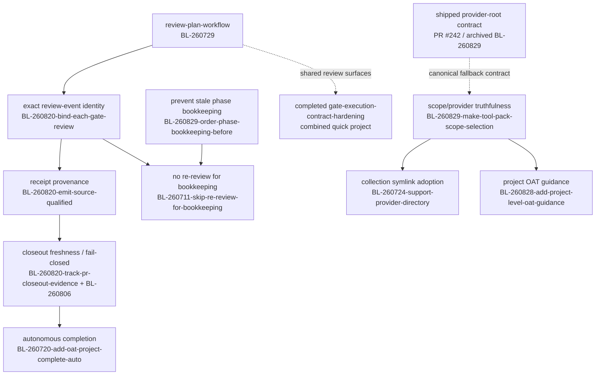
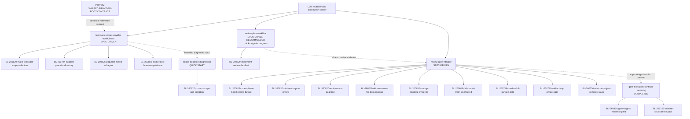

# Roadmap

This file records prioritized direction and lives under `pjm/` (the operational
layer). To reduce cross-worktree conflicts, prefer adding or moving single
bullet lines over rewriting whole sections. Backlog references include the ID
and title so this map remains readable without a board lookup.

## Now (Active / Committed)

<!-- Add active work here. Format:
- **BL-YYMMDD-slug: {title}** — brief description. Project: {name} (if linked)
-->

- **2026-08-31 execution program (31 external plans, W1–W6)** — W1 merged as PR #262 (CLI 0.2.56); W2 merged as PR #267 (CLI 0.2.57); W3 (workflow durability and containment) implemented as wrapper project `wave-3-execution` (CLI 0.2.58), PR pending merge; W4–W6 pending in program order. Program: `.oat/repo/reference/external-plans/2026-08-31-execution-program.md`.
- **BL-260708-verify-cursor-gpt-5-6-subagent: Verify Cursor GPT-5.6 subagent model slugs** — Re-run structured controls after a Cursor client rollout exposes Task in headless mode or support confirms the private requests; review by 2026-08-08. Current recommended candidates remain configured but unvalidated.
- **BL-260711-add-root-owned-dispatch-broker: Add root-owned dispatch broker for exact OAT subagent launches** — Preserve phase coordination and exact target provenance without nested provider initialization or broad coordinator permissions.
- **BL-260711-add-activity-aware-gate: Add activity-aware gate timeouts** — Build adaptive idle-kill and early-artifact semantics on the shipped scope-aware hard budgets, transcript liveness evidence, and correlated timeout recovery.
- **BL-260729-implement-reviewplan-first: Implement ReviewPlan-first reviewer workflow** — Finish QA/dogfood and reconcile draft PR #190 before opening another broad review implementation lane. Project: review-plan-workflow.
- **BL-260711-skip-re-review-for-bookkeeping: Skip re-review for bookkeeping-only review findings** — Highest-priority review-efficiency safety net; repair ledger-only findings without spending another quality-review cycle. Project: review-gate-integrity.
- **BL-260829-make-tool-pack-scope-selection: Make tool-pack scope, provider reachability, and dispatch state truthful** — Revalidate the active project against shipped PRs #227, #240, and #242, then advance its layered scope/provider state model without reopening the shipped provider-root contract. Project: tool-pack-scope-provider-truthfulness.

## Next (Planned)

<!-- Add planned work here. Format:
- **BL-YYMMDD-slug: {title}** — brief description. Project: {name} (if linked)
-->

- **BL-260724-support-provider-directory: Support provider directory symlinks as full collection sync** — Prefer collection-level links until real divergence, then fall back safely to per-entry sync. Project: tool-pack-scope-provider-truthfulness.
- **BL-260828-add-project-level-oat-guidance: Add project-level OAT guidance prompt during init and workflow installation** — Add the explicit project-adoption prompt and managed AGENTS.md section without coupling it to user-scope pack placement. Project: tool-pack-scope-provider-truthfulness.
- **BL-260829-order-phase-bookkeeping-before: Order phase bookkeeping before per-phase review dispatch** — Prevent stale implementation/state ledgers from generating repeat Important findings before review dispatch. Project: review-gate-integrity.
- **BL-260806-fail-closed-when-configured: Fail closed when configured closeout snapshot is absent** — Persist the normalized closeout sequence before child dispatch and prevent terminal completion until every configured child is durably recorded.
- **BL-260820-bind-each-gate-review: Bind each gate review disposition to its exact received ledger event** — Establish event identity before provenance and no-re-review behavior. Project: review-gate-integrity.
- **BL-260820-emit-source-qualified: Emit source-qualified provenance envelopes for review and gate receipts** — Make review, gate, and fallback outcomes auditable after event identity is stable. Project: review-gate-integrity.
- **BL-260718-mandatory-skill-load-clause: Mandatory skill-load clause for lifecycle steps that name skills** — High-priority workflow-integrity fix: lifecycle text naming a skill as a step must require loading it; evidence from the wave-skills-promotion closeout. Project: wave-skills-promotion follow-up.
- **Wave-workflow follow-ups (grouped)** — **BL-260718-add-oat-wave-lifecycle-cli** + **BL-260718-document-execution-program** (CLI family + stable artifact contract, trigger: second consumer / post-W6 prioritization); **BL-260718-rewrite-worktree-bootstrap** (tested TS bootstrap-group). Project: wave-skills-promotion.
- **Explainer publication-hardening follow-ups (grouped)** — **BL-260817-run-the-rc-explainer-end** + **BL-260817-decide-and-pin-the-system** (CI browser provisioning decisions); **BL-260817-drop-explainer-kit-publish** (remove `publish-request/v1` in a future minor); **BL-260817-verify-protected-mode-public** (authenticated end-to-end URL verification for protected mode). Project: explainer-improvements-v2.
- **BL-260712-per-project-override: Per-project override to disable configured external gates** — Skip configured gates for one project without mutating shared user configuration.

## Later (Directional Intent)

<!-- Add directional work here. Format:
- **BL-YYMMDD-slug: {title}** — brief description. Project: {name} (if linked)
-->

- **BL-260706-front-load-recurring-gate: Front-load recurring gate-finding classes into implementer briefs** — Reduce repeated review/fix loops by carrying stable gate expectations into implementation prompts.
- **BL-260719-add-pinned-recon-agents: Add pinned recon agents for reusable orchestration** — Define provider-neutral, read-only pinned recon roles that dispatch by task-class floor across review and non-review workflows without recursively reusing full reviewers.
- **BL-260728-additional-visual-workflows: Additional visual workflows** — Evaluate diff review, plan review, fact-check, dashboard, complex table, and richer composition workflows now that golden unattended recap quality is restored.

## Sequencing map (2026-08-30)

This is the current execution model after PRs #240, #242, and #243 merged. It separates project
boundaries from implementation order: discovery and design can overlap, while
shared skill, ratchet, and review-artifact files should not be changed by
parallel implementation lanes.

### Recommended sequence

1. Finish/dogfood **BL-260729-implement-reviewplan-first** (Implement
   ReviewPlan-first reviewer workflow) and reconcile PR #190 with current main.
2. Merge the completed **BL-260827-correct-scope-and-adoption** diagnostics
   slice, then rebase **BL-260829-make-tool-pack-scope-selection** (Make
   tool-pack scope, provider reachability, and dispatch state truthful) onto its
   active-adapter and inventory/rendering seams plus PR #242's provider-root
   contract. Preserve umbrella ownership of the broader provider-by-scope
   model, catalog/picker visibility, restart guidance, collection symlinks,
   `AGENTS.md` behavior, and dispatch provenance.
3. Within the review/gate lane, implement **BL-260829-order-phase-bookkeeping-before**
   (Order phase bookkeeping before per-phase review dispatch) before
   **BL-260711-skip-re-review-for-bookkeeping** (Skip re-review for
   bookkeeping-only review findings). The former prevents avoidable findings;
   the latter remains the highest-priority safety net for unavoidable ledger
   repairs and other lifecycle-only findings.
4. After the scope/provider state model is stable, run
   **BL-260724-support-provider-directory** (Support provider directory
   symlinks as full collection sync) and **BL-260828-add-project-level-oat-guidance**
   (Add project-level OAT guidance prompt during init and workflow installation)
   as parallel subtracks where file ownership permits.
5. After ReviewPlan/event identity, sequence
   **BL-260820-emit-source-qualified** (Emit source-qualified provenance
   envelopes for review and gate receipts), then
   **BL-260820-track-pr-closeout-evidence** (Track PR-closeout evidence
   freshness against the current head) and
   **BL-260806-fail-closed-when-configured** (Fail closed when configured
   closeout snapshot is absent). Only then advance the autonomous-completion
   and broader gate-expansion work.

### Visual dependency tree

Legend: **BL-260729** is **BL-260729-implement-reviewplan-first — Implement
ReviewPlan-first reviewer workflow**; **BL-260820-bind-each-gate-review** is
**Bind each gate review disposition to its exact received ledger event**;
**BL-260820-emit-source-qualified** is **Emit source-qualified provenance
envelopes for review and gate receipts**; **BL-260820-track-pr-closeout-evidence**
is **Track PR-closeout evidence freshness against the current head**;
**BL-260806** is **BL-260806-fail-closed-when-configured — Fail closed when
configured closeout snapshot is absent**; **BL-260829-order-phase-bookkeeping-before**
is **Order phase bookkeeping before per-phase review dispatch**; **BL-260711**
is **BL-260711-skip-re-review-for-bookkeeping — Skip re-review for
bookkeeping-only review findings**; the archived
**BL-260829-unified-agent-provider-root** shipped the **Unified
AGENT_PROVIDER_ROOT binding for portable skill and agent references** in PR #242;
**BL-260829-make-tool-pack-scope-selection** is **Make tool-pack scope,
provider reachability, and dispatch state truthful**; **BL-260724** is **BL-260724-support-provider-directory — Support provider directory symlinks as full collection sync**; **BL-260828** is **BL-260828-add-project-level-oat-guidance — Add project-level OAT guidance prompt during init and workflow installation**; and **BL-260720** is **BL-260720-add-oat-project-complete-auto — Add oat-project-complete-auto companion skill for autonomous closeouts**.

## Project grouping and workflow modes (2026-08-30)

This is a current planning view of the OAT reliability and distribution cluster,
not an exhaustive project catalog. Revalidate the grouping, ownership, and mode
recommendations after PR #190 is reconciled and the active scope/provider
project absorbs the completed diagnostics slice. A solid edge below
means primary backlog ownership. A dashed edge means a supporting relationship
or shared surface; it does not transfer ownership.

| Project                                 | Current / recommended mode                                          | Primary backlog items                                                                                                                                                                                                                                                                                                                                                                                                                                                                                                                                                                                                                                                                                                                                                                                                                                                                                                                                                  | Why this mode and boundary                                                                                                                                                                                                                                                    |
| --------------------------------------- | ------------------------------------------------------------------- | ---------------------------------------------------------------------------------------------------------------------------------------------------------------------------------------------------------------------------------------------------------------------------------------------------------------------------------------------------------------------------------------------------------------------------------------------------------------------------------------------------------------------------------------------------------------------------------------------------------------------------------------------------------------------------------------------------------------------------------------------------------------------------------------------------------------------------------------------------------------------------------------------------------------------------------------------------------------------- | ----------------------------------------------------------------------------------------------------------------------------------------------------------------------------------------------------------------------------------------------------------------------------- |
| `tool-pack-scope-provider-truthfulness` | **Spec-driven**                                                     | **BL-260829-make-tool-pack-scope-selection — Make tool-pack scope, provider reachability, and dispatch state truthful**; **BL-260724-support-provider-directory — Support provider directory symlinks as full collection sync**; **BL-260826-populate-native-subagent — Populate native subagent runtime identity from provider transcript metadata**; **BL-260828-add-project-level-oat-guidance — Add project-level OAT guidance prompt during init and workflow installation**                                                                                                                                                                                                                                                                                                                                                                                                                                                                                      | Cross-cutting scope/provider/content-type state, collection symlink adoption, AGENTS.md behavior, restart visibility, picker truthfulness, and fallback provenance. The umbrella owns integration; diagnostics remain a separate bounded project.                             |
| `scope-adoption-diagnostics`            | **Quick start** (implementation complete; closeout)                 | **BL-260827-correct-scope-and-adoption — Correct scope and adoption diagnostics**                                                                                                                                                                                                                                                                                                                                                                                                                                                                                                                                                                                                                                                                                                                                                                                                                                                                                      | The bounded diagnostic slice is complete and feeds active-adapter and inventory/rendering seams into the umbrella without absorbing broader provider materialization or agent-root implementation.                                                                            |
| `review-plan-workflow`                  | **Spec-driven recommended; currently quick-origin and in progress** | **BL-260729-implement-reviewplan-first — Implement ReviewPlan-first reviewer workflow**                                                                                                                                                                                                                                                                                                                                                                                                                                                                                                                                                                                                                                                                                                                                                                                                                                                                                | The implementation is already tied to PR #190, so do not reset it midstream. Its cross-cutting review artifact and dispatch contract merits spec-driven treatment if it is resumed as a new project or promoted at a safe reconciliation boundary.                            |
| `review-gate-integrity`                 | **Spec-driven**                                                     | **BL-260711-skip-re-review-for-bookkeeping — Skip re-review for bookkeeping-only review findings**; **BL-260829-order-phase-bookkeeping-before — Order phase bookkeeping before per-phase review dispatch**; **BL-260820-bind-each-gate-review — Bind each gate review disposition to its exact received ledger event**; **BL-260820-emit-source-qualified — Emit source-qualified provenance envelopes for review and gate receipts**; **BL-260820-track-pr-closeout-evidence — Track PR-closeout evidence freshness against the current head**; **BL-260806-fail-closed-when-configured — Fail closed when configured closeout snapshot is absent**; **BL-260718-harden-full-surface-gate — Harden full-surface gate reviews against budget and recursive dispatch**; **BL-260711-add-activity-aware-gate — Add activity-aware gate timeouts**; **BL-260720-add-oat-project-complete-auto — Add oat-project-complete-auto companion skill for autonomous closeouts** | These items share review ledgers, lifecycle state, provenance, closeout freshness, dispatch budgets, and gate policy. They should be designed as one integrity model, with bookkeeping-before-review and exact event identity ordered ahead of no-re-review and receipt work. |
| `gate-execution-contract-hardening`     | **Quick start** (completed)                                         | **BL-260826-gate-targets-must-not-yield — Gate targets must not yield on background work in headless mode**; **BL-260726-validate-structured-output — Validate structured-output contract in gate skill commands** (both closed)                                                                                                                                                                                                                                                                                                                                                                                                                                                                                                                                                                                                                                                                                                                                       | Delivered the bounded end-to-end contract spanning configured structured commands, headless no-yield execution, cause-specific terminal diagnosis, and an integration proof without absorbing the broader review lifecycle redesign.                                          |

### Grouping tree

The intended implementation shape is therefore three substantial active tracks
without an active bounded companion: (1) the scope/provider truth umbrella, (2)
the review-plan workflow, and (3) review/gate integrity. Diagnostics is a
completed input that merges before umbrella implementation, and the combined
gate-execution-contract project is complete. PR #242 is a shipped prerequisite,
not another active track. The active tracks can proceed in parallel when they
do not touch shared artifacts.
