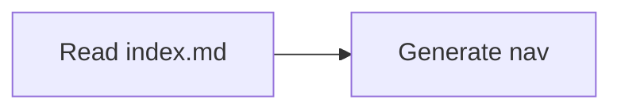

# Contributing to {{SITE_NAME}}

Documentation should ship with the code it explains. This docs app is scaffolded to give contributors and agents a shared contract for navigation, Markdown features, and local tooling.

## Navigation contract

- Every documentation directory must contain an `index.md`.
- Each `index.md` must include a `## Contents` section.
- The `## Contents` section is the machine-readable local map for sibling pages and child directories.
- `overview.md` is deprecated in favor of `index.md`.
- Contents owns sidebar membership/order; frontmatter titles own leaf and section labels. Every canonical page/child section needs one physical-parent entry. Cross-links stay in page bodies, preserving breadcrumbs and previous/next.
- `predev` / `prebuild` run installed `oat docs nav sync --framework fumadocs --target-dir .`, then `fumadocs-mdx`, then the separate agent-index generator. Do not copy repository-specific workspace source CLI commands into this app.
- `oat docs nav sync --framework fumadocs --validate-only` is source-only; `--check` compares generated output without writes and requires generation first. The modes are mutually exclusive.
- Ordinary `.md` routes, a root loader base and relative fragments are supported. External/query-bearing Contents entries, MDX/custom slugs and separators are unsupported; fenced examples are ignored. Deployment basePath is applied by the renderer.
- Ignored `docs/**/meta.json` and `.oat-fumadocs-nav.json` are protected by path/hash ownership. Preserve unowned/edited bytes; never adopt files by editing hashes. Back up proven disposable output with its sidecar before removing only those files and regenerating. Traversal/symlink paths are refused. Partial writes need inspection, not a claim of multi-file transactionality.
- Format authored Markdown only, not ignored generated JSON.

## Local workflow

1. Install dependencies:

   ```bash
   {{INSTALL_CMD}}
   ```

2. Run the live preview:

   ```bash
   {{DEV_CMD}}
   ```

3. Run Markdown {{LINT_PHRASE}} as configured for this docs app.

## Supported Markdown features

### GFM alerts

Styled callout blocks using GitHub-flavored Markdown syntax:

> [!NOTE]
> Useful supporting context.

> [!WARNING]
> Important information to be aware of.

### Mermaid diagrams

Fenced code blocks with the `mermaid` language identifier are rendered as diagrams:

````text

````

### Code blocks

Syntax-highlighted fenced code blocks with a copy button included by default.

### Full-text search

Built-in FlexSearch-powered static search for discovering content without browsing the full tree.

### Dark/light mode

Theme toggle is included in the layout. Mermaid diagrams re-render on mode switch.

## Agent guidance

See `AGENTS.md` in this directory for how agents should work inside this docs app. This `contributing.md` covers human authoring conventions; `AGENTS.md` covers agent runtime discipline (adding pages, restructuring nav, audit/apply, three agent-instruction surfaces). Keeping those concerns separate keeps each file useful to its audience.
