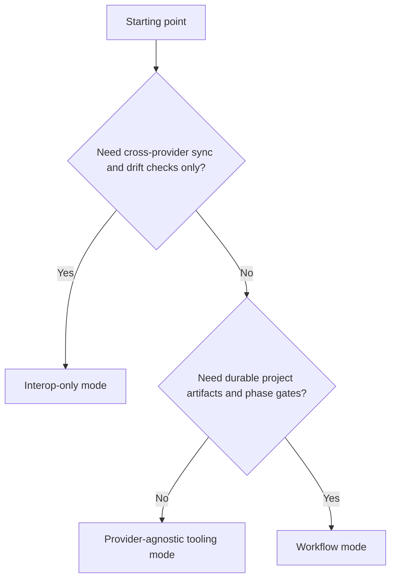
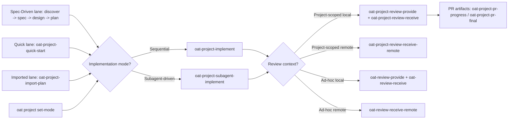

# Open Agent Toolkit (OAT)

Open Agent Toolkit (OAT) is an open-source toolkit built on open standards for defining and managing agent skills, subagents, and hooks across multiple AI coding providers (Claude Code, Cursor, GitHub Copilot, Gemini CLI, Codex CLI). It provides a provider-agnostic interoperability layer first, with optional, human-in-the-loop workflow scaffolding layered on top.

OAT has three distinct capabilities:

1. Provider interoperability CLI for syncing/managing canonical skills and sub-agents across tools.
2. Reusable skills, CLI commands, and tooling that support provider-agnostic development workflows.
3. Optional workflow system for structured discovery/spec/design/plan/implement execution.

You can use any capability independently.

## What This Repo Contains

This repository currently includes three core pieces:

- Workflow skills in `.agents/skills`
  - Skills drive OAT lifecycle behavior and quality gates.
- Project artifacts under `.oat/projects/...`
  - Discovery/spec/design/plan/implementation/review/PR records.
- Provider interop CLI in `packages/cli`
  - Commands for canonical asset management, provider sync, drift detection, and diagnostics.

## Three Ways To Use OAT



| Mode | Best for | Primary entry points |
|---|---|---|
| Interop-only | Canonical skill/agent sync + drift diagnostics + tool-pack lifecycle | `oat init`, `oat init tools`, `oat status`, `oat sync`, `oat instructions ...`, `oat providers ...`, `oat remove ...`, `oat cleanup ...`, `oat doctor` |
| Provider-agnostic tooling | Reusing skills/utilities without spec-driven lifecycle overhead | `apps/oat-docs/docs/skills/index.md`, `apps/oat-docs/docs/skills/docs-workflows.md`, `apps/oat-docs/docs/cli/docs-apps.md`, selected `oat-*` skills |
| Workflow | Structured execution with durable artifacts and review gates | `oat-project-new`/`oat-project-open`, then lane-specific skills |

### A) Interop-only mode (CLI only)

Use OAT only for cross-provider asset management:

- Initialize canonical directories
- Detect drift and strays
- Sync provider views safely
- Validate AGENTS.md to CLAUDE.md pointer integrity and repair drift
- Install/update bundled OAT tool packs with version-aware prompts (`oat init tools`)
- Remove installed skills or packs (`oat remove ...`) with dry-run/apply semantics
- Audit and clean workflow/project hygiene drift
- Run diagnostics

Primary commands:
- `oat init`
- `oat status`
- `oat sync`
- `oat instructions validate`
- `oat instructions sync`
- `oat init tools`
- `oat providers list`
- `oat providers inspect <provider>`
- `oat providers set`
- `oat remove skill <name>`
- `oat remove skills --pack <ideas|workflows|utility>`
- `oat cleanup project`
- `oat cleanup artifacts`
- `oat doctor`

This mode is useful even if you do not use OAT workflow skills at all.

### B) Provider-agnostic tooling mode (skills + utilities)

Use reusable skills and tooling without adopting the spec-driven project lifecycle:

- Draft ideas and plans with your preferred provider
- Keep plan-first docs outside OAT, then sync/import into an OAT project when ready
- Reuse provider-agnostic helper skills and commands
- Adopt only the pieces you need for your team’s workflow

Start points:
- [Skills overview](apps/oat-docs/docs/skills/index.md)
- [Docs workflows](apps/oat-docs/docs/skills/docs-workflows.md)
- [Docs app commands](apps/oat-docs/docs/cli/docs-apps.md)
- [Reference](apps/oat-docs/docs/reference/index.md)

### C) Workflow mode (skills + project artifacts)

Use OAT lifecycle skills when you want explicit checkpoints and durable project artifacts.

Recommended when:
- You want traceable artifacts (`state/spec/design/plan/implementation`) for handoffs and audits.
- You want review/fix loops and PR artifacts driven by a consistent workflow contract.
- You want the option to start fast (quick/import) and promote to spec-driven lifecycle later.

Lane options (all converge on implementation + project review workflows):

| Lane | Typical sequence | Best fit |
|---|---|---|
| Spec-Driven | Discovery -> Spec -> Design -> Plan -> Implement -> Project review loop | New initiatives or higher-risk changes that need strong artifact rigor |
| Quick | Quick start (discovery + plan baseline) -> Implement -> Project review loop | Smaller scoped work that still needs structured execution |
| Imported-plan | Plan with provider -> Import to OAT project -> Implement -> Project review loop | External/provider-authored plans you want normalized into OAT artifacts |

Shared across lanes:
- Review/fix loops (`oat-project-review-provide` + `oat-project-review-receive` for local, `oat-project-review-receive-remote` for GitHub PR feedback)
- Ad-hoc reviews (`oat-review-provide` + `oat-review-receive` for local, `oat-review-receive-remote` for GitHub PR feedback)
- PR artifacts (`oat-project-pr-progress`, `oat-project-pr-final`)
- Optional promotion to spec-driven lifecycle (`oat-project-promote-spec-driven`) where applicable

This layer is optional and can build on top of interop + provider-agnostic tooling.

## Core Model

OAT centers on canonical agent assets and explicit workflow artifacts.

- Canonical assets:
  - `.agents/skills/`
  - `.agents/agents/`
- Workflow artifacts:
  - `.oat/projects/<scope>/<project>/state.md`
  - `.oat/projects/<scope>/<project>/{discovery,spec,design,plan,implementation}.md`
  - `.oat/projects/<scope>/<project>/reviews/*.md`
  - `.oat/projects/<scope>/<project>/pr/*.md`

If you are interop-only, you can ignore most project artifact files.

## Quickstart (Repo Development)

### 1) Install and verify

```bash
pnpm install
pnpm run cli -- help
```

### 2) Initialize and inspect

```bash
pnpm run cli -- init --scope project
pnpm run cli -- status --scope all
pnpm run cli -- providers list
```

### 3) Sync provider views (when needed)

```bash
pnpm run cli -- sync --scope all
pnpm run cli -- sync --scope all --apply
```

Notes:
- `sync` is dry-run by default.
- `--apply` performs filesystem updates.
- Project provider support is configured in `.oat/sync/config.json` (set via `oat init` interactive prompt or `oat providers set`).
- Canonical subagents in `.agents/agents/*.md` are the source of truth. For Codex project scope, `sync --apply` generates `.codex/agents/*.toml` and merges `.codex/config.toml`.
- Stray adoption in `oat init` / `oat status` reconciles canonical plus the adopted provider first; run `oat sync --scope all --apply` for cross-provider fanout.
- In non-interactive contexts, set provider intent explicitly:
  - `pnpm run cli -- providers set --scope project --enabled claude,codex --disabled cursor`

### 3.5) Install or update OAT tool packs (optional)

```bash
pnpm run cli -- init tools
```

Notes:
- Installs OAT skills/agents/templates/scripts by pack (`ideas`, `workflows`, `utility`).
- When installed skills are older than bundled versions, interactive runs prompt you to update selected skills.
- Non-interactive runs report outdated skills without updating them (use pack subcommands with `--force` to overwrite).

### 3.6) Bootstrap or maintain a docs app (optional)

```bash
pnpm run cli -- docs init --app-name my-docs
pnpm run cli -- docs nav sync --target-dir apps/my-docs
```

Notes:
- `docs init` scaffolds an MkDocs Material docs app with OAT defaults.
- `docs nav sync` regenerates `mkdocs.yml` navigation from directory `index.md` `## Contents` sections.
- `docs analyze` and `docs apply` expose the docs workflow entrypoints and pair with the `oat-docs-analyze` / `oat-docs-apply` skills.

### 4) Validate instruction pointers (recommended)

```bash
pnpm run cli -- instructions validate
pnpm run cli -- instructions sync
pnpm run cli -- instructions sync --apply
```

Notes:
- `instructions validate` is read-only.
- `instructions sync` is dry-run by default.
- Use `instructions sync --apply --force` to overwrite mismatched `CLAUDE.md` files.

### 5) Audit and clean project/artifact hygiene (optional)

```bash
pnpm run cli -- cleanup project
pnpm run cli -- cleanup artifacts
```

Apply mode examples:

```bash
pnpm run cli -- cleanup project --apply
pnpm run cli -- cleanup artifacts --apply
```

Notes:
- Cleanup commands are dry-run by default.
- `cleanup artifacts --apply` uses interactive triage in TTY contexts by default.
- In non-interactive contexts, use `--all-candidates --yes` to allow stale-candidate mutation.

### 6) Bootstrap a new worktree checkout

```bash
pnpm run worktree:init
```

This installs dependencies, builds packages, and applies project-scope sync links in one step.
For a guided OAT-aware setup flow (create/reuse worktree + readiness checks), use the `oat-worktree-bootstrap` skill.

Maintenance note:
- `pnpm oat:validate-skills` routes to `oat internal validate-oat-skills` and validates required `oat-*` skill structure.

## Consumer CLI Usage (Without pnpm)

If you are using OAT CLI as a consumer, prefer the `oat` executable interface rather than repo scripts.

Current state:
- `@oat/cli` is currently private in this repository (`packages/cli/package.json` has `"private": true`), so registry `npx` usage is not available yet.

Run from source with npm:

```bash
cd packages/cli
npm install
npm run build
node dist/index.js --help
node dist/index.js status --scope project
```

Optional local linking for `oat` command:

```bash
cd packages/cli
npm link
oat --help
oat sync --scope all --apply
oat instructions validate
```

## Interop-Only Quickstart (Consumer Intent)

Once you have an `oat` executable available in your environment:

```bash
oat init --scope project
oat providers set --scope project --enabled claude,codex --disabled cursor
oat status --scope all
oat sync --scope all
oat sync --scope all --apply
oat instructions validate
oat instructions sync --apply
oat init tools
oat remove skills --pack utility     # dry-run by default
oat cleanup project
oat cleanup artifacts
oat doctor --scope all
```

This gives you the core value of OAT without adopting workflow artifacts.

## Workflow At A Glance



### Choose a lane

1. Spec-Driven workflow lane
   - Create/open project (`oat-project-new` / `oat-project-open`)
   - Discovery (`oat-project-discover`)
   - Spec (`oat-project-spec`)
   - Design (`oat-project-design`)
   - Plan (`oat-project-plan`)
   - Implement (`oat-project-implement` or `oat-project-subagent-implement`)
2. Quick workflow lane
   - Quick start (`oat-project-quick-start`, which captures discovery context and writes a runnable plan baseline)
   - Implement (`oat-project-implement` or `oat-project-subagent-implement`)
   - Optional promotion (`oat-project-promote-spec-driven`)
3. Imported-plan workflow lane
   - Produce discovery/plan externally with provider tooling
   - Import external plan (`oat-project-import-plan`)
   - Implement (`oat-project-implement` or `oat-project-subagent-implement`)
   - Optional promotion (`oat-project-promote-spec-driven`)

### Typical lane sequences

1. Provider-plan import sequence
   - External discovery + planning with provider tooling
   - `oat-project-import-plan`
   - `oat-project-implement` or `oat-project-subagent-implement`
   - `oat-project-review-provide` + `oat-project-review-receive`
   - `oat-project-pr-final`
2. Quick-start sequence
   - `oat-project-quick-start` (discovery + initial plan scaffold)
   - `oat-project-implement` or `oat-project-subagent-implement`
   - `oat-project-review-provide` + `oat-project-review-receive`
   - `oat-project-pr-final`

### Shared workflow options

1. Routing and next-step checks:
   - `oat-project-progress`
2. Execution mode persistence:
   - `oat project set-mode <single-thread|subagent-driven>`
3. Canonical plan-writing contract:
   - `oat-project-plan-writing` (shared spec-driven/quick/import planning semantics)
4. Review path selection:
   - Project-scoped review: `oat-project-review-provide` + `oat-project-review-receive` (local) / `oat-project-review-receive-remote` (GitHub PR)
   - Ad-hoc/non-project review: `oat-review-provide` + `oat-review-receive` (local) / `oat-review-receive-remote` (GitHub PR)
5. PR generation:
   - Progress PR: `oat-project-pr-progress`
   - Final PR: `oat-project-pr-final`
6. Lifecycle completion:
   - `oat-project-complete` (with optional active-project cleanup)

## Documentation

Start here:

- [OAT overview](apps/oat-docs/docs/index.md)
- [Quickstart](apps/oat-docs/docs/quickstart.md)

Section indexes:

- [Workflow](apps/oat-docs/docs/workflow/index.md)
- [Skills](apps/oat-docs/docs/skills/index.md)
- [Projects](apps/oat-docs/docs/projects/index.md)
- [CLI](apps/oat-docs/docs/cli/index.md)
- [Provider interop](apps/oat-docs/docs/cli/provider-interop/index.md)
- [Reference](apps/oat-docs/docs/reference/index.md)

## Development Commands

```bash
pnpm build
pnpm lint
pnpm type-check
pnpm test
```
