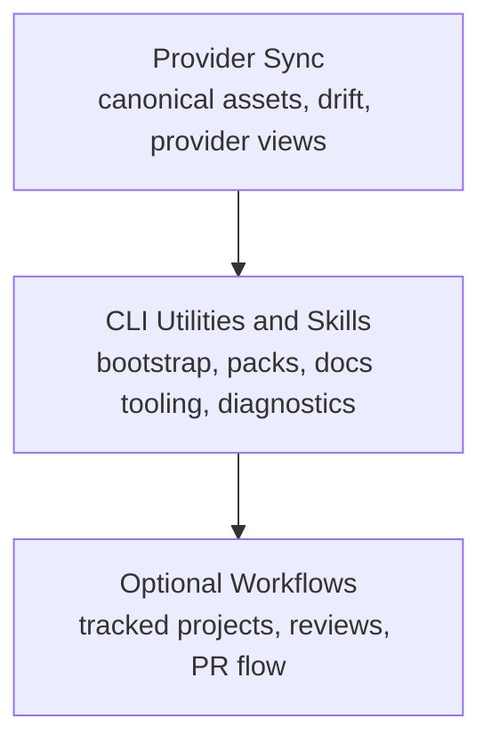

# Open Agent Toolkit (OAT)

Open Agent Toolkit is an open-source toolkit for portable, provider-agnostic agent tooling and workflows.

It helps you:

- define canonical agent assets once
- sync those assets across providers
- use provider-agnostic CLI utilities and skills
- optionally run tracked, human-in-the-loop project workflows on top

## Capability Layers



You can adopt any layer independently.

## Quick Start

```bash
pnpm install
pnpm run cli -- help
pnpm run cli -- init --scope project
pnpm run cli -- status --scope all
```

Useful next commands:

- `pnpm run cli -- sync --scope all`
- `pnpm run cli -- tools install`
- `pnpm run cli -- docs init --app-name my-docs`
- `pnpm run cli -- config describe`
- `pnpm run cli -- config dump --json`
- `pnpm run cli -- project status --json`
- `pnpm run cli -- project list --json`

For local repo development:

- `pnpm build`
- `pnpm build:docs`
- `pnpm lint`
- `pnpm type-check`
- `pnpm test`

## Docs

Full documentation lives on the docs site:

- [Docs Home](https://voxmedia.github.io/open-agent-toolkit/)
- [Start Here](https://voxmedia.github.io/open-agent-toolkit/quickstart)
- [Provider Sync](https://voxmedia.github.io/open-agent-toolkit/provider-sync)
- [Agentic Workflows](https://voxmedia.github.io/open-agent-toolkit/workflows)
- [Docs Tooling](https://voxmedia.github.io/open-agent-toolkit/docs-tooling)
- [CLI Utilities](https://voxmedia.github.io/open-agent-toolkit/cli-utilities)
- [Reference](https://voxmedia.github.io/open-agent-toolkit/reference)
- [Contributing](https://voxmedia.github.io/open-agent-toolkit/contributing)

## Repo Layout

- `packages/cli` - OAT CLI for provider sync, docs tooling, project utilities, and diagnostics
- `packages/control-plane` - read-only project-state library used by the CLI for structured OAT project status, listing, and recommendation data
- `packages/docs-config` - config helpers for OAT-powered Fumadocs apps
- `packages/docs-theme` - shared React components for OAT-powered Fumadocs apps
- `packages/docs-transforms` - remark plugins and transform bundle for OAT-powered Fumadocs apps
- `apps/oat-docs` - the OAT docs site
- `.agents/skills` - bundled OAT skills
- `.oat` - OAT templates, project artifacts, repo reference, and sync state

## Packages

- [`@open-agent-toolkit/cli`](./packages/cli/README.md)
- [`@open-agent-toolkit/control-plane`](./packages/control-plane/README.md)
- [`@open-agent-toolkit/docs-config`](./packages/docs-config/README.md)
- [`@open-agent-toolkit/docs-theme`](./packages/docs-theme/README.md)
- [`@open-agent-toolkit/docs-transforms`](./packages/docs-transforms/README.md)
