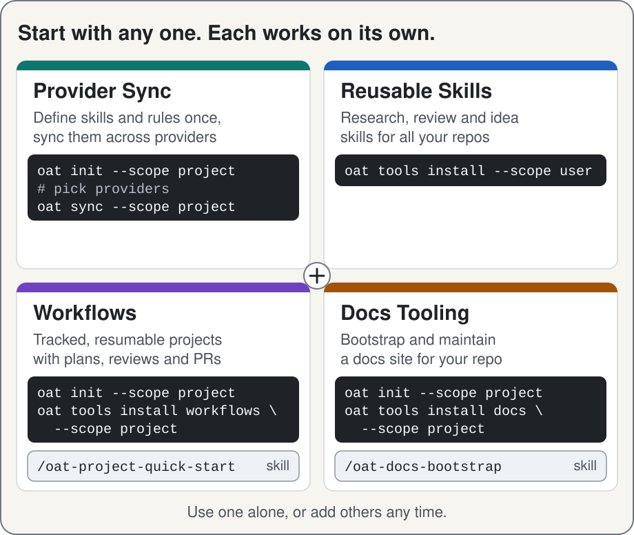

# Open Agent Toolkit (OAT)

Define agent capabilities once, use them across coding tools, and add as much workflow structure as your team needs. Open Agent Toolkit (OAT) is an open-source CLI, skill library, and optional project workflow system—not another agent runtime.

## Choose Your Starting Point

Start with the part that solves your problem; combine others when useful:

1. **Keep coding tools aligned.** Maintain canonical skills, agents, and rules; sync provider views and inspect drift instead of maintaining separate copies. Start with [Provider Sync](https://voxmedia.github.io/open-agent-toolkit/provider-sync).
2. **Use skills for a task.** Research a decision or review code without adopting a tracked project lifecycle. Choose a [skill](https://voxmedia.github.io/open-agent-toolkit/skills).
3. **Make longer work resumable.** Use plans, implementation records, reviews, and human checkpoints when you need a tracked workflow. [Choose a Workflow](https://voxmedia.github.io/open-agent-toolkit/workflows/choose-workflow) that fits the work.
4. **Make documentation easier to maintain.** Bootstrap plain Markdown or a docs site, then analyze and apply improvements with [Docs Tooling](https://voxmedia.github.io/open-agent-toolkit/docs-tooling).

Provider sync does not require project workflows. Standalone skills do not require an active OAT project; project-specific skills state their prerequisites in their guides.



The image shows terminal commands and agent skills separately. Invoke `/name` in slash-based agents or `$name` in Codex, not in a shell. Project scope targets repository assets; the core pack, when installed, is user-only. New tracked projects default to synced scope and require an `origin` Git remote; choose local project storage if you do not want remote-backed project state.

## First Success: Inspect a Repository

Requires Node.js 22.17 or newer and Git 2.31 or newer. Install the CLI, then run it in an existing repository:

```bash
npm install --global @open-agent-toolkit/cli
cd /path/to/your-repo
oat init --scope project
oat status --scope project
```

Initialization creates canonical directories and sync state; status reports provider assets and drift. Follow the provider prompts and skip optional guided setup if you only want sync. This does not create a tracked OAT project.

Once you have canonical assets, preview changes with `oat sync --scope project --dry-run` before applying them. Pack installation has its own scope: use `oat tools install --scope project` for repository-scoped packs, or `--scope user` to reuse them across repositories. See [CLI Bootstrap](https://voxmedia.github.io/open-agent-toolkit/getting-started/bootstrap) for setup details and [Tool Packs](https://voxmedia.github.io/open-agent-toolkit/getting-started/tool-packs) for the user-only core pack and other installation choices.

## Go Deeper

The [documentation](https://voxmedia.github.io/open-agent-toolkit/) owns the full guides and command reference:

- [Quickstart](https://voxmedia.github.io/open-agent-toolkit/getting-started/quickstart) — choose an adoption path.
- [Instruction Sync](https://voxmedia.github.io/open-agent-toolkit/provider-sync/instruction-sync) — validate nested `AGENTS.md` files and configure optional `CLAUDE.md` shims; no shims are created by default.
- [CLI Reference](https://voxmedia.github.io/open-agent-toolkit/reference/cli-reference) and [Configuration](https://voxmedia.github.io/open-agent-toolkit/reference/config-and-local-state) — find commands, options, and local-state behavior.

## Contributing

To develop OAT itself, clone this repository and initialize your checkout:

```bash
pnpm run worktree:init
pnpm run cli -- help
```

The bootstrap installs dependencies, builds the workspace, and prepares local configuration and provider views. Follow the [contributor guide](https://voxmedia.github.io/open-agent-toolkit/contributing) and the ordered Definition of Done in [`AGENTS.md`](AGENTS.md) before submitting changes.

The workspace contains the [CLI](packages/cli/README.md), [read-only project control plane](packages/control-plane/README.md), and Fumadocs [configuration](packages/docs-config/README.md), [theme](packages/docs-theme/README.md), and [transforms](packages/docs-transforms/README.md) packages. The docs site lives in `apps/oat-docs`, bundled skills in `.agents/skills`, and templates, project artifacts, repository reference, and sync state in `.oat`.
