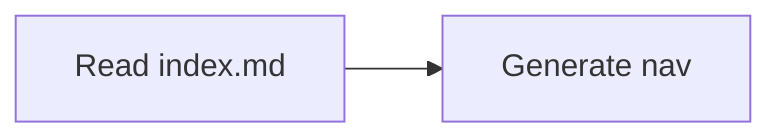

# Contributing to OAT Docs

Documentation should ship with the code it explains. This docs app is scaffolded to give contributors and agents a shared contract for navigation, Markdown features, and local tooling.

## Navigation contract

- Every documentation directory must contain an `index.md`.
- Each `index.md` must include a `## Contents` section.
- The `## Contents` section is the machine-readable local map for sibling pages and child directories.

## Local workflow

1. Start the dev server from the repo root:

   ```bash
   pnpm dev:docs
   ```

2. Run Markdown linting:

   ```bash
   pnpm --filter oat-docs docs:lint
   ```

3. Run Markdown formatting:

   ```bash
   pnpm --filter oat-docs docs:format
   ```

## Supported Markdown features

### Frontmatter

Every page should have `title` and `description` fields in YAML frontmatter. The `title` is used for sidebar navigation and page headings.

**Syntax:**

```yaml
---
title: Page Title
description: A short summary of the page.
---
```

### Callouts

GitHub-style callout blocks are supported.

**Syntax:**

```text
> [!NOTE]
> Useful supporting context.

> [!WARNING]
> Important caution for the reader.
```

**Rendered:**

> [!NOTE]
> Useful supporting context.

> [!WARNING]
> Important caution for the reader.

### Mermaid diagrams

Fenced code blocks with `mermaid` language are rendered as diagrams.

**Syntax:**

````text

````

**Rendered:**


### Tabs

Tab groups use MkDocs-style tab markers. Each `=== "Title"` followed by an indented code block creates a tab.

**Syntax:**

```text
=== "pnpm"

    pnpm install

=== "npm"

    npm install
```

**Rendered:**

=== "pnpm"

    pnpm install

=== "npm"

    npm install

=== "yarn"

    yarn install

### Code blocks

Standard fenced code blocks with syntax highlighting are supported for all common languages. Add a `title` to the meta string to display a filename header.

**Syntax:**

````text
```typescript title="src/example.ts"
const greeting = 'hello world';
console.log(greeting);
```
````

**Rendered:**

```typescript title="src/example.ts"
const greeting = 'hello world';
console.log(greeting);
```

## Agent guidance

- Treat `index.md` plus its `## Contents` section as the local discovery source of truth.
- Prefer linking to source files and commands explicitly when documenting behavior.
- Run `pnpm exec oat docs generate-index` to regenerate the docs surface index after adding or removing pages.
