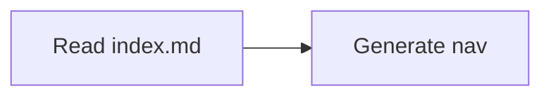

# Contributing to OAT Docs

Documentation should ship with the code it explains. This docs app is scaffolded to give contributors and agents a shared contract for navigation, Markdown features, and local tooling.

## Navigation contract

- Every documentation directory must contain an `index.md`.
- Each `index.md` must include a `## Contents` section.
- The `## Contents` section is the machine-readable local map for sibling pages and child directories.
- `overview.md` is deprecated. Replace it with `index.md` or a descriptive leaf page when the directory already has an `index.md`.

## Local workflow

1. Install Python dependencies:

   ```bash
   pnpm docs:setup
   ```

2. Run the live preview:

   ```bash
   pnpm docs:dev
   ```

3. Run Markdown formatting and linting as configured for this docs app.

## Installed plugins

### `search`

Adds full-text search to the generated docs site so readers can discover content without browsing the full tree.

### `git-revision-date`

Shows file revision dates using Git history, which helps surface stale pages during maintenance reviews.

### `macros`

Enables variable-style content reuse and small computed fragments inside MkDocs pages.

### `glightbox`

Adds lightbox behavior for linked images so diagrams and screenshots can be expanded in-place.

### `callouts`

Supports GitHub-style callout blocks in Markdown for note, warning, and tip content.

## Enabled Markdown extensions

### `admonition`

Supports MkDocs callout syntax:

```markdown
!!! note
Useful supporting context.
```

### `attr_list`

Lets you attach attributes such as classes or IDs to Markdown elements.

### `md_in_html`

Allows Markdown content inside raw HTML blocks when layout needs extra structure.

### `nl2br`

Treats single newlines as line breaks in rendered output.

### `pymdownx.caret`, `pymdownx.mark`, `pymdownx.tilde`

Adds inline formatting helpers for insertions, highlights, and strikethrough-like syntax.

### `pymdownx.details`

Supports collapsible details blocks for optional reference content.

### `pymdownx.emoji`

Enables emoji shortcodes and richer emoji rendering.

### `pymdownx.inlinehilite`

Adds inline code highlighting helpers for short syntax examples.

### `pymdownx.highlight`

Provides fenced code block highlighting.

### `pymdownx.snippets`

Supports file and snippet inclusion patterns for reusable documentation fragments.

### `pymdownx.superfences`

Extends fenced code support and enables custom fences such as Mermaid:

````markdown

````

### `pymdownx.tabbed`

Supports tabbed content blocks for related workflows or platform variants.

### `toc`

Adds table-of-contents anchors and permalinks for headings.

## Agent guidance

- Treat `index.md` plus its `## Contents` section as the local discovery source of truth.
- Prefer linking to source files and commands explicitly when documenting behavior.
- When adding a new plugin or extension, update this guide with what it does and how to use it.
