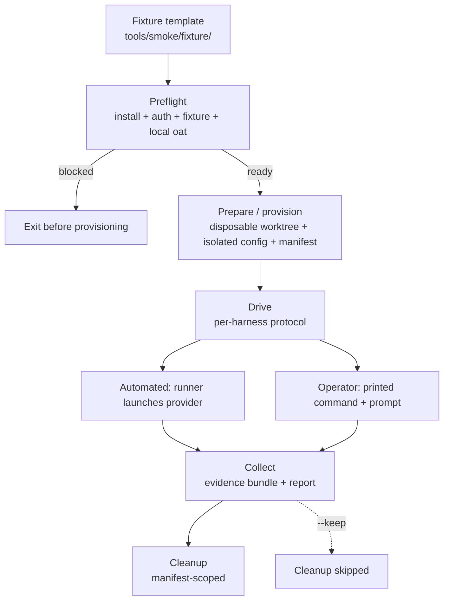

# Smoke Testing

The smoke runner (`tools/smoke/`) drives the real OAT orchestration workflows end
to end against a self-contained fixture project. It provisions a disposable Git
worktree, hands that worktree to a live provider harness, collects durable
evidence of what actually happened, verifies the evidence against per-scenario
assertion profiles, and then removes everything it created.

Run it manually as release validation and after any change that could alter
orchestration behavior — dispatch, parallel phase topology, review gating, state
transitions, or the fixture contract itself. It is deliberately **not** part of
the default CI path: each run launches real provider processes and external
review gates, so it is operator-initiated rather than automatic.

This page describes the machinery and the process. It does not report the
outcome of any particular run.

## Data flow



Collection runs even when the drive stage fails, so a broken run still produces
an evidence bundle before cleanup reclaims its resources.

## Prerequisites

Preflight (`tools/smoke/runner/preflight.mjs`) derives the required runtime set
from both the selected drive harness and its independent gate runtime. Every
distinct required runtime must be installed and authenticated before
provisioning. Preflight also runs `oat gate target list --json` and requires the
configured target to report available without launching a review.

| Harness      | Runtime probe            | Authentication probe  |
| ------------ | ------------------------ | --------------------- |
| `codex`      | `codex --version`        | `codex login status`  |
| `claude`     | `claude --version`       | `claude auth status`  |
| `cursor-ide` | `cursor --version`       | `cursor agent status` |
| `cursor-cli` | `cursor-agent --version` | `cursor-agent status` |

Additional readiness requirements before a run can start:

- **`CURSOR_API_KEY` presence.** Required when the harness is `cursor-cli` or
  `cursor-ide`, or when the selected gate runtime is Cursor (this is the case
  for the Codex harness, whose review gate is cross-runtime). Preflight checks
  only for a non-empty value; the key is never printed, logged, or written into
  config, manifests, prompts, or evidence.
- **Local build.** Preflight requires the CLI to resolve to the freshly built
  local dist entrypoint (`packages/cli/dist/index.js`) through the committed
  `tools/smoke/bin/oat` shim, with a version matching source. Build the CLI
  first (for example, `pnpm build`) so the disposable worktree does not fall
  through to a global `oat`.
- **Fixture integrity.** Preflight runs the fixture validators and checks the
  required project artifacts, presets, and seed logs before provisioning.

If any required check fails, preflight raises `PreflightError` and no
provisioning is started.

## Scenario selection

Select the scenario with `--scenario`. The manifest's applied scenario is the
authoritative selector for which assertion profile the evidence is checked
against.

- **`plan-review`** — proves the plan-review lifecycle: the substantive plan
  (task IDs and parallel groups) is stable across resume, the plan gate review
  is corroborated against gate-owned invocation evidence, and state advances
  atomically from pre-review through reviewed to implementation-ready.
- **`implement`** — proves execution: one accepted, completed phase implementer
  and one direct-root phase reviewer for each of `p01`, `p02`, and `p03`;
  exactly five fixture markers and five bounded task commits; exact
  at-or-below-ceiling target selection; isolated flat parallel branches with
  fan-in after all declared dependencies; phase-review row and artifact
  binding; explicit runtime identity status; and exactly one final code gate
  after `p03`.
- **`full`** — unions the plan-review and implement profiles. It runs exactly
  two external gates: one plan-review gate before implementation and one final
  code gate after `p03`.

## Running

The runner entrypoint is `tools/smoke/runner/run-smoke.mjs`. `--harness` and
`--scenario` are always required. Drive mode defaults to `automated` and all
stages (`prepare`, `drive`, `collect`) run by default.

### Automated full run

Automated drive supports `codex`, `claude`, and `cursor-cli`. The runner
launches the provider itself and runs all three stages:

```bash
node tools/smoke/runner/run-smoke.mjs --harness codex --scenario full
```

### Operator prepare/collect split

Operator mode splits the lifecycle so a noninteractive command cannot drive by
accident. Passing `--drive-mode operator` without `--stage` defaults to
`prepare` only, so you run prepare and collect as separate commands:

```bash
node tools/smoke/runner/run-smoke.mjs \
  --harness claude --scenario full --drive-mode operator --stage prepare
# Run the printed command and paste the printed prompt in an interactive TTY.
node tools/smoke/runner/run-smoke.mjs \
  --harness claude --scenario full --drive-mode operator --stage collect
```

Prepare prints the disposable worktree path, the interactive provider command,
and the canned root prompt. Complete the driven session before running collect.

### Manual Cursor IDE flow

`cursor-ide` is operator-driven by definition, so it always uses the
prepare/collect shape and never substitutes a headless CLI drive. Do not pass
`--drive-mode operator`; its canonical report root omits the `operator/`
segment.

```bash
node tools/smoke/runner/run-smoke.mjs --harness cursor-ide --scenario full --stage prepare
```

Then, following `tools/smoke/protocols/cursor-ide.md`:

1. Open the printed disposable worktree in Cursor.
2. Start a new Agent session in that worktree.
3. Paste the canned root prompt printed by prepare and let the session finish.
4. Run the matching collect stage:

```bash
node tools/smoke/runner/run-smoke.mjs --harness cursor-ide --scenario full --stage collect
```

For each required review gate, the canned prompt invokes `oat gate review`
exactly once with the harness's fixed `--target`. Listing targets with
`oat gate target list` is a valid probe; invoking a gate as a probe is not,
because an accepted gate launch is terminal even when it fails.

### Dry run and keep

- `--dry-run` stubs the install and authentication probes and produces a drive
  stub instead of launching a provider, letting you exercise the
  provisioning and cleanup wiring. The fixture and local-CLI checks still run
  for real.
- `--keep` short-circuits cleanup so the worktree, branches, and manifest remain
  on disk for inspection.

```bash
node tools/smoke/runner/run-smoke.mjs --harness cursor-cli --scenario plan-review --dry-run --keep
```

## Negative controls

Negative controls prove the runner refuses to do the wrong thing.

**Unavailable target.** Set `OAT_SMOKE_FORCE_UNAVAILABLE=<harness>` to force that
harness's runtime probe to report unavailable. Preflight then blocks before any
provisioning, and the control asserts that no manifests, branches, or worktrees
were created. Capture the failed runner output, then normalize it:

```bash
OAT_SMOKE_FORCE_UNAVAILABLE=codex \
  node tools/smoke/runner/run-smoke.mjs --harness codex --scenario plan-review \
  > preflight-capture.txt 2>&1
node tools/smoke/evidence/negative.mjs \
  --harness codex \
  --preflight preflight-capture.txt \
  --repository "$(pwd)" \
  --runs-dir "$(pwd)/tools/smoke/.runs" \
  --out tools/smoke/reports/negative-controls/codex
```

**Post-acceptance failure.** Once a child launch is accepted and then fails, that
outcome is terminal: any launch after an accepted failure is a Critical
violation. Explicit pre-start rejections before the accepted launch remain
valid. This control is verified through the `post-acceptance-failure` profile
(see below).

## Interpreting evidence reports

Reports are written outside the disposable worktree, under
`tools/smoke/reports/<harness>/<scenario>/` for automated runs and
`tools/smoke/reports/<harness>/operator/<scenario>/` for operator runs
(`cursor-ide` always uses the operator-free `tools/smoke/reports/cursor-ide/<scenario>/`
path).

The collect stage runs the collector and report generator automatically. To
regenerate or re-verify a report by hand:

```bash
node tools/smoke/evidence/report.mjs --bundle <out>/bundle.json --out <out>
node tools/smoke/evidence/report.mjs --check <out>/report.json \
  --expect-profile <plan-review|implement|full|unavailable-target|post-acceptance-failure>
```

Reading the output:

- **`report.json` is authoritative.** It records the SHA-256 digest and sibling
  path of the `bundle.json` it was generated from. The `report.md` table
  (columns Assertion, Severity, Status, Description) is a derived, human-readable
  view.
- **`--check` re-verification** rereads the bound bundle, validates its digest,
  recomputes the scenario profile, and requires the caller's explicit expected
  profile plus byte-equivalent results. It does not trust the report's stated
  status, assertion IDs, severities, summary counts, or the bundle's own
  scenario as the caller's intent.

The evidence is organized as three layers — launcher-owned production records,
independent durable corroboration from Git and the fixture, and the normalized
bundle and assertion report. See
[Evidence Layers](../workflows/projects/evidence-layers.md) for the model.

## Cleanup and recovery

Cleanup (`tools/smoke/runner/cleanup.mjs`) is manifest-scoped: it only removes
resources the run journaled. It runs automatically when the run errored, when a
full `prepare` → `drive` → `collect` lifecycle completed, or when a
collection-only invocation ran. `--keep` short-circuits it entirely. An operator
`prepare` stage therefore intentionally leaves its worktree in place for you to
drive.

After an interrupted run you may find:

- `tools/smoke/.runs/smoke-<branch>/` containing the `provisioning-manifest.json`
  and the disposable `worktree/`.
- The outer `smoke-*` branch and any journaled child branches created for
  parallel phases.

Recovery validates the tracked smoke marker at each ownership baseline, refuses
divergent branch tips, mismatched shared Git directories, missing baseline
markers, and any run-descendant worktree or branch absent from the journal. A
journaled worktree that is already gone from disk is still recoverable; a
contradictory or unjournaled resource fails closed with a refusal rather than
guessing.

### Reserved versus registered ownership

The deterministic provider's nested phase worktrees are journaled as a
transaction, so an interruption cannot leave one of them as a child cleanup
has to refuse. Other nested creators still register directly after creation;
their entries are read exactly the same way, but their creation window is not
yet covered. The two states are:

- **`reserved`** — the exact branch, worktree path, marker path, expected
  baseline, shared Git directory, and run identity are written to the manifest
  _before_ `git worktree add` runs. The entry is durable intent, not ownership.
- **`registered`** — the child's marker, Git worktree registration, branch,
  HEAD ancestry, and shared Git directory have all been corroborated.
  Finalization only flips a matching reservation; it never rewrites what was
  reserved, and a child contradicting its reservation is refused.

Cleanup reconciles a reservation only against exactly matching state. If
neither the branch nor the worktree was ever created, nothing is deleted and
the reservation goes away with the manifest. If both exist exactly as reserved,
they are removed after baseline, shared Git directory, and run-marker
corroboration. If only the branch survives, its tip must equal the reserved
baseline exactly. Anything else — an occupied path Git never registered, a
different branch at the reserved path, a missing marker — fails closed.

Manifests written before this transaction existed use ownership journal schema
version 1. They stay readable and all of their entries read as already
`registered`. Such a manifest is never rewritten to a newer schema version and
never gains a reservation, and a v1 entry claiming reserved state is refused
rather than treated as owned. Direct registration may still append a
`registered` entry to one, which leaves its schema version untouched.

Nothing is ever pruned by `smoke-*` name, path prefix, run age, or ancestry
alone. Without an ownership lease the runner cannot tell a stale run from an
active one, so it refuses instead of guessing and leaves the state for you to
resolve.

To finish a stalled run, re-run the matching `--stage collect` (collection-only
triggers cleanup) or start a fresh run; the runner reconciles journaled
resources on the next errored or collection-bearing invocation. If cleanup fails
closed on unjournaled state, resolve that state manually before retrying.

## Updating the fixture as workflows change

When a workflow or skill contract changes shape, the fixture and its checks must
change with it, and a passing smoke run on the updated fixture is the acceptance
bar. Typical touch points:

- **Fixture plan** (`tools/smoke/fixture/project/plan.md`) — task IDs, the
  parallel-groups declaration, each task's write target, and the expected commit
  subject. Preflight enforces the task count, groups, and per-task integrity.
- **Lifecycle presets** (`tools/smoke/fixture/presets/`) — the `pre-review` and
  `implementation-ready` frontmatter fingerprints that transition assertions
  parse.
- **Protocols** (`tools/smoke/protocols/*.md`) — the canned prompts, fixed gate
  counts, and expected per-harness topology.
- **Assertion profiles** (`tools/smoke/evidence/assertions.mjs`) — the expected
  task IDs and the plan-review, implement, and full profiles.
- **Format contract tests** (`tools/smoke/fixture/fixture-format-contract.test.mjs`,
  `fixture-integrity.test.mjs`, and `presets/apply-preset.test.mjs`) — run by
  preflight and updated alongside any contract change.

Change these together, then run the affected scenario end to end. If the updated
fixture does not pass, the workflow change is not accepted.

## Related

- [Contributing Code](code.md)
- [Implementation Execution](../workflows/projects/implementation-execution.md)
- [Dispatch Ceiling](../workflows/projects/dispatch-ceiling.md)
