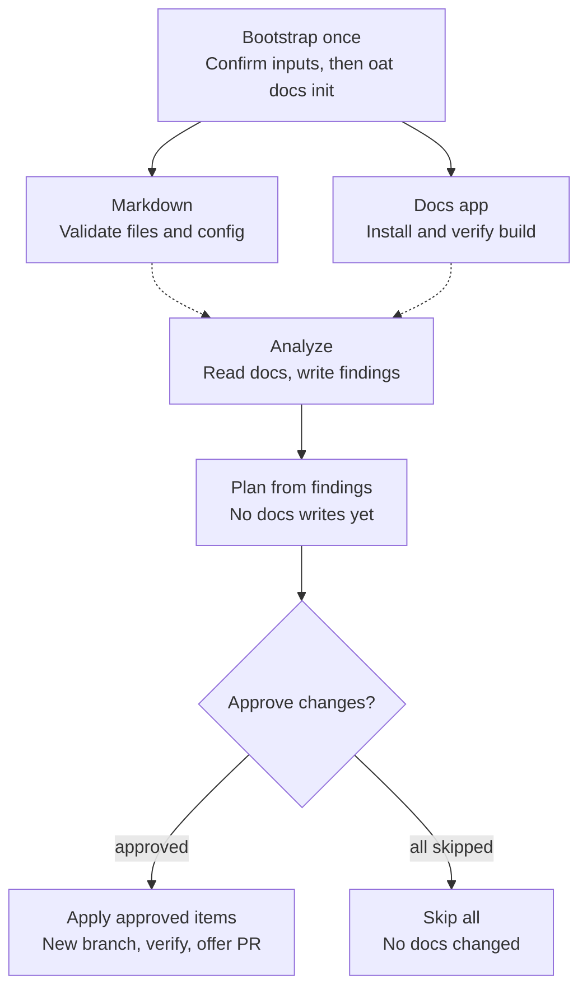

# Docs Workflows

OAT’s docs workflow combines deterministic CLI helpers with higher-judgment
skills for analysis and controlled updates.

Install the workflow skills with `oat tools install docs` (preferred) or
`oat init tools docs` before using the analyze/apply flow in a new repo.

## Docs workflow pieces

### CLI helpers

- `oat docs init` bootstraps/adopts Markdown files or scaffolds a docs app (Fumadocs or MkDocs)
- `oat docs migrate` converts MkDocs admonitions to GFM callouts and injects frontmatter
- `oat docs generate-index` generates a Fumadocs app-root docs index manifest from the Markdown file tree
- `oat docs nav sync` regenerates MkDocs `mkdocs.yml` nav, or strict Fumadocs `meta.json` files, from `index.md` `## Contents` sections
- `oat docs analyze` and `oat docs apply` expose the workflow surface in CLI help

### Skills

- `authoring-docs` is the provider-agnostic baseline for evidence-first
  technical documentation: page types, information architecture, category
  guidance, templates, and review rubrics
- `oat-docs-authoring` layers the OAT Markdown/Fumadocs authored-source contract on top of
  `authoring-docs` for targeted authoring, restructuring, link repair, and
  local navigation maintenance inside an existing OAT documentation surface
- `oat-docs-bootstrap` is the guided onramp for Markdown setup/adoption or adding a docs app —
  wraps `oat docs init` with preflight detection, richer input gathering (site
  name distinct from package name), labeled post-patches for open CLI gaps,
  file-level verification for Markdown or framework build verification, config
  inspection, and an educational walkthrough
- `oat-docs-analyze` evaluates a docs surface for structure, drift, coverage,
  contributor guidance, and docs-app contract issues, then runs the shared
  auto artifact-review loop to verify the generated analysis artifact's
  evidence, severities, and recommendations
- `oat-docs-apply` consumes the analysis artifact and applies only approved,
  evidence-backed recommendations
- `oat-project-document` performs post-implementation docs sync for a tracked project,
  including finding missing coverage for newly shipped capability areas and
  recommending new docs pages or directories when existing docs do not provide
  a natural home. See the [project lifecycle post-implementation flow](../workflows/projects/lifecycle.md#post-implementation-flow)
  for where this runs in the tracked project flow.

## Contract model

The docs workflow mirrors the agent-instructions analyze/apply split:

- Analyze owns discovery, evidence gathering, confidence, and disclosure decisions
- Analyze also owns accuracy verification of the generated analysis artifact
  through the shared auto artifact-review loop before the apply workflow consumes
  it
- Apply consumes the artifact, asks for approval, and must not invent new docs conventions

This keeps deterministic behavior in the CLI and judgment-heavy behavior in the
skills.

## Typical flow

Diagram: bootstrap once, then analyze, approve and apply only agreed improvements.

- **Setup, once.** `oat-docs-bootstrap` checks the repo without writing, asks
  you to confirm its inputs, then runs `oat docs init`. Plain Markdown setup validates authored files,
  configuration and guidance without installing app dependencies or building a
  site. Fumadocs and MkDocs setup adds the relevant post-patches, installation,
  build verification and walkthrough.
- **Analyze.** `oat-docs-analyze` never edits docs. It writes an analysis
  artifact under `.oat/repo/analysis/` (and updates OAT tracking).
- **Approve.** `oat-docs-apply` builds a plan from the newest artifact and
  stops for your decision: apply all, review item by item, or discuss and
  revise. If the artifact is missing or stale it sends you back to analyze. If
  you skip every item, nothing changes.
- **Apply.** Only after approval does apply create a branch, edit the approved
  docs, regenerate navigation, verify, commit and offer a pull request. Items
  marked as needing confirmation are confirmed again before they are written.
- **Repeat.** Re-run analyze afterwards to confirm the result.

1. Bootstrap or explicitly adopt a documentation surface with `oat-docs-bootstrap` (preferred — guided, includes post-scaffold patches and walkthrough) or `oat docs init` directly (CLI-only / non-interactive workflows)
2. (Optional) If migrating from MkDocs, handle that as a separate migration workstream; `oat docs migrate --docs-dir docs --config mkdocs.yml --apply` is only the syntax/frontmatter helper
3. Use `oat-docs-authoring` for targeted OAT Markdown/Fumadocs authoring work, with `authoring-docs` as the universal documentation-quality baseline
4. Keep authored context and title/description metadata, with an `index.md` and useful `## Contents` in each non-excluded Markdown-bearing directory; preserve asset-only exceptions and local instructions
5. Keep local `## Contents` sections current
6. Verify files/links and refresh declared derived artifacts:
   - **Markdown:** use the configured root literally, including nested `docs`; authored indexes are editable. No app install/site build/nav sync is required. Optional manifests need explicit external output and never replace the authored config index.
   - **MkDocs:** `oat docs nav sync`
   - **Fumadocs:** `oat docs nav sync` for the committed `meta.json` sidebar files (it reports pages no `## Contents` map lists), and `oat docs generate-index` for the root manifest (runs automatically via `predev`/`prebuild` hooks)
7. Run `oat-docs-analyze`; by default it verifies the generated analysis artifact
   through `workflow.autoArtifactReview.analysis`
8. Review the artifact and run `oat-docs-apply`

## Existing Markdown and partial setup

Bootstrap checks declared config before discovery and framework evidence before
plain-tree candidates. A populated plain tree is offered adopt/audit; `--yes`
alone does not authorize adoption. `--adopt` preserves existing bytes and adds
missing baseline files only. Config/guidance success does not prove complete
content conformity: analyze recommends missing context, metadata, Contents or
child indexes, and apply performs only approved repairs without replacing useful
context or local instructions.

Use `--dry-run` for a nonmutating Markdown preview. Guidance conflicts may yield
`partial`/exit `1`, with planned files/config; a real partial reports any already
created files/config separately. Repeated converged adoption returns no changes.
See [Commands](commands.md#oat-docs-init) for examples and exit behavior.

## Progressive disclosure

The docs workflow expects local indexes to guide discovery without forcing agents
to open every page.

- keep local topic summaries in `index.md`
- link to deeper setup/config/reference material when full detail is not needed inline
- let the analysis artifact decide what should be inline, link-only, omitted, or escalated to the user

## Related docs

- [`commands.md`](commands.md)
- [`add-docs-to-a-repo.md`](add-docs-to-a-repo.md)
- [`../reference/docs-index-contract.md`](../reference/docs-index-contract.md)
- [`../contributing/skills.md`](../contributing/skills.md)

## authoring-docs

**Invocation:** Ask, “Use authoring-docs to improve the recovery instructions
in `docs/imports.md` for an on-call engineer.” Skill invocations are agent
instructions, not shell commands: use `/authoring-docs` where supported,
`$authoring-docs` in Codex, or the skill's name in a request. This convention
also applies to the other skills below; example paths refer to your files.

**Prerequisites:** A documentation target, intended reader, and accessible
sources of truth. No OAT project or OAT documentation configuration is
required. Source code, configuration, tests, deployment files, and existing
instructions establish what you can safely document.

**Example scenario:** An import runbook says to retry a job but does not
explain how an operator confirms that retrying is safe. Ask the skill to
inspect the actual job behavior and add a reader-focused recovery sequence,
marking any operational assumption that needs the owner's confirmation.

Choose the page's primary job before writing: a tutorial gets a reader to
first success, a how-to completes a task, reference provides exact contracts,
explanation builds understanding, and a runbook supports safe recovery. This
avoids mixing an introductory story, an exhaustive flag list, and an
incident procedure into one undifferentiated page. Preserve useful existing
intent and improve the nearest appropriate page instead of creating a
parallel documentation surface.

**Expected output:** Evidence-backed Markdown with clear prerequisites,
steps, expected results, verification, and relevant links. Risky operations
need recovery or rollback guidance when the sources establish it. Unknown
ownership, commands, endpoints, or compatibility guarantees remain explicit
questions rather than invented facts. The handoff identifies changed files,
sources inspected, checks run, and remaining uncertainty.

**Next step:** Run the target repository's documented checks and resolve
owner-review gaps before sharing. Use [oat-docs-authoring](#oat-docs-authoring)
when the target also needs OAT placement and navigation conventions.

## oat-docs

**Invocation:** `/oat-docs "How do I choose between a quick and lite project?"`.
If you provide no question, the skill asks what you want to understand.

**Prerequisites:** Installed bundled OAT documentation under `~/.oat/docs/`.
No active project is required. If that documentation is missing, the skill
stops with installation guidance rather than substituting a repository
checkout that may describe a different release.

**Example scenario:** You are about to plan a small maintenance change and
want to understand the artifacts and approval boundary of each workflow.
Ask the skill to explain the choices from the installed documentation before
starting a project or changing configuration.

**Expected output:** A documentation-backed answer with practical examples
and pointers to relevant bundled pages. The skill searches and reads the
actual documentation rather than answering only from remembered behavior.
It can offer a related setup action or skill, but does not execute that offer
without confirmation.

**Next step:** Choose the workflow or command that matches your task. If the
answer suggests setup changes, confirm the exact action separately from the
question-and-answer conversation.

## oat-docs-authoring

**Invocation:** Ask, “Use oat-docs-authoring to add a retry troubleshooting
section to the existing imports guide and update its local map if needed.”
The skill can also be invoked as `/oat-docs-authoring` with your task.

**Prerequisites:** An existing OAT Markdown surface, OAT/Fumadocs app, or
clearly identified target following OAT conventions, plus the installed
`authoring-docs` baseline. No active lifecycle project is required. This is
a targeted authoring or repair workflow, not bootstrap, a broad audit, or
bulk application of an analysis report.

**Example scenario:** One documented import error has a new recovery path.
Update that guide from the actual implementation and tests without
reorganizing unrelated sections or hand-editing generated sidebar files.

The wrapper adds OAT-specific placement and navigation rules to universal
authoring standards. Edit authored pages and relevant local `index.md`
Contents maps together, preserve useful context and local instructions, and
prefer `.md` unless the page needs JSX. For configured Markdown, use the
literal content root and authored index, even if it contains a nested
directory named `docs`; do not create an unnecessary app shell.

**Expected output:** Focused authored-source changes, checked links and
metadata, and any locally required generated-artifact refresh or freshness
check. The handoff distinguishes checks actually run from checks unavailable
or intentionally not applicable. Project-derived release documentation
belongs in the project-document workflow, not this wrapper.

**Next step:** Review and validate the focused diff. For broader uncertainty
about the surface, use [oat-docs-analyze](#oat-docs-analyze); for a new surface,
use [oat-docs-bootstrap](#oat-docs-bootstrap).

## oat-docs-bootstrap

**Invocation:** `/oat-docs-bootstrap`, optionally with a target directory.
The conversation chooses Markdown, Fumadocs, or MkDocs and confirms the
destination before scaffolding or adoption. Selecting a framework here is
not an instruction to add framework flags to unrelated navigation commands.

**Prerequisites:** An initialized OAT repository with readable
`.oat/config.json`, `.agents/`, and a runnable OAT CLI. An active project is
optional: it may provide context for the walkthrough, but setup does not
require one. The installed CLI must support the selected setup path.

**Example scenario:** Your repository already has useful Markdown guides in
`documentation/`, and the team wants OAT discovery and authoring guidance
without a site runtime. Choose additive Markdown adoption, retain those
guides, and then audit their metadata and local maps. Do not replace the tree
with a docs app simply because one can be scaffolded.

Preflight reads declared documentation configuration before discovery and
checks framework evidence before assuming a populated directory is plain
Markdown. An existing plain tree needs an explicit adopt, audit-only, or
abort choice. A non-interactive confirmation alone is not adoption authority.
Markdown setup collects a title, dedicated repository-relative root, and
optional description; it does not require an app name, dependency install,
preview server, or site build. Existing content and instructions are
preserved, and missing content conformity becomes audit work rather than
silent repair.

For Fumadocs or MkDocs, the skill gathers the appropriate app inputs, probes
CLI capabilities, invokes the scaffold, and applies only relevant,
capability-gated post-patches. The visible site title and package name are
different inputs. Verification follows the selected surface: file/config/link
checks for Markdown, framework-specific checks and build verification for an
app. Optional completion enforcement is an explicit choice, not a hidden
side effect of initialization.

**Expected output:** A verified fresh setup or additive adoption, followed
by a walkthrough of actual configuration, authored indexes, page metadata,
and contribution conventions. Markdown keeps its configured index authored;
an optional generated inventory needs an explicit destination outside the
configured content tree and never replaces it. A dry-run is only a preview.
A partial result can have created files while still requiring manual
guidance work; report that state rather than claiming complete bootstrap.

**Next step:** For an adopted tree, run [oat-docs-analyze](#oat-docs-analyze)
and approve any repairs through apply. For a fresh surface, add the first
reader task using [oat-docs-authoring](#oat-docs-authoring) and its walkthrough
conventions.

## oat-docs-analyze

**Invocation:** `/oat-docs-analyze`, with a request identifying the docs
surface you want evaluated. The skill resolves declared configuration and
framework evidence before generic directory fallbacks; it does not rely on
a guessed root when the repository already declares one.

**Prerequisites:** A Git repository with a docs app, Markdown tree, or
root-level documentation, and `jq` for tracking updates. No active project
is required. Configured Markdown does not need an app package, generated
manifest, or docs-root agent file to qualify for analysis.

**Example scenario:** A team adopted an existing Markdown tree, but users
still cannot find several supported CLI operations. Analyze the literal
configured root against command definitions, examples, and local maps so
the report identifies which capability needs which page or section, rather
than prescribing a new framework as the fix.

The skill inventories content, checks index-contract coverage, verifies
substantive claims against repository sources, finds missing or thin
capability coverage, and checks navigation and drift. A usable finding names
the evidence, severity, proposed location, and concrete subtopics. Ownership
or operational claims that local sources cannot establish become
owner-review gaps, not confident invented instructions.

Existing tracking selects full or delta analysis when its recorded commit
is valid. The workflow is read-only toward docs and navigation; it writes
and may correct its own report, then updates analysis tracking. Generated
navigation is freshness-checked, not repaired during the audit.

**Expected output:** A timestamped `.oat/repo/analysis/docs-*.md` report with
evidence, confidence, and disclosure decisions, including concrete targets
for link-only recommendations. By default, a bounded auto artifact-review
loop checks the report before tracking and handoff. A disabled loop or
residual findings must remain disclosed; a report's existence alone does
not mean every recommendation is verified or approved.

**Next step:** Review the findings and run [oat-docs-apply](#oat-docs-apply)
for selected recommendations. If evidence or target information is missing,
repair the analysis contract rather than asking apply to fill it in.

## oat-docs-apply

**Invocation:** `/oat-docs-apply` after reviewing a docs analysis report.
The skill locates the recent report, builds a recommendation plan, and asks
which actions you approve before changing documentation.

**Prerequisites:** A recent, complete docs analysis artifact and an unchanged
compatible target. Recommendations need evidence, confidence, disclosure,
and concrete link targets where applicable. No active lifecycle project is
required. Missing analysis or a changed target requires a fresh analysis,
not conventions invented during apply.

**Example scenario:** The audit found three hidden CLI pages, an inaccurate
example, and a proposed reorganization. Approve only the page listings and
example correction, leaving the reorganization for discussion. Apply should
execute those selected actions without broadening the work to every finding.

**Expected output:** Approved changes on the workflow's branch, relevant
source/link checks, and declared navigation or generated-artifact refreshes.
Markdown retains its authored index and needs no framework build or nav
sync; Fumadocs sidebar metadata is regenerated from approved Contents
changes, never hand-edited. The summary reports the applied plan and checks.
Commit and optional PR steps remain explicit; pushing requires confirmation.

**Next step:** Review the diff and approve publication separately. Rerun
analysis if you need a post-apply assessment, and treat unapproved
recommendations as remaining decisions rather than completed work.
