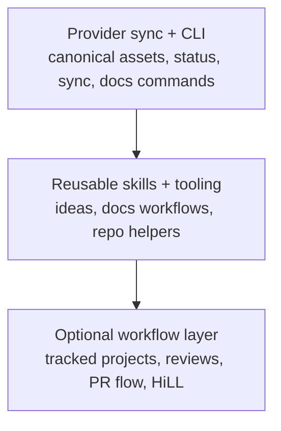
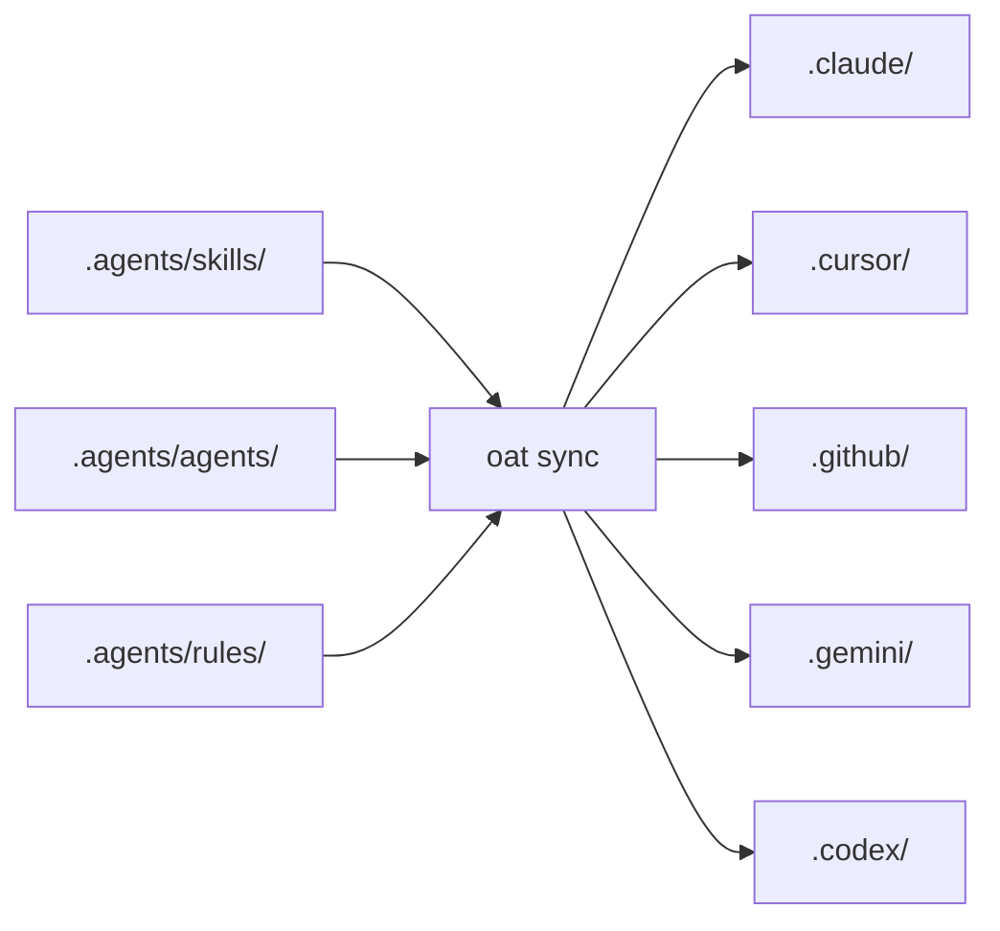

# Core Concepts

OAT combines a provider-sync layer, reusable skills and CLI tooling, and an optional workflow system. This page gives the high-level mental model so the detailed docs are easier to navigate.

## Capability Stack

## Canonical Assets and Provider Views

OAT keeps canonical assets in repo-controlled locations and projects provider-specific views from that source of truth. The canonical form is what you edit and review directly; provider views are synchronized outputs that let Claude Code, Cursor, Copilot, Gemini, and Codex consume the same intent in their native layouts.

Use these docs next:

- [Provider Sync](provider-sync/index.md)
- [Reference](../reference/index.md)

## Sync, Drift, and Adoption

`oat sync` applies canonical content to provider views, while `oat status` reports whether a provider is in sync, drifted, or missing content. Drift is expected when provider-side files diverge from canonical content; OAT now also covers canonical rule sync and stray adoption so you can bring unmanaged files back under the canonical model deliberately.

Use these docs next:

- [Provider Sync Commands](provider-sync/commands.md)
- [Manifest and Drift](provider-sync/manifest-and-drift.md)

## Scopes

Most OAT operations run in one of three scopes: `project`, `user`, or `all`. Project scope targets the current repository, user scope targets user-level installations, and `all` evaluates both. The same scope model appears across sync, status, and provider configuration commands, so it is worth learning early.

Use these docs next:

- [Scope and Surface](provider-sync/scope-and-surface.md)
- [CLI Reference](cli-reference.md)

## Skills and CLI Commands

Skills are structured workflow instructions stored in `.agents/skills`, while CLI commands provide direct operational entry points like `oat init`, `oat sync`, or `oat docs init`. Some capabilities are primarily CLI-driven, some are primarily skill-driven, and some combine both. As a rule: use the CLI for direct system actions and use skills when you want guided lifecycle execution.

Use these docs next:

- [Skills](skills/index.md)
- [Contributing Skills](../contributing/skills.md)

## The Three Usage Modes

OAT can be adopted in three layers:

1. Provider sync and CLI interop only
2. Provider-agnostic tooling and reusable skills
3. Optional workflow/project lifecycle

These layers stack. You can stay at the interop layer, use only the tooling layer, or adopt the full lifecycle when you need tracked discovery, planning, implementation, review, and PR flow.

Use these docs next:

- [Quickstart](../quickstart.md)
- [Workflow & Projects](workflow/index.md)

## Human-in-the-Loop Lifecycle

The workflow system supports explicit checkpoints so a project can pause at selected moments for approval or direction. At the workflow level, HiLL gates control lifecycle routing across discovery, spec, design, plan, and implementation. During implementation, plan-phase checkpoints control where execution pauses between plan phases.

Use these docs next:

- [Workflow & Projects](workflow/index.md)
- [Hill Checkpoints](workflow/hill-checkpoints.md)
