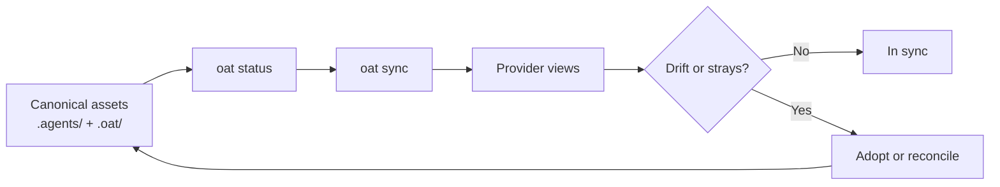

# Provider Sync

Use this section when you want OAT to project a canonical rules-and-skills layout into provider-specific surfaces such as Claude, Cursor, Copilot, Gemini, or Codex.

Provider sync is a standalone path. You can adopt it without using tracked OAT projects, and then layer workflow artifacts on top later if you need them.

## Contents

- [Scope and Surface](scope-and-surface.md) - Canonical assets, provider views, scopes, and the sync surface area.
- [Commands](commands.md) - `oat status`, `oat sync`, and `oat providers ...` behavior.
- [Providers](providers.md) - Provider-specific mappings, capabilities, and path conventions.
- [Manifest and Drift](manifest-and-drift.md) - How OAT tracks synced state, stray files, and adoption decisions.
- [Config](config.md) - Provider config model, enablement, and scope semantics.

## What This Section Covers

- canonical assets in `.agents/skills`, `.agents/agents`, and `.agents/rules`
- derived provider views that should be treated as synced outputs unless explicitly adopted
- drift detection, stray discovery, and adoption decisions when provider files change
- command behavior for inspecting sync state, configuring providers, and writing synced output

## Sync Flow

## Typical Flow

1. Run `oat init` to create canonical OAT directories and base config.
2. Inspect current state with `oat status`.
3. Enable or adjust providers with `oat providers ...` as needed.
4. Run `oat sync` to materialize provider views from canonical assets.
5. Re-run `oat status` after edits to confirm drift, adoption, or sync needs.

## Canonical Rules and Adoption

Recent OAT changes moved more behavior into canonical rules plus explicit adoption flows. In practice that means:

- treat `.agents/` and `.oat/` content as the source of truth
- use sync and adoption workflows to pull provider-side edits back into canonical form
- avoid maintaining long-lived, hand-edited provider copies when the canonical source can own the change

## Related Contributor Docs

- [Hooks and Safety](../../contributing/hooks-and-safety.md) - Operational safety guidance for hooks, mutation commands, and synced changes.
- [Writing Skills](../../contributing/skills.md) - Contributor guidance when sync behavior depends on skill authoring changes.

## If You Are Trying To...

- operate sync, drift, or provider configuration as a user, stay in this section
- change hook behavior or understand mutation safety, jump to [Hooks and Safety](../../contributing/hooks-and-safety.md)
- update canonical skills that later sync into provider views, jump to [Writing Skills](../../contributing/skills.md)
