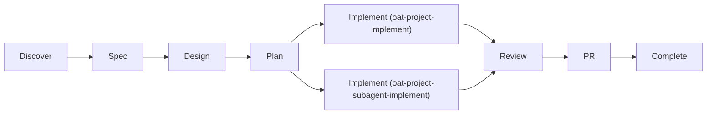
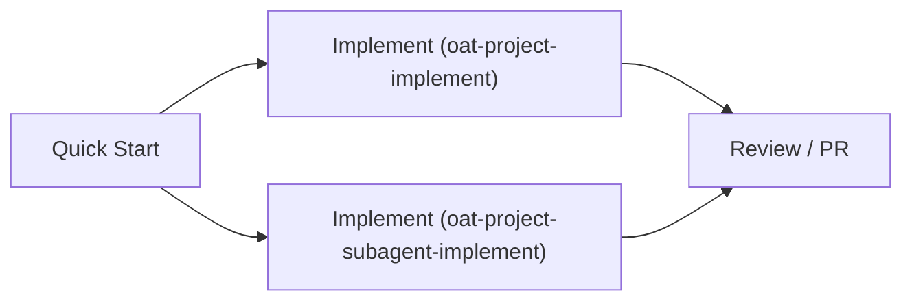
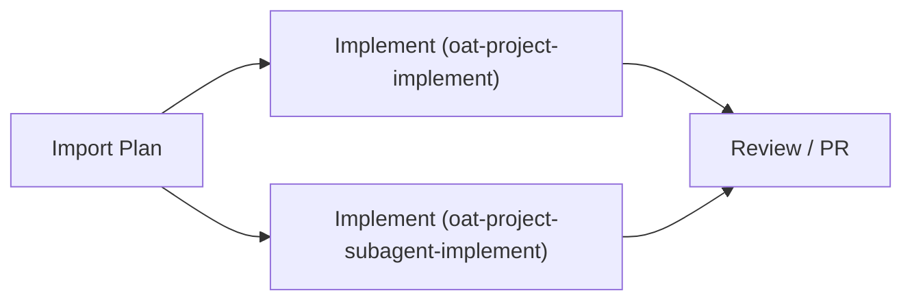

# Lifecycle

This lifecycle is an optional OAT layer. Interop-only users can skip it.

OAT lifecycle order:

1. Discovery (`oat-project-discover`)
2. Spec (`oat-project-spec`)
3. Design (`oat-project-design`)
4. Plan (`oat-project-plan`)
5. Implement (`oat-project-implement` or `oat-project-subagent-implement`)
6. Review loop (`oat-project-review-provide` / `oat-project-review-receive`)
7. PR (`oat-project-pr-progress` / `oat-project-pr-final`)
8. Complete (`oat-project-complete`)

## Implementation modes

- **Sequential (default):** `oat-project-implement`
- **Parallel/subagent-driven:** `oat-project-subagent-implement`
- Use `oat project set-mode <single-thread|subagent-driven>` to persist mode in project state.
- `oat-project-implement` remains the canonical consumer and redirects when mode is `subagent-driven`.

## Review receive behavior

- `oat-project-review-receive` now presents a findings overview before asking for any disposition decisions.
- Findings are shown with stable IDs by severity (`C*`, `I*`, `M*`, `m*`) so follow-up choices map clearly to specific items.
- For each finding, the receive step summarizes the reviewer note, adds agent analysis, and gives a recommendation (convert now vs defer with rationale).

## Alternate lifecycle lanes

### Quick lane diagram

1. `oat-project-quick-start`
2. Implement:
   - `oat-project-implement` (sequential)
   - `oat-project-subagent-implement` (parallel/subagent-driven)
3. `oat-project-review-provide` / `oat-project-pr-final`
4. Optional `oat-project-promote-spec-driven` to backfill spec-driven lifecycle artifacts in-place

### Import lane diagram

1. `oat-project-import-plan`
2. Implement:
   - `oat-project-implement` (sequential)
   - `oat-project-subagent-implement` (parallel/subagent-driven)
3. `oat-project-review-provide` / `oat-project-pr-final`
4. Optional `oat-project-promote-spec-driven` to switch project mode to spec-driven lifecycle

## Lane diagrams

### Spec-Driven workflow lane

### Quick lane

### Import lane

## Artifact progression

`discovery.md` -> `spec.md` -> `design.md` -> `plan.md` -> `implementation.md`

Quick lane progression:

`discovery.md` -> `plan.md` -> `implementation.md` (`spec.md`/`design.md` optional)

Import lane progression:

`references/imported-plan.md` -> `plan.md` -> `implementation.md` (`spec.md`/`design.md` optional)

## Operational rules

- Keep `state.md`, `plan.md`, and `implementation.md` synchronized.
- Stop at configured HiLL checkpoints.
- Do not move lifecycle forward when required review gates are unresolved.

## Active project resolution

- Active project state is stored in `.oat/config.local.json` (`activeProject`, repo-relative path).
- Projects root is stored in `.oat/config.json` (`projects.root`) and can be read via `oat config get projects.root`.
- Workflow skills prefer `oat config get activeProject` / `oat config get projects.root` rather than reading pointer files directly.

## Reference artifacts

- `.oat/projects/<scope>/<project>/spec.md`
- `.oat/projects/<scope>/<project>/design.md`
- `.oat/projects/<scope>/<project>/plan.md`
- `.oat/projects/<scope>/<project>/implementation.md`
