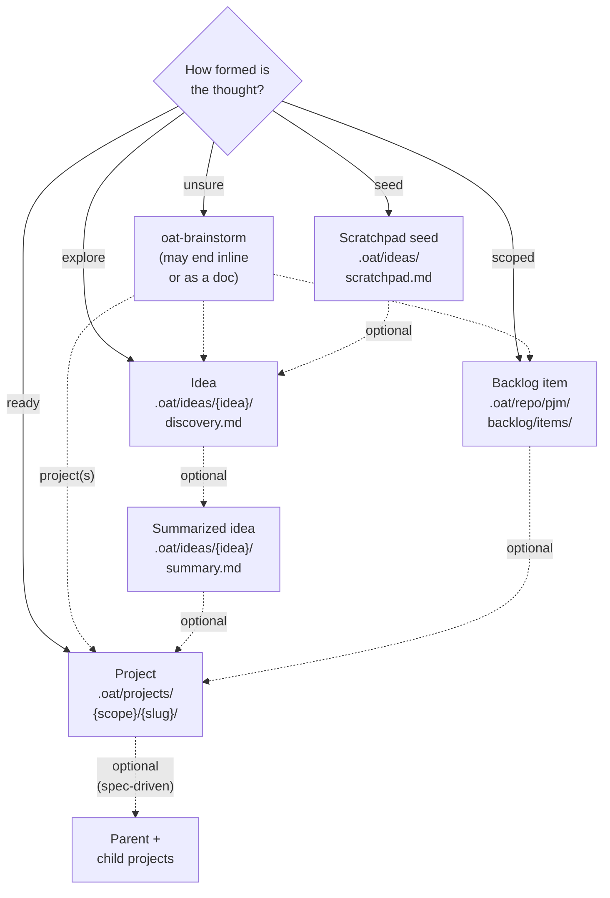

# Ideas Lifecycle

The ideas lifecycle is intentionally lightweight compared to the project workflow.

## Levels

Ideas can be stored at two levels:

- **Project level** (default) — `.oat/ideas/` in the current project, gitignored
- **User level** (global) — `~/.oat/ideas/` in the home directory, for ideas not tied to a specific project

All idea skills accept a `--global` flag to operate at user level. Without the flag, skills auto-detect the level by checking for an active idea pointer or existing ideas directory at each level.

Each level has its own independent backlog, scratchpad, and active-idea config value.

## Flow

Start in the home that matches how formed the thought is. Every home is a fine place to stop. Dashed arrows are optional moves.



Where to start:

- **Unsure:** `oat-brainstorm`. It can end as an inline answer or a document,
  or hand off to an idea, a backlog item, or one or more projects.
- **A one-line seed:** `oat-idea-scratchpad`.
- **Worth exploring:** `oat-idea-new`. `oat-idea-ideate` resumes an idea, can
  start one from a scratchpad seed, and can reopen a summarized idea.
- **Scoped work for later:** `oat-pjm-add-backlog-item` (needs `oat pjm init`).
- **Ready to build:** `oat-project-lite`, `oat-project-quick-start`,
  `oat-project-new`, or `oat-project-import-plan` for a plan written elsewhere.

Optional moves:

- Seed to idea: `oat-idea-new`.
- Idea to summarized idea: `oat-idea-summarize`.
- Summarized idea to project: the documented route is `oat-project-new` and
  then `oat-project-discover`, with `summary.md` as the request. That is a
  spec-driven project.
- Backlog item to project: start any project skill and give it the item (or
  its kickoff handoff) as context. Archive the item with `oat backlog archive`
  when the work ships.
- Split into parent and child projects: from spec-driven discovery
  (`oat-project-discover`), or directly from `oat-brainstorm`.

Good to know:

- Moving on leaves the earlier record in place. It is archived, not moved.
- The paths shown are project-level defaults. With `--global`, ideas live in
  `~/.oat/ideas/`. Ideas are local and usually gitignored.
- The ideas backlog (`backlog.md` inside the ideas folder) is an index of
  ideas. It is not the repository backlog under `.oat/repo/pjm/backlog/`.
- Backlog items are committed to the repository. Projects are committed
  (shared scope), pushed to a project ref (synced scope, the default on a
  fresh install), or kept on your machine (local scope).

1. Quick capture: `oat-idea-scratchpad` to review or capture idea seeds
2. Start brainstorming: `oat-idea-new` (scaffolds directory, then invokes `oat-idea-ideate`)
3. Resume brainstorming: `oat-idea-ideate` (multiple sessions over time)
4. Finalize: `oat-idea-summarize` (generates summary, updates backlog)

## Relationship to `oat-brainstorm`

The always-on `oat-brainstorm` skill (in the `brainstorm` tool pack) can feed into this workflow. When a brainstorming conversation converges on an ideas-pack destination, the dispatcher follows the same flow above and seeds it with the brainstorming session content:

- **Capture as new idea** — runs `oat-idea-new` Steps 3-7 inline and pre-fills the new idea's `discovery.md` from the brainstorming payload (`What's the Idea?` from the synthesized summary + motivation, `What Would It Look Like?` from the vision, `Open Questions` from the conversation, plus a first session under `Notes & Discussion` headed `### Session: YYYY-MM-DD (seeded from oat-brainstorm)`). The dispatcher then optionally chains into `oat-idea-ideate` Step 4 to keep brainstorming inside the idea, or stops with the session captured.
- **Extend existing idea** — jumps straight to `oat-idea-ideate` Step 4 (Start New Session) on the chosen idea path and appends the brainstorming transcript as a new session under `Notes & Discussion`.
- **Summarize directly** — fast path that runs the capture flow silently and then invokes `oat-idea-summarize` end-to-end, producing both the idea record and the summary in one shot. Only offered when the brainstorming conversation produced enough material to summarize directly.

`oat-brainstorm` sets `activeIdea` automatically when its destination lands in this workflow. If the brainstorming conversation converges on a non-ideas destination instead (scoped backlog item, new project, doc-to-path, inline), `oat-brainstorm` does not touch ideas — see [Tool Packs](../../getting-started/tool-packs.md) for the full brainstorm pack reference.

## Directory structure

```text
# Project level
.oat/ideas/
├── backlog.md              # Aggregated list of all ideas
├── scratchpad.md           # Quick-capture pad for idea seeds
└── {idea-name}/
    ├── discovery.md        # Brainstorming document
    └── summary.md          # Generated when finalized

# User level (global) — same structure
~/.oat/ideas/
├── backlog.md
├── scratchpad.md
└── {idea-name}/
    ├── discovery.md
    └── summary.md
```

## State model

Ideas track two states in `discovery.md` frontmatter:

- `brainstorming` — actively being explored
- `summarized` — finalized with a summary document

No `state.md` per idea. No HiLL gates. No knowledge base dependency.

## Active idea

Each level stores the active idea in its config file:

- Project level: `activeIdea` in `.oat/config.local.json` (gitignored)
- User level: `activeIdea` in `~/.oat/config.json`

Read/write via CLI: `oat config get activeIdea` / `oat config set activeIdea <path>`.

Ideas and projects use separate config keys and do not interfere with each other.

## Scratchpad

The scratchpad is a checklist for capturing idea seeds quickly. Each entry supports nested bullets for quick notes:

```markdown
- [ ] **{idea name}** - {brief summary} _(YYYY-MM-DD)_
  - {quick note}
  - {another note}
```

Use `oat-idea-scratchpad` to review entries or quick-capture new ones. When `oat-idea-ideate` runs without an active idea, it also shows scratchpad entries alongside existing ideas. Selecting a scratchpad entry scaffolds the idea inline.

## Backlog

The backlog (`backlog.md`) aggregates all ideas in three sections:

- **Active Brainstorming** — ideas currently being explored
- **Captured Ideas** — summarized and ready for future consideration
- **Archived** — completed, abandoned, or promoted to projects

## Promotion to project

To promote a summarized idea to a Spec-Driven OAT project:

1. Run the `oat-project-new` skill with the idea name to scaffold the project
2. Run the `oat-project-discover` skill and use the idea's `summary.md` as the initial request
3. Update the ideas backlog entry to Archived with reason: promoted to project

If the work hasn't been summarized as an idea yet — or never was an idea to begin with — `oat-brainstorm`'s **"promote to a new OAT project"** destination is a parallel route. The brainstorm dispatcher scaffolds the project via `oat project new <slug> --mode <mode>`, writes the seeded `discovery.md` directly from the brainstorming payload (Initial Request, Solution Space with approaches considered, Chosen Direction, Key Decisions, Open Questions), and stops with a pointer to `oat-project-quick-start` or `oat-project-design`. It deliberately writes `discovery.md` only — never a partial `design.md` — so the design phase keeps its full collaborative cadence.

## Initialization

The ideas directory is created automatically by `oat-idea-new` or `oat-idea-scratchpad` on first use. Future: `oat init ideas` will scaffold the directory and copy idea skills into the project.

## Reference artifacts

- `{IDEAS_ROOT}/backlog.md`
- `{IDEAS_ROOT}/scratchpad.md`
- `{IDEAS_ROOT}/{idea-name}/discovery.md`
- `{IDEAS_ROOT}/{idea-name}/summary.md`
- `.oat/templates/ideas/`

## oat-idea-scratchpad

**Invocation:** `/oat-idea-scratchpad capture` or
`/oat-idea-scratchpad review`; add `--global` for the user-level scratchpad.
These are agent instructions, not shell commands. Codex uses
`$oat-idea-scratchpad`, or you can ask for the skill by name; the same
convention applies to the other idea skills below.

**Prerequisites:** Installed idea templates and a chosen ideas level. Neither
an active idea nor an OAT lifecycle project is required. Without `--global`,
the skill resolves existing idea pointers/directories and asks when the
destination is ambiguous; repository-level ideas do not mean an active
project is required.

**Example scenario:** During a support review, you notice that upload failures
might be easier to recover if customers could keep a recovery token. Capture
the seed and one or two observations now without stopping the review to
design a feature. In a later review session, inspect the unchecked seeds and
choose which one deserves exploration.

**Expected output:** Capture adds a named, dated checklist entry with the
required one-line summary and any supplied notes to
`{IDEAS_ROOT}/scratchpad.md`, initializing the scratchpad/backlog from
templates on first use. Review reads the existing seeds instead. A captured
seed is not a project, formal requirement, or implementation commitment.

**Next step:** Explicitly select a seed for [oat-idea-ideate](#oat-idea-ideate)
or start a named idea with [oat-idea-new](#oat-idea-new). Capture offers these
actions but does not automatically launch brainstorming.

## oat-idea-new

**Invocation:** `/oat-idea-new upload-recovery`, with optional `--global`.
Supply a new idea name, or answer the naming question. Confirm the ideas
level if both repository and user stores are possible.

**Prerequisites:** Installed ideas templates and the chained
`oat-idea-ideate` skill, plus a writable chosen ideas store. No existing
idea or active OAT project is required. A name collision is not permission
to overwrite an existing discovery document.

**Example scenario:** You chose the upload-recovery seed for a longer
conversation and want its notes to survive across sessions. Create a named
idea rather than a project so the team can explore its value before
committing to scope or implementation.

**Expected output:** `{IDEAS_ROOT}/upload-recovery/discovery.md`, an Active
Brainstorming backlog entry, and an `activeIdea` pointer to the new record.
The workflow initializes missing idea indexes, checks for a matching
scratchpad seed, verifies setup, and hands off to ideation. The idea pointer
is separate from the active-project pointer.

**Next step:** Continue the conversational exploration with
[oat-idea-ideate](#oat-idea-ideate). Keep uncertainty as questions rather than
turning a freshly created template into an approved design.

## oat-idea-ideate

**Invocation:** `/oat-idea-ideate`, with optional `--global`, to resume the
resolved idea or select an actual existing idea/scratchpad seed when
prompted. For an untracked, destinationless brainstorm, use `oat-brainstorm`
instead of inventing a scratchpad entry as the starting point.

**Prerequisites:** An existing tracked idea or an explicitly selected
unchecked scratchpad seed. Selecting a seed uses the new-idea scaffolding
steps before continuing. No active lifecycle project is required. If there
are no ideas or seeds, the skill stops with capture/new-idea guidance.

**Example scenario:** After speaking with support, you have new questions
about who would use a recovery token. Resume the upload-recovery idea, review
the earlier notes, and explore the new observations without converting the
session into architecture work or a task breakdown.

**Expected output:** A dated session in the idea's `discovery.md`, capturing
discussion, observations, and open questions. If the idea was already
summarized, choose explicitly whether to reopen brainstorming, view its
summary, or select a different idea. The exploratory mode does not write
code, a specification, or an implementation plan.

**Next step:** Resume another session if the idea is still unclear, or use
[oat-idea-summarize](#oat-idea-summarize) when the discovery content is mature
enough for a stable handoff.

## oat-idea-summarize

**Invocation:** `/oat-idea-summarize`, optionally with `--global`, for the
resolved idea. Review the generated summary before accepting it.

**Prerequisites:** An active idea with meaningful `discovery.md` content,
the summary template, and the chained ideation skill for a return to
brainstorming. This is an idea requirement, not an active-project
requirement; an empty scaffold is insufficient evidence for a useful
summary.

**Example scenario:** Several sessions established the recovery-token idea's
audience, potential value, and main unknowns. Summarize those findings so the
team can revisit the concept next month without rereading every session.
Keep unresolved security and operational questions visible rather than
presenting the concept as approved to build.

**Expected output:** A proposed `summary.md` synthesizing the idea's overview,
key points, value, possible effort, next steps, references, and open
questions. Acceptance changes discovery state to `summarized` and moves its
backlog entry to Captured Ideas. Refinement requires another review; choosing
continued brainstorming discards the proposed summary and does not finalize
state or backlog.

**Next step:** Keep the summarized idea for future prioritization or explicitly
start a project using its summary as input. Summarization itself neither
creates a lifecycle project nor authorizes implementation.
