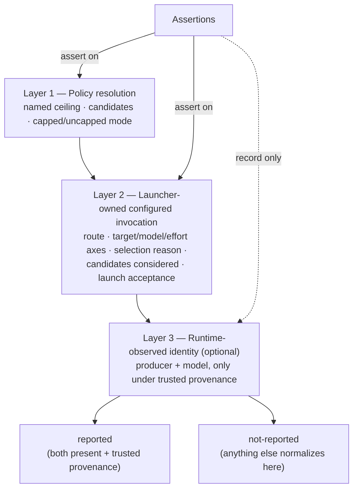

# Evidence Layers

OAT dispatch evidence is layered so that trust flows from what OAT can prove
toward what it can only observe. The launcher always knows which policy it
resolved and which exact route it configured and launched, so that evidence is
authoritative. A child's self-report of its own model is corroboration, not
ground truth — it may be missing, delayed, or untrusted without ever
invalidating the configured-invocation record.

The model has **three layers**. The first two are what OAT decided and did; the
third is what a runtime happened to say about itself. Assertions target the
first two layers. The third is recorded as `reported` or `not-reported` and
never gates a conclusion on its own.

## Layer map

Assertions bind to Layers 1 and 2. Layer 3 is recorded as `reported` or
`not-reported`; its absence never invalidates Layer 2.

## Layer 1 — Policy resolution

Layer 1 is the output of the dispatch-ceiling / policy resolver: the named
ceiling in effect, the eligible candidates under that ceiling, and whether the
policy is capped (a named maximum such as `balanced` or `high`), uncapped
(explicit managed state), or inherit/default. It answers _what was allowed_
before any single task chose a target.

This layer is a maximum and a candidate set, not a selection. A named `high`
ceiling keeps lower configured tiers eligible; it does not pin one family or
effort. See [Dispatch Policy](dispatch-ceiling.md) for named policy choices,
candidate ladders, and the resolver contract.

## Layer 2 — Launcher-owned configured invocation

Layer 2 is the dispatch record the launcher writes when it selects and launches
a route. It is the **authoritative evidence of what was configured and
launched**, and it records:

- the selected route and the exact target, model axis, and effort axis;
- the `selection.reason`, drawn from the stable shared values `native-catalog`,
  `native-catalog-unsatisfying`, `pre-start-rejection`, `inherit`, and
  `gate-target` (adapters may add a more specific diagnostic but never replace
  or rename these);
- the ordered `candidates_considered` before launch (never sorted);
- launch acceptance status (`accepted` or `blocked-before-start`) and mechanism.

Because the launcher constructs the invocation payload itself, this layer does
not depend on any child cooperation. A launch is judged consistent only when its
candidate tier, selected model/effort axes, ceiling model/effort axes, policy,
and exact target all agree. The `atOrBelowCeiling` boolean the launcher provides
is retained as source evidence but is **not trusted** by assertions — they
recompute eligibility from the configured candidates and named ceiling instead.
This layer maps to Dispatch Report V1 and its provenance record; see the
[Dispatch Report V1 / producer provenance](dispatch-ceiling.md#dispatch-report-v1-and-producer-provenance)
section.

For project-aware work, OAT persists this native dispatch lineage as one
generic record per request under the project's `dispatch/` directory. The
generic snake-case fields remain authoritative. A namespaced `oat` block adds
only canonical-role identity, proven pre-start rejection, fallback linkage,
and optional runtime observation. `DispatchReportV1` and the parseable
`Dispatch:` compatibility stamp keep their existing byte shape.

The launcher constructs and redacts the complete payload before calling the
native host, then records the host's accepted or `blocked-before-start` result
immediately. Only a provider-wrapper attestation proving that no child started
can authorize one fresh, exact-target fallback record. Timeout, `BLOCKED`,
refusal after acceptance, runtime mismatch, missing telemetry, and malformed
output cannot authorize replacement.

## Layer 3 — Runtime-observed identity (optional corroboration)

Layer 3 is the only layer that reflects what a runtime said about itself, and it
is optional corroboration. It is normalized to `reported` **only** when both the
`producer` and `model` are present _and_ provenance is one of
`runtime-observed`, `provider-output`, or `gate-corroborated`. Anything else —
missing producer, missing model, or a non-trusted provenance value — normalizes
to `not-reported`.

Requested controls, configured defaults, role-name parsing, and reviewer
self-identification do not become observed runtime identity. Crucially, a
missing or `not-reported` runtime identity **never invalidates** the
launcher-owned configured-invocation evidence in Layer 2. Selected model and
effort axes stay exact even when runtime producer identity is not reported.

### Provider metadata observation

`oat project dispatch record` accepts an optional post-launch observation event
whose `metadata` is a sanitized provider envelope — `provider`, `observedAt`,
and `entries` — and normalizes it against the record's own immutable configured
invocation. The result is stored under the record's `oat.runtimeObservation`.

The channel is metadata-only and capability-gated:

| Provider | Observed axes                                      | Notes                                                                 |
| -------- | -------------------------------------------------- | --------------------------------------------------------------------- |
| Codex    | child lineage, role, model, effort, service tier   | Read from `session_meta` and `turn_context` metadata entries.         |
| Claude   | role, model, service tier; effort is `not-exposed` | Read from the `system`/`init` and `result` metadata entries.          |
| Cursor   | none                                               | Explicitly `not-reported`; requested values are never copied into it. |

Parsers classify entries by their `type` discriminator alone, so a conversation
entry's body is never read, and only bounded provider identifiers are extracted.
Prompts, messages, credentials, and transcript bodies are refused at the input
boundary rather than filtered out of a stored record; a raw, unsanitized
transcript is rejected instead of being partially accepted.

Comparison covers only the axes both sides report. With no comparable axis the
match is `not-comparable`, because silence is not agreement. An axis a provider
does not expose (`not-exposed`) is excluded rather than compared as a literal.
An axis the configured invocation names under two equally authoritative
spellings — a canonical role name and its materialized native selector —
matches either.

A parse failure, a declined request correlation, an unsupported provider, or an
absent envelope all produce `not-reported`. None of them copies a requested
argument or a materialized pin into observed state, and `mismatching` is
evidence only: it authorizes no replacement, retry, or fallback, and leaves
`launch_status`, `child_outcome`, and every configured control untouched. The
`--json` result reports `runtimeIdentity.configured` and
`runtimeIdentity.observed` as separate objects that are never merged into one
"effective" identity.

## How the smoke runner consumes these layers

The smoke runner's evidence pipeline reads all three layers and asserts only on
the trustworthy ones. Launcher-owned records (`dispatch/<scope>-<attempt>.json`),
orchestration state-transition records, and gate JSON are written before
collection. The collector then flows the evidence through three stages:

1. **Bundle** — collect the immutable dispatch, orchestration, and gate records
   into a normalized evidence bundle, preserving structured candidates and
   recomputing eligible candidates through the named ceiling. Runtime identity
   is normalized here to `reported` / `not-reported`.
2. **Assertion profiles** — apply the profiles that assert on Layers 1 and 2
   (policy resolution and configured invocation), while recording Layer 3 as
   corroboration only.
3. **Report** — emit the evidence report from launcher-owned records and gate
   artifacts, carrying `reported` / `not-reported` runtime status without
   letting a missing Layer 3 fail a Layer 2 assertion.

The collector projects `runtimeObservation` the same way: it reads committed
records and never launches a provider, so an observation appears in a bundle
only because a launcher-owned record already carried one. A partially filled
observation normalizes to `not-reported` rather than being completed from any
other layer.

For how to run this end to end and when to refresh the fixture, see
[Smoke testing](../../contributing/smoke-testing.md).

## Related

- [Dispatch Policy](dispatch-ceiling.md) — Dispatch Report V1 and the
  producer-provenance record that back Layers 1 and 2.
- [Orchestration Model](orchestration-model.md) — the dispatch topology that
  produces these records.
- [Review Flavors](review-flavors.md) — how the four review flavors are recorded
  through the same launcher-owned evidence.
- [Smoke testing](../../contributing/smoke-testing.md) — operating the evidence
  pipeline against real providers.
