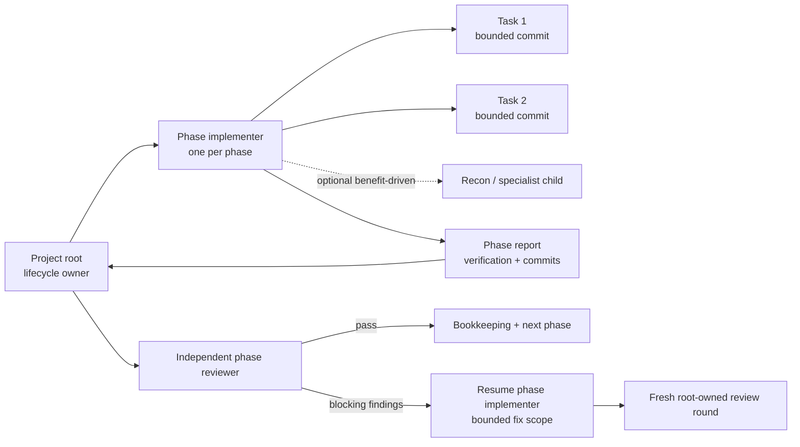
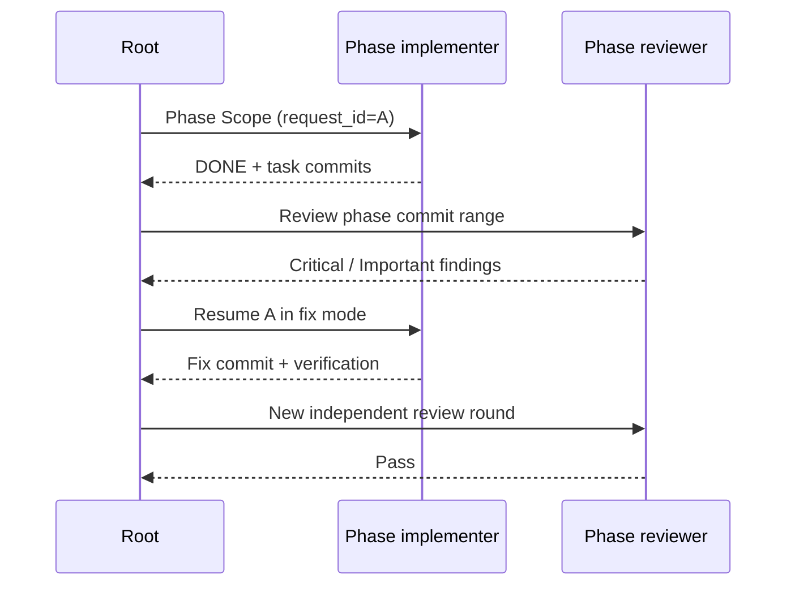

# Implementation Execution

`oat-project-implement` owns the project lifecycle. It dispatches one phase
implementer per phase, validates that agent's task commits, dispatches the
independent phase reviewer, routes blocking findings back to the phase agent,
and updates project state.

## Quick Look

- **Phase boundary:** one phase implementer directly executes every planned task
  in dependency order.
- **Task boundary:** each task still produces exactly one bounded, verified
  commit.
- **Prevention boundary:** formatting, declared task verification, and
  applicable cheap checks run before the task commit.
- **Recovery boundary:** an eligible post-commit defect may produce a separate
  same-target recovery commit under the phase's bounded recovery authority.
- **Review boundary:** the root dispatches one independent reviewer after the
  phase report.
- **Fix boundary:** blocking findings return to the original phase handle when
  possible.
- **Final exit-gate boundary:** after final verification and final lifecycle
  review, the root resolves the configured implementation gate before
  approval-aware sequencing, final HiLL, completion, or success output.
- **Optional nesting:** a phase agent may dispatch bounded recon, fanout, or
  specialist work when that materially helps. Ordinary tasks do not require a
  third tier.
- **Parallelism:** plan-declared phases may run concurrently in separate
  worktrees. Tasks inside one phase remain serial.

Tasks execute serially in one worktree for the phase.



## Ownership

### Project root

The root:

- resolves the active project, execution tier, dispatch policy, and phase
  schedule;
- selects and launches the phase implementer;
- validates the phase report, commit range, file boundaries, and worktree
  cleanliness;
- selects and launches the phase reviewer;
- owns retry limits, review disposition, worktree fan-in, HiLL checkpoints, and
  tracking-artifact commits; and
- runs external phase gates and final closeout.

The root does not implement phase tasks while an accepted phase launch owns
that scope.

### Phase implementer

The phase implementer receives one `Phase Scope`, reads the relevant artifacts
once, and directly executes each task in plan order. For every task it:

1. records the pre-task HEAD;
2. implements only the declared task files;
3. runs task verification;
4. self-checks requirements and scope before commit;
5. creates exactly one task commit; and
6. verifies the commit, file boundary, tests, and clean worktree.

After all tasks, it runs phase-wide verification and returns a compact report.
It does not dispatch the phase reviewer or mutate general project bookkeeping.
While it owns the worktree, it may atomically update only the active phase's
authoritative `oat_phase_recovery_policy.phase_attempt_usage.<pNN>` entry. The
phase returns with a matching committed `completed` or `failed` terminal marker
still present. The root validates that marker against the report, recovery
event, immutable history, attempt accounting, exact target, and verification
before clearing it. Only the post-validation null marker is the settled ledger
state; a premature clear or contradictory marker fails closed.

## Prevent Defects Before Commit

Prevention is the first recovery control. Before each planned task commit, the
phase implementer runs checks in this order:

1. format every changed file;
2. run the task's declared verification;
3. run every repository-discovered cheap check that applies to the changed
   surface and is proportionate to the task; and
4. run a discoverable scoped build or test when the task changes emitted
   output, build or test configuration, packaging, or equivalent behavior.

Broad repository tests and builds may remain phase-level when running them for
every task would be disproportionate. These broader checks verify that the
phase's task outputs compose correctly. A correction made before the planned
task commit is prevention and does not consume a recovery attempt.

## Recover After Commit

When declared task, transition, or phase verification finds a post-commit
defect, OAT classifies it before editing. Automatic recovery proceeds only when
the correction is mechanically bounded, unambiguous, in phase, non-destructive,
and verifiable, and when the exact launcher-owned implementation target and
original-request provenance remain intact. Architecture, security, product,
requirements, public-behavior, credential, protected-branch, destructive, or
non-mechanical scope changes require operator direction.

The accepted task commit remains immutable. For an eligible defect, the phase
implementer reserves an attempt in the authoritative phase ledger, applies the
bounded correction, creates exactly one append-only recovery commit, reruns the
failing focused check and relevant phase verification, and continues without a
new authorization prompt. Mechanically related failures from one verification
command may share one atomic attempt and commit; independent defects require
separate attempts and commits.

Append-only history protects accepted work by requiring a new, auditable commit;
it does not require repeated approval for a mechanical repair already covered
by the phase's standing authority. The important distinctions are:

- a **defect** is a post-commit failure discovered by declared verification;
- an **authorization prompt** is required only at a direction-required
  boundary, not for every eligible defect;
- a **continuation** preserves the original request and exact target, either in
  the accepted handle or through an explicitly linked fresh same-target
  recovery launch; and
- a **successful repair** produces one immutable append-only recovery commit.

This recovery is not accepted-launch fallback. After a launch is accepted,
completion, failure, timeout, interruption, `BLOCKED`, or contract refusal never
makes another model, provider, route, or worker eligible. A fresh launch is
permitted only when the caller-specific lifecycle contract already authorized
bounded recovery, the accepted handle cannot resume, the exact original target
remains bindable, a pending attempt is reconciled, and the existing
`continuation_events` record links it to the original request.

### Recovery Budget

`oat_phase_recovery_policy` is dedicated to implementation recovery and is
independent of `oat_orchestration_retry_limit`, which continues to govern
review-fix and gate loops. The project default is `10` attempts per phase.
Project defaults and phase-specific overrides accept integers from `0` through
`20`; `0` disables automatic post-commit repair for that scope.

Attempt usage is monotonic and durable per phase. A new attempt is consumed
before the bounded edit begins, so a failed edit, commit, or re-verification
cannot retry for free. An already-reconciled pending attempt may finish without
another reservation, even when usage equals the limit. Evidence of an
infrastructure or flaky failure permits one no-edit rerun without consuming an
attempt; a repeated unexplained failure is ambiguous and stops without editing.

At three recovery events, the phase report warns about elevated recovery volume
but may continue while every eligibility condition and the budget remain valid.
At exhaustion, OAT stops for one explicit operator outcome:

1. **Add N attempts:** set that phase's total limit to `used_attempts + N`,
   capped at `20`, without resetting prior usage.
2. **Authorize changed scope:** record a separate consequential or
   scope-expanding action outside automatic recovery.
3. **Stop:** preserve the worktree, immutable history, and evidence.

### Recovery Event

Every recovered, direction-required, or failed-attempt disposition emits
exactly one event with this heading, label order, and vocabulary:

```markdown
### Recovery Event {event-id}

- Phase/task: {phase and originating task when known}
- Original request: {original_request_id}
- Original commit: {immutable task commit}
- Defect class: lint | type | test | build | composition | other
- Discovered by: {exact verification command or transition check}
- Disposition: recovered | direction-required | failed-attempt
- Authorization: phase-standing | operator-extension | operator-scope
- Attempt: {used}/{phase_recovery_limit}
- Dispatch target: {exact launcher-owned implementation target}
- Recovery commit: {sha or -}
- Verification: {focused and relevant phase result}
- Reason: {eligibility or stop-boundary evidence}
```

The event ledger keeps defect volume, authorization-prompt volume, continuation
volume, and successful repair commits measurable as separate facts. A failed
attempt still produces one event even when it produces no recovery commit.

### Pre-Change Baseline

The recorded pre-change baseline is nine recovery events plus two
operator-recovery continuations. Known failures included lint, composition, and
test-fixture defects; exact per-class counts are unavailable. The repeated
prompts exposed a latent policy under integration-heavy verification rather
than a recent regression. In particular, PR #176 changed phase-base anchoring
and is explicitly excluded from causation: the root still captures a fresh
phase base immediately before each launch, so earlier recovery commits are
already part of the next phase's base.

### Phase reviewer

The root sends the reviewer a fresh scope containing the authoritative phase
commit range, task IDs and boundaries, project artifacts, and verification
evidence. The review passes with zero Critical and zero Important findings.
Medium and Minor findings are recorded without blocking the phase.

## Final Exit-Gate Boundary

After every planned phase and review round finishes, the project root runs final
verification and the mandatory final lifecycle review. It then resolves
`workflow.gates.skills.oat-project-implement` and persists the result in
`oat_implement_exit_gate`. This configured gate is separate from the phase
reviewer, final lifecycle reviewer, and optional phase gate; none can substitute
for another.

Resolution and policy outcomes are explicit:

- A null resolution persists `allowed/no_gate` for the current implementation
  basis.
- A configured passing review persists `allowed/passed` after any eligible
  review receive is durably completed.
- `warn` persists `allowed/warned`; `prompt` proceeds only after explicit
  approval persists `allowed/prompt_approved`.
- `block`, an unresolved prompt, invalid or contradictory output, and
  operational or receive failures remain blocked. Remediation retries follow
  the persisted `maxAttempts` policy.

Gate execution is resumable across both launch and receive. Before launch, OAT
persists an attempt ID, start time, and result-receipt path. It correlates those
with the gate run marker, structured envelope, and run-bound artifact before it
accepts a result or relaunches. Before receive, it persists the handoff and
source/archive correlation; resume verifies the archived artifact, Reviews
event, and bookkeeping commit before marking receive complete. Missing,
contradictory, or ambiguous correlation fails closed. A valid accepted run or
completed receive is never duplicated.

Freshness is bound to the reviewed HEAD and a versioned implementation
fingerprint. New generations use an `effective-delta-v1` fingerprint over
Git's canonical NUL-delimited raw tree delta. The generation persists the
logical PR/default-branch base ref, requires one merge base, and hashes full
base and final modes and object IDs with rename detection disabled. This makes
same-file base changes visible while excluding commit history and human diff
context. Every effective-delta path is included except the exact project
`state.md` file that carries the digest and would otherwise be self-referential;
that structured state is validated independently.

Recognized closeout-only descendants preserve a valid result: gate artifacts
and receipts, project tracking and project-log appends,
summary/documentation/PR sequence outputs, final HiLL bookkeeping, and
completion bookkeeping. Recognition also requires the corresponding persisted
gate or sequence transition; a matching path category alone is insufficient.
After each authorized closeout boundary, the workflow advances a rolling
checkpoint to the complete effective delta at that HEAD. The checkpoint records
the last non-checkpoint commit; a following persistence commit is ignored only
when its diff changes that exact state carrier and nothing else.

A merge, rebase, or base update preserves the result only when its full
effective delta matches that rolling checkpoint. Conflict resolution or
branch-owned implementation, test, skill, template, or workflow changes that
alter the delta make the result stale, require a current final lifecycle review,
and start a new gate generation. No implementation or closeout output path is
excluded from the comparison. Legacy unqualified fingerprints retain the older
fail-closed descendant-path behavior and are not migrated in place.

This narrow merge-only exemption relies on fresh repository CI, automated
review such as Bugbot, and lifecycle self-review to cover integration risk.
Those checks do not substitute for the semantic gate on the full
implementation; they avoid repeating that expensive review when the
implementation outcome itself did not change.

Only an allowed and fresh gate disposition can enter the pre-approval sequence,
cross final HiLL, run the post-approval sequence, mark implementation complete,
or emit success.

## Update Installed Recovery Contracts

Bounded phase recovery ships in OAT `0.2.28`. After upgrading to that release or
later, update the installed OAT tools and then regenerate provider views from
the canonical contracts:

```bash
oat tools update
oat sync --scope all
```

Run the commands in that order before expecting global Claude, Codex, or Cursor
phase agents to use the new contract. Provider assets are generated views, not
independently maintained policy forks.

## Phase Scope

The root supplies one scope for the whole phase:

```yaml
project: .oat/projects/shared/example
phase_id: p02
mode: implement
artifact_paths:
  plan: .oat/projects/shared/example/plan.md
  design: .oat/projects/shared/example/design.md
  spec: .oat/projects/shared/example/spec.md
  implementation: .oat/projects/shared/example/implementation.md
workflow_mode: spec-driven
phase_base_head: abc123
worktree: /path/to/p02-worktree
commit_convention: 'feat({scope}): {description}'
request_id: dispatch-unique-id
dispatch_target: oat-phase-implementer-gpt-5-6-terra-high
selection_reason: native-catalog
candidates_considered:
  - oat-phase-implementer-gpt-5-6-terra-high
```

The phase target controls the phase agent. It does not require the same target
for optional nested work or review. Those launches resolve independently under
their own role policy.

## Dispatch Ceilings

A project or phase named ceiling is a maximum over the configured ordered
candidate ladder, not a fixed family preference. The root selects one exact
phase implementer target at or below that maximum. Review selection uses the
configured review ceiling, not a narrower phase task ceiling.
The root passes the recorded phase maximum through invocation-only
`--ceiling-tier`; it does not rewrite layered configuration.

Optional nested work also resolves an exact bounded target. If no nested work is
needed, OAT does not probe or require third-tier capacity.

Provider controls remain exact: Codex uses
`providers.codex.dispatchArgs.variant`, Claude uses
`providers.claude.dispatchArgs.model`, and Cursor uses
`providers.cursor.dispatchArgs.variant`. Cursor launches that exact
resolver-selected native agent type first; the flat ID and bracket-form pin
remain inside the explicit mapping and are never normalized by workflow prose.
The launcher records this selection as `configured`, while runtime identity
remains `not-reported` without independent observation. Only a pre-start native
role-selection rejection permits another target-preserving route.

See [Dispatch Policy](dispatch-ceiling.md) for configuration and
[Orchestration Model](orchestration-model.md) for the complete role map.

## Fix Continuity

When review finds Critical or Important issues, the root resumes the original
phase handle in `fix` mode with:

- the review artifact and bounded findings;
- the previous phase report;
- the original dispatch `request_id`; and
- a continuation event.

If a successfully completed phase handle is unavailable, the root may launch at
most one fresh phase agent with the same exact target and bounded fix scope.
The new dispatch record links to the original `request_id` through the existing
`continuation_events` field. This is a new fix scope, not replacement of an
accepted failed launch and not a new schema version.



## Parallel Phase Groups

For a plan-declared parallel group, the root:

1. records the orchestration HEAD;
2. creates one worktree per phase through `oat-worktree-bootstrap-auto`;
3. verifies ownership registration and the expected base;
4. dispatches one phase implementer per worktree concurrently;
5. owns each phase review and fix loop;
6. merges passing phases in plan order;
7. runs integration verification after each merge; and
8. cleans merged worktrees.

Containment, ownership, base, or fixture-readiness failure in smoke mode aborts
the run. It never authorizes replacement or sequential degradation.

## Codex Depth

Default execution needs the root-to-phase-agent depth. `agents.max_depth >= 2`
is useful capability for optional phase-agent nesting, but it is not a default
topology preflight requirement. OAT may still materialize a higher depth floor
so recon or specialist fanout is available when justified.

## Accepted Launches

Once a launch is accepted, its terminal result is authoritative. Timeout,
interruption, `BLOCKED`, or missing self-report does not authorize a replacement
route. Only explicit pre-start rejection can select another route.

The exception is `invalid-run-abort`: external containment or integrity
evidence proves the whole run invalid, so the runner cancels owned handles and
stops without treating cancellation as a child outcome.

## Related

- [Orchestration Model](orchestration-model.md)
- [Dispatch Policy](dispatch-ceiling.md)
- [Review Flavors](review-flavors.md)
- [Programmatic Execution](programmatic-execution.md)
- [Evidence Layers](evidence-layers.md)
