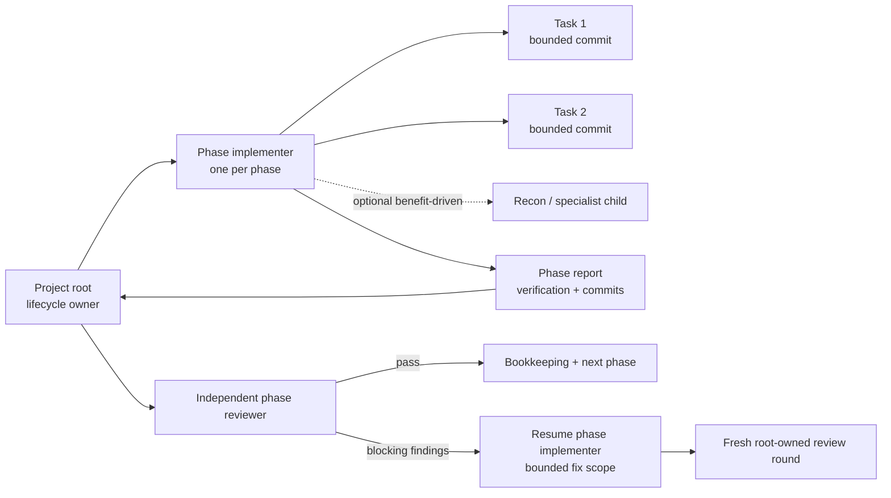
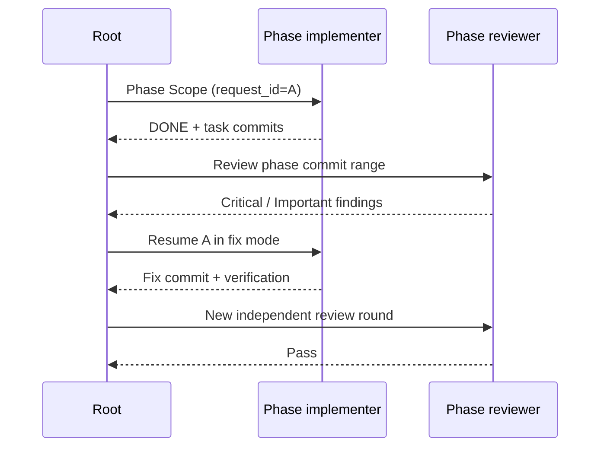

# Implementation Execution

`oat-project-implement` owns the project lifecycle. It dispatches one phase
implementer per phase, validates that agent's task commits, dispatches the
independent phase reviewer, routes blocking findings back to the phase agent,
and updates project state.

## Quick Look

- **Phase boundary:** one phase implementer directly executes every planned task
  in dependency order.
- **Task boundary:** each task still produces exactly one bounded, verified
  commit.
- **Review boundary:** the root dispatches one independent reviewer after the
  phase report.
- **Fix boundary:** blocking findings return to the original phase handle when
  possible.
- **Optional nesting:** a phase agent may dispatch bounded recon, fanout, or
  specialist work when that materially helps. Ordinary tasks do not require a
  third tier.
- **Parallelism:** plan-declared phases may run concurrently in separate
  worktrees. Tasks inside one phase remain serial.

Tasks execute serially in one worktree for the phase.



## Ownership

### Project root

The root:

- resolves the active project, execution tier, dispatch policy, and phase
  schedule;
- selects and launches the phase implementer;
- validates the phase report, commit range, file boundaries, and worktree
  cleanliness;
- selects and launches the phase reviewer;
- owns retry limits, review disposition, worktree fan-in, HiLL checkpoints, and
  tracking-artifact commits; and
- runs external phase gates and final closeout.

The root does not implement phase tasks while an accepted phase launch owns
that scope.

### Phase implementer

The phase implementer receives one `Phase Scope`, reads the relevant artifacts
once, and directly executes each task in plan order. For every task it:

1. records the pre-task HEAD;
2. implements only the declared task files;
3. runs task verification;
4. self-checks requirements and scope before commit;
5. creates exactly one task commit; and
6. verifies the commit, file boundary, tests, and clean worktree.

After all tasks, it runs phase-wide verification and returns a compact report.
It does not dispatch the phase reviewer or mutate project bookkeeping.

### Phase reviewer

The root sends the reviewer a fresh scope containing the authoritative phase
commit range, task IDs and boundaries, project artifacts, and verification
evidence. The review passes with zero Critical and zero Important findings.
Medium and Minor findings are recorded without blocking the phase.

## Phase Scope

The root supplies one scope for the whole phase:

```yaml
project: .oat/projects/shared/example
phase_id: p02
mode: implement
artifact_paths:
  plan: .oat/projects/shared/example/plan.md
  design: .oat/projects/shared/example/design.md
  spec: .oat/projects/shared/example/spec.md
  implementation: .oat/projects/shared/example/implementation.md
workflow_mode: spec-driven
phase_base_head: abc123
worktree: /path/to/p02-worktree
commit_convention: 'feat({scope}): {description}'
request_id: dispatch-unique-id
dispatch_target: oat-phase-implementer-gpt-5-6-terra-high
selection_reason: native-catalog
candidates_considered:
  - oat-phase-implementer-gpt-5-6-terra-high
```

The phase target controls the phase agent. It does not require the same target
for optional nested work or review. Those launches resolve independently under
their own role policy.

## Dispatch Ceilings

A project or phase named ceiling is a maximum over the configured ordered
candidate ladder, not a fixed family preference. The root selects one exact
phase implementer target at or below that maximum. Review selection uses the
configured review ceiling, not a narrower phase task ceiling.
The root passes the recorded phase maximum through invocation-only
`--ceiling-tier`; it does not rewrite layered configuration.

Optional nested work also resolves an exact bounded target. If no nested work is
needed, OAT does not probe or require third-tier capacity.

Provider controls remain exact: Codex uses
`providers.codex.dispatchArgs.variant`, Claude uses
`providers.claude.dispatchArgs.model`, and Cursor uses
`providers.cursor.dispatchArgs.variant`. Cursor launches that exact
resolver-selected native agent type first; the flat ID and bracket-form pin
remain inside the explicit mapping and are never normalized by workflow prose.
The launcher records this selection as `configured`, while runtime identity
remains `not-reported` without independent observation. Only a pre-start native
role-selection rejection permits another target-preserving route.

See [Dispatch Policy](dispatch-ceiling.md) for configuration and
[Orchestration Model](orchestration-model.md) for the complete role map.

## Fix Continuity

When review finds Critical or Important issues, the root resumes the original
phase handle in `fix` mode with:

- the review artifact and bounded findings;
- the previous phase report;
- the original dispatch `request_id`; and
- a continuation event.

If a successfully completed phase handle is unavailable, the root may launch at
most one fresh phase agent with the same exact target and bounded fix scope.
The new dispatch record links to the original `request_id` through the existing
`continuation_events` field. This is a new fix scope, not replacement of an
accepted failed launch and not a new schema version.



## Parallel Phase Groups

For a plan-declared parallel group, the root:

1. records the orchestration HEAD;
2. creates one worktree per phase through `oat-worktree-bootstrap-auto`;
3. verifies ownership registration and the expected base;
4. dispatches one phase implementer per worktree concurrently;
5. owns each phase review and fix loop;
6. merges passing phases in plan order;
7. runs integration verification after each merge; and
8. cleans merged worktrees.

Containment, ownership, base, or fixture-readiness failure in smoke mode aborts
the run. It never authorizes replacement or sequential degradation.

## Codex Depth

Default execution needs the root-to-phase-agent depth. `agents.max_depth >= 2`
is useful capability for optional phase-agent nesting, but it is not a default
topology preflight requirement. OAT may still materialize a higher depth floor
so recon or specialist fanout is available when justified.

## Accepted Launches

Once a launch is accepted, its terminal result is authoritative. Timeout,
interruption, `BLOCKED`, or missing self-report does not authorize a replacement
route. Only explicit pre-start rejection can select another route.

The exception is `invalid-run-abort`: external containment or integrity
evidence proves the whole run invalid, so the runner cancels owned handles and
stops without treating cancellation as a child outcome.

## Related

- [Orchestration Model](orchestration-model.md)
- [Dispatch Policy](dispatch-ceiling.md)
- [Review Flavors](review-flavors.md)
- [Programmatic Execution](programmatic-execution.md)
- [Evidence Layers](evidence-layers.md)
