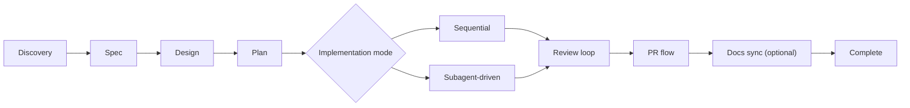
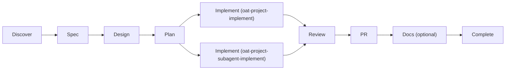
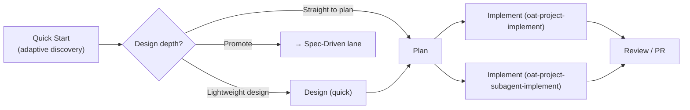
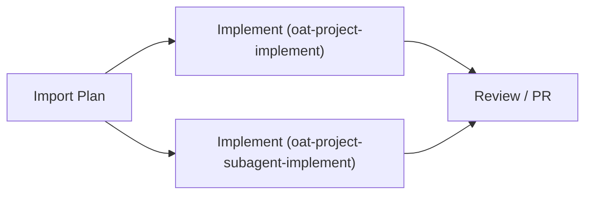
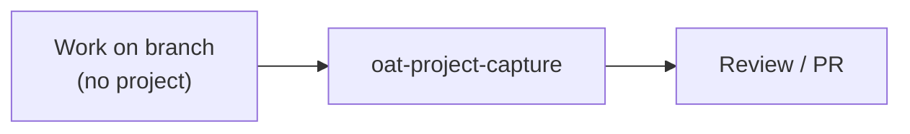

# Lifecycle

This lifecycle is an optional OAT layer. Interop-only users can skip it.

OAT lifecycle order:

1. Discovery (`oat-project-discover`)
2. Spec (`oat-project-spec`)
3. Design (`oat-project-design`)
4. Plan (`oat-project-plan`)
5. Implement (`oat-project-implement` or `oat-project-subagent-implement`)
6. Review loop (`oat-project-review-provide` / `oat-project-review-receive`)
7. Summary (`oat-project-summary`) — generates `summary.md` as institutional memory; `oat-project-pr-final` and `oat-project-complete` auto-refresh it when missing or stale
8. PR (`oat-project-pr-progress` / `oat-project-pr-final`) — sets `pr_open` status
9. Revision loop (`oat-project-revise`) — optional; accepts post-PR feedback
10. Documentation sync (`oat-project-document`) — optional; reads project artifacts to identify docs needing updates, checks `tools.project-management`, and auto-runs `oat-pjm-update-repo-reference` before scanning docs when the project-management pack is installed
11. Complete (`oat-project-complete`)

**Shortcut:** `oat-project-next` reads project state and invokes the correct next skill automatically — use it instead of remembering which skill comes next. Complements `oat-project-progress` (which is read-only diagnostic).

## Quick Look

- What it does: explains the end-to-end lifecycle for tracked OAT projects, including alternate quick and import lanes.
- When to use it: when you need the actual project execution model, not just a high-level overview of workflow mode.
- Primary entry points: `oat-project-new`, `oat-project-quick-start`, `oat-project-import-plan`, `oat-project-implement`

## Lifecycle Map

## Post-implementation flow

After implementation and final review pass:

1. **Summary** (`oat-project-summary`) — generates `summary.md` as institutional memory from project artifacts; PR-final and completion will auto-refresh it if you have not already run it or if it is stale
2. **Documentation** (`oat-project-document`) — optional sync of project docs; now uses the shared `tools.project-management` config signal to decide whether repo-reference refresh should run before docs analysis
3. **PR** (`oat-project-pr-final`) — creates PR description (auto-refreshes `summary.md` first when needed, then uses it as source), sets `oat_phase_status: pr_open`, and tracks actual PR existence with `oat_pr_status` / `oat_pr_url`
4. **Revision loop** (`oat-project-revise`) — accepts post-PR feedback:
   - Inline feedback creates `p-revN` revision phases with `prevN-tNN` task IDs
   - GitHub PR feedback delegates to `oat-project-review-receive-remote`
   - Review artifacts delegate to `oat-project-review-receive`
   - After revision tasks complete, state returns to `pr_open`
5. **Complete** (`oat-project-complete`) — accepts any phase status (`pr_open`, `complete`, `in_progress`), auto-refreshes `summary.md` before closeout when needed, and always archives the project locally

### Completion archive behavior

On completion, OAT now treats archive handling as part of the closeout lifecycle:

- Local archive is always written to `.oat/projects/archived/<project>/`.
- If `.oat/config.json` enables `archive.s3SyncOnComplete` and sets `archive.s3Uri`, completion also attempts an S3 upload for a dated snapshot such as `<archive.s3Uri>/<repo-slug>/projects/20260401-<project>/`.
- If `.oat/config.json` sets `archive.summaryExportPath`, completion copies `summary.md` to `<archive.summaryExportPath>/20260401-<project>.md`.
- Missing or unusable AWS CLI configuration produces warnings during completion instead of blocking closeout.
- `oat project archive sync` can later sync all archived projects, or one named archived project, back down from S3; it selects the latest dated remote snapshot and materializes it into the local bare archive tree.

### Phase status: `pr_open`

After `oat-project-pr-final` runs, `state.md` shows `oat_phase_status: pr_open`. This signals:

- The project is in its post-PR review posture
- The project is NOT done — agents should not start a new project
- Next steps: `oat-project-revise` (for feedback) or `oat-project-complete` (when approved)

Actual PR existence is tracked separately from `oat_phase_status`:

- `oat_pr_status` records whether the PR is merely ready to create, open, closed, or merged
- `oat_pr_url` records the tracked PR URL when a PR exists

This distinction matters during completion: `oat-project-complete` can skip the "Open a PR?" prompt when `oat_pr_status: open` is already present.

### Auto-review at checkpoints

When `autoReviewAtCheckpoints` is enabled (via `.oat/config.json` or `plan.md` frontmatter `oat_auto_review_at_checkpoints`), completing a plan phase checkpoint automatically spawns a subagent code review scoped to every implementation phase not already covered by a passed whole-phase code review, through the just-completed checkpoint. Mid-implementation multi-phase reviews use inclusive phase-range scopes such as `p02-p03`; the final implementation checkpoint uses `code final`. The review uses auto-disposition mode (minors auto-converted to fix tasks, no user prompts). Disabled by default.

## Implementation modes

- **Sequential (default):** `oat-project-implement`
- **Parallel/subagent-driven:** `oat-project-subagent-implement`
- Use `oat project set-mode <single-thread|subagent-driven>` to persist mode in project state.
- `oat-project-implement` remains the canonical consumer and redirects when mode is `subagent-driven`.

## Review receive behavior

- `oat-project-review-receive` now presents a findings overview before asking for any disposition decisions.
- Findings are shown with stable IDs by severity (`C*`, `I*`, `M*`, `m*`) so follow-up choices map clearly to specific items.
- For each finding, the receive step summarizes the reviewer note, adds agent analysis, and gives a recommendation (convert now vs defer with rationale).

## Alternate lifecycle lanes

### Quick lane diagram

1. `oat-project-quick-start` (adaptive discovery — well-understood requests synthesize quickly, exploratory requests invest in solution space exploration)
2. Decision point: straight to plan, optional lightweight `design.md`, or promote to spec-driven
3. Implement:
   - `oat-project-implement` (sequential)
   - `oat-project-subagent-implement` (parallel/subagent-driven)
4. `oat-project-review-provide` / `oat-project-pr-final`
5. Optional `oat-project-promote-spec-driven` to backfill spec-driven lifecycle artifacts in-place

### Import lane diagram

1. `oat-project-import-plan`
2. Implement:
   - `oat-project-implement` (sequential)
   - `oat-project-subagent-implement` (parallel/subagent-driven)
3. `oat-project-review-provide` / `oat-project-pr-final`
4. Optional `oat-project-promote-spec-driven` to switch project mode to spec-driven lifecycle

## Lane diagrams

### Spec-Driven workflow lane

### Quick lane

### Import lane

### Capture lane

Retroactive project creation for work done outside the OAT project workflow. Common scenario: mobile/cloud sessions where you brainstorm and implement with an agent, then want to open a PR and review from your desktop.

Entry point: `/oat-project-capture` (skill-only, no CLI command — requires agent conversation context).

Key differences from other lanes:

- **No plan generation** — the work is already done; the scaffold-created `plan.md` template is kept but not authored
- **Discovery from conversation** — `discovery.md` captures intent and decisions from the agent's conversation context, not from requirements analysis
- **Implementation from commits** — `implementation.md` is populated from commit history with SHAs, not from executing plan tasks
- **Lifecycle state is user-chosen** — user decides whether the project is ready for review or still in progress

## Artifact progression

`discovery.md` -> `spec.md` -> `design.md` -> `plan.md` -> `implementation.md` -> `summary.md`

Quick lane progression:

`discovery.md` -> [`design.md` (optional lightweight)] -> `plan.md` -> `implementation.md`

Import lane progression:

`references/imported-plan.md` -> `plan.md` -> `implementation.md` (`spec.md`/`design.md` optional)

Capture lane progression:

`discovery.md` (from conversation) + `implementation.md` (from commits) — no forward-looking artifacts

## Operational rules

- Keep `state.md`, `plan.md`, and `implementation.md` synchronized.
- Stop at configured HiLL checkpoints.
- Do not move lifecycle forward when required review gates are unresolved.

## Reducing lifecycle friction with workflow preferences

The lifecycle has several interactive prompts that power users often answer the same way every time — HiLL checkpoint behavior, archive on complete, auto-create PR, post-implementation chaining, final review execution model, and re-review scope narrowing. These can be configured once via `workflow.*` preference keys and respected automatically by skills.

See the [Workflow preferences section in the Configuration guide](../../cli-utilities/configuration.md#workflow-preferences-workflow) for the full list of keys and how to set them. Preferences resolve through a three-layer chain (`env > repo-local > repo-shared > user > default`), so you can set personal defaults at user scope once and override per-repo only when needed.

## Active project resolution

- Active project state is stored in `.oat/config.local.json` (`activeProject`, repo-relative path).
- Projects root is stored in `.oat/config.json` (`projects.root`) and can be read via `oat config get projects.root`.
- Workflow skills prefer `oat config get activeProject` / `oat config get projects.root` rather than reading pointer files directly.

## Reference artifacts

- `.oat/projects/<scope>/<project>/spec.md`
- `.oat/projects/<scope>/<project>/design.md`
- `.oat/projects/<scope>/<project>/plan.md`
- `.oat/projects/<scope>/<project>/implementation.md`
