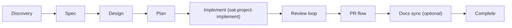
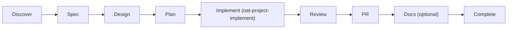
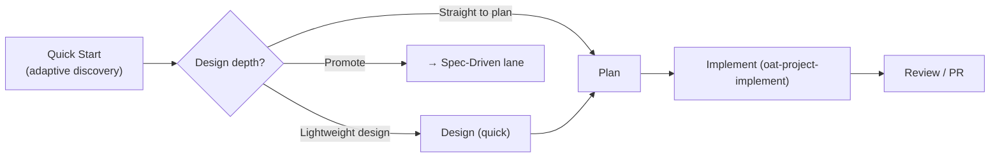
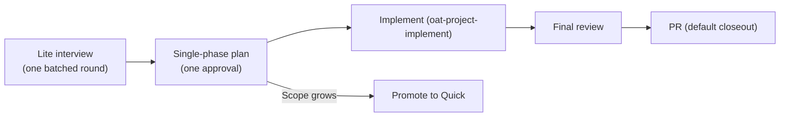
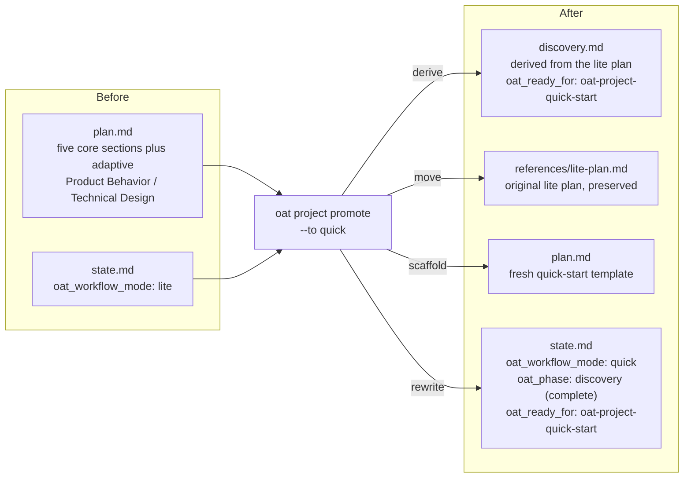
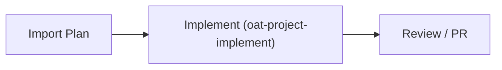
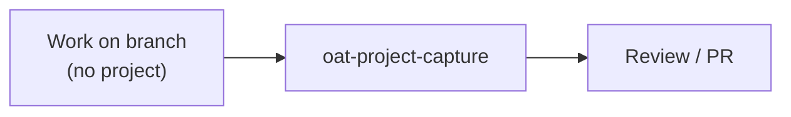

# Lifecycle

This lifecycle is an optional OAT layer. Interop-only users can skip it.

OAT lifecycle order:

1. Discovery (`oat-project-discover`)
2. Spec (`oat-project-spec`)
3. Design (`oat-project-design`)
4. Plan (`oat-project-plan`)
5. Implement (`oat-project-implement`)
6. Review loop (`oat-project-review-provide` / `oat-project-review-receive`)
7. Summary (`oat-project-summary`) — generates `summary.md` as institutional memory; `oat-project-pr-final` and `oat-project-complete` auto-refresh it when missing or stale
8. PR (`oat-project-pr-progress` / `oat-project-pr-final`) — sets `pr_open` status
9. Revision loop (`oat-project-revise`) — optional; accepts post-PR feedback
10. Documentation sync (`oat-project-document`) — optional; reads project artifacts and code evidence to identify docs needing updates, checks for missing coverage of newly shipped capability areas, and auto-runs `oat-pjm-update-repo-reference` before scanning docs only when the PJM capability is available **and** this repository has adopted PJM
11. Complete (`oat-project-complete`)

**Shortcut:** `oat-project-next` reads project state and invokes the correct next skill automatically — use it instead of remembering which skill comes next. Complements `oat-project-progress` (which is read-only diagnostic).

Full spec-driven design supports three interaction modes: collaborative, selective collaborative, and draft-and-review. Selective collaborative drafts routine sections silently and presents high-risk or uncertain sections for live review. Quick-start lightweight design stays simpler and offers only collaborative or draft-and-review. See [Design Modes](design-modes.md) for details.

## Quick Look

- What it does: explains the end-to-end lifecycle for tracked OAT projects, including alternate quick, lite, and import lanes.
- When to use it: when you need the actual project execution model, not just a high-level overview of workflow mode.
- Primary entry points: `oat-project-new`, `oat-project-quick-start`, `oat-project-lite`, `oat-project-import-plan`, `oat-project-implement`

## Lifecycle Map

```mermaid
flowchart LR
  D["Discovery"] --> S["Spec"] --> G["Design"] --> P["Plan"]
  P --> I["Implement (oat-project-implement)"]
  I --> R["Review loop"] --> PR["PR flow"]
  PR --> DOC["Docs sync (optional)"]
  DOC --> C["Complete"]
```

This map shows the spec-driven default. The quick, lite, import, and capture
lanes each skip part of it — see [Lane diagrams](#lane-diagrams) below. Lite in
particular has no discovery, spec, or design step at all.

## Post-implementation flow

Implementation closeout has one authoritative order:

1. Run final implementation verification.
2. Pass the mandatory final lifecycle review.
3. Resolve and disposition the configured `oat-project-implement` exit gate.
4. Run the configured pre-approval sequence.
5. Record final HiLL approval when the final phase is a checkpoint.
6. Run the configured post-approval sequence.
7. Mark implementation complete and emit the implementation success output.

The configured exit gate is independent from the mandatory lifecycle review,
root-owned phase reviews, and optional `oat_phase_review_gate`. It must reach an
allowed and fresh disposition before pre-approval work starts. A
`not_configured` resolution is recorded explicitly as `allowed/no_gate`; it is
not inferred from missing state, and a null, missing, or unrecognized resolver
result fails closed as unresolved instead.

After implementation closeout finishes:

1. **Summary** (`oat-project-summary`) — generates `summary.md` as institutional memory from project artifacts; PR-final and completion will auto-refresh it if you have not already run it or if it is stale
2. **Documentation** (`oat-project-document`) — optional sync of project docs; decides whether repo-reference refresh should run before docs analysis using two independent checks, and should recommend new docs pages/directories when the shipped work introduces a capability area that the docs app does not already cover
3. **PR** (`oat-project-pr-final`) — creates PR description (auto-refreshes `summary.md` first when needed, then uses it as source), sets `oat_phase_status: pr_open`, and tracks actual PR existence with `oat_pr_status` / `oat_pr_url`
4. **Revision loop** (`oat-project-revise`) — accepts post-PR feedback:
   - Inline feedback creates `p-revN` revision phases with `prevN-tNN` task IDs
   - GitHub PR feedback delegates to `oat-project-review-receive-remote`
   - Review artifacts delegate to `oat-project-review-receive`
   - After revision tasks complete, state returns to `pr_open`
5. **Complete** (`oat-project-complete`) — accepts any phase status (`pr_open`, `complete`, `in_progress`), auto-refreshes `summary.md` before closeout when needed, and archives when selected by the workflow preference or completion prompt

### Project-recap gate (non-lite)

The final-closeout orchestrator owns one project-recap gate. It runs after the
final code review has passed and after any configured pre-approval summary and
documentation steps, but before final HiLL approval. It neither replaces nor
repeats the final review, and the stored order of the other pre-approval steps
is preserved.

Recap intent resolves through `oat-explainer-kit`. A fresh `project-recap`
manifest for the current completed implementation is reused rather than
regenerated — fresh means it names recipe `project-recap`, belongs to this
project, has a terminal outcome, and its recorded source hashes match the
current approved inputs. A present-but-incomplete, wrong-recipe, or stale
manifest does not qualify.

Recap outcomes are reported, not blocking: `failed` and `built-not-durable` are
recorded as warnings and never block final approval, completion reporting, or
later PR steps. The selected or attempted outcome and run path are included in
the implementation completion report, and `summary.md` carries a single
`Explainer Outcome` section when it exists.

**Lite skips this gate entirely.** Lite sets `PROJECT_RECAP_REACHABLE=false` and
does not resolve recap intent, inspect recap runs, invoke `oat-explainer-kit`,
or run the terminal-outcome guard. It proceeds from the required reviews through
its stored optional steps to `pr` and sequence completion.

Lite mode collapses the default pre-approval sequence to PR creation only.
`oat-project-pr-final` builds the body directly from the lite plan and
`implementation.md`; summary and documentation remain explicit lite opt-ins,
and retro is not added to the lite closeout sequence.

### Completion archive behavior

On completion, OAT treats archive handling as an explicit closeout choice:

- When archiving is selected, the local archive is written to `.oat/projects/archived/<project>/`.
- When archiving is disabled or declined, durable projects remain at their
  active path. Synced completion still finalizes and pushes the project ref,
  commits the discovery record as `complete`, retains the checkout and ref, and
  attests a selected recap against the project-ref history.
- For a synced project, closeout first finalizes the project artifacts and
  pushes them to `refs/oat/projects/<project>`. Archive then requires a clean,
  fully pushed checkout; copies it without the `.git` pointer or `reviews/`;
  seals configured durable exports; transitions terminal reachability to
  `refs/oat/completed/<project>`; removes the nested checkout; and deletes the
  tracked JSON record in the parent lifecycle commit. This order keeps
  SHA-pinned PR links valid without leaving active discovery state behind.
- A completed-only ref and a completed ref plus same-SHA active alias are both
  valid terminal shapes. The active alias is inert: list omits it and pull/open
  reject it. Differing SHAs are a hard mismatch with recovery guidance.
- If `.oat/config.json` enables `archive.s3SyncOnComplete` and sets `archive.s3Uri`, completion requires the S3 upload of a dated snapshot such as `<archive.s3Uri>/<repo-slug>/projects/20260401-<project>/` to succeed before terminal record/ref cleanup. A failed configured upload leaves retry identity intact and does not claim closeout.
- If `.oat/config.json` sets `archive.awsProfile` and/or `archive.awsRegion`, those values are forwarded to every `aws` invocation triggered by completion (preflight checks + `aws s3 sync`) and override any ambient shell `AWS_PROFILE` / `AWS_DEFAULT_PROFILE` / `AWS_REGION` / `AWS_DEFAULT_REGION` values. The repo's archive-scoped credentials are treated as deliberate intent so users don't have to unset shell env vars before running completion. See [`config-and-local-state.md`](../../cli-utilities/config-and-local-state.md) for the full precedence chain.
- If `.oat/config.json` sets `archive.summaryExportPath`, completion copies `summary.md` to `<archive.summaryExportPath>/20260401-<project>.md`.
- Missing or unusable AWS CLI configuration blocks synced terminal cleanup when S3 durability is configured; when S3 sync is not configured, it is not part of the durability requirement.
- `oat repo archive sync` can later sync all archived projects, or one named archived project, back down from S3; it selects the latest dated remote snapshot and materializes it into the local bare archive tree.
- Persisted archive metadata binds the snapshot to the source-ref SHA, allowing
  an interrupted closeout or legacy complete record to resume without
  rematerializing an active project. Dashboard and list surfaces omit fully
  retired projects and report precise cleanup or ref-mismatch diagnoses for
  remaining legacy state.
- `oat project links` continues to render full-SHA links through the completed
  ref. `oat project prune` is a separate destructive choice that removes
  terminal ref reachability but preserves local and S3 archive snapshots.

### Phase status: `pr_open`

After `oat-project-pr-final` runs, `state.md` shows `oat_phase_status: pr_open`. This signals:

- The project is in its post-PR review posture
- The project is NOT done — agents should not start a new project
- Next steps: `oat-project-revise` (for feedback) or `oat-project-complete` (when approved)

Actual PR existence is tracked separately from `oat_phase_status`:

- `oat_pr_status` records whether the PR is merely ready to create, open, closed, or merged
- `oat_pr_url` records the tracked PR URL when a PR exists

This distinction matters during completion: `oat-project-complete` can skip the "Open a PR?" prompt when `oat_pr_status: open` is already present.

### Auto-review at HiLL checkpoints

### Approval-aware post-implementation sequencing

`workflow.postImplementSequence` can use the legacy string values or a structured
`{ preApproval, postApproval }` value. After final verification, final review,
and an allowed, fresh implementation exit-gate disposition, OAT snapshots the
effective sequence, runs ordered pre-approval steps, records final HiLL
approval, and only then runs post-approval steps. The snapshot is restart-safe:
an incomplete sequence routes back to implementation and resumes from its first
incomplete step.

Structured sequences accept `summary`, `document`, `pr`, and `retro`.
`retro` is post-approval only: placing it in `preApproval` invalidates the
structured value. This placement lets the retrospective include the final
approval and feedback tail while still running before project completion
freezes lifecycle artifacts. The legacy string mappings are unchanged and do
not add a retro step.

When a pending post-approval `retro` step runs, OAT dispatches
`oat-project-retro` in generate mode. Applying repo improvements and filing
tracker items remain separately consented through interactive confirmation or
`workflow.retro.*` configuration.

`oat-project-next` checks `oat_implement_exit_gate` before every normal
post-implementation route. Missing, pending, blocked, malformed, or stale state
routes back to `oat-project-implement` even when `oat_phase_status` is
`complete` or `pr_open`. Only an allowed, fresh disposition can continue to
summary, documentation, PR, or project completion.

### Retrospective completion safety net

Before an interactive completion closes the project,
`oat-project-complete` checks for
`{PROJECT_PATH}/references/project-retro.md`. If the artifact is missing, it
offers to generate one before completion. If the artifact exists, completion
does not offer another retro; it may note unsettled promotion or filing
registers. Non-interactive completion skips this offer, so autonomous
generation occurs only through an explicitly configured post-approval `retro`
step.

When `workflow.autoReviewAtHillCheckpoints` is enabled or `plan.md` frontmatter sets `oat_auto_review_at_hill_checkpoints`, completing a HiLL checkpoint automatically runs the extra lifecycle review scoped to every implementation phase not already covered by a passed whole-phase code review, through the just-completed checkpoint. Mid-implementation multi-phase reviews use inclusive phase-range scopes such as `p02-p03`; the final implementation checkpoint uses `code final`. The review uses auto-disposition mode (minors auto-converted to fix tasks, no user prompts). Disabled by default. Legacy `autoReviewAtCheckpoints` and `oat_auto_review_at_checkpoints` are still read as fallbacks. This does not control Tier 1 per-phase `oat-reviewer` gates.

### Phase-review setup during planning

Spec-driven, quick, and import planning run one shared setup after stable phase
IDs exist and before the plan artifact review. Lite omits this planning-time
setup and prompt, while its built-in implementation phase and final reviews
remain required. The target probe qualifies only
an explicitly configured, enabled, and available review target, then offers all
phases, selected phases, or disabled. Existing explicit
`oat_phase_review_gate` values are preserved unchanged without re-prompting.
Probe failure, no qualifying target, non-interactive execution, or user decline
leaves phase review disabled. Provider native plan mode inherits this behavior
through the import-plan lane.

## Implementation modes

`oat-project-implement` v2.0 dispatches one subagent per phase (not per task). Capability detection at skill start selects a tier, locked for the run:

- **Tier 1 (subagents):** native subagent dispatch via Claude Code, Cursor, or Codex with spawn authorization.
- **Tier 2 (guarded sequential execution):** orchestrator reads the agent files and uses a target-preserving route when native subagents are unavailable or authorization is declined.

A concrete managed reviewer remains bound across both tiers. Codex uses the
exact registered role or a child pinned to the resolved model and effort;
Claude passes the exact resolver-returned `dispatchArgs.model`; Cursor launches
the exact `providers.cursor.dispatchArgs.variant` native reviewer variant.
Retries preserve that complete target. Tier 2 does not authorize a target
downgrade. Inline review is allowed only with verified equivalent host
controls, or for explicit inherit/default behavior or the documented
managed-uncapped reviewer base-role exception; otherwise the review blocks.

Within either tier, parallelism is expressed as plan metadata:

- **Sequential (default):** plans with no `oat_plan_parallel_groups` field, or with an empty array. Phases run in plan order on the orchestration branch.
- **Parallel groups:** phases listed together in `oat_plan_parallel_groups` run concurrently in worktrees (Tier 1 only) and merge back to the orchestration branch in plan order. Groups themselves execute sequentially.

See [Implementation Execution](implementation-execution.md) for the full execution model — tier detection, bounded fix loop, fan-in, merge-conflict handling, dry-run, and resumption.

## Review receive behavior

- `oat-project-review-receive` now presents a findings overview before asking for any disposition decisions.
- Findings are shown with stable IDs by severity (`C*`, `I*`, `M*`, `m*`) so follow-up choices map clearly to specific items.
- For each finding, the receive step summarizes the reviewer note, adds agent analysis, and gives a recommendation (convert now vs defer with rationale).

## Alternate lifecycle lanes

### Quick lane diagram

1. `oat-project-quick-start` (adaptive discovery — provide a project name and optional description; if only the name is provided, quick-start asks for the missing description before discovery. Well-understood requests synthesize quickly, exploratory requests invest in solution space exploration. Before scaffolding, the skill checks inherited git state and asks whether to commit, proceed, or abort when the worktree is already dirty.)
2. Decision point: straight to plan, optional lightweight `design.md`, or promote to spec-driven
3. Implement: `oat-project-implement` (sequential by default; parallel when `oat_plan_parallel_groups` is declared)
4. `oat-project-review-provide` / `oat-project-pr-final`
5. Optional `oat-project-promote-spec-driven` to backfill spec-driven lifecycle artifacts in-place

### Lite lane diagram

1. `oat-project-lite` runs one batched interview, authors a single-phase `plan.md` with validation criteria, and pauses once for approval
2. Implement: `oat-project-implement` runs the single phase without HiLL checkpoint prompts
3. Pass the mandatory final review, then route directly to `oat-project-pr-final`
4. Optional `oat project promote <project-path> --to quick` when the work no longer fits one sitting

### Import lane diagram

1. `oat-project-import-plan` (checks inherited git state before import scaffolding so sync-generated or unrelated dirty files do not silently roll into project bookkeeping)
2. Implement: `oat-project-implement` (sequential by default; parallel when `oat_plan_parallel_groups` is declared)
3. `oat-project-review-provide` / `oat-project-pr-final`
4. Optional `oat-project-promote-spec-driven` to switch project mode to spec-driven lifecycle

## Lane diagrams

### Spec-Driven workflow lane

```mermaid
flowchart LR
  D["Discover"] --> S["Spec"] --> G["Design"] --> P["Plan"]
  P --> I["Implement (oat-project-implement)"]
  I --> R["Review"] --> PR["PR"] --> Doc["Docs (optional)"] --> C["Complete"]
```

During the Design step, `oat-project-design` asks how to work through the document unless a mode was selected by argument, environment, or `workflow.designMode`. The three full-design choices are collaborative, selective collaborative, and draft-and-review.

Before a plan is marked ready for implementation, planning resolves the current
provider's dispatch policy from `workflow.dispatchPolicy.mode` and
`workflow.dispatchPolicy.policy`, or from project `state.md` frontmatter. The
legacy `workflow.dispatchCeiling.providers.<provider>` config and
`oat_dispatch_ceiling` frontmatter remain compatibility inputs for capped
managed policies. If no policy is configured and the session is interactive,
planning asks once and stores the answer as `oat_dispatch_policy`;
non-interactive planning with an unresolved policy is not implementation-ready
and blocks at the planning boundary until the resolver succeeds. Implementation
preflight retains the same defensive check, but it is not the first place an
unresolved plan fails. `Uncapped` is explicit managed selection with no maximum
cap; `Inherit Host Defaults` is separate and means OAT does not select model or
effort controls.

### Quick lane

```mermaid
flowchart LR
  Q["Quick Start\n(adaptive discovery)"] --> D{"Design depth?"}
  D -->|Straight to plan| P["Plan"]
  D -->|Lightweight design| LD["Design (quick)"] --> P
  D -->|Promote| SD["→ Spec-Driven lane"]
  P --> QI["Implement (oat-project-implement)"]
  QI --> QR["Review / PR"]
```

Quick lane lightweight design intentionally keeps a smaller collaborative/draft choice. Selective collaborative becomes available only after promotion into the full spec-driven design lane.

Quick-start follows the same dispatch policy rule at the plan boundary: capture
the policy when interactive, persist `oat_dispatch_policy` to project state, and
avoid any mid-implementation policy prompt. Legacy dispatch-ceiling state is
still read as compatibility capped-policy input, but new quick-start selections
should use the dispatch-policy names, including explicit `Uncapped` and
`Inherit Host Defaults`.

### Lite lane

```mermaid
flowchart LR
  L["Lite interview\n(one batched round)"] --> P["Single-phase plan\n(one approval)"]
  P --> I["Implement (oat-project-implement)"]
  I --> R["Final review"] --> PR["PR (default closeout)"]
  P -->|Scope grows| Q["Promote to Quick"]
```

Lite keeps planning and validation in `plan.md`. The interview selects a
`minimal`, `product`, `technical`, or `both` content shape and records the
rationale. Product Behavior is required for user-visible changes; Technical
Design is required for cross-module, data/state-format, or consumed-contract
changes. It has no separate discovery, spec, or design artifact, skips
implementation HiLL prompts, and routes a passed final review directly to PR
creation. Summary and documentation run only when enabled through the
lite-specific post-implementation sequence.

Each task chooses evidence proportionate to its risk instead of requiring one
test-first recipe. Behavioral changes need a proof that fails without the
change; refactors default to characterization-first when existing coverage is
insufficient; documentation-only work may use formatting, link, spelling, or
build checks. UI changes require visual proof. In autonomous runs, available
computer-use capability performs that proof; otherwise execution stops at an
explicit proof boundary.

### Promoting a lite project to quick

When lite work outgrows one sitting, `oat project promote <project-path> --to quick`
converts it in place. Each artifact has a different fate: the authored lite plan
is **moved** to `references/lite-plan.md`, a new `discovery.md` is **derived**
from its five core sections plus any adaptive Product Behavior and Technical
Design, a **fresh** quick template takes over the `plan.md` path, and `state.md`
is **rewritten** to quick mode.

```mermaid
flowchart LR
  subgraph Before
    LPLAN["plan.md\nfive core sections plus adaptive\nProduct Behavior / Technical Design"]
    LSTATE["state.md\noat_workflow_mode: lite"]
  end

  CMD["oat project promote\n--to quick"]

  subgraph After
    DISC["discovery.md\nderived from the lite plan\noat_ready_for: oat-project-quick-start"]
    REF["references/lite-plan.md\noriginal lite plan, preserved"]
    QPLAN["plan.md\nfresh quick-start template"]
    QSTATE["state.md\noat_workflow_mode: quick\noat_phase: discovery (complete)\noat_ready_for: oat-project-quick-start"]
  end

  LPLAN --> CMD
  LSTATE --> CMD
  CMD -->|derive| DISC
  CMD -->|move| REF
  CMD -->|scaffold| QPLAN
  CMD -->|rewrite| QSTATE
```

The project slug, directory, and branch are untouched, so history and any open
work continue uninterrupted. `oat_ready_for` is stamped on **both** `discovery.md`
and `state.md`; the quick-start recommender reads artifact readiness, so
consumers must preserve both. Promotion refuses rather than half-applying: a
non-lite project, an existing `references/lite-plan.md`, invalid authored
sections, an unresolved scope, or an unreadable template each return a stable
categorical `reason` and exit non-zero. See
[CLI Reference](../../reference/cli-reference.md) for the full refusal contract.

### Import lane

```mermaid
flowchart LR
  I["Import Plan"] --> II1["Implement (oat-project-implement)"]
  II1 --> IR["Review / PR"]
```

### Capture lane

Retroactive project creation for work done outside the OAT project workflow. Common scenario: mobile/cloud sessions where you brainstorm and implement with an agent, then want to open a PR and review from your desktop.

```mermaid
flowchart LR
  W["Work on branch\n(no project)"] --> Cap["oat-project-capture"]
  Cap --> R["Review / PR"]
```

Entry point: `/oat-project-capture` (skill-only, no CLI command — requires agent conversation context).

Key differences from other lanes:

- **No plan generation** — the work is already done; the scaffold-created `plan.md` template is kept but not authored
- **Discovery from conversation** — `discovery.md` captures intent and decisions from the agent's conversation context, not from requirements analysis
- **Implementation from commits** — `implementation.md` is populated from commit history with SHAs, not from executing plan tasks
- **Lifecycle state is user-chosen** — user decides whether the project is ready for review or still in progress

## Artifact progression

`discovery.md` -> `spec.md` -> `design.md` -> `plan.md` -> `implementation.md` -> `summary.md`

Quick lane progression:

`discovery.md` -> [`design.md` (optional lightweight)] -> `plan.md` -> `implementation.md`

Lite lane progression:

`plan.md` -> `implementation.md` -> `pr/*.md` (`summary.md` and documentation are opt-in)

Import lane progression:

`references/imported-plan.md` -> `plan.md` -> `implementation.md` (`spec.md`/`design.md` optional)

Capture lane progression:

`discovery.md` (from conversation) + `implementation.md` (from commits) — no forward-looking artifacts

## Operational rules

- Keep `state.md`, `plan.md`, and `implementation.md` synchronized.
- For a synced project, publish lifecycle artifact writes with
  `oat project push`; do not stage `.oat/projects/synced/<project>/` on the
  parent branch.
- On arrival, run `oat project pull` before reading a synced project's state.
- Stop at configured HiLL checkpoints.
- Do not move lifecycle forward when required review gates are unresolved.
- Project entry skills (`oat-project-new`, `oat-project-quick-start`, and `oat-project-import-plan`) surface inherited dirty git state before scaffolding. If the dirty list includes `.oat/sync/manifest.json`, `.claude/`, `.cursor/`, or `.codex/`, the skill calls out that those paths are typically sync output and offers Commit now, Proceed anyway, or Abort.

## Reducing lifecycle friction with workflow preferences

The lifecycle has several interactive prompts that power users often answer the same way every time — HiLL checkpoint behavior, archive on complete, auto-create PR, post-implementation chaining, final review execution model, and re-review scope narrowing. These can be configured once via `workflow.*` preference keys and respected automatically by skills.

See the [Workflow preferences section in the Configuration guide](../../cli-utilities/configuration.md#workflow-preferences-workflow) for the full list of keys and how to set them. Preferences resolve through a three-layer chain (`env > repo-local > repo-shared > user > default`), so you can set personal defaults at user scope once and override per-repo only when needed.

## Active project resolution

- Active project state is stored in `.oat/config.local.json` (`activeProject`, repo-relative path).
- Projects root is stored in `.oat/config.json` (`projects.root`) and can be read via `oat config get projects.root`.
- Workflow skills prefer `oat config get activeProject` / `oat config get projects.root` rather than reading pointer files directly.

## Capability availability versus repository adoption

Lifecycle skills that touch repository project-management state make two
separate checks, and both must hold before any PJM write:

1. **Capability availability** — `oat tools has project-management` answers
   whether the PJM skills and templates are installed and complete at project or
   user scope. Since packs default to user scope, this is usually satisfied by a
   user-scope install with no repository footprint.
2. **Repository adoption** — `oat pjm doctor --json` answers whether _this_
   repository adopted PJM. Branch on its `adoption.state` field: `declared` and
   `inferred-legacy` allow repository PJM writes; `partial-initialization` and
   `none` stop with `oat pjm init` as the recovery.

Pack presence is never treated as evidence of repository adoption. A skill that
finds the capability available but the repository unadopted reports the
actionable `oat pjm init` stop instead of scaffolding implicitly. See
[Install vs. initialize](../../cli-utilities/tool-packs.md#install-vs-initialize).

## Brainstorming integration with the project lifecycle

`oat-brainstorm` (in the `brainstorm` tool pack) interacts with the project lifecycle in two distinct ways: it can **seed a brand new project** from a brainstorming conversation when no project is active, or **fold back into an active project** when one is.

### Seeding a new project from a brainstorm

When the brainstorming destination is "promote to a new OAT project", the dispatcher confirms a project slug and one of three modes: `lite`, `quick`, or `spec-driven`. For Quick and Spec-Driven projects, it runs `oat project new <slug> --mode <mode>` and writes `discovery.md` directly from the brainstorming payload — Initial Request, Solution Space with approaches considered, Chosen Direction, Key Decisions, and Open Questions. It writes only `discovery.md` (never a partial `design.md`), then points to `oat-project-quick-start` or `oat-project-design` without auto-chaining. For Lite projects, it instead seeds the five sections in `plan.md`, leaves `discovery.md` and `design.md` absent, and points to `oat-project-lite`.

This is a parallel entry path into all three lanes, not a new lane. Quick and Spec-Driven users arrive at `oat-project-quick-start` or `oat-project-design` with discovery already populated; Lite users arrive at `oat-project-lite` with the single-phase plan already seeded.

### Folding back into an active project

When `oat-brainstorm` fires while a project is active, it offers a 3-way picker before any pack-filtered destination shows up:

- **Related to the project** → for Lite, fold the synthesis into `plan.md` immediately above `## Phase 1` and hand off to `oat-project-lite`; for Quick and Spec-Driven, use the most-specific upstream artifact (`design.md` if it exists, otherwise `discovery.md`) and hand off to `oat-project-quick-start` or `oat-project-plan`. Any mode with an open PR hands off to `oat-project-revise`. The fold-back commit is safety-gated: a preflight `git status --porcelain -- "$ARTIFACT_PATH"` checks for dirty state, staging is exactly `git add -- "$ARTIFACT_PATH"` (never `-A`, never globs), and the handoff prompt only prints after the scoped commit succeeds.
- **Independent of the project** → the active project is acknowledged but doesn't constrain the picker; brainstorm routes through its standard pack-filtered terminal-state options (new project, backlog item, idea, doc-to-path, inline).
- **Related but supplementary** → write a brainstorming reference file at `.oat/projects/<scope>/<project>/brainstorming/YYYY-MM-DD-<topic>.md`, alongside `pr/` and `reviews/`. No lifecycle artifact is touched.

The fold-back path is what makes "we got to plan and realized the design missed something" recoverable mid-project: the upstream artifact gets updated and committed cleanly, then the user re-runs plan authoring with a "don't refresh, integrate" context that preserves review-table state.

## Reference artifacts

- `.oat/projects/<scope>/<project>/spec.md`
- `.oat/projects/<scope>/<project>/design.md`
- `.oat/projects/<scope>/<project>/plan.md`
- `.oat/projects/<scope>/<project>/implementation.md`
