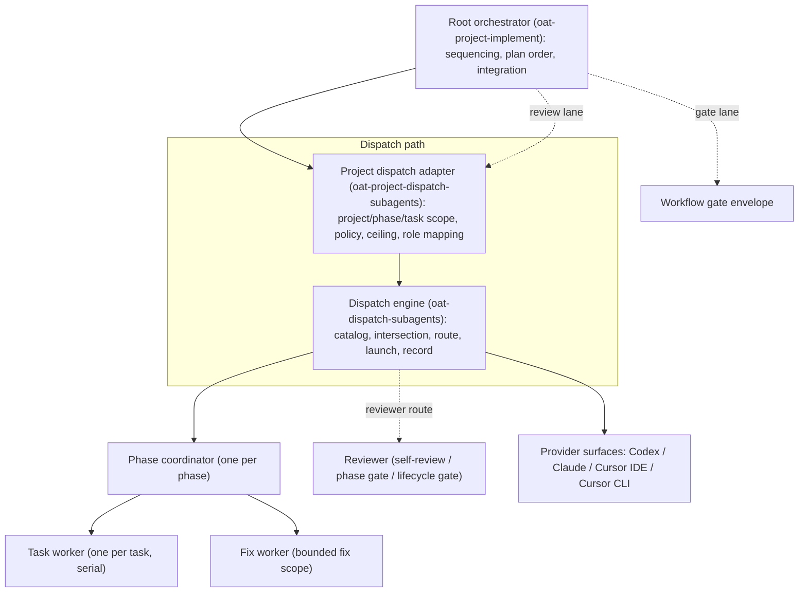
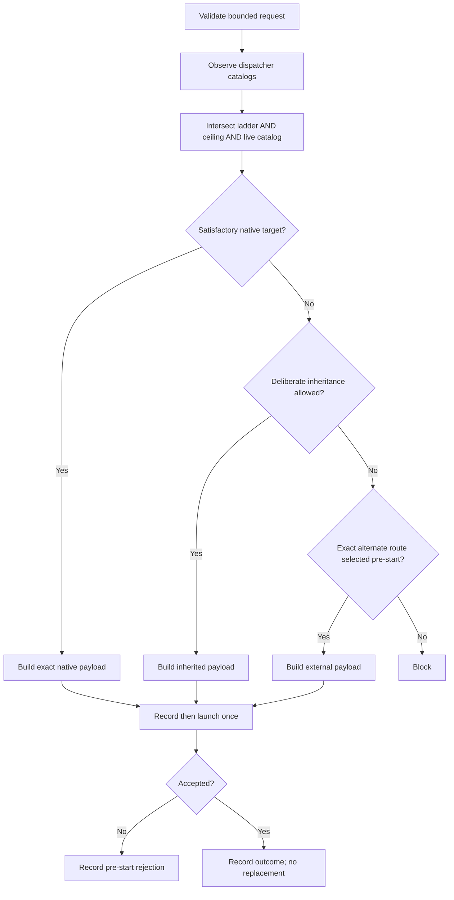

# Orchestration Model

OAT project implementation is built from four cooperating layers. Each layer
owns a different decision and hands a narrower, more concrete contract to the
next:

1. **Lifecycle skills** own sequencing and judgment — plan order, phase
   boundaries, verification, integration, review disposition, and user
   checkpoints. `oat-project-implement` is the root of this layer.
2. **The project dispatch adapter** (`oat-project-dispatch-subagents`)
   translates project state into a generic request: it resolves the active
   project, phase, and task scope, the dispatch policy and named ceiling, the
   lifecycle-role mapping, and gate independence.
3. **The dispatch engine** (`oat-dispatch-subagents`) is provider-neutral. It
   probes capability and authorization, observes live dispatcher catalogs,
   intersects candidates, selects a native-first route, launches once, and
   records structured dispatch evidence. It never reads project state.
4. **Provider surfaces** are the concrete harnesses (Codex, Claude, Cursor IDE,
   Cursor CLI) that actually spawn a child.

The engine/adapter boundary is the core layering of this model. The adapter
knows what OAT projects mean; the engine knows how to select and launch a
child on a provider without ever interpreting `pNN-tNN` identifiers, gates, or
worktrees. Keeping those concerns split is what lets the same selection and
evidence contract serve every harness.

This page synthesizes the cross-cutting model. It links the deep pages rather
than restating their mechanics: see
[Implementation Execution](implementation-execution.md) for the coordinator and
worker loop, tiers, and resumption, and
[Dispatch Policy](dispatch-ceiling.md) for ladders, ceilings, and the dispatch
report.

## Layering and Roles

The root orchestrator dispatches phase coordinators; each coordinator
dispatches one task worker per task. Every dispatch on that path flows through
the project adapter and then the engine. Reviewers and gates travel the same
dispatch path but occupy separate lanes with their own independence rules.

## Roles and Boundaries

There is exactly one coordinator per phase. A coordinator dispatches one exact
target-pinned worker per task and never implements ordinary task work in its
own context. Workers run serially within a phase; only plan-declared parallel
phase worktrees run concurrently. Fix loops are bounded by
`oat_orchestration_retry_limit` (default `2`).

| Role              | Generic class | Owns                                                                              | Must not                                                                                           |
| ----------------- | ------------- | --------------------------------------------------------------------------------- | -------------------------------------------------------------------------------------------------- |
| Phase coordinator | `coordinator` | One phase dossier, dependency order, integration, per-task selection, self-review | Implement ordinary tasks, widen task boundaries, alter plan sequencing, take over user checkpoints |
| Task worker       | `worker`      | One task, one bounded file set, one verified commit                               | Silently inherit the root model; dispatch another worker                                           |
| Fix worker        | `worker`      | One bounded fix scope from listed findings                                        | Receive the full phase finding list; exceed retry/fix-loop limits                                  |
| Reviewer          | `reviewer`    | Independent or inherited review exactly per caller policy                         | Silently downgrade a gate to producer-context self-review                                          |

Scopes reach each role by **progressive disclosure**: a coordinator receives
only its Phase Scope and the coordinator role contract, a worker receives only
one Task Scope, and a reviewer receives only the bounded review scope, commit
range, allowed files, and review artifact contract. No role preloads the
root-workflow references "for context." See
[Implementation Execution](implementation-execution.md) for the full mechanics,
tier selection, and resumption behavior.

## Dispatch Selection

For every dispatch the engine performs full-information selection immediately
before launch. It validates the bounded request, observes the catalogs exposed
to the dispatcher that will launch the child, and intersects the configured
candidate ladder with the project ceiling and the live catalog. It then prefers
an eligible native route; otherwise it takes a deliberate inheritance route, or
an exact alternate route selected before start, or it blocks.

The selection contract has a few load-bearing rules:

- **Judge per task.** The intersection is recomputed for each bounded task, not
  once per phase.
- **Substitute upward, never downward.** When the judged candidate is not
  dispatchable, the engine may move up the ladder to a dispatchable
  near-equivalent, but it never quietly drops to a cheaper target.
- **Workers never silently inherit the root model.** A ceiling is a budget
  maximum, not a selection; an expensive root model is not a default target.
- **Independent snapshots.** A root native catalog does not establish a nested
  coordinator's catalog. Root and nested catalogs are independent snapshots
  observed at their own dispatch context.

**Mismatch advisory.** When the ladder ∩ native-catalog intersection reveals
ladder entries that are not natively dispatchable, the contract advises the
user with natively-dispatchable near-equivalents suggested as ladder
_additions_ — never removals. Ladders also serve CLI dispatch, which has a
different availability set, so removing an entry would silently narrow that
surface. See [Dispatch Policy](dispatch-ceiling.md) for ladder shapes, named
ceilings, and the dispatch report and provenance fields the selection produces.

## Per-Harness Topology

The same model runs on four harness surfaces. Codex has a settled native
topology; the other lanes contain open questions that are answered by live
smoke evidence per run, not asserted here as settled facts.

```mermaid
flowchart TD
  subgraph Codex["Codex"]
    CR["Root"] --> CC["Coordinator (spawn_agent, depth >= 2)"]
    CC --> CW["Task workers (scoped writable roots)"]
  end

  subgraph Claude["Claude"]
    LR["Root (native Task subagents)"] -.->|"nesting validated per-run"| LC["Coordinator"]
    LC -.->|"nesting validated per-run"| LW["Task workers"]
  end

  subgraph CursorIDE["Cursor IDE"]
    IR["Operator-started root"] --> IC2["Coordinator (full-information native selection)"]
    IC2 -->|"CLI task dispatch = recorded pre-start selection"| IW["Task workers"]
  end

  subgraph CursorCLI["Cursor CLI (cursor-agent)"]
    UR["Headless root"] -.->|"task-event observability validated per-run"| UC["Coordinator / workers"]
  end
```

- **Codex:** native `spawn_agent` topology, `agents.max_depth >= 2`, with
  scoped writable roots per worker. This lane is a settled native topology.
- **Claude:** native Task subagents. Whether coordinator→worker nesting is
  supported is an **open question answered by live smoke evidence per run**
  (shown as dashed edges); the sanctioned topology is documented once observed,
  not assumed.
- **Cursor IDE:** the root session is started manually by an operator. The
  coordinator applies full-information selection against its native catalog.
  Any CLI task dispatch must appear as a recorded pre-start selection with its
  reason and considered candidates.
- **Cursor CLI (`cursor-agent`):** a separate flavor driven headlessly. Whether
  Task events are observable at all in this flavor is an **open question
  validated per-run by smoke evidence** (dashed edge); the run produces
  positive evidence or documents the flavor's actual sanctioned topology.

The Claude nesting question and the Cursor CLI observability question are open
by design. They are answered by per-run live smoke evidence and must never be
stated as settled facts in this model.

## Route Tiers and Terminality

Route selection uses three tiers, in strict order of preference:

1. **Native same-runtime** — the preferred default whenever it satisfies the
   resolved role, model, effort, authority, and isolation requirements. It
   needs no additional authorization.
2. **Policy-resolved CLI/programmatic or cross-runtime** — permitted without a
   per-run prompt when the configured dispatch policy (resolved by the project
   adapter) or a configured cross-family gate selected the route. This is
   standing, scope-bound authorization; the engine records
   `selection_source: policy-resolved` with the owning configuration evidence.
3. **Agent-improvised alternate routes** — prohibited unless the user
   explicitly approves the named target and scope for the **current run**.
   Approval from a prior run, task, branch reset, or materially different scope
   does not carry forward.

Availability of a provider CLI, SDK, or API is capability evidence, not route
authorization. If neither configured policy nor current explicit approval
authorizes an alternate route, the engine uses an eligible native route or
blocks.

**Accepted-launch terminality.** An accepted launch is terminal for automatic
replacement eligibility. Completion, failure, timeout, interruption, `BLOCKED`,
and contract refusal are all post-acceptance outcomes; none of them makes
another route eligible or triggers automatic fallback. Only a **pre-start
rejection** — a wrapper failure or payload rejection before the child starts —
allows a new recorded selection, and only within the caller's bounded retry
policy. Operator-authorized recovery is a new explicit action, never automatic
fallback. Continuing the same accepted child through its valid handle is
allowed and recorded separately, preserving the original selectors and route.

One caller-owned exception exists: when the run itself becomes invalid under
the caller's containment or integrity policy, the caller may cancel accepted
handles it owns and record an `invalid-run-abort` with the invalidating
evidence. Cancellation never makes another route eligible and never authorizes
replacement, fallback, or a successful child outcome.

## Related

- [Review Flavors](review-flavors.md) — self-review, phase gate, and lifecycle
  gate flavors mapped to the reviewer role class.
- [Evidence Layers](evidence-layers.md) — dispatch records, selection
  provenance, and runtime identity layers.
- [Implementation Execution](implementation-execution.md) — coordinator/worker
  execution mechanics, tiers, and resumption.
- [Dispatch Policy](dispatch-ceiling.md) — candidate ladders, named ceilings,
  and the dispatch report and provenance fields.
- [Reviews](reviews.md) — the review request/receive loop and phase gate.
- [Workflow Gates](../../cli-utilities/workflow-gates.md) — the gate envelope
  and receive-eligibility contract.
- [Smoke Testing](../../contributing/smoke-testing.md) — per-harness drive
  protocols and live evidence for the open topology questions.
